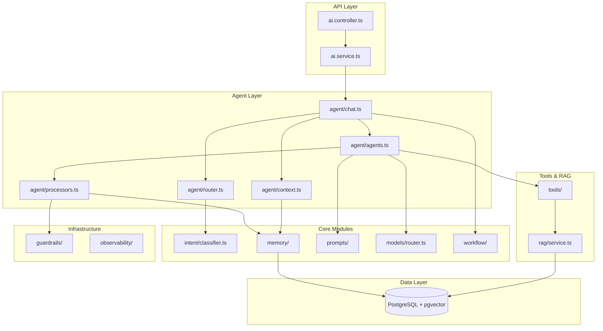

# Design Document: Activity Semantic Search

## Overview

本设计文档描述聚场 v4.5 的活动语义搜索功能，采用 Mastra 风格的模块化 RAG 架构，实现基于向量的混合检索能力。

### 核心目标
1. **语义理解**：用户说"压力大想发呆"，能推荐"白噪音读书局"
2. **冷启动救命**：数据少时提升匹配率（"玩水"匹配"室内冲浪"）
3. **千人千面**：记住用户偏好，个性化推荐

### 技术选型
- **向量数据库**：PostgreSQL + pgvector 扩展
- **Embedding 模型**：智谱 embedding-3 (1024 维)
- **索引类型**：HNSW (Hierarchical Navigable Small World)
- **检索策略**：Hybrid Search (Hard Filter + Soft Rank)

## Architecture

### 架构决策：意图驱动的动态上下文 (Intent-Driven Dynamic Context)

**核心理念**：逻辑上的 Multi-Agent，物理上的 Single Agent

我们不需要多个 LLM 在后台开会，而是根据用户的意图，给小聚戴上不同的"帽子"（加载不同的 Prompt 和 Tools）。

**为什么不用真·多 Agent？**
1. **延迟爆炸** - Agent 之间的一来一回都是 HTTP 请求，用户等不起
2. **调试地狱** - Agent A 传参给 Agent B 传错了，很难排查
3. **Token 浪费** - 每个 Agent 都要重复加载上下文，成本翻倍

**v4.5 方案**：在 `ai/` 模块下新增 `agent/` 子模块，封装 Agent 运行时逻辑。

### AI 模块目录结构 (v4.6 重构)

**核心变更**：
- 保留 MVC 结构 (`ai.controller.ts` / `ai.service.ts` / `ai.model.ts`)
- `ai.service.ts` 变成薄代理，委托给 `agent/chat.ts`
- 全部使用纯函数，禁止 class
- 复用现有 `workflow/` 作为编排器
- **新增 Processors 架构**：Mastra 风格的输入/输出处理器

```
modules/ai/                       # AI 模块 (MVC 结构)
├── index.ts                      # 模块导出
├── ai.controller.ts              # [C] API 路由 (POST /ai/chat)
├── ai.service.ts                 # [S] 薄代理 → 委托给 agent/chat.ts
├── ai.model.ts                   # [M] TypeBox Schema
│
├── agent/                        # [NEW] Agent 运行时 (Mastra 风格)
│   ├── index.ts                  # export { streamChat, generateChat, getAgent }
│   ├── types.ts                  # AgentConfig, RuntimeContext, ChatParams, Processor
│   ├── agents.ts                 # createAgent() + 预定义 Agent 配置
│   ├── chat.ts                   # streamChat(), generateChat() 入口
│   ├── router.ts                 # classifyIntent() - 意图分类
│   ├── context.ts                # buildContext() - RuntimeContext 构建
│   └── processors.ts             # [NEW] inputProcessors / outputProcessors 定义
│
├── workflow/                     # [现有] 工作流引擎 (编排器)
│   ├── workflow.ts               # 状态机核心
│   ├── draft-flow.ts             # 草稿确认流程
│   ├── partner-matching.ts       # 找搭子追问流程
│   └── types.ts                  # 工作流类型
│
├── rag/                          # [NEW] RAG 子模块
│   ├── index.ts                  # 模块导出
│   ├── service.ts                # search(), indexActivity(), deleteIndex()
│   ├── utils.ts                  # enrichText(), embed(), inferVibe()
│   └── types.ts                  # SearchParams, ScoredActivity, IndexItem
│
├── intent/                       # 意图识别（保留）
│   ├── classifier.ts             # 分类器实现
│   └── definitions.ts            # 意图模式定义
│
├── memory/                       # 记忆系统（保留）
│   ├── store.ts                  # 会话存储
│   ├── working.ts                # 用户画像
│   └── extractor.ts              # 偏好提取
│
├── tools/                        # 工具注册（保留）
│   ├── registry.ts               # 工具注册表
│   └── explore-nearby.ts         # 探索附近 (调用 RAG)
│
├── prompts/                      # Prompt 模板（保留）
│   ├── xiaoju-v39.ts             # 小聚人设
│   └── builder.ts                # Prompt 构建器
│
├── models/                       # 模型路由（保留）
│   └── router.ts                 # 模型选择
│
├── guardrails/                   # 防护栏（保留）
├── observability/                # 可观测性（保留，吸收 services/metrics.ts）
├── moderation/                   # 内容审核（保留）
├── anomaly/                      # 异常检测（保留）
├── evals/                        # 评估框架（保留）
│
├── processors/                   # [删除] 功能已被 agent/processors.ts 吸收
├── enrichment/                   # [删除] 功能已被 rag/utils.ts 吸收
└── services/                     # [删除] metrics.ts 移到 observability/
```

### 模块依赖关系图



### 完整调用流程

```
┌─────────────────────────────────────────────────────────────────────────────┐
│                         完整调用流程 (Request → Response)                     │
├─────────────────────────────────────────────────────────────────────────────┤
│                                                                              │
│  1. HTTP Request                                                             │
│     POST /ai/chat { message, userId, location, conversationId }              │
│         │                                                                    │
│         ▼                                                                    │
│  2. ai.controller.ts                                                         │
│     - 参数验证 (TypeBox)                                                      │
│     - JWT 认证                                                               │
│         │                                                                    │
│         ▼                                                                    │
│  3. ai.service.ts (薄代理)                                                    │
│     - re-export streamChat()                                                 │
│         │                                                                    │
│         ▼                                                                    │
│  4. agent/chat.ts - streamChat()                                             │
│     │                                                                        │
│     ├─── 4.1 检查进行中的 workflow                                            │
│     │         │                                                              │
│     │         ├── 有 → workflow/partner-matching.ts 或 draft-flow.ts         │
│     │         │                                                              │
│     │         └── 无 → 继续正常流程                                           │
│     │                                                                        │
│     ├─── 4.2 buildContext() → RuntimeContext                                 │
│     │         - 获取 userProfile (memory/working.ts)                         │
│     │         - 获取 recentHistory (memory/store.ts)                         │
│     │                                                                        │
│     ├─── 4.3 classifyIntent() → 意图分类                                      │
│     │         - 委托给 intent/classifier.ts                                  │
│     │         - 返回: EXPLORE | CREATE | PARTNER | MANAGE | CHAT             │
│     │                                                                        │
│     ├─── 4.4 getAgent(intent) → 选择 Agent                                   │
│     │         - explorer | creator | partner | manager | chat                │
│     │                                                                        │
│     └─── 4.5 agent.stream() → 执行 LLM                                       │
│               │                                                              │
│               ├─── Input Processors (顺序执行)                                │
│               │     1. inputGuardProcessor (安全检查)                         │
│               │     2. userProfileProcessor (画像注入)                        │
│               │     3. tokenLimitProcessor (Token 截断)                       │
│               │                                                              │
│               ├─── streamText() / generateText()                             │
│               │     - 动态注入 system prompt                                  │
│               │     - 动态注入 tools                                          │
│               │     - Tool 调用 → rag/service.ts (如 exploreNearby)           │
│               │                                                              │
│               └─── Output Processors (顺序执行)                               │
│                     1. outputGuardProcessor (输出检查)                        │
│                     2. saveHistoryProcessor (保存历史)                        │
│                     3. extractPreferencesProcessor (提取偏好)                 │
│         │                                                                    │
│         ▼                                                                    │
│  5. HTTP Response                                                            │
│     - 流式: toDataStreamResponse()                                           │
│     - 非流式: JSON { text, toolCalls, usage }                                │
│                                                                              │
└─────────────────────────────────────────────────────────────────────────────┘
```

### 命名规范 (业界最佳实践)

| 类型 | 命名规范 | 示例 | 说明 |
|------|----------|------|------|
| **目录** | kebab-case | `agent/`, `rag/`, `memory/` | 小写，连字符分隔 |
| **文件** | kebab-case.ts | `chat.ts`, `create-tool.ts` | 小写，连字符分隔 |
| **函数** | camelCase | `streamChat()`, `buildContext()` | 动词开头 |
| **类型/接口** | PascalCase | `AgentConfig`, `RuntimeContext` | 名词 |
| **常量** | UPPER_SNAKE_CASE | `DEFAULT_MAX_STEPS` | 全大写，下划线分隔 |
| **Processor** | camelCase + Processor | `userProfileProcessor` | 描述性名称 + Processor 后缀 |
| **Agent** | camelCase + Agent | `explorerAgent` | 角色名 + Agent 后缀 |

**文件命名对照表**：

| 文件 | 职责 | 符合规范 |
|------|------|----------|
| `agent/types.ts` | 类型定义 | ✅ |
| `agent/agents.ts` | Agent 工厂 + 配置 | ✅ |
| `agent/chat.ts` | 对话入口 | ✅ |
| `agent/router.ts` | 意图路由 | ✅ |
| `agent/context.ts` | 上下文构建 | ✅ |
| `agent/processors.ts` | 处理器定义 | ✅ |
| `rag/service.ts` | RAG 核心服务 | ✅ |
| `rag/utils.ts` | 工具函数 | ✅ |
| `rag/types.ts` | 类型定义 | ✅ |
| `tools/create-tool.ts` | Tool 工厂 | ✅ |
| `tools/explore-nearby.ts` | 探索附近 Tool | ✅ |

### 待删除的冗余模块

| 模块 | 原功能 | 迁移目标 |
|------|--------|----------|
| `processors/` | AI 上下文处理 | `agent/processors.ts` |
| `enrichment/` | 文本富集 | `rag/utils.ts` |
| `services/metrics.ts` | 指标收集 | `observability/metrics.ts` |

### Agent 封装层设计

**调用链路**：
```
Controller → ai.service.ts (薄代理) → agent/chat.ts (streamChat) → workflow/ (如有) → agent.stream()
```

```
┌─────────────────────────────────────────────────────────────────────────┐
│                         AI Module (modules/ai/)                          │
├─────────────────────────────────────────────────────────────────────────┤
│                                                                          │
│  ai.controller.ts (POST /ai/chat)                                        │
│      │                                                                   │
│      ▼                                                                   │
│  ai.service.ts (薄代理)                                                   │
│      │ re-export streamChat(), generateChat()                            │
│      ▼                                                                   │
│  ┌─────────────────────────────────────────────────────────────────┐   │
│  │              agent/chat.ts                                       │   │
│  │              streamChat() - 流式对话入口 (纯函数)                   │   │
│  └─────────────────────────────────────────────────────────────────┘   │
│      │                                                                   │
│      ├─── 1. 检查进行中的 workflow ───────────────────────────────┐     │
│      │                                                             │     │
│      ▼                                                             ▼     │
│  ┌─────────────────┐                                    ┌──────────────┐│
│  │ workflow/       │ ← 有进行中的 workflow?              │ 正常 Agent   ││
│  │ partner-matching│   是 → 走 workflow 流程             │ 流程         ││
│  │ draft-flow      │   否 → 走正常 Agent 流程            │              ││
│  └────────┬────────┘                                    └──────┬───────┘│
│           │                                                    │        │
│           │                    ┌───────────────────────────────┘        │
│           │                    │                                        │
│           │                    ▼                                        │
│           │  ┌─────────────────┐  ┌─────────────────┐  ┌─────────────┐ │
│           │  │ 2. Context      │  │ 3. Router       │  │ 4. Mode     │ │
│           │  │    Builder      │  │    (Intent)     │  │    Switch   │ │
│           │  │ buildContext()  │  │ classifyIntent()│  │ getMode()   │ │
│           │  └────────┬────────┘  └────────┬────────┘  └──────┬──────┘ │
│           │           │                    │                  │        │
│           │           └────────────────────┼──────────────────┘        │
│           │                                │                           │
│           │                                ▼                           │
│           │  ┌─────────────────────────────────────────────────────┐   │
│           │  │              5. streamText() Execution               │   │
│           │  │              (动态注入 system prompt + tools)         │   │
│           │  └─────────────────────────────────────────────────────┘   │
│           │                                │                           │
│           │                                ▼                           │
│           │  ┌─────────────────────────────────────────────────────┐   │
│           │  │              6. Lifecycle Hooks (onFinish)           │   │
│           │  │              - memory/store.ts 保存历史               │   │
│           │  │              - memory/extractor.ts 提取偏好           │   │
│           │  └─────────────────────────────────────────────────────┘   │
│           │                                                            │
│           └────────────────────────────────────────────────────────────┘
│                                                                          │
│  ┌─────────────────────────────────────────────────────────────────┐   │
│  │                    tools/ (被 Mode 动态加载)                      │   │
│  │  ┌──────────────┐  ┌──────────────┐  ┌──────────────┐           │   │
│  │  │ createDraft  │  │ publishAct   │  │ exploreNearby│ ──────────┼───┼─┐
│  │  └──────────────┘  └──────────────┘  └──────────────┘           │   │ │
│  └─────────────────────────────────────────────────────────────────┘   │ │
│                                                                          │ │
│  ┌─────────────────────────────────────────────────────────────────┐   │ │
│  │                    rag/ (被 exploreNearby 调用)                   │◄──┘ │
│  │  ┌──────────────┐  ┌──────────────┐  ┌──────────────┐           │     │
│  │  │ service.ts   │  │ utils.ts     │  │ types.ts     │           │     │
│  │  │ search()     │  │ enrichText() │  │              │           │     │
│  │  │ index()      │  │ embed()      │  │              │           │     │
│  │  └──────────────┘  └──────────────┘  └──────────────┘           │     │
│  └─────────────────────────────────────────────────────────────────┘     │
│                                                                          │
└──────────────────────────────────────────────────────────────────────────┘
```
                                 │
                                 ▼
┌─────────────────────────────────────────────────────────────────────────┐
│                        Data Layer                                        │
│  ┌─────────────────────────────────────────────────────────────────┐   │
│  │                    PostgreSQL + pgvector                         │   │
│  │  ┌─────────────────┐  ┌─────────────────┐                       │   │
│  │  │ activities      │  │ HNSW Index      │                       │   │
│  │  │ (embedding col) │  │ (vector_cosine) │                       │   │
│  │  └─────────────────┘  └─────────────────┘                       │   │
│  └─────────────────────────────────────────────────────────────────┘   │
└─────────────────────────────────────────────────────────────────────────┘
```

### ai.service.ts - 薄代理

```typescript
// ai.service.ts - MVC Service 层 (薄代理，纯函数)

import { streamChat, generateChat, type ChatParams } from './agent/runner';

/**
 * 流式对话 - 委托给 Agent
 */
export { streamChat };

/**
 * 非流式对话 - 委托给 Agent
 */
export { generateChat };

// 其他现有函数保持不变...
export { generateTitle } from './prompts/builder';
```

### Agent API 设计 (借鉴 Mastra)

#### 核心概念

借鉴 Mastra 的 Agent API 设计，我们采用以下核心概念：

1. **Agent 定义** - 通过配置对象定义 Agent（name, instructions, model, tools）
2. **RuntimeContext** - 请求级别的上下文传递（userId, location, conversationId）
3. **generate/stream** - 两种响应模式
4. **Memory** - 基于 userId + conversationId 的会话记忆
5. **onStepFinish** - 生命周期钩子
6. **inputProcessors/outputProcessors** - 输入输出处理器

#### agent/types.ts - 类型定义

```typescript
// agent/types.ts - Mastra 风格的类型定义

import type { CoreMessage, LanguageModel, CoreSystemMessage } from 'ai';

/** 系统消息类型 (支持多种格式) */
export type SystemMessage = 
  | string 
  | string[] 
  | CoreSystemMessage 
  | CoreSystemMessage[];

/** Agent 配置 (类似 Mastra 的 Agent 定义) */
export interface AgentConfig {
  /** Agent 唯一标识符 */
  name: string;
  /** Agent 描述 (可选) */
  description?: string;
  /** 系统指令 - 可以是字符串、数组或函数 */
  instructions: SystemMessage | ((ctx: RuntimeContext) => SystemMessage | Promise<SystemMessage>);
  /** 语言模型 - 可以静态提供或动态解析 */
  model: LanguageModel | ((ctx: RuntimeContext) => LanguageModel | Promise<LanguageModel>);
  /** 工具集 - 可以静态提供或动态解析 */
  tools?: ToolsInput | ((ctx: RuntimeContext) => ToolsInput | Promise<ToolsInput>);
  /** 最大步骤数 */
  maxSteps?: number;
  /** 默认生成选项 */
  defaultGenerateOptions?: AgentGenerateOptions;
  /** 默认流式选项 */
  defaultStreamOptions?: AgentStreamOptions;
  /** 输入处理器 */
  inputProcessors?: Processor[];
  /** 输出处理器 */
  outputProcessors?: Processor[];
}

/** 工具输入类型 */
export type ToolsInput = Record<string, any>;

/** 运行时上下文 (类似 Mastra 的 RuntimeContext) */
export interface RuntimeContext {
  userId: string | null;
  location?: { lat: number; lng: number; name?: string };
  conversationId?: string;
  userProfile?: UserProfile;
  recentHistory?: CoreMessage[];
  /** 自定义数据 */
  [key: string]: any;
}

/** Agent 生成选项 */
export interface AgentGenerateOptions {
  messages?: CoreMessage[];
  runtimeContext?: RuntimeContext;
  onStepFinish?: (step: StepResult) => void | Promise<void>;
  maxSteps?: number;
  /** Memory 配置 */
  memory?: MemoryConfig;
}

/** Agent 流式选项 */
export interface AgentStreamOptions extends AgentGenerateOptions {
  /** 是否启用流式 */
  stream?: boolean;
}

/** 步骤结果 (用于 onStepFinish 回调) */
export interface StepResult {
  text: string;
  toolCalls?: ToolCall[];
  toolResults?: ToolResult[];
  finishReason: string;
  usage: { promptTokens: number; completionTokens: number };
}

/** Memory 配置 */
export interface MemoryConfig {
  resource: string;  // userId
  thread: string;    // conversationId
}

/** 处理器接口 (Mastra 风格) */
export interface Processor {
  name: string;
  /** 输入处理 - 在消息发送给 LLM 之前 */
  processInput?: (messages: CoreMessage[], ctx: RuntimeContext) => CoreMessage[] | Promise<CoreMessage[]>;
  /** 输出结果处理 - 在 LLM 响应返回给用户之前 (非流式) */
  processOutputResult?: (result: any, ctx: RuntimeContext) => any | Promise<any>;
  /** 输出流处理 - 在 LLM 响应返回给用户之前 (流式) */
  processOutputStream?: (stream: any, ctx: RuntimeContext) => any | Promise<any>;
}
```

#### agent/processors.ts - Processors 定义 (Mastra 风格)

```typescript
// agent/processors.ts - Mastra 风格的输入/输出处理器

import type { CoreMessage } from 'ai';
import type { Processor, RuntimeContext } from './types';
import { buildProfilePrompt } from '../memory/working';
import { createLogger } from '../observability/logger';

const logger = createLogger('agent-processors');

// ============ Input Processors ============

/**
 * 用户画像注入处理器
 * 在消息发送给 LLM 之前，注入用户偏好信息
 */
export const userProfileProcessor: Processor = {
  name: 'user-profile-injector',
  processInput: async (messages, ctx) => {
    if (!ctx.userProfile) return messages;
    
    const profilePrompt = buildProfilePrompt(ctx.userProfile);
    if (!profilePrompt) return messages;
    
    // 在第一条 system message 后注入用户画像
    const systemIndex = messages.findIndex(m => m.role === 'system');
    if (systemIndex >= 0) {
      const systemMsg = messages[systemIndex];
      messages[systemIndex] = {
        ...systemMsg,
        content: `${systemMsg.content}\n\n${profilePrompt}`,
      };
    }
    
    logger.debug('User profile injected', { 
      userId: ctx.userId,
      preferencesCount: ctx.userProfile.preferences?.length || 0,
    });
    
    return messages;
  },
};

/**
 * Token 限制处理器
 * 截断过长的消息，避免超出模型上下文窗口
 */
export const tokenLimitProcessor: Processor = {
  name: 'token-limiter',
  processInput: async (messages, ctx) => {
    const maxTokens = 12000; // 大约 12k tokens
    let totalLength = 0;
    
    // 从最新消息开始保留，直到达到限制
    const result: CoreMessage[] = [];
    for (let i = messages.length - 1; i >= 0; i--) {
      const msg = messages[i];
      const content = typeof msg.content === 'string' ? msg.content : JSON.stringify(msg.content);
      const msgLength = content.length;
      
      if (totalLength + msgLength > maxTokens && result.length > 0) {
        logger.warn('Messages truncated due to token limit', {
          originalCount: messages.length,
          keptCount: result.length,
        });
        break;
      }
      
      result.unshift(msg);
      totalLength += msgLength;
    }
    
    return result;
  },
};

/**
 * Guardrails 输入检查处理器
 * 检查用户输入是否包含敏感内容
 */
export const inputGuardProcessor: Processor = {
  name: 'input-guard',
  processInput: async (messages, ctx) => {
    // 委托给 guardrails/input-guard.ts
    const { checkInput } = await import('../guardrails/input-guard');
    const lastUserMsg = messages.filter(m => m.role === 'user').pop();
    
    if (lastUserMsg) {
      const content = typeof lastUserMsg.content === 'string' 
        ? lastUserMsg.content 
        : JSON.stringify(lastUserMsg.content);
      const result = await checkInput(content, ctx.userId);
      
      if (!result.safe) {
        logger.warn('Input blocked by guardrail', { reason: result.reason });
        throw new Error(`输入被拦截: ${result.reason}`);
      }
    }
    
    return messages;
  },
};

// ============ Output Processors ============

/**
 * 会话历史保存处理器
 * 在 LLM 响应后保存对话历史
 */
export const saveHistoryProcessor: Processor = {
  name: 'save-history',
  processOutputResult: async (result, ctx) => {
    if (!ctx.userId || !ctx.conversationId) return result;
    
    const { saveTurn } = await import('../memory/store');
    await saveTurn(ctx.userId, ctx.conversationId, ctx.lastUserMessage, result);
    
    logger.debug('Conversation saved', { 
      conversationId: ctx.conversationId,
    });
    
    return result;
  },
};

/**
 * 偏好提取处理器
 * 从对话中提取用户偏好并更新画像
 */
export const extractPreferencesProcessor: Processor = {
  name: 'extract-preferences',
  processOutputResult: async (result, ctx) => {
    if (!ctx.userId) return result;
    
    const { extractPreferences } = await import('../memory/extractor');
    // 异步执行，不阻塞响应
    extractPreferences(ctx.userId, ctx.lastUserMessage, result.text).catch(err => {
      logger.error('Failed to extract preferences', { error: err });
    });
    
    return result;
  },
};

/**
 * Guardrails 输出检查处理器
 * 检查 LLM 输出是否包含敏感内容
 */
export const outputGuardProcessor: Processor = {
  name: 'output-guard',
  processOutputResult: async (result, ctx) => {
    const { checkOutput } = await import('../guardrails/output-guard');
    const checkResult = await checkOutput(result.text);
    
    if (!checkResult.safe) {
      logger.warn('Output blocked by guardrail', { reason: checkResult.reason });
      return {
        ...result,
        text: '抱歉，我无法回答这个问题。',
      };
    }
    
    return result;
  },
};

// ============ Default Processor Chains ============

/** 默认输入处理器链 */
export const defaultInputProcessors: Processor[] = [
  inputGuardProcessor,
  userProfileProcessor,
  tokenLimitProcessor,
];

/** 默认输出处理器链 */
export const defaultOutputProcessors: Processor[] = [
  outputGuardProcessor,
  saveHistoryProcessor,
  extractPreferencesProcessor,
];
```

#### Processors 执行流程

```
┌─────────────────────────────────────────────────────────────────────────┐
│                    Processors Pipeline                                   │
├─────────────────────────────────────────────────────────────────────────┤
│                                                                          │
│  User Message                                                            │
│      │                                                                   │
│      ▼                                                                   │
│  ┌─────────────────────────────────────────────────────────────────┐   │
│  │              Input Processors (顺序执行)                          │   │
│  │  ┌──────────────┐  ┌──────────────┐  ┌──────────────┐           │   │
│  │  │ inputGuard   │→ │ userProfile  │→ │ tokenLimit   │           │   │
│  │  │ (安全检查)    │  │ (画像注入)    │  │ (Token截断)   │           │   │
│  │  └──────────────┘  └──────────────┘  └──────────────┘           │   │
│  └─────────────────────────────────────────────────────────────────┘   │
│      │                                                                   │
│      ▼                                                                   │
│  ┌─────────────────────────────────────────────────────────────────┐   │
│  │              LLM Execution (streamText / generateText)           │   │
│  └─────────────────────────────────────────────────────────────────┘   │
│      │                                                                   │
│      ▼                                                                   │
│  ┌─────────────────────────────────────────────────────────────────┐   │
│  │              Output Processors (顺序执行)                         │   │
│  │  ┌──────────────┐  ┌──────────────┐  ┌──────────────┐           │   │
│  │  │ outputGuard  │→ │ saveHistory  │→ │ extractPrefs │           │   │
│  │  │ (输出检查)    │  │ (保存历史)    │  │ (提取偏好)    │           │   │
│  │  └──────────────┘  └──────────────┘  └──────────────┘           │   │
│  └─────────────────────────────────────────────────────────────────┘   │
│      │                                                                   │
│      ▼                                                                   │
│  Response to User                                                        │
│                                                                          │
└─────────────────────────────────────────────────────────────────────────┘
```

#### agent/agents.ts - Agent 工厂 + 预定义配置

```typescript
// agent/agents.ts - createAgent() 工厂 + 预定义 Agent 配置

import { streamText, generateText, type CoreMessage } from 'ai';
import { getModel } from '../models/router';
import { createExploreNearby } from '../tools/explore-nearby';
import { createDraft, refineDraft, publishActivity } from '../tools/draft';
import { createPartnerIntent, askPreference } from '../tools/partner';
import { getMyActivities, cancelActivity } from '../tools/manage';
import type { AgentConfig, RuntimeContext, AgentStreamOptions, AgentGenerateOptions } from './types';

// ============ Agent Factory ============

/**
 * 创建 Agent 实例 (Mastra 风格)
 */
function createAgent(config: AgentConfig) {
  const { name, description, instructions, model, tools = {}, maxSteps = 5 } = config;

  async function resolveInstructions(ctx: RuntimeContext): Promise<string> {
    const resolved = typeof instructions === 'function' ? await instructions(ctx) : instructions;
    if (typeof resolved === 'string') return resolved;
    if (Array.isArray(resolved)) return resolved.map(m => typeof m === 'string' ? m : m.content).join('\n');
    return resolved.content;
  }

  async function resolveModel(ctx: RuntimeContext) {
    return typeof model === 'function' ? await model(ctx) : model;
  }

  async function resolveTools(ctx: RuntimeContext) {
    return typeof tools === 'function' ? await tools(ctx) : tools;
  }

  async function stream(options: AgentStreamOptions) {
    const { messages = [], runtimeContext = {}, onStepFinish, maxSteps: optMaxSteps } = options;
    const ctx = runtimeContext as RuntimeContext;

    const [systemPrompt, resolvedModel, resolvedTools] = await Promise.all([
      resolveInstructions(ctx),
      resolveModel(ctx),
      resolveTools(ctx),
    ]);

    return streamText({
      model: resolvedModel,
      system: systemPrompt,
      messages,
      tools: resolvedTools,
      maxSteps: optMaxSteps ?? maxSteps,
      onStepFinish: onStepFinish ? async (step) => {
        await onStepFinish({
          text: step.text,
          toolCalls: step.toolCalls,
          toolResults: step.toolResults,
          finishReason: step.finishReason,
          usage: step.usage,
        });
      } : undefined,
    });
  }

  async function generate(options: AgentGenerateOptions) {
    const { messages = [], runtimeContext = {}, maxSteps: optMaxSteps } = options;
    const ctx = runtimeContext as RuntimeContext;

    const [systemPrompt, resolvedModel, resolvedTools] = await Promise.all([
      resolveInstructions(ctx),
      resolveModel(ctx),
      resolveTools(ctx),
    ]);

    return generateText({
      model: resolvedModel,
      system: systemPrompt,
      messages,
      tools: resolvedTools,
      maxSteps: optMaxSteps ?? maxSteps,
    });
  }

  return { name, description, stream, generate, config };
}

export type Agent = ReturnType<typeof createAgent>;

// ============ Predefined Agents ============

/** 探索 Agent - 导游模式 */
const explorerAgent = createAgent({
  name: 'explorer',
  description: '熟悉重庆的本地导游，根据用户的模糊描述推荐活动',
  instructions: (ctx) => `
你是小聚，一个熟悉重庆的本地导游。
用户当前在: ${ctx.location?.name || '未知位置'}。
请根据用户的模糊描述推荐活动。
推荐时必须解释理由 (matchReason)。
语气要热情、令人向往。
  `.trim(),
  model: getModel('chat'),
  tools: (ctx) => ({ exploreNearby: createExploreNearby(ctx.userId) }),
  maxSteps: 5,
});

/** 创建 Agent - 秘书模式 */
const creatorAgent = createAgent({
  name: 'creator',
  description: '高效的活动秘书，帮用户把模糊的想法转化为结构化的活动草稿',
  instructions: `
你是小聚，一个高效的活动秘书。
你的目标是帮用户把模糊的想法转化为结构化的活动草稿。
一旦信息（时间、地点、主题）收集齐，立即调用 createDraft。
语气要干练、确认性强。
  `.trim(),
  model: getModel('chat'),
  tools: (ctx) => ({
    createDraft: createDraft(ctx.userId),
    refineDraft: refineDraft(ctx.userId),
    publishActivity: publishActivity(ctx.userId),
  }),
  maxSteps: 5,
});

/** 找搭子 Agent - 中介模式 */
const partnerAgent = createAgent({
  name: 'partner',
  description: '热心的社交中介，帮用户找到志同道合的搭子',
  instructions: `
你是小聚，一个热心的社交中介。
帮用户找到志同道合的搭子。
需要收集：活动类型、时间偏好、地点偏好。
  `.trim(),
  model: getModel('chat'),
  tools: (ctx) => ({
    createPartnerIntent: createPartnerIntent(ctx.userId),
    askPreference: askPreference(ctx.userId),
  }),
  maxSteps: 5,
});

/** 管理 Agent - 管家模式 */
const managerAgent = createAgent({
  name: 'manager',
  description: '用户的活动管家，帮用户查看和管理他们的活动',
  instructions: `你是小聚，用户的活动管家。帮用户查看和管理他们的活动。`.trim(),
  model: getModel('chat'),
  tools: (ctx) => ({
    getMyActivities: getMyActivities(ctx.userId),
    cancelActivity: cancelActivity(ctx.userId),
  }),
  maxSteps: 3,
});

/** 闲聊 Agent - 朋友模式 */
const chatAgent = createAgent({
  name: 'chat',
  description: '用户的朋友，可以闲聊，但要适时引导用户使用聚场的功能',
  instructions: `你是小聚，用户的朋友。可以闲聊，但要适时引导用户使用聚场的功能。`.trim(),
  model: getModel('chat'),
  tools: {}, // 不给工具，纯聊天，省钱
  maxSteps: 1,
});

/** Agent 注册表 */
export const agents = {
  explorer: explorerAgent,
  creator: creatorAgent,
  partner: partnerAgent,
  manager: managerAgent,
  chat: chatAgent,
} as const;

export type AgentName = keyof typeof agents;

/** 获取 Agent 实例 */
export function getAgent(name: AgentName) {
  return agents[name];
}
```

#### agent/chat.ts - Agent 运行入口

```typescript
// agent/chat.ts - Agent 运行入口 (纯函数)

import { convertToCoreMessages } from 'ai';
import { getAgent, type AgentName } from './agents';
import { classifyIntent } from './router';
import { buildContext } from './context';
import { saveTurn } from '../memory/store';
import { extractPreferences } from '../memory/extractor';
import { recoverPartnerMatchingState } from '../workflow/partner-matching';
import type { RuntimeContext } from './types';

export interface ChatParams {
  userId: string | null;
  message: string;
  location?: { lat: number; lng: number };
  conversationId?: string;
}

/** 意图到 Agent 的映射 */
const intentToAgent: Record<string, AgentName> = {
  EXPLORE: 'explorer',
  CREATE: 'creator',
  PARTNER: 'partner',
  MANAGE: 'manager',
  CHAT: 'chat',
};

/**
 * 流式对话入口 (纯函数)
 */
export async function streamChat(params: ChatParams) {
  const { userId, message, location, conversationId } = params;

  // 1. 检查是否有进行中的 workflow
  if (conversationId) {
    const partnerState = await recoverPartnerMatchingState(conversationId);
    if (partnerState?.status === 'collecting') {
      return handlePartnerMatchingWorkflow(partnerState, message, params);
    }
  }

  // 2. 构建 RuntimeContext
  const runtimeContext = await buildContext({ userId, location, conversationId });

  // 3. 意图分类 → 选择 Agent
  const intent = await classifyIntent(message, runtimeContext.recentHistory);
  const agentName = intentToAgent[intent] || 'chat';
  const agent = getAgent(agentName);

  // 4. 调用 agent.stream()
  const result = await agent.stream({
    messages: convertToCoreMessages(runtimeContext.recentHistory || [], message),
    runtimeContext,
    onStepFinish: async (step) => {
      // 5. 生命周期钩子
      if (userId && conversationId) {
        await saveTurn(userId, conversationId, message, step);
        extractPreferences(userId, message, step.text).catch(console.error);
      }
    },
  });

  return result.toDataStreamResponse();
}

/**
 * 非流式对话入口 (用于内部调用)
 */
export async function generateChat(params: ChatParams) {
  const { userId, message, location, conversationId } = params;

  const runtimeContext = await buildContext({ userId, location, conversationId });
  const intent = await classifyIntent(message, runtimeContext.recentHistory);
  const agentName = intentToAgent[intent] || 'chat';
  const agent = getAgent(agentName);

  return agent.generate({
    messages: convertToCoreMessages(runtimeContext.recentHistory || [], message),
    runtimeContext,
  });
}
```

#### agent/router.ts - 意图分类

```typescript
// agent/router.ts - 意图分类 (纯函数)

import { classifyIntent as classify } from '../intent/classifier';

/**
 * 意图分类 (委托给现有 intent/classifier)
 */
export async function classifyIntent(message: string, history?: any[]): Promise<string> {
  return classify(message, history);
}
```

#### agent/context.ts - 上下文构建

```typescript
// agent/context.ts - RuntimeContext 构建 (纯函数)

import { getRecentHistory } from '../memory/store';
import { getUserProfile } from '../memory/working';
import type { RuntimeContext } from './types';

interface BuildContextParams {
  userId: string | null;
  location?: { lat: number; lng: number };
  conversationId?: string;
}

/**
 * 构建 RuntimeContext (Mastra 风格)
 */
export async function buildContext(params: BuildContextParams): Promise<RuntimeContext> {
  const { userId, location, conversationId } = params;

  const [userProfile, recentHistory] = await Promise.all([
    userId ? getUserProfile(userId) : null,
    conversationId ? getRecentHistory(conversationId, 10) : [],
  ]);

  return {
    userId,
    location,
    conversationId,
    userProfile,
    recentHistory,
  };
}
```

### 模块职责说明

| 层级 | 文件 | 职责 |
|------|------|------|
| **Controller** | `ai.controller.ts` | HTTP 路由，参数验证 |
| **Service** | `ai.service.ts` | 薄代理，re-export agent/ |
| **Agent** | `agent/types.ts` | 类型定义 (AgentConfig, RuntimeContext, ChatParams) |
| **Agent** | `agent/agents.ts` | createAgent() 工厂 + 预定义 Agent 配置 |
| **Agent** | `agent/chat.ts` | streamChat/generateChat 入口 |
| **Agent** | `agent/router.ts` | 意图分类 → Agent 选择 |
| **Agent** | `agent/context.ts` | RuntimeContext 构建 |
| **Workflow** | `workflow/workflow.ts` | 状态机核心 (编排器) |
| **Workflow** | `workflow/partner-matching.ts` | 找搭子追问流程 |
| **Workflow** | `workflow/draft-flow.ts` | 草稿确认流程 |
| **RAG** | `rag/service.ts` | 向量索引和检索 |
| **RAG** | `rag/utils.ts` | 文本富集、向量生成 |
| **Memory** | `memory/store.ts` | 会话历史存储 |
| **Memory** | `memory/working.ts` | 用户画像管理 |
| **Tools** | `tools/*.ts` | 各种 Tool 实现 |

### Tool API 设计 (借鉴 Mastra createTool)

借鉴 Mastra 的 `createTool()` API，但使用 **TypeBox 替代 Zod**（项目规范要求）。

#### tools/create-tool.ts - Tool 工厂函数

```typescript
// tools/create-tool.ts - Mastra 风格的 Tool 创建 (使用 TypeBox)

import { tool, jsonSchema } from 'ai';
import { toJsonSchema } from '@juchang/utils';
import type { TSchema, Static } from '@sinclair/typebox';
import type { RuntimeContext } from '../agent/types';

/** Tool 配置 (Mastra 风格，TypeBox 版本) */
export interface ToolConfig<TInput extends TSchema, TOutput extends TSchema> {
  /** 工具唯一标识符 */
  id: string;
  /** 工具功能描述 (Agent 根据此描述决定何时使用该工具) */
  description: string;
  /** 输入参数 Schema (TypeBox) */
  inputSchema: TInput;
  /** 输出结果 Schema (TypeBox，可选) */
  outputSchema?: TOutput;
  /** 执行函数 */
  execute: (params: {
    context: Static<TInput>;
    runtimeContext?: RuntimeContext;
    abortSignal?: AbortSignal;
  }) => Promise<Static<TOutput>>;
}

/**
 * 创建 Tool (Mastra 风格，TypeBox 版本)
 * 
 * @example
 * ```typescript
 * const reverseTool = createTool({
 *   id: 'reverse-string',
 *   description: 'Reverse the input string',
 *   inputSchema: t.Object({
 *     input: t.String(),
 *   }),
 *   outputSchema: t.Object({
 *     output: t.String(),
 *   }),
 *   execute: async ({ context }) => {
 *     const reversed = context.input.split('').reverse().join('');
 *     return { output: reversed };
 *   },
 * });
 * ```
 */
export function createTool<TInput extends TSchema, TOutput extends TSchema>(
  config: ToolConfig<TInput, TOutput>
) {
  const { id, description, inputSchema, execute } = config;

  return tool({
    description,
    parameters: jsonSchema<Static<TInput>>(toJsonSchema(inputSchema)),
    execute: async (params, options) => {
      return execute({
        context: params,
        runtimeContext: options?.runtimeContext,
        abortSignal: options?.abortSignal,
      });
    },
  });
}

/** 创建带 userId 闭包的 Tool 工厂 */
export function createToolFactory<TInput extends TSchema, TOutput extends TSchema>(
  config: Omit<ToolConfig<TInput, TOutput>, 'execute'> & {
    execute: (params: {
      context: Static<TInput>;
      userId: string | null;
      runtimeContext?: RuntimeContext;
      abortSignal?: AbortSignal;
    }) => Promise<Static<TOutput>>;
  }
) {
  return (userId: string | null) => {
    return createTool({
      ...config,
      execute: async (params) => {
        return config.execute({
          ...params,
          userId,
        });
      },
    });
  };
}
```

#### tools/explore-nearby.ts - 使用 createTool

```typescript
// tools/explore-nearby.ts - 使用 Mastra 风格的 createTool

import { t } from 'elysia';
import { createToolFactory } from './create-tool';
import { search } from '../rag/service';

/** 输入 Schema */
const exploreNearbyInputSchema = t.Object({
  semanticQuery: t.Optional(t.String({ 
    description: '用户的自然语言查询，如"安静的地方看书"' 
  })),
  lat: t.Number({ description: '用户纬度' }),
  lng: t.Number({ description: '用户经度' }),
  radiusInKm: t.Optional(t.Number({ 
    description: '搜索半径(公里)', 
    default: 5 
  })),
  type: t.Optional(t.String({ description: '活动类型' })),
  limit: t.Optional(t.Number({ 
    description: '返回数量', 
    default: 10 
  })),
});

/** 输出 Schema */
const exploreNearbyOutputSchema = t.Object({
  type: t.Literal('widget_explore'),
  data: t.Object({
    center: t.Object({
      lat: t.Number(),
      lng: t.Number(),
    }),
    results: t.Array(t.Object({
      id: t.String(),
      title: t.String(),
      type: t.String(),
      lat: t.Number(),
      lng: t.Number(),
      locationName: t.String(),
      distance: t.Optional(t.Number()),
      startAt: t.String(),
      currentParticipants: t.Number(),
      maxParticipants: t.Number(),
      score: t.Number(),
      matchReason: t.Optional(t.String()),
    })),
  }),
});

/** 探索附近活动 Tool */
export const createExploreNearby = createToolFactory({
  id: 'explore-nearby',
  description: '探索附近的活动。支持语义搜索，如"想找个安静的地方看书"',
  inputSchema: exploreNearbyInputSchema,
  outputSchema: exploreNearbyOutputSchema,
  execute: async ({ context, userId }) => {
    const { semanticQuery, lat, lng, radiusInKm = 5, type, limit = 10 } = context;

    // 统一走 RAG 检索
    const results = await search({
      semanticQuery: semanticQuery || '附近的活动',
      filters: {
        location: { lat, lng, radiusInKm },
        type,
      },
      limit,
      includeMatchReason: !!semanticQuery,
    });

    return {
      type: 'widget_explore' as const,
      data: {
        center: { lat, lng },
        results: results.map(r => ({
          id: r.activity.id,
          title: r.activity.title,
          type: r.activity.type,
          lat: r.activity.location.y,
          lng: r.activity.location.x,
          locationName: r.activity.locationName,
          distance: r.distance,
          startAt: r.activity.startAt.toISOString(),
          currentParticipants: r.activity.currentParticipants,
          maxParticipants: r.activity.maxParticipants,
          score: r.score,
          matchReason: r.matchReason,
        })),
      },
    };
  },
});
```

#### tools/draft.ts - 草稿相关 Tools

```typescript
// tools/draft.ts - 草稿相关 Tools

import { t } from 'elysia';
import { createToolFactory } from './create-tool';

/** 创建草稿 Tool */
export const createDraft = createToolFactory({
  id: 'create-draft',
  description: '创建活动草稿。当用户表达想组局的意图时调用',
  inputSchema: t.Object({
    title: t.String({ description: '活动标题' }),
    type: t.String({ description: '活动类型' }),
    locationName: t.Optional(t.String({ description: '地点名称' })),
    locationHint: t.Optional(t.String({ description: '地点提示' })),
    startAt: t.Optional(t.String({ description: '开始时间 (ISO 格式)' })),
    maxParticipants: t.Optional(t.Number({ description: '最大人数', default: 4 })),
  }),
  outputSchema: t.Object({
    type: t.Literal('widget_draft'),
    data: t.Object({
      draftId: t.String(),
      title: t.String(),
      type: t.String(),
      status: t.String(),
    }),
  }),
  execute: async ({ context, userId }) => {
    // 实现草稿创建逻辑
    // ...
  },
});

/** 修改草稿 Tool */
export const refineDraft = createToolFactory({
  id: 'refine-draft',
  description: '修改活动草稿的某个字段',
  inputSchema: t.Object({
    draftId: t.String({ description: '草稿 ID' }),
    field: t.String({ description: '要修改的字段' }),
    value: t.Any({ description: '新值' }),
  }),
  outputSchema: t.Object({
    type: t.Literal('widget_draft'),
    data: t.Object({
      draftId: t.String(),
      updated: t.Boolean(),
    }),
  }),
  execute: async ({ context, userId }) => {
    // 实现草稿修改逻辑
    // ...
  },
});

/** 发布活动 Tool */
export const publishActivity = createToolFactory({
  id: 'publish-activity',
  description: '将草稿发布为正式活动',
  inputSchema: t.Object({
    draftId: t.String({ description: '草稿 ID' }),
  }),
  outputSchema: t.Object({
    type: t.Literal('widget_action'),
    data: t.Object({
      activityId: t.String(),
      published: t.Boolean(),
    }),
  }),
  execute: async ({ context, userId }) => {
    // 实现发布逻辑
    // ...
  },
});
```

### Tool 设计原则

| 原则 | 说明 |
|------|------|
| **TypeBox Schema** | 使用 TypeBox 定义输入输出 Schema，禁止 Zod |
| **工厂模式** | 使用 `createToolFactory` 创建带 userId 闭包的 Tool |
| **RuntimeContext** | 通过 execute 参数访问运行时上下文 |
| **AbortSignal** | 支持取消长时间运行的操作 |
| **Widget 返回** | Tool 返回 Widget 类型，前端根据 type 渲染 |

### 数据流图

```
┌──────────────────────────────────────────────────────────────────────────┐
│                         索引流程 (Indexing)                               │
│                                                                          │
│  Activity Created/Updated                                                │
│         │                                                                │
│         ▼                                                                │
│  ┌─────────────┐    ┌─────────────┐    ┌─────────────┐    ┌──────────┐ │
│  │ Activities  │───▶│  Enricher   │───▶│  Embedder   │───▶│ Database │ │
│  │   Module    │    │ (文本富集)   │    │ (向量生成)   │    │ (存储)    │ │
│  └─────────────┘    └─────────────┘    └─────────────┘    └──────────┘ │
│                                                                          │
└──────────────────────────────────────────────────────────────────────────┘

┌──────────────────────────────────────────────────────────────────────────┐
│                         检索流程 (Retrieval)                              │
│                                                                          │
│  User Query: "想找个安静的地方看书"                                        │
│         │                                                                │
│         ▼                                                                │
│  ┌─────────────┐    ┌─────────────┐    ┌─────────────┐    ┌──────────┐ │
│  │   Agent     │───▶│ exploreNearby│───▶│ RAG Service │───▶│ Database │ │
│  │             │    │    Tool     │    │   search()  │    │          │ │
│  └─────────────┘    └─────────────┘    └──────┬──────┘    └────┬─────┘ │
│                                               │                │        │
│                                               ▼                ▼        │
│                                        ┌─────────────────────────┐      │
│                                        │   Hybrid Search         │      │
│                                        │   1. Hard Filter (SQL)  │      │
│                                        │   2. Soft Rank (Vector) │      │
│                                        └─────────────────────────┘      │
│                                                     │                   │
│                                                     ▼                   │
│                                        ┌─────────────────────────┐      │
│                                        │   Scored Results        │      │
│                                        │   + matchReason         │      │
│                                        └─────────────────────────┘      │
│                                                                          │
└──────────────────────────────────────────────────────────────────────────┘
```

## Components and Interfaces

### 1. RAG Module (`modules/rag/`)

#### 目录结构
```
ai/rag/
├── index.ts           # 模块导出
├── service.ts         # 核心服务 (search, indexActivity, deleteIndex)
├── utils.ts           # enrichText(), embed(), inferVibe()
└── types.ts           # SearchParams, ScoredActivity, IndexItem
```

#### 核心接口

```typescript
// types.ts

/** 混合检索参数 */
export interface HybridSearchParams {
  semanticQuery: string;           // 用户自然语言查询
  filters: {
    location?: {
      lat: number;
      lng: number;
      radiusInKm: number;
    };
    timeRange?: {
      start: Date;
      end: Date;
    };
    type?: string;                 // 活动类型
  };
  limit?: number;                  // 默认 20
  threshold?: number;              // 相似度阈值，默认 0.5
  includeMatchReason?: boolean;    // 是否生成推荐理由
}

/** 带评分的活动结果 */
export interface ScoredActivity {
  activity: Activity;
  score: number;                   // 语义相似度 (0-1)
  distance?: number;               // 物理距离 (米)
  matchReason?: string;            // 推荐理由
}

/** 索引项 */
export interface IndexItem {
  activityId: string;
  enrichedText: string;            // 富集化文本
  embedding?: number[];            // 向量 (可选，用于批量操作)
}

/** RAG 服务配置 */
export interface RagConfig {
  embeddingModel: string;          // 默认 'embedding-3' (智谱)
  embeddingDimensions: number;     // 默认 1024
  defaultLimit: number;            // 默认 20
  defaultThreshold: number;        // 默认 0.5
  batchSize: number;               // 批量处理大小，默认 100
}
```

#### RAG Service

```typescript
// rag/service.ts

import { db } from '@juchang/db';
import { activities } from '@juchang/db/schema';
import { sql, eq, and, gt, lt } from 'drizzle-orm';
import { enrichActivityText, generateEmbedding } from './utils';
import type { HybridSearchParams, ScoredActivity, RagConfig } from './types';

/** 默认配置 */
const defaultConfig: RagConfig = {
  embeddingModel: 'embedding-3',  // 智谱
  embeddingDimensions: 1024,
  defaultLimit: 20,
  defaultThreshold: 0.5,
  batchSize: 100,
};

/**
 * 索引单个活动
 * 在活动创建/更新时调用
 */
export async function indexActivity(activity: Activity): Promise<void> {
  const enrichedText = enrichActivityText(activity);
  const embedding = await generateEmbedding(enrichedText);
  
  await db.update(activities)
    .set({ embedding })
    .where(eq(activities.id, activity.id));
}

/**
 * 批量索引活动
 * 用于数据回填
 */
export async function indexActivities(
  activityList: Activity[],
  options?: { batchSize?: number; delayMs?: number }
): Promise<{
  success: number;
  failed: number;
  errors: Array<{ id: string; error: string }>;
}> {
  const { batchSize = defaultConfig.batchSize, delayMs = 100 } = options || {};
  let success = 0;
  let failed = 0;
  const errors: Array<{ id: string; error: string }> = [];

  for (let i = 0; i < activityList.length; i += batchSize) {
    const batch = activityList.slice(i, i + batchSize);
    
    for (const activity of batch) {
      try {
        await indexActivity(activity);
        success++;
      } catch (error) {
        failed++;
        errors.push({
          id: activity.id,
          error: error instanceof Error ? error.message : String(error),
        });
      }
    }

    // 速率限制
    if (i + batchSize < activityList.length) {
      await new Promise(resolve => setTimeout(resolve, delayMs));
    }
  }

  return { success, failed, errors };
}

/**
 * 删除活动索引
 * 在活动删除时调用
 */
export async function deleteIndex(activityId: string): Promise<void> {
  await db.update(activities)
    .set({ embedding: null })
    .where(eq(activities.id, activityId));
}

/**
 * 混合检索
 * 核心搜索方法
 */
export async function search(params: HybridSearchParams): Promise<ScoredActivity[]> {
  // 实现见下方 Hybrid Search 章节
}

/**
 * 生成推荐理由
 * 可选功能，使用 LLM 解释匹配原因
 */
export async function generateMatchReason(
  query: string,
  activity: Activity,
  score: number
): Promise<string> {
  // 实现见 Error Handling 章节
}
```

### 2. Enricher (文本富集)

```typescript
// rag/utils.ts

/**
 * 将活动数据富集为语义文本
 * 包含：标题、描述、类型、标签、时间、地点、氛围
 */
export function enrichActivityText(activity: Activity): string {
  const dayOfWeek = getDayOfWeek(activity.startAt);  // 周一-周日
  const timeOfDay = getTimeOfDay(activity.startAt);  // 早上/下午/晚上/深夜
  const impliedVibe = inferVibe(activity);           // 热闹/安静/商务等

  return `
标题: ${activity.title}
描述: ${activity.description || ''}
类型: ${activity.type}
标签: ${activity.tags?.join(', ') || ''}
时间: ${dayOfWeek} ${timeOfDay}
地点: ${activity.locationName}
氛围: ${impliedVibe}
  `.trim();
}

/**
 * 推断活动氛围
 * 基于活动类型和描述关键词
 */
export function inferVibe(activity: Activity): string {
  // 基于类型的默认氛围
  const vibeByType: Record<string, string> = {
    'hotpot': '热闹',
    'mahjong': '热闹',
    'reading': '安静',
    'coffee': '安静',
    'sports': '活力',
    'hiking': '户外',
    // ...
  };

  // 基于描述关键词调整
  const quietKeywords = ['安静', '静谧', '放松', '发呆', '冥想'];
  const loudKeywords = ['热闹', '嗨', '派对', '聚会', '狂欢'];

  // 返回推断的氛围
  return vibeByType[activity.type] || '休闲';
}
```

### 3. Embedder (向量生成)

```typescript
// rag/utils.ts (续)

import { embed } from 'ai';
import { openai } from '@ai-sdk/openai';

/**
 * 生成文本向量
 */
export async function generateEmbedding(text: string): Promise<number[]> {
  // 使用智谱 embedding-3 模型
  const { getZhipuEmbedding } = await import('../models/adapters/zhipu');
  return getZhipuEmbedding(text);
}

/**
 * 批量生成向量
 * 支持速率限制
 */
export async function generateEmbeddings(
  texts: string[],
  options?: { batchSize?: number; delayMs?: number }
): Promise<number[][]> {
  const { batchSize = 100, delayMs = 100 } = options || {};
  const results: number[][] = [];

  for (let i = 0; i < texts.length; i += batchSize) {
    const batch = texts.slice(i, i + batchSize);
    const embeddings = await Promise.all(
      batch.map(text => generateEmbedding(text))
    );
    results.push(...embeddings);

    // 速率限制
    if (i + batchSize < texts.length) {
      await new Promise(resolve => setTimeout(resolve, delayMs));
    }
  }

  return results;
}
```

### 4. Hybrid Search (混合检索)

```typescript
// rag/service.ts (search 方法实现)

async search(params: HybridSearchParams): Promise<ScoredActivity[]> {
  const {
    semanticQuery,
    filters,
    limit = this.config.defaultLimit,
    threshold = this.config.defaultThreshold,
    includeMatchReason = false,
  } = params;

  // 1. 生成查询向量
  const queryVector = await generateEmbedding(semanticQuery);

  // 2. 构建混合查询 (Hard Filter + Soft Rank)
  const results = await db.execute(sql`
    SELECT 
      a.*,
      (1 - (a.embedding <=> ${JSON.stringify(queryVector)})) as similarity
      ${filters.location ? sql`, ST_Distance(
        a.location::geography,
        ST_SetSRID(ST_MakePoint(${filters.location.lng}, ${filters.location.lat}), 4326)::geography
      ) as distance` : sql``}
    FROM activities a
    WHERE 
      a.status = 'active'
      AND a.start_at > NOW()
      AND a.current_participants < a.max_participants
      AND a.embedding IS NOT NULL
      ${filters.location ? sql`
        AND ST_DWithin(
          a.location::geography,
          ST_SetSRID(ST_MakePoint(${filters.location.lng}, ${filters.location.lat}), 4326)::geography,
          ${filters.location.radiusInKm * 1000}
        )
      ` : sql``}
      ${filters.type ? sql`AND a.type = ${filters.type}` : sql``}
      ${filters.timeRange?.start ? sql`AND a.start_at >= ${filters.timeRange.start}` : sql``}
      ${filters.timeRange?.end ? sql`AND a.start_at <= ${filters.timeRange.end}` : sql``}
    ORDER BY similarity DESC
    LIMIT ${limit}
  `);

  // 3. 过滤低于阈值的结果
  const filtered = results.filter(r => r.similarity >= threshold);

  // 4. 如果结果太少，跳过向量搜索直接返回
  if (filtered.length <= 3) {
    return filtered.map(r => ({
      activity: r,
      score: r.similarity,
      distance: r.distance,
    }));
  }

  // 5. 可选：生成推荐理由
  if (includeMatchReason) {
    return Promise.all(
      filtered.map(async r => ({
        activity: r,
        score: r.similarity,
        distance: r.distance,
        matchReason: await this.generateMatchReason(semanticQuery, r, r.similarity),
      }))
    );
  }

  return filtered.map(r => ({
    activity: r,
    score: r.similarity,
    distance: r.distance,
  }));
}
```

### 5. API Endpoint

```typescript
// ai/rag/controller.ts (可选，也可以直接在 ai.controller.ts 中添加路由)

import { Elysia, t } from 'elysia';
import { ragService } from './rag.service';

export const ragController = new Elysia({ prefix: '/rag' })
  .post('/search', async ({ body }) => {
    const results = await ragService.search(body);
    return { results };
  }, {
    body: t.Object({
      semanticQuery: t.String({ minLength: 1 }),
      filters: t.Object({
        location: t.Optional(t.Object({
          lat: t.Number(),
          lng: t.Number(),
          radiusInKm: t.Number({ default: 5 }),
        })),
        timeRange: t.Optional(t.Object({
          start: t.String({ format: 'date-time' }),
          end: t.String({ format: 'date-time' }),
        })),
        type: t.Optional(t.String()),
      }),
      limit: t.Optional(t.Number({ default: 20, maximum: 50 })),
      threshold: t.Optional(t.Number({ default: 0.5, minimum: 0, maximum: 1 })),
      includeMatchReason: t.Optional(t.Boolean({ default: false })),
    }),
    response: t.Object({
      results: t.Array(t.Object({
        activity: t.Any(),
        score: t.Number(),
        distance: t.Optional(t.Number()),
        matchReason: t.Optional(t.String()),
      })),
    }),
  });
```

## Data Models

### Database Schema Updates

```typescript
// packages/db/src/schema/activities.ts

import { pgTable, uuid, varchar, text, timestamp, integer, geometry, vector, index } from 'drizzle-orm/pg-core';

export const activities = pgTable("activities", {
  id: uuid("id").primaryKey().defaultRandom(),
  creatorId: uuid("creator_id").notNull().references(() => users.id),
  title: varchar("title", { length: 100 }).notNull(),
  description: text("description"),
  location: geometry("location", { type: "point", mode: "xy", srid: 4326 }).notNull(),
  locationName: varchar("location_name", { length: 100 }).notNull(),
  address: varchar("address", { length: 255 }),
  locationHint: varchar("location_hint", { length: 100 }).notNull(),
  startAt: timestamp("start_at").notNull(),
  type: activityTypeEnum("type").notNull(),
  maxParticipants: integer("max_participants").default(4).notNull(),
  currentParticipants: integer("current_participants").default(1).notNull(),
  status: activityStatusEnum("status").default("draft").notNull(),
  
  // v4.5 新增：向量字段
  embedding: vector('embedding', { dimensions: 1024 }),
  
  createdAt: timestamp("created_at").defaultNow().notNull(),
  updatedAt: timestamp("updated_at").defaultNow().notNull(),
}, (table) => ({
  // HNSW 索引：用于向量相似度搜索
  embeddingIndex: index('activities_embedding_idx')
    .using('hnsw', table.embedding.op('vector_cosine_ops')),
  // PostGIS 空间索引 (原有)
  locationIndex: index('activities_location_idx')
    .using('gist', table.location),
}));
```

### User Interest Vectors (MaxSim)

```typescript
// packages/db/src/schema/users.ts (workingMemory 字段结构)

interface EnhancedUserProfile {
  version: 2;
  preferences: EnhancedPreference[];
  frequentLocations: string[];
  lastUpdated: Date;
  
  // v4.5 新增：用户兴趣向量 (MaxSim 策略)
  interestVectors?: InterestVector[];
}

interface InterestVector {
  activityId: string;           // 关联的活动 ID
  embedding: number[];          // 1024 维向量 (智谱 embedding-3)
  participatedAt: Date;         // 参与时间
  feedback?: 'positive' | 'neutral' | 'negative';  // 用户反馈
}

// 最多存储 3 个最近满意活动的向量
// 搜索时使用 MaxSim：取与查询向量最大相似度的那个
```

### Migration Script

```typescript
// packages/db/drizzle/0009_add_embedding.sql

-- 启用 pgvector 扩展
CREATE EXTENSION IF NOT EXISTS vector;

-- 添加 embedding 列
ALTER TABLE activities 
ADD COLUMN IF NOT EXISTS embedding vector(1024);

-- 创建 HNSW 索引
CREATE INDEX IF NOT EXISTS activities_embedding_idx 
ON activities 
USING hnsw (embedding vector_cosine_ops);
```


## Correctness Properties

*A property is a characteristic or behavior that should hold true across all valid executions of a system—essentially, a formal statement about what the system should do. Properties serve as the bridge between human-readable specifications and machine-verifiable correctness guarantees.*

### Property 1: Migration Idempotency

*For any* database state, running the migration script multiple times SHALL produce the same final state as running it once.

**Validates: Requirements 1.4**

### Property 2: Embedding Lifecycle

*For any* activity, when it is created or when its title/description/type/tags are updated, the embedding field SHALL be non-null and contain a 1024-dimensional vector.

**Validates: Requirements 2.1, 2.3**

### Property 3: Enriched Text Format

*For any* activity with valid data, the enriched text SHALL contain all required fields (标题, 描述, 类型, 标签, 时间, 地点, 氛围) in the specified format.

**Validates: Requirements 2.2**

### Property 4: Vibe Inference Consistency

*For any* activity type, the inferred vibe SHALL be one of the predefined values (热闹, 安静, 活力, 户外, 商务, 休闲) and SHALL be deterministic for the same input.

**Validates: Requirements 2.6**

### Property 5: Date Formatting

*For any* valid timestamp, the formatted output SHALL contain a valid day of week (周一-周日) and time of day (早上/下午/晚上/深夜).

**Validates: Requirements 2.7**

### Property 6: Search Results Validity

*For any* search query with threshold T and limit L:
- All returned results SHALL have similarity score >= T
- Results SHALL be ordered by similarity score descending
- Result count SHALL be <= L

**Validates: Requirements 3.3, 3.4, 3.5**

### Property 7: Hybrid Search Correctness

*For any* hybrid search with filters:
- All returned activities SHALL have status = 'active'
- All returned activities SHALL have start_at > current time
- All returned activities SHALL have current_participants < max_participants
- If location filter is provided, all results SHALL be within the specified radius
- If type filter is provided, all results SHALL match the specified type
- Results SHALL be ordered by similarity score descending

**Validates: Requirements 4.2, 4.3, 4.6**

### Property 8: MatchReason Generation

*For any* search with includeMatchReason=true, all returned results SHALL have a non-empty matchReason field.

**Validates: Requirements 5.1**

### Property 9: Interest Vector Storage

*For any* user with interest vectors:
- The number of stored vectors SHALL be <= 3
- No vector SHALL be an average of other vectors (each vector corresponds to exactly one activity)

**Validates: Requirements 6.2, 6.6**

### Property 10: MaxSim Personalization

*For any* search with user interest vectors:
- The personalization boost SHALL be calculated using MaxSim (maximum similarity across all stored vectors)
- The boost SHALL not exceed 20% of the base score

**Validates: Requirements 6.3, 6.4**

### Property 11: Backfill Idempotency

*For any* set of activities, running the backfill script multiple times SHALL:
- Skip activities that already have embeddings (unless --force)
- Produce the same final state as running once
- Not create duplicate embeddings

**Validates: Requirements 7.3, 7.5**

### Property 12: Semantic Search Activation

*For any* exploreNearby call with semanticQuery parameter:
- The RAG service search() method SHALL be invoked
- All returned results SHALL have a matchReason field

**Validates: Requirements 8.2, 8.4**

### Property 13: Response Time Bound

*For any* search request, the response time SHALL not exceed 3000ms.

**Validates: Requirements 8.5**

## Error Handling

### Embedding Generation Failures

```typescript
try {
  const embedding = await generateEmbedding(enrichedText);
  await updateActivityEmbedding(activityId, embedding);
} catch (error) {
  // 记录错误但不阻塞活动创建
  logger.error('Embedding generation failed', { activityId, error });
  // 活动仍然可以被创建，只是没有向量
  // 后续可以通过 backfill 脚本补充
}
```

### Search Service Degradation

```typescript
async search(params: HybridSearchParams): Promise<ScoredActivity[]> {
  try {
    // 尝试语义搜索
    return await this.semanticSearch(params);
  } catch (error) {
    logger.warn('Semantic search failed, falling back to SQL', { error });
    // 降级到纯 SQL 搜索
    return await this.sqlOnlySearch(params);
  }
}
```

### MatchReason Generation Failures

```typescript
async generateMatchReason(query: string, activity: Activity, score: number): Promise<string> {
  try {
    return await this.llmGenerateReason(query, activity, score);
  } catch (error) {
    logger.warn('MatchReason generation failed', { error });
    // 返回默认理由
    return `距离你 ${activity.distance}m，相似度 ${(score * 100).toFixed(0)}%`;
  }
}
```

### Rate Limiting

```typescript
// Embedding API 速率限制
const RATE_LIMIT = {
  requestsPerMinute: 3000,
  tokensPerMinute: 1000000,
};

// 批量处理时添加延迟
async indexActivities(activities: Activity[]): Promise<void> {
  for (let i = 0; i < activities.length; i += BATCH_SIZE) {
    const batch = activities.slice(i, i + BATCH_SIZE);
    await Promise.all(batch.map(a => this.indexActivity(a)));
    
    // 速率限制延迟
    if (i + BATCH_SIZE < activities.length) {
      await sleep(100); // 100ms 延迟
    }
  }
}
```

## Testing Strategy

### Unit Tests

单元测试覆盖核心功能模块：

1. **Enricher Tests**
   - 测试 `enrichActivityText()` 输出格式
   - 测试 `inferVibe()` 对各种活动类型的推断
   - 测试日期格式化函数

2. **RAG Service Tests**
   - 测试 `indexActivity()` 正确存储向量
   - 测试 `search()` 返回正确格式
   - 测试错误处理和降级逻辑

3. **API Tests**
   - 测试 `/rag/search` 端点参数验证
   - 测试响应格式

### Property-Based Tests

使用 fast-check 进行属性测试，每个测试运行 100+ 次迭代：

```typescript
import fc from 'fast-check';

// Property 3: Enriched Text Format
describe('enrichActivityText', () => {
  it('should contain all required fields for any valid activity', () => {
    fc.assert(
      fc.property(
        fc.record({
          title: fc.string({ minLength: 1, maxLength: 100 }),
          description: fc.option(fc.string()),
          type: fc.constantFrom('hotpot', 'mahjong', 'sports', 'reading'),
          tags: fc.array(fc.string()),
          locationName: fc.string({ minLength: 1 }),
          startAt: fc.date(),
        }),
        (activity) => {
          const text = enrichActivityText(activity);
          expect(text).toContain('标题:');
          expect(text).toContain('描述:');
          expect(text).toContain('类型:');
          expect(text).toContain('标签:');
          expect(text).toContain('时间:');
          expect(text).toContain('地点:');
          expect(text).toContain('氛围:');
        }
      ),
      { numRuns: 100 }
    );
  });
});

// Property 6: Search Results Validity
describe('RAG search', () => {
  it('should return results with valid scores and ordering', () => {
    fc.assert(
      fc.property(
        fc.record({
          query: fc.string({ minLength: 1 }),
          threshold: fc.float({ min: 0, max: 1 }),
          limit: fc.integer({ min: 1, max: 50 }),
        }),
        async ({ query, threshold, limit }) => {
          const results = await ragService.search({
            semanticQuery: query,
            filters: {},
            threshold,
            limit,
          });
          
          // All scores >= threshold
          expect(results.every(r => r.score >= threshold)).toBe(true);
          
          // Sorted by score descending
          for (let i = 1; i < results.length; i++) {
            expect(results[i - 1].score).toBeGreaterThanOrEqual(results[i].score);
          }
          
          // Count <= limit
          expect(results.length).toBeLessThanOrEqual(limit);
        }
      ),
      { numRuns: 100 }
    );
  });
});

// Property 9: Interest Vector Storage
describe('Interest vectors', () => {
  it('should store at most 3 vectors without averaging', () => {
    fc.assert(
      fc.property(
        fc.array(fc.record({
          activityId: fc.uuid(),
          embedding: fc.array(fc.float(), { minLength: 1024, maxLength: 1024 }),
        }), { minLength: 1, maxLength: 10 }),
        async (vectors) => {
          const user = await createTestUser();
          
          for (const v of vectors) {
            await addInterestVector(user.id, v);
          }
          
          const stored = await getInterestVectors(user.id);
          
          // Max 3 vectors
          expect(stored.length).toBeLessThanOrEqual(3);
          
          // Each vector corresponds to exactly one activity (no averaging)
          const activityIds = stored.map(v => v.activityId);
          expect(new Set(activityIds).size).toBe(stored.length);
        }
      ),
      { numRuns: 100 }
    );
  });
});
```

### Integration Tests

集成测试验证端到端流程：

1. **索引流程测试**
   - 创建活动 → 验证 embedding 生成
   - 更新活动 → 验证 embedding 更新
   - 删除活动 → 验证索引清理

2. **检索流程测试**
   - 语义查询 → 验证返回相关结果
   - 位置过滤 → 验证距离计算
   - 类型过滤 → 验证类型匹配

3. **降级测试**
   - 模拟 Embedding 服务故障 → 验证降级到 SQL
   - 模拟 LLM 服务故障 → 验证默认 matchReason

### Performance Tests

性能测试验证响应时间：

```typescript
describe('Performance', () => {
  it('should complete search within 3 seconds', async () => {
    const start = Date.now();
    
    await ragService.search({
      semanticQuery: '想找个安静的地方看书',
      filters: {
        location: { lat: 29.5, lng: 106.5, radiusInKm: 5 },
      },
      limit: 20,
    });
    
    const duration = Date.now() - start;
    expect(duration).toBeLessThan(3000);
  });
});
```

## Scripts

### Backfill Script (scripts/backfill-embeddings.ts)

**对应需求**: Requirement 7

```typescript
// scripts/backfill-embeddings.ts
// 批量回填现有活动的 Embedding

import { db } from '@juchang/db';
import { activities } from '@juchang/db/schema';
import { isNull, eq } from 'drizzle-orm';
import { enrichActivityText, generateEmbedding } from '../apps/api/src/modules/ai/rag/utils';

interface BackfillOptions {
  force?: boolean;      // 强制重新生成已有 embedding 的活动
  dryRun?: boolean;     // 预览模式，不实际写入
  batchSize?: number;   // 批量大小，默认 100
  delayMs?: number;     // 批次间延迟，默认 100ms
}

async function backfillEmbeddings(options: BackfillOptions = {}) {
  const { force = false, dryRun = false, batchSize = 100, delayMs = 100 } = options;

  console.log('🚀 Starting embedding backfill...');
  console.log(`   Options: force=${force}, dryRun=${dryRun}, batchSize=${batchSize}`);

  // 1. 查询需要处理的活动
  const query = force
    ? db.select().from(activities)
    : db.select().from(activities).where(isNull(activities.embedding));

  const allActivities = await query;
  console.log(`📊 Found ${allActivities.length} activities to process`);

  let processed = 0;
  let skipped = 0;
  let errors = 0;
  const errorDetails: Array<{ id: string; error: string }> = [];

  // 2. 批量处理
  for (let i = 0; i < allActivities.length; i += batchSize) {
    const batch = allActivities.slice(i, i + batchSize);
    
    for (const activity of batch) {
      try {
        // 生成富集文本
        const enrichedText = enrichActivityText(activity);
        
        if (dryRun) {
          console.log(`[DRY-RUN] Would process: ${activity.id} - ${activity.title}`);
          processed++;
          continue;
        }

        // 生成 embedding
        const embedding = await generateEmbedding(enrichedText);

        // 更新数据库
        await db.update(activities)
          .set({ embedding })
          .where(eq(activities.id, activity.id));

        processed++;
        
        if (processed % 10 === 0) {
          console.log(`✅ Processed ${processed}/${allActivities.length}`);
        }
      } catch (error) {
        errors++;
        errorDetails.push({
          id: activity.id,
          error: error instanceof Error ? error.message : String(error),
        });
        console.error(`❌ Error processing ${activity.id}: ${error}`);
      }
    }

    // 批次间延迟（速率限制）
    if (i + batchSize < allActivities.length && !dryRun) {
      await new Promise(resolve => setTimeout(resolve, delayMs));
    }
  }

  // 3. 输出统计
  console.log('\n📈 Backfill Summary:');
  console.log(`   Total: ${allActivities.length}`);
  console.log(`   Processed: ${processed}`);
  console.log(`   Skipped: ${skipped}`);
  console.log(`   Errors: ${errors}`);

  if (errorDetails.length > 0) {
    console.log('\n❌ Error Details:');
    errorDetails.forEach(e => console.log(`   ${e.id}: ${e.error}`));
  }

  return { processed, skipped, errors, errorDetails };
}

// CLI 入口
const args = process.argv.slice(2);
const options: BackfillOptions = {
  force: args.includes('--force'),
  dryRun: args.includes('--dry-run'),
};

backfillEmbeddings(options)
  .then(() => process.exit(0))
  .catch(err => {
    console.error(err);
    process.exit(1);
  });
```

**使用方式**:
```bash
# 预览模式
bun run scripts/backfill-embeddings.ts --dry-run

# 正常执行（跳过已有 embedding 的活动）
bun run scripts/backfill-embeddings.ts

# 强制重新生成所有 embedding
bun run scripts/backfill-embeddings.ts --force
```

### Migration Script (scripts/upgrade-v4.5.ts)

**对应需求**: Requirement 16

```typescript
// scripts/upgrade-v4.5.ts
// v4.5 数据迁移脚本：添加 pgvector 扩展和 embedding 列

import { db } from '@juchang/db';
import { sql } from 'drizzle-orm';

interface MigrationOptions {
  dryRun?: boolean;
}

async function upgradeToV45(options: MigrationOptions = {}) {
  const { dryRun = false } = options;

  console.log('🚀 Starting v4.5 migration...');
  console.log(`   Options: dryRun=${dryRun}`);

  const steps = [
    {
      name: 'Install pgvector extension',
      sql: sql`CREATE EXTENSION IF NOT EXISTS vector`,
    },
    {
      name: 'Add embedding column',
      sql: sql`ALTER TABLE activities ADD COLUMN IF NOT EXISTS embedding vector(1024)`,
    },
    {
      name: 'Create HNSW index',
      sql: sql`CREATE INDEX IF NOT EXISTS activities_embedding_idx ON activities USING hnsw (embedding vector_cosine_ops)`,
    },
  ];

  for (const step of steps) {
    console.log(`\n📌 ${step.name}...`);
    
    if (dryRun) {
      console.log(`   [DRY-RUN] Would execute: ${step.sql.queryChunks.join('')}`);
      continue;
    }

    try {
      await db.execute(step.sql);
      console.log(`   ✅ Done`);
    } catch (error) {
      // 检查是否是"已存在"类型的错误（幂等性）
      if (error instanceof Error && error.message.includes('already exists')) {
        console.log(`   ⏭️ Skipped (already exists)`);
      } else {
        console.error(`   ❌ Error: ${error}`);
        throw error;
      }
    }
  }

  console.log('\n✅ Migration completed!');
  console.log('\n📝 Next steps:');
  console.log('   1. Run backfill script: bun run scripts/backfill-embeddings.ts');
  console.log('   2. Verify embeddings: SELECT COUNT(*) FROM activities WHERE embedding IS NOT NULL');
}

// CLI 入口
const args = process.argv.slice(2);
const options: MigrationOptions = {
  dryRun: args.includes('--dry-run'),
};

upgradeToV45(options)
  .then(() => process.exit(0))
  .catch(err => {
    console.error(err);
    process.exit(1);
  });
```

**使用方式**:
```bash
# 预览模式
bun run scripts/upgrade-v4.5.ts --dry-run

# 执行迁移
bun run scripts/upgrade-v4.5.ts
```

## Breaking Changes & Cleanup

**对应需求**: Requirement 15, 17

### API 变更

| 旧 API | 新 API | 说明 |
|--------|--------|------|
| `GET /activities/nearby` | `POST /rag/search` | 统一走 RAG 检索 |
| `exploreNearby` (SQL-only) | `exploreNearby` (RAG-based) | Tool 内部升级 |

### 需要删除的代码

```
apps/api/src/modules/activities/
├── activities.controller.ts
│   └── DELETE: GET /nearby 路由 (被 /rag/search 替代)
│
apps/api/src/modules/ai/tools/
├── explore-nearby.ts
│   └── DELETE: SQL-only 搜索逻辑 (统一走 RAG)
│   └── DELETE: "if semantic then RAG else SQL" 分支
```

### 前端 SDK 更新

```bash
# API 变更后，重新生成 SDK
bun run gen:api
```

### 清理检查清单

- [ ] 删除 `GET /activities/nearby` 路由
- [ ] 删除 `exploreNearby` 中的 SQL-only 分支
- [ ] 删除任何 "compatibility shim" 代码
- [ ] 删除注释掉的旧代码
- [ ] 更新 TAD.md 移除废弃模式的引用
- [ ] 重新生成前端 SDK
