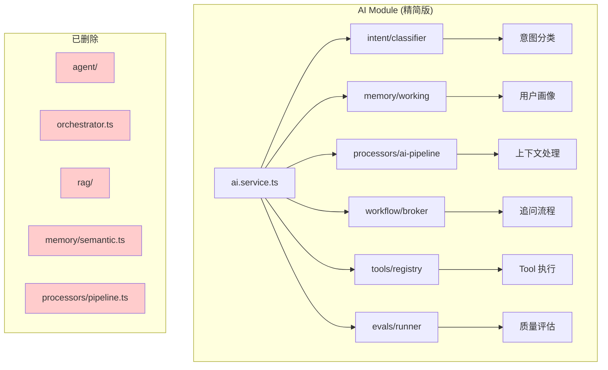
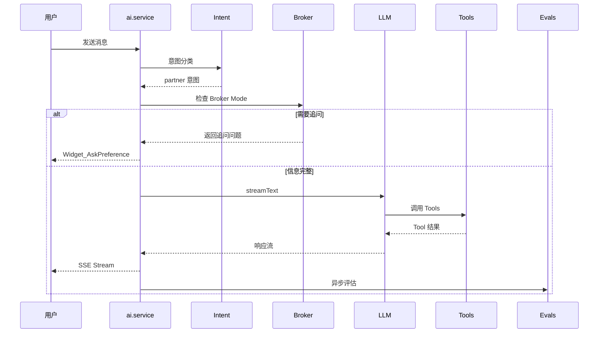

# Design Document

## Overview

本设计文档描述 AI 模块架构清理的技术方案。

核心原则：
- **删除过度设计**：RAG、Agent 抽象层
- **保留全流程能力**：Workflow 状态机（broker、draft-flow、match-flow）
- **接入有价值模块**：Evals 实时评估

## Architecture

### 清理前 vs 清理后

```
清理前（过度设计）              清理后（精简 + 全流程）
ai/                            ai/
├── agent/        ❌ 删除       ├── intent/       ✅ 保留
├── orchestrator  ❌ 删除       ├── memory/       ✅ 保留（删除 semantic.ts）
├── rag/          ❌ 删除       ├── tools/        ✅ 保留
├── workflow/                   ├── models/       ✅ 保留
│   ├── workflow.ts  ✅ 保留    ├── prompts/      ✅ 保留（添加 ACTIVITY_GUIDE）
│   ├── broker.ts    ✅ 接入    ├── guardrails/   ✅ 保留
│   ├── draft-flow   ✅ 保留    ├── observability/✅ 保留
│   ├── match-flow   ✅ 保留    ├── moderation/   ✅ 保留
│   └── preference   ❌ 删除    ├── anomaly/      ✅ 保留
├── processors/                 ├── evals/        ✅ 接入实时评估
│   ├── ai-pipeline  ✅ 简化    ├── workflow/
│   ├── pipeline     ❌ 删除    │   ├── workflow.ts  ✅ 通用引擎
│   └── 其他         ❌ 删除    │   ├── broker.ts    ✅ 找搭子追问
├── evals/        ✅ 接入       │   ├── draft-flow   ✅ 草稿确认
└── ai.service.ts ✅ 增强       │   └── match-flow   ✅ 匹配确认
                               ├── processors/
                               │   └── ai-pipeline.ts ✅ 简化版
                               └── ai.service.ts ✅ 增强
```

### 精简后架构图



### 数据流



## Design Details

### 1. 删除 Agent 抽象层

**删除文件**：
- `agent/` 整个目录（agent.ts, executor.ts, runtime.ts, streaming.ts, types.ts）
- `orchestrator.ts`

**原因**：Vercel AI SDK 的 `streamText` 已足够，自研抽象层 ROI 为负。

### 2. 删除 RAG 模块

**删除文件**：
- `rag/` 整个目录（retriever.ts, types.ts）
- `memory/semantic.ts`

**原因**：
- 小聚是"按图索骥"（结构化查询），不是"大海捞针"（语义检索）
- 知识量小（几十条活动建议），Prompt 内置即可
- 当前是内存实现，重启丢失，生产环境无用

**替代方案**：在 `prompts/xiaoju-v39.ts` 添加活动引导知识：

```typescript
const ACTIVITY_GUIDE: Record<string, string> = {
  剧本杀: '建议6-8人，提前预约，先问大家喜欢推理/情感/恐怖',
  火锅: '人均80-120元，提前订位，问清忌口',
  羽毛球: '建议4-6人，提前订场地，带好球拍和水',
  KTV: '建议4-8人，提前订包间，问清是否有麦霸',
  桌游: '建议4-6人，新手建议从简单游戏开始',
  // ... 扩展到 10 种常见活动类型
};
```

### 3. 保留 Workflow 模块（全流程能力）

**保留文件**：
- `workflow/workflow.ts` - 通用状态机引擎
- `workflow/broker.ts` - 找搭子追问流程（接入 ai.service.ts）
- `workflow/draft-flow.ts` - 草稿确认流程
- `workflow/match-flow.ts` - 匹配确认流程
- `workflow/types.ts` - 类型定义

**删除文件**：
- `workflow/preference-flow.ts` - 与 broker.ts 功能重叠

**Workflow 使用场景**：

| 流程 | 触发条件 | 状态流转 |
|------|----------|----------|
| Broker | 用户说"找搭子"但信息不完整 | collecting → searching → completed |
| Draft | AI 生成活动草稿后 | review → publish/cancel |
| Match | 找搭子匹配成功后 | review → confirm/reject |

### 4. 接入 Broker Mode

在 `ai.service.ts` 中接入：

```typescript
import { 
  shouldEnterBrokerMode, 
  recoverBrokerState, 
  createBrokerState,
  updateBrokerState,
  getNextQuestion,
  parseUserAnswer,
  persistBrokerState,
} from './workflow/broker';

// 在意图分类后检查
if (intentResult.intent === 'partner' && userId) {
  const thread = await getOrCreateThread(userId);
  const brokerState = await recoverBrokerState(thread.id);
  
  if (shouldEnterBrokerMode('partner', brokerState)) {
    return handleBrokerFlow(request, brokerState, thread.id);
  }
}

// handleBrokerFlow 实现结构化追问
async function handleBrokerFlow(
  request: ChatRequest,
  existingState: BrokerState | null,
  threadId: string
): Promise<Response> {
  const state = existingState || createBrokerState();
  const question = getNextQuestion(state);
  
  if (!question) {
    // 信息收集完成，调用 createPartnerIntent
    return callPartnerIntentTool(state.collectedPreferences);
  }
  
  // 返回追问 Widget
  return createAskPreferenceResponse(question, state);
}
```

### 5. 精简 Processors

**删除文件**：
- `processors/pipeline.ts` - 过度抽象的处理器框架
- `processors/types.ts` - 随 pipeline.ts 删除
- `processors/context-injector.ts` - 未使用
- `processors/history-loader.ts` - 未使用
- `processors/token-limiter.ts` - 未使用

**简化 ai-pipeline.ts**：

```typescript
// 简化后的 ai-pipeline.ts - 移除语义检索依赖
import { getEnhancedUserProfile, buildProfilePrompt } from '../memory/working';
import { createLogger } from '../observability/logger';

const logger = createLogger('ai-pipeline');

/**
 * 处理 AI 请求上下文（简化版）
 * 
 * 只保留用户画像注入，移除语义检索
 */
export async function processAIContext(params: {
  userId: string | null;
  message: string;
  systemPrompt: string;
  history?: Array<{ role: string; content: string }>;
}): Promise<string> {
  let prompt = params.systemPrompt;
  
  // 1. 注入用户画像（如果有）
  if (params.userId) {
    const profile = await getEnhancedUserProfile(params.userId);
    if (profile.preferences.length > 0 || profile.frequentLocations.length > 0) {
      const profilePrompt = buildProfilePrompt(profile);
      if (profilePrompt) {
        prompt += `\n\n${profilePrompt}`;
        logger.debug('User profile injected', { 
          preferencesCount: profile.preferences.length,
        });
      }
    }
  }
  
  // 2. Token 限制（简单截断）
  const maxLength = 12000;
  if (prompt.length > maxLength) {
    logger.warn('System prompt truncated', { originalLength: prompt.length });
    prompt = prompt.slice(0, maxLength) + '\n...[内容过长，已截断]';
  }
  
  return prompt;
}
```

### 6. 接入 Evals 实时评估

在 `ai.service.ts` 的 `onFinish` 回调中异步执行：

```typescript
import { evaluateResponse } from './evals/runner';

onFinish: async ({ text }) => {
  // ... 现有逻辑 ...
  
  // 异步评估，不阻塞响应
  evaluateResponseQuality({
    input: lastUserMessage,
    output: text || '',
    expectedIntent: intentResult.intent,
    actualToolCalls: traceSteps.map(s => s.toolName),
  }).then(result => {
    if (result.score < 0.6) {
      logger.warn('Low quality response detected', { 
        score: result.score,
        input: lastUserMessage.slice(0, 50),
      });
    }
  }).catch(() => {});
}
```

需要在 `evals/runner.ts` 添加简化的评估函数：

```typescript
/**
 * 评估单个响应质量（实时版）
 */
export async function evaluateResponseQuality(params: {
  input: string;
  output: string;
  expectedIntent: string;
  actualToolCalls: string[];
}): Promise<{ score: number; details: Record<string, number> }> {
  const scores: Record<string, number> = {};
  
  // 1. 输出非空检查
  scores.hasOutput = params.output.length > 0 ? 1 : 0;
  
  // 2. 工具调用合理性（简单规则）
  const intentToolMap: Record<string, string[]> = {
    create: ['createActivityDraft'],
    explore: ['exploreNearby'],
    partner: ['createPartnerIntent', 'askPreference'],
    manage: ['getMyActivities'],
  };
  const expectedTools = intentToolMap[params.expectedIntent] || [];
  scores.toolMatch = expectedTools.length === 0 
    ? 1 
    : params.actualToolCalls.some(t => expectedTools.includes(t)) ? 1 : 0;
  
  // 计算总分
  const avgScore = Object.values(scores).reduce((a, b) => a + b, 0) / Object.values(scores).length;
  
  return { score: avgScore, details: scores };
}
```

## Summary

| 模块 | 操作 | 原因 |
|------|------|------|
| agent/ | 删除 | Vercel AI SDK 已足够 |
| orchestrator.ts | 删除 | 额外抽象层无价值 |
| rag/ | 删除 | "按图索骥"不需要语义检索 |
| memory/semantic.ts | 删除 | 依赖 RAG，一起删除 |
| workflow/workflow.ts | 保留 | 通用状态机引擎 |
| workflow/broker.ts | 接入 | 找搭子追问流程 |
| workflow/draft-flow.ts | 保留 | 草稿确认流程 |
| workflow/match-flow.ts | 保留 | 匹配确认流程 |
| workflow/preference-flow.ts | 删除 | 与 broker 重叠 |
| processors/ | 大部分删除 | 只保留简化版 ai-pipeline.ts |
| evals/ | 接入 | 实时自我评估 |
