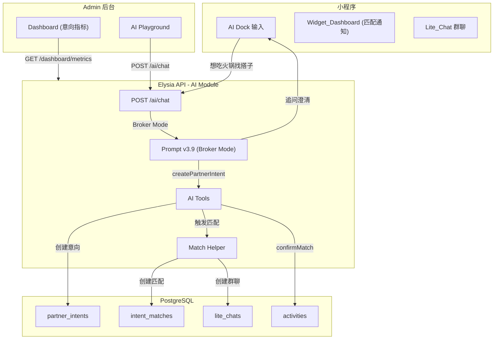

# Design Document: Partner Intent System (找搭子)

## Overview

**Version: v4.0 (Smart Broker)**

「找搭子」功能的核心是将 Agent 从"被动收单员"升级为"高级经纪人"。用户是"挑剔的买家"，Agent 必须追问澄清需求后才能下单入库，匹配必须精准（tag 冲突宁可不匹配）。

**核心设计原则**：
1. **No Independent REST API**: 所有用户操作通过 `POST /ai/chat`，不创建独立的 `/intents` 模块
2. **Prompt-Driven Behavior**: 核心变化在 System Prompt，新增 "Broker Mode" 指令
3. **Rich MetaData Required**: Agent 必须提取结构化数据（tags, budget_type, poi_preference）
4. **Strict Matching**: tag 冲突直接不匹配，宁缺毋滥
5. **Admin = Dashboard + Playground**: 不需要独立的意向管理页面

**核心流程**：
```
Inquiry (询价) → Search (查库) → Consultation (追问澄清) → Booking (下单入库) → Matching (精准撮合)
```

## Architecture

### 系统架构图



### 数据流

```
用户: "想吃火锅，谁组我就去"
    ↓
Agent 进入 Broker Mode
    ↓
Agent 追问: "想大概几点去？是希望能AA吗？"
    ↓
用户: "今晚7点，AA制，不喝酒"
    ↓
Agent 提取 Rich Intent: {tags: ["AA", "NoAlcohol"], time: "今晚19:00"}
    ↓
Agent 调用 createPartnerIntent
    ↓
系统触发匹配检测
    ↓
发现匹配 → 创建 Lite_Chat → 发送 Icebreaker
    ↓
Widget_Dashboard 显示匹配通知
    ↓
Temp_Organizer 确认 → 转为 Activity
```

## Components and Interfaces

### 1. Database Schema

#### 1.1 新增枚举

```typescript
// packages/db/src/schema/enums.ts

export const partnerIntentStatusEnum = pgEnum("partner_intent_status", [
  "active",     // 活跃中，等待匹配
  "matched",    // 已匹配成功
  "expired",    // 已过期 (24h)
  "cancelled"   // 用户取消
]);

export const intentMatchOutcomeEnum = pgEnum("intent_match_outcome", [
  "pending",    // 等待确认
  "confirmed",  // 已确认，转为活动
  "expired",    // 超时未确认
  "cancelled"   // 取消
]);
```

#### 1.2 partner_intents 表

```typescript
// packages/db/src/schema/partner-intents.ts

export const partnerIntents = pgTable("partner_intents", {
  id: uuid("id").primaryKey().defaultRandom(),
  userId: uuid("user_id").notNull().references(() => users.id),
  
  // 基础信息
  activityType: activityTypeEnum("activity_type").notNull(),
  locationHint: varchar("location_hint", { length: 100 }).notNull(),
  location: geometry("location", { type: "point", mode: "xy", srid: 4326 }).notNull(),
  timePreference: varchar("time_preference", { length: 50 }),
  
  // Rich Intent - Agent 追问后提取的结构化偏好
  metaData: jsonb("meta_data").$type<{
    tags: string[];              // ["AA", "NoAlcohol", "Quiet", "GirlFriendly"]
    poiPreference?: string;      // "朱光玉" (具体店铺)
    budgetType?: "AA" | "Treat" | "Free";
    rawInput: string;            // 原始用户输入
  }>().notNull(),
  
  status: partnerIntentStatusEnum("status").default("active").notNull(),
  expiresAt: timestamp("expires_at").notNull(),
  createdAt: timestamp("created_at").defaultNow().notNull(),
  updatedAt: timestamp("updated_at").defaultNow().notNull(),
}, (t) => [
  index("partner_intents_user_idx").on(t.userId),
  index("partner_intents_status_idx").on(t.status),
  index("partner_intents_type_idx").on(t.activityType),
  index("partner_intents_location_idx").using("gist", t.location),
]);

export const insertPartnerIntentSchema = createInsertSchema(partnerIntents);
export const selectPartnerIntentSchema = createSelectSchema(partnerIntents);
export type PartnerIntent = typeof partnerIntents.$inferSelect;
```

#### 1.3 intent_matches 表 (3表精简版)

> **优化说明**：用 `uuid[]` 数组替代 `intent_match_members` 中间表，Match 本身就是"隐形群组"

```typescript
// packages/db/src/schema/intent-matches.ts

export const intentMatches = pgTable("intent_matches", {
  id: uuid("id").primaryKey().defaultRandom(),
  
  activityType: activityTypeEnum("activity_type").notNull(),
  matchScore: integer("match_score").notNull(), // 0-100
  commonTags: jsonb("common_tags").$type<string[]>().notNull(),
  centerLocation: geometry("center_location", { type: "point", mode: "xy", srid: 4326 }).notNull(),
  centerLocationHint: varchar("center_location_hint", { length: 100 }).notNull(),
  
  tempOrganizerId: uuid("temp_organizer_id").notNull().references(() => users.id),
  
  // 优化：直接用数组存储关联的 Intent IDs 和 User IDs，砍掉中间表
  intentIds: uuid("intent_ids").array().notNull(),
  userIds: uuid("user_ids").array().notNull(),
  
  activityId: uuid("activity_id").references(() => activities.id),
  
  outcome: intentMatchOutcomeEnum("outcome").default("pending").notNull(),
  confirmDeadline: timestamp("confirm_deadline").notNull(),
  
  matchedAt: timestamp("matched_at").defaultNow().notNull(),
  confirmedAt: timestamp("confirmed_at"),
  createdAt: timestamp("created_at").defaultNow().notNull(),
});

export const insertIntentMatchSchema = createInsertSchema(intentMatches);
export const selectIntentMatchSchema = createSelectSchema(intentMatches);
export type IntentMatch = typeof intentMatches.$inferSelect;
```

#### 1.4 match_messages 表 (破冰消息)

> **优化说明**：直接关联 `matchId`，Match 本身就是群组，无需单独的 `lite_chats` 表

```typescript
// packages/db/src/schema/match-messages.ts

export const matchMessages = pgTable("match_messages", {
  id: uuid("id").primaryKey().defaultRandom(),
  
  // 直接关联到 Match ID (Match = Group)
  matchId: uuid("match_id").notNull().references(() => intentMatches.id, { onDelete: 'cascade' }),
  
  // 发送者 (null = 系统/Agent 消息)
  senderId: uuid("sender_id").references(() => users.id),
  
  // 消息类型: text, system, icebreaker
  messageType: varchar("message_type", { length: 20 }).default("text").notNull(),
  
  // 消息内容
  content: text("content").notNull(),
  
  createdAt: timestamp("created_at").defaultNow().notNull(),
}, (t) => [
  index("match_messages_match_idx").on(t.matchId),
  index("match_messages_created_idx").on(t.createdAt),
]);
```

> **删除的表**：
> - `intent_match_members` - 用 `intentIds[]` 和 `userIds[]` 数组替代
> - `lite_chats` - Match 本身就是群组
> - `lite_chat_messages` - 改为 `match_messages`

### 2. Prompt Engineering (核心变化)

#### 2.1 Prompt v3.9 - Broker Mode

```typescript
// apps/api/src/modules/ai/prompts/xiaoju-v39.ts
// 在现有 v3.8 基础上新增 Broker Mode 指令

// 新增 <broker_mode> 区块
<broker_mode>
触发条件:
- 用户搜索活动无结果时
- 用户说"找搭子/谁组我就去/懒得组局/等人约"

核心指令:
1. 进入 Broker Mode 后，你是"高级经纪人"，用户是"挑剔的买家"
2. 禁止立即入库：用户说"想吃火锅"不能直接创建意向
3. 必须追问澄清：
   - 时间: "想大概几点去？"
   - 预算: "是希望能AA吗？"
   - 偏好: "有什么特别要求吗？比如不喝酒、安静点的"
4. 追问限制：最多1-2轮，一句话可以问多个问题
5. 追问完成后，调用 createPartnerIntent 并确认：
   "📋 需求确认：
   目标：朱光玉火锅 (观音桥)
   时间：今晚 19:00 左右
   偏好：AA制、不喝酒、安静
   正在帮你寻找匹配的饭搭子... 有消息第一时间叫你。"

偏好优先级规则 (Intent Priority):
- 当前对话意图 > 历史意向记录
- 用户可能平时不喜欢某活动，但今天想尝试
- 示例：用户历史记录显示"不喜欢爬山"，但今天说"想去爬山"
  → 以当前对话为准，创建爬山意向
- 不要用历史偏好否定当前意图
- 历史偏好仅用于：追问时提供默认选项、匹配时作为参考
</broker_mode>

// 扩展 <intent_map>
<intent_map>
// ... 现有映射 ...

// 新增：找搭子意图
找搭子: "找搭子/谁组我就去/懒得组局/等人约" → 进入 Broker Mode
查意向: "我的搭子意向/我的意向" → getMyIntents
取消意向: "取消意向/不找了" → cancelIntent
确认匹配: "确认发布/就这个" → confirmMatch
</intent_map>

// 新增 <broker_examples>
<broker_examples>
U: 想吃火锅，谁组我就去
CTX: 位置=观音桥
A: 没问题！想大概几点去？是希望能AA吗？
// 进入 Broker Mode，追问澄清，不立即创建意向

U: 今晚7点吧，AA制，最好不喝酒
CTX: Broker Mode
A: 📋 需求确认：
目标：火锅 (观音桥)
时间：今晚 19:00 左右
偏好：AA制、不喝酒
正在帮你寻找匹配的饭搭子... 有消息第一时间叫你。
call createPartnerIntent({
  rawInput: "想吃火锅，今晚7点，AA制，不喝酒",
  activityType: "food",
  locationHint: "观音桥",
  timePreference: "今晚19:00",
  tags: ["AA", "NoAlcohol"],
  budgetType: "AA"
})
// 追问完成后才创建意向

// 偏好优先级示例
U: 想去爬山
CTX: 历史记录显示用户"不喜欢爬山"
A: 好呀！想去哪儿爬？大概什么时候？
// 以当前对话为准，不要说"你之前不是不喜欢爬山吗"
// 历史偏好不能否定当前意图

U: 周末去缙云山
A: 📋 需求确认：
目标：爬山 (缙云山)
时间：周末
正在帮你寻找匹配的爬山搭子...
call createPartnerIntent({
  rawInput: "想去爬山，周末，缙云山",
  activityType: "sports",
  locationHint: "缙云山",
  timePreference: "周末",
  tags: [],
  poiPreference: "缙云山"
})
</broker_examples>
```

### 3. AI Tools 设计

> **设计原则**：所有用户操作通过 AI Tools，不创建独立的 REST API

#### 3.1 createPartnerIntent Tool

```typescript
// apps/api/src/modules/ai/tools/create-partner-intent.ts

import { t } from 'elysia';
import { tool, jsonSchema } from 'ai';
import { toJsonSchema } from '@juchang/utils';

const createPartnerIntentSchema = t.Object({
  rawInput: t.String({ description: '用户原始输入' }),
  activityType: t.String({ description: '活动类型: food/entertainment/sports/boardgame' }),
  locationHint: t.String({ description: '地点提示: 观音桥/解放碑' }),
  timePreference: t.Optional(t.String({ description: '时间偏好: 今晚/周末/明天下午' })),
  tags: t.Array(t.String(), { description: '偏好标签: ["AA", "NoAlcohol", "Quiet"]' }),
  budgetType: t.Optional(t.Union([
    t.Literal('AA'),
    t.Literal('Treat'),
    t.Literal('Free'),
  ], { description: '预算类型' })),
  poiPreference: t.Optional(t.String({ description: '具体店铺偏好: 朱光玉' })),
});

type CreatePartnerIntentParams = typeof createPartnerIntentSchema.static;

export function createPartnerIntentTool(
  userId: string | null,
  userLocation: { lat: number; lng: number } | null
) {
  return tool({
    description: '创建搭子意向。当用户完成需求澄清后使用。必须包含 tags 和 activityType。',
    
    inputSchema: jsonSchema<CreatePartnerIntentParams>(
      toJsonSchema(createPartnerIntentSchema)
    ),
    
    execute: async (params: CreatePartnerIntentParams) => {
      // 1. 验证登录
      if (!userId) {
        return { success: false, error: '需要先登录才能发布搭子意向', requireAuth: true };
      }
      
      // 2. 验证手机号 (CP-9)
      const user = await getUserById(userId);
      if (!user?.phoneNumber) {
        return { success: false, error: '需要先绑定手机号才能发布搭子意向' };
      }
      
      // 3. 验证位置
      if (!userLocation) {
        return { success: false, error: '需要获取你的位置才能匹配附近的搭子' };
      }
      
      // 4. 检查重复意向
      const existingIntent = await getActiveIntentByType(userId, params.activityType);
      if (existingIntent) {
        return { success: false, error: `你已经有一个[${params.activityType}]意向在等待匹配了` };
      }
      
      // 5. 创建意向
      const intent = await db.insert(partnerIntents).values({
        userId,
        activityType: params.activityType,
        locationHint: params.locationHint,
        location: sql`ST_SetSRID(ST_MakePoint(${userLocation.lng}, ${userLocation.lat}), 4326)`,
        timePreference: params.timePreference,
        metaData: {
          tags: params.tags,
          poiPreference: params.poiPreference,
          budgetType: params.budgetType,
          rawInput: params.rawInput,
        },
        expiresAt: new Date(Date.now() + 24 * 60 * 60 * 1000), // 24h
      }).returning();
      
      // 6. 触发匹配检测
      const matchResult = await detectMatchesForIntent(intent[0].id);
      
      // 7. 返回结果
      if (matchResult) {
        return {
          success: true,
          intentId: intent[0].id,
          matchFound: true,
          matchId: matchResult.id,
          message: '🎉 找到匹配的搭子了！',
        };
      }
      
      return {
        success: true,
        intentId: intent[0].id,
        matchFound: false,
        message: '意向已发布，有匹配会第一时间通知你',
      };
    },
  });
}
```

#### 3.2 getMyIntents Tool

```typescript
// apps/api/src/modules/ai/tools/get-my-intents.ts

export function getMyIntentsTool(userId: string | null) {
  return tool({
    description: '查询用户的搭子意向列表和待确认的匹配。',
    
    inputSchema: jsonSchema<{}>({ type: 'object', properties: {} }),
    
    execute: async () => {
      if (!userId) {
        return { success: false, error: '需要先登录', requireAuth: true };
      }
      
      const intents = await db
        .select()
        .from(partnerIntents)
        .where(and(
          eq(partnerIntents.userId, userId),
          eq(partnerIntents.status, 'active')
        ));
      
      const pendingMatches = await getPendingMatchesForUser(userId);
      
      return {
        success: true,
        intents,
        pendingMatches,
      };
    },
  });
}
```

#### 3.3 cancelIntent Tool

```typescript
// apps/api/src/modules/ai/tools/cancel-intent.ts

const cancelIntentSchema = t.Object({
  intentId: t.String({ description: '要取消的意向 ID' }),
});

export function cancelIntentTool(userId: string | null) {
  return tool({
    description: '取消搭子意向。',
    
    inputSchema: jsonSchema<{ intentId: string }>(toJsonSchema(cancelIntentSchema)),
    
    execute: async ({ intentId }) => {
      if (!userId) {
        return { success: false, error: '需要先登录', requireAuth: true };
      }
      
      const [intent] = await db
        .select()
        .from(partnerIntents)
        .where(and(
          eq(partnerIntents.id, intentId),
          eq(partnerIntents.userId, userId)
        ));
      
      if (!intent) {
        return { success: false, error: '找不到这个意向' };
      }
      
      if (intent.status !== 'active') {
        return { success: false, error: '这个意向已经不能取消了' };
      }
      
      await db
        .update(partnerIntents)
        .set({ status: 'cancelled', updatedAt: new Date() })
        .where(eq(partnerIntents.id, intentId));
      
      return { success: true, message: '意向已取消' };
    },
  });
}
```

#### 3.4 confirmMatch Tool

```typescript
// apps/api/src/modules/ai/tools/confirm-match.ts

const confirmMatchSchema = t.Object({
  matchId: t.String({ description: '要确认的匹配 ID' }),
});

export function confirmMatchTool(userId: string | null) {
  return tool({
    description: '确认匹配，将匹配转为正式活动。只有临时召集人可以确认。',
    
    inputSchema: jsonSchema<{ matchId: string }>(toJsonSchema(confirmMatchSchema)),
    
    execute: async ({ matchId }) => {
      if (!userId) {
        return { success: false, error: '需要先登录', requireAuth: true };
      }
      
      const [match] = await db
        .select()
        .from(intentMatches)
        .where(eq(intentMatches.id, matchId));
      
      if (!match) {
        return { success: false, error: '找不到这个匹配' };
      }
      
      if (match.tempOrganizerId !== userId) {
        return { success: false, error: '只有临时召集人才能确认发布' };
      }
      
      if (match.outcome !== 'pending') {
        return { success: false, error: '这个匹配已经处理过了' };
      }
      
      if (new Date() > match.confirmDeadline) {
        return { success: false, error: '匹配已过期，请重新发布意向' };
      }
      
      // 创建活动
      const activity = await createActivityFromMatch(match);
      
      return {
        success: true,
        activityId: activity.id,
        message: '🎉 活动创建成功！',
      };
    },
  });
}
```

### 4. Match Service (匹配逻辑)

> **偏好优先级原则**：当前意向的 tags > 历史偏好。匹配时只看当前意向的 meta_data，不参考用户历史记录。

```typescript
// apps/api/src/modules/ai/tools/helpers/match.ts

// 冲突标签定义
const CONFLICTING_TAGS: [string, string][] = [
  ['NoAlcohol', 'Drinking'],
  ['Quiet', 'Party'],
  ['GirlOnly', 'BoyOnly'],
];

/**
 * 检测意向匹配
 */
export async function detectMatchesForIntent(intentId: string): Promise<IntentMatch | null> {
  const intent = await getIntentById(intentId);
  if (!intent || intent.status !== 'active') return null;
  
  // 1. 查找候选意向 (同类型、3km内、活跃状态)
  const candidates = await db
    .select()
    .from(partnerIntents)
    .where(and(
      eq(partnerIntents.activityType, intent.activityType),
      eq(partnerIntents.status, 'active'),
      ne(partnerIntents.id, intentId),
      sql`ST_DWithin(
        ${partnerIntents.location}::geography,
        ST_SetSRID(ST_MakePoint(${intent.location.x}, ${intent.location.y}), 4326)::geography,
        3000
      )`
    ));
  
  if (candidates.length === 0) return null;
  
  // 2. 检查 tag 冲突
  const compatibleCandidates = candidates.filter(c => 
    !hasTagConflict(intent.metaData.tags, c.metaData.tags)
  );
  
  if (compatibleCandidates.length === 0) return null;
  
  // 3. 计算匹配分数
  const allIntents = [intent, ...compatibleCandidates];
  const matchScore = calculateMatchScore(allIntents);
  
  // 4. 检查阈值 (> 80%)
  if (matchScore < 80) return null;
  
  // 5. 创建匹配
  return createMatch(allIntents, matchScore);
}

/**
 * 检查 tag 冲突
 */
function hasTagConflict(tagsA: string[], tagsB: string[]): boolean {
  for (const [tag1, tag2] of CONFLICTING_TAGS) {
    if (
      (tagsA.includes(tag1) && tagsB.includes(tag2)) ||
      (tagsA.includes(tag2) && tagsB.includes(tag1))
    ) {
      return true;
    }
  }
  return false;
}

/**
 * 计算匹配分数
 */
function calculateMatchScore(intents: PartnerIntent[]): number {
  const allTags = intents.flatMap(i => i.metaData.tags);
  const tagCounts = allTags.reduce((acc, tag) => {
    acc[tag] = (acc[tag] || 0) + 1;
    return acc;
  }, {} as Record<string, number>);
  
  const commonTags = Object.entries(tagCounts)
    .filter(([_, count]) => count >= 2)
    .map(([tag]) => tag);
  
  const avgTagCount = allTags.length / intents.length;
  return Math.round((commonTags.length / Math.max(avgTagCount, 1)) * 100);
}

/**
 * 创建匹配记录 (3表精简版)
 */
async function createMatch(intents: PartnerIntent[], matchScore: number): Promise<IntentMatch> {
  // 选择最早的意向创建者作为 Temp_Organizer
  const tempOrganizer = intents.reduce((a, b) => 
    a.createdAt < b.createdAt ? a : b
  );
  
  // 计算中心位置
  const centerLocation = calculateCenterLocation(intents);
  
  // 计算确认截止时间 (6h 或当天 23:59)
  const confirmDeadline = calculateConfirmDeadline();
  
  // 提取 intentIds 和 userIds 数组
  const intentIds = intents.map(i => i.id);
  const userIds = intents.map(i => i.userId);
  
  // 创建匹配记录 (Match 本身就是群组)
  const [match] = await db.insert(intentMatches).values({
    activityType: intents[0].activityType,
    matchScore,
    commonTags: getCommonTags(intents),
    centerLocation,
    centerLocationHint: intents[0].locationHint,
    tempOrganizerId: tempOrganizer.userId,
    intentIds,
    userIds,
    confirmDeadline,
  }).returning();
  
  // 发送 Icebreaker (直接关联 matchId)
  await sendIcebreaker(match, intents);
  
  return match;
}
```

### 5. Dashboard 扩展

```typescript
// apps/api/src/modules/dashboard/dashboard.service.ts
// 扩展 getBusinessMetrics() 函数

export async function getIntentMetrics(): Promise<IntentMetrics> {
  const now = new Date();
  const todayStart = new Date(now.setHours(0, 0, 0, 0));
  
  // 活跃意向数
  const [activeCount] = await db
    .select({ count: sql<number>`count(*)` })
    .from(partnerIntents)
    .where(eq(partnerIntents.status, 'active'));
  
  // 今日新增
  const [todayNew] = await db
    .select({ count: sql<number>`count(*)` })
    .from(partnerIntents)
    .where(gte(partnerIntents.createdAt, todayStart));
  
  // 转化率 (matched / total)
  const [total] = await db
    .select({ count: sql<number>`count(*)` })
    .from(partnerIntents);
  const [matched] = await db
    .select({ count: sql<number>`count(*)` })
    .from(partnerIntents)
    .where(eq(partnerIntents.status, 'matched'));
  
  const conversionRate = total.count > 0 
    ? Math.round((matched.count / total.count) * 100) 
    : 0;
  
  // 平均匹配时长
  const avgMatchTime = await calculateAvgMatchTime();
  
  return {
    activeCount: { value: activeCount.count, trend: 0 },
    todayNew: { value: todayNew.count, trend: 0 },
    conversionRate: { value: conversionRate, unit: '%', trend: 0 },
    avgMatchTime: { value: avgMatchTime, unit: 'min', trend: 0 },
  };
}
```

### 6. Playground 扩展

```typescript
// apps/admin/src/features/ai-ops/components/playground/playground-chat.tsx
// ToolPreview 组件新增渲染分支

function ToolPreview({ toolPart, onSendMessage }) {
  const toolName = getToolName(toolPart);
  
  // 新增分支
  if (toolName === 'createPartnerIntent') {
    return <IntentCreatedPreview output={toolPart.output} />;
  }
  
  if (toolName === 'getMyIntents') {
    return <IntentListPreview intents={toolPart.output?.intents} />;
  }
  
  if (toolName === 'confirmMatch') {
    return <MatchConfirmedPreview output={toolPart.output} />;
  }
  
  // ... 现有分支
}
```

### 7. Welcome API 扩展

```typescript
// apps/api/src/modules/ai/ai.service.ts
// 扩展 buildWelcomeResponse 函数

async function buildWelcomeResponse(userId: string | null, ...): Promise<WelcomeResponse> {
  // ... 现有逻辑
  
  // 新增: 检查未确认的匹配 (置顶高亮)
  let pendingMatches: PendingMatch[] = [];
  if (userId) {
    pendingMatches = await getPendingMatchesForUser(userId);
  }
  
  // 新增: 找搭子快捷入口
  const suggestions = buildSuggestionItems(location);
  suggestions.push({
    type: 'suggestion',
    label: '想吃火锅找搭子',
    prompt: '想吃火锅，谁组我就去',
  });
  
  return {
    greeting,
    subGreeting,
    sections,
    pendingMatches, // 新增
  };
}
```

### 8. Cron Jobs

```typescript
// apps/api/src/jobs/intent-jobs.ts

// 1. 过期意向处理 (每小时)
export async function expireOldIntents(): Promise<void> {
  await db
    .update(partnerIntents)
    .set({ status: 'expired', updatedAt: new Date() })
    .where(and(
      eq(partnerIntents.status, 'active'),
      lt(partnerIntents.expiresAt, new Date())
    ));
}

// 2. 过期匹配处理 (每 10 分钟)
export async function handleExpiredMatches(): Promise<void> {
  const expiredMatches = await db
    .select()
    .from(intentMatches)
    .where(and(
      eq(intentMatches.outcome, 'pending'),
      lt(intentMatches.confirmDeadline, new Date())
    ));
  
  for (const match of expiredMatches) {
    // 尝试重新分配 Temp_Organizer
    const reassigned = await reassignTempOrganizer(match.id);
    if (!reassigned) {
      // 无法重新分配，标记为过期
      await db
        .update(intentMatches)
        .set({ outcome: 'expired' })
        .where(eq(intentMatches.id, match.id));
    }
  }
}
```

## Data Models

### Rich Intent 结构

```typescript
interface RichIntent {
  tags: string[];              // ["AA", "NoAlcohol", "Quiet"]
  poiPreference?: string;      // "朱光玉"
  budgetType?: "AA" | "Treat" | "Free";
  rawInput: string;            // 原始用户输入
}
```

### 标签定义

| 标签 | 含义 | 冲突标签 |
|------|------|----------|
| AA | AA制 | Treat |
| Treat | 有人请客 | AA |
| NoAlcohol | 不喝酒 | Drinking |
| Drinking | 要喝酒 | NoAlcohol |
| Quiet | 安静 | Party |
| Party | 热闘 | Quiet |
| GirlFriendly | 女生友好 | - |
| GirlOnly | 仅限女生 | BoyOnly |
| BoyOnly | 仅限男生 | GirlOnly |

### Icebreaker Message 模板

```typescript
const icebreakerTemplate = `
🎉 终于匹配上了！
@{users} 你们都想{activityType}，而且都{commonTags}。
既然需求这么一致，我帮你们把方案拟好了。
@{tempOrganizer} 要不你点个头，我们这局就成了？
`;
```

## Correctness Properties

*A property is a characteristic or behavior that should hold true across all valid executions of a system—essentially, a formal statement about what the system should do. Properties serve as the bridge between human-readable specifications and machine-verifiable correctness guarantees.*

### Property 1: Vague Input Rejection

*For any* user input that only contains activity type without time/budget/vibe preferences, the Agent SHALL NOT immediately call createPartnerIntent.

**Validates: Requirements 1.2**

### Property 2: Rich Intent Extraction

*For any* user input containing identifiable preferences (tags like "AA制", "不喝酒"), the extracted meta_data.tags SHALL contain all identified preferences.

**Validates: Requirements 1.6**

### Property 3: Intent Data Round-Trip

*For any* created partner intent, reading it back from the database SHALL return the same meta_data (tags, budgetType, rawInput) that was provided during creation.

**Validates: Requirements 1.6, 1.7**

### Property 4: Intent Expiration Default

*For any* newly created partner intent, the expiresAt timestamp SHALL equal createdAt + 24 hours.

**Validates: Requirements 1.7**

### Property 5: Matching Hard Filters

*For any* two intents, a match SHALL only be created if: (1) activity_type matches exactly, (2) locations are within 3km, (3) time windows overlap.

**Validates: Requirements 2.2**

### Property 6: Tag Conflict Detection

*For any* two intents where one has tag "NoAlcohol" and the other has tag "Drinking", the system SHALL NOT create a match between them.

**Validates: Requirements 2.3**

### Property 7: Match Score Calculation

*For any* match, the match_score SHALL equal (common_tags_count / average_tags_count) * 100, rounded to the nearest integer.

**Validates: Requirements 2.4**

### Property 8: Match Threshold Enforcement

*For any* set of intents with match_score < 80%, the system SHALL NOT create a match.

**Validates: Requirements 2.5**

### Property 9: Temp Organizer Selection

*For any* match, the Temp_Organizer SHALL be the user whose intent has the earliest createdAt timestamp among all matched intents.

**Validates: Requirements 2.6**

### Property 10: Confirm Deadline Calculation

*For any* match, the confirmDeadline SHALL be either 6 hours from matchedAt OR 23:59 of the same day, whichever is earlier.

**Validates: Requirements 3.3**

### Property 11: Match Confirmation State Transition

*For any* match where Temp_Organizer confirms: (1) all related intents SHALL have status='matched', (2) an activity SHALL be created with status='active', (3) all matched users SHALL be added as participants.

**Validates: Requirements 4.1, 4.2, 4.3**

### Property 12: Privacy Protection in Notifications

*For any* notification message posted to the official group, the message SHALL NOT contain user nicknames or identifiable information.

**Validates: Requirements 5.3**

### Property 13: Dashboard Metrics Accuracy

*For any* dashboard metrics query, the activeCount SHALL equal the count of intents with status='active' in the database.

**Validates: Requirements 6.1**

## Error Handling

### User-Facing Errors

| Error Code | Condition | Message |
|------------|-----------|---------|
| `PHONE_REQUIRED` | User has no phone number | "需要先绑定手机号才能发布搭子意向" |
| `LOCATION_REQUIRED` | No location provided | "需要获取你的位置才能匹配附近的搭子" |
| `DUPLICATE_INTENT` | Active intent exists for same type | "你已经有一个[火锅]意向在等待匹配了" |
| `INTENT_NOT_FOUND` | Intent ID doesn't exist | "找不到这个意向" |
| `INTENT_NOT_ACTIVE` | Intent is not active | "这个意向已经不能操作了" |
| `NOT_ORGANIZER` | User is not Temp_Organizer | "只有临时召集人才能确认发布" |
| `MATCH_EXPIRED` | Match confirmDeadline passed | "匹配已过期，请重新发布意向" |

### Edge Cases

1. **All users in match cancel before confirmation**: Mark match as 'cancelled', no activity created
2. **Temp_Organizer cancels their intent**: Reassign to next user immediately
3. **Only 1 user left in match**: Cancel match, restore remaining user's intent to 'active'
4. **Intent expires during match pending**: Keep match valid until confirmDeadline

## Testing Strategy

### Unit Tests

Unit tests focus on specific examples and edge cases:

1. **Intent Creation**
   - Create intent with valid data → success
   - Create intent without phone → error
   - Create intent without location → error
   - Create duplicate intent for same type → error

2. **Match Detection**
   - Two intents same type, <3km, no conflict → match created
   - Two intents same type, >3km → no match
   - Two intents with conflicting tags → no match

3. **Match Confirmation**
   - Temp_Organizer confirms → activity created
   - Non-organizer confirms → error

### Property-Based Tests

Property-based tests verify universal properties across many generated inputs. Each test runs minimum 100 iterations.

**Testing Framework**: fast-check (TypeScript)

```typescript
// Property 6: Tag Conflict Detection
// Feature: partner-intent, Property 6: Tag Conflict Detection
test('conflicting tags prevent matching', async () => {
  await fc.assert(
    fc.asyncProperty(
      arbitraryIntentWithTags(['NoAlcohol']),
      arbitraryIntentWithTags(['Drinking']),
      async (intentA, intentB) => {
        const match = await detectMatchesForIntent(intentA.id);
        return match === null; // No match should be created
      }
    ),
    { numRuns: 100 }
  );
});

// Property 9: Temp Organizer Selection
// Feature: partner-intent, Property 9: Temp Organizer Selection
test('earliest intent creator becomes Temp_Organizer', async () => {
  await fc.assert(
    fc.asyncProperty(
      fc.array(arbitraryIntent(), { minLength: 2, maxLength: 5 }),
      async (intents) => {
        const match = await createMatchFromIntents(intents);
        const earliest = intents.reduce((a, b) => 
          a.createdAt < b.createdAt ? a : b
        );
        return match.tempOrganizerId === earliest.userId;
      }
    ),
    { numRuns: 100 }
  );
});
```