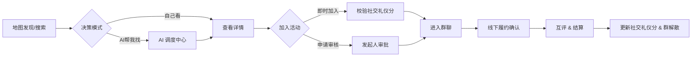

# 聚场 (Juchang) 产品需求文档 - V8.5 (MVP Final)

## 1. 全局定义 (Global Definitions)

### 1.1 商业模式 (Business Model) - O2O定位
**产品定位**：强 O2O 属性的 LBS 社交平台，核心价值在于线下真实履约与社交连接。

*   **免费核心功能**：地图浏览、创建活动、基础AI、群聊等。
*   **按需付费服务** (微信支付)：
    *   **AI 深度服务**：智能推荐 (1元/次)、决策辅助 (2元/次)。
    *   **功能增强**：活动置顶 (5元/次)、强提醒通知 (1元/次)。
    *   **会员订阅 (Pro)**：月费会员 (15元/月) 享受AI服务折扣、优先展示等权益。
*   **合规说明**：产品具备完整的商业闭环设计。在开发规划中需做好 iOS/安卓平台的合规设计（如虚拟支付、订阅管理等），确保符合各平台审核规范。PRD 层面保留完整的商业逻辑设计。

### 1.2 信任体系 (Trust System) - 社交礼仪分
**社交礼仪分 (Social Etiquette Score)**：
- **初始分**：100 分
- **上限**：120 分 (需通过多次优良履约突破 100)
- **展示逻辑**：在 Tab 4 (我) 页面中，不直接展示具体分数，改为展示语义化入口（如"社交礼仪：极佳/良好/一般/待提升"或对应图标）。用户点击该入口后，跳转到详情页查看具体分数、雷达图、履约记录等详细信息。

**社交礼仪分变动规则**：

**正向加分 (+)**：
- **完成履约**：+2 分 (通过任一履约方式)
- **获得好评**：+1 分 (每日上限 +3)
- **连续履约**：连续5次履约额外 +2 分
- **主动取消**：提前2小时以上取消 +0 分 (不扣分)

**负向扣分 (-)**：
- **违约 (无故不参加)**：-20 分 (严重惩罚)
- **临时取消**：活动开始前2小时内取消 -1 分
- **获得差评**：-2 分
- **被举报核实**：-50 分
- **恶意刷分**：-30 分

**履约认定机制**（仅限线下LBS活动）：
1. **GPS签到**：适用于固定地点活动 (吃饭、运动场所等)
2. **1v1局扫码确认**：适用于1对1活动，必须由发起人扫描参与者的二维码（或双方互认），确保线下真实见面
3. **多人局发起人确权**：适用于3人及以上活动，发起人拥有一键确认全员到场的权限，同时也支持单独勾选成员

**阈值控制**：
- **< 80 分**：无法发起需审核的活动
- **< 60 分**：禁止发起活动，禁止报名
- **< 40 分**：账号冻结，需申诉恢复

**语义化等级映射**：
- **120分**：社交礼仪：极佳 ⭐⭐⭐⭐⭐
- **100-119分**：社交礼仪：优秀 ⭐⭐⭐⭐
- **80-99分**：社交礼仪：良好 ⭐⭐⭐
- **60-79分**：社交礼仪：一般 ⭐⭐
- **< 60分**：社交礼仪：待提升 ⭐

### 1.3 时效性 (Ephemerality)
*   **活动生命周期**：地图默认展示所有活动，用户可通过筛选器按需过滤时间范围。
*   **群聊生命周期**：正确跟随生命周期创建。

### 1.4 业务场景全景与边界定义 (Scenario Landscape & Boundaries)

**目的**：通过穷尽"找搭子"的真实场景，帮助团队聚焦 LBS 核心业务，明确我们"做什么"和"不做什么"，并预判不同场景下的痛点与解决方案，让产品在细节处发光。

#### A. 核心战场：强线下 LBS 场景 (Must-Win Battles)

**1. 拼单/省钱型 (Cost Sharing) —— 高频刚需**

**场景穷举**：
- **拼饭**：火锅、烤肉、日料、自助餐等
- **拼车**：机场接送、夜归拼车、跨城出行
- **拼单**：山姆会员店、Costco、奶茶团购、外卖拼单

**核心痛点**：
- **支付纠纷**：AA制结算不清、临时跳车导致费用分摊不均
- **临时跳车**：临近活动开始突然取消，导致其他人成本增加

**产品解法**：
- **费用标签强制显示**：活动详情页必须明确标注"AA制/请客/我请"，避免后续纠纷
- **社交礼仪分惩罚机制**：临时跳车（2小时内取消）扣除社交礼仪分 -5，增加跳车成本
- **多人局发起人确权**：采用"发起人确认"机制，发起人可一键确认全员到场，确保履约真实性
- **支付引导**：活动结束后，AI群助理自动提醒结算方式，引导线下完成支付

**2. 技能/互助型 (Utility) —— 价值交换**

**场景穷举**：
- **互拍**：探店拍照、公园写真、街拍搭子
- **健身辅助**：卧推保护、跑步陪练、瑜伽指导
- **遛狗**：宠友社交、遛狗搭子
- **技能交换**：语言交换、技能教学

**核心痛点**：
- **技能不匹配**：拍照技术差、健身知识不足，导致体验不佳
- **信任度低**：1对1场景下，担心对方不靠谱或技能水平不符预期

**产品解法**：
- **强调个人评价体系**：Tab 4 的"AI 个人评价"与"历史标签"（如"拍照达人"、"健身老手"）帮助用户快速识别技能匹配度
- **1v1 局强制扫码确认**：必须启用"双向扫码确认"机制，确保线下真实见面，保障双方安全
- **技能标签展示**：个人资料支持添加技能标签，活动详情页展示发起人的相关技能标签
- **评价闭环**：活动结束后，评价系统支持"技能评价"维度（如"拍照技术很棒"、"很会指导"）

**3. 兴趣/陪伴型 (Vibe) —— 情感粘性**

**场景穷举**：
- **文化娱乐**：看展、话剧、音乐会、电影（特别是恐怖电影搭子）
- **桌游社交**：剧本杀、密室逃脱（缺1人补位）、桌游局
- **城市探索**：Citywalk、探店、咖啡厅打卡
- **休闲陪伴**：逛街、下午茶、公园散步

**核心痛点**：
- **社恐冷场**：进群后没人说话，活动开始前尴尬
- **鸽子导致流局**：特别是剧本杀、密室等需要固定人数的活动，缺1人就会流局

**产品解法**：
- **AI 群助理破冰**：进群瞬间，AI自动发言引导话题，如"欢迎大家！@发起人 既然大家都进来了，要不要先定一下具体的碰头位置？"
- **地图刷新机制**：每次刷新仅更新5条数据，确保能快速发现附近的新活动，快速补位
- **活动状态实时更新**：剧本杀、密室等固定人数活动，显示"缺X人"，方便用户快速补位
- **AI 氛围调节**：检测群聊冷场，AI主动发起话题，如"大家对明天的活动有什么期待吗？"
- **强提醒通知**：活动开始前1小时、30分钟、10分钟，AI自动@所有人提醒，降低鸽子率

**4. 短途出行型 (Travel) —— 高信任门槛**

**场景穷举**：
- **周末短途**：周边露营、一日徒步、爬山
- **城市周边**：古镇游、温泉、采摘

**核心痛点**：
- **人身安全**：远离市区，存在安全隐患
- **路线分歧**：对路线、时间安排有不同意见
- **高信任门槛**：需要与陌生人一起出行，信任成本高

**产品解法**：
- **严格风控模型**：AI风险评估系统对出行类活动进行严格审核，高风险活动（如深夜、偏僻地点）自动标记警告
- **高社交礼仪分门槛**：发起人可设置"社交礼仪分90+"等门槛，确保参与者都是高信用用户
- **强制公共场所集合**：系统建议在公共场所（如地铁站、商场）集合，再一起出发
- **安全提示与免责声明**：活动详情页增加安全提示，如"建议在公共场所集合"、"注意人身安全"等
- **GPS轨迹记录**：活动进行中，系统记录GPS轨迹（用户授权后），作为安全保障
- **紧急联系人**：鼓励用户在个人资料中设置紧急联系人，高风险活动自动提醒

#### B. 战略边界：负面清单 (Negative Scope)

**坚决不做纯线上搭子**：

**排除场景**：
- ❌ **游戏组队**：王者荣耀、和平精英等游戏组队
- ❌ **纯语音连麦**：语音聊天、语音陪聊
- ❌ **云监督学习**：线上自习室、云监督打卡
- ❌ **线上观影**：一起看电影、一起看剧
- ❌ **线上活动**：所有不需要线下见面的活动

**引导逻辑**：
- 即使用户有聊天需求，系统必须要求绑定一个线下的 POI (地理位置)
- 例如：用户想"找人聊天"，系统引导改为"楼下咖啡馆聊聊"，强制要求选择具体地点
- 创建活动时，LBS定位为必填项，无法创建无地理位置的线上活动

**价值观**：
- **聚场的灵魂是"物理世界的真实碰撞"**，不做网络世界的流量消耗品
- 我们相信，只有线下真实见面，才能建立真正的信任和连接
- MVP阶段专注LBS线下场景，引导用户"走出家门"

**边界说明**：
- **混合场景处理**：如果活动有线上+线下混合需求（如"先线上聊，再线下见面"），必须以线下为主，线上部分作为辅助
- **活动类型限制**：创建活动时，活动类型选项仅包含线下场景（吃饭、运动、娱乐、学习等），不包含线上场景

#### C. 场景对核心流程的启示 (Implications)

**1. 地图设计启示**

- **动态 vs 静态场景兼容**：
  - **静态场景**（拼饭、看展）：Pin点固定在POI位置，点击查看详情
  - **动态场景**（拼车、Citywalk）：Pin点显示起点位置，详情页标注"路线动态"，支持显示路线轨迹
  - **地图Pin点设计**：需清晰区分"固定地点"和"动态路线"两种类型

- **场景标签化**：地图筛选器支持按场景类型筛选（拼单型、技能型、兴趣型、出行型），帮助用户快速找到匹配场景

**2. 履约设计启示**

- **不同场景对应不同履约强度**：
  - **1v1 扫码**：适用于技能/互助型（互拍、健身辅助），最高安全等级
  - **多人确认**：适用于拼单型、兴趣型，发起人确权机制
  - **GPS签到**：适用于固定地点活动（拼饭、看展），标准履约方式

- **场景化履约流程**：
  - **拼车场景**：起点GPS签到 + 终点GPS签到，双重验证
  - **剧本杀场景**：固定人数活动，缺1人无法开始，系统自动提醒补位
  - **出行场景**：起点集合GPS签到 + 途中GPS轨迹记录（可选）

**3. 合规设计启示**

- **高风险场景安全提示**：
  - **拼车场景**：详情页增加"拼车安全提示"，包括"建议在公共场所上车"、"注意人身安全"等
  - **出行场景**：详情页增加"出行安全提示"，包括"建议在公共场所集合"、"告知家人行程"等
  - **1v1场景**：详情页增加"1v1安全提示"，包括"建议在公共场所见面"、"注意个人安全"等

- **免责声明**：
  - 高风险活动（出行、拼车、1v1）详情页底部增加免责声明
  - 用户报名时，需确认"已阅读并同意安全提示"

- **风控分级**：
  - **低风险**（拼饭、看展）：标准风控
  - **中风险**（拼车、1v1）：增强风控 + 安全提示
  - **高风险**（出行、深夜活动）：严格风控 + 高社交礼仪分门槛 + 强制安全提示

**4. 运营策略启示**

- **场景化内容运营**：
  - 冷启动期，优先投放高频场景（拼饭、拼单），快速积累用户
  - 成长期，重点运营兴趣型场景（看展、Citywalk），提升用户粘性
  - 成熟期，拓展出行型场景，提升平台价值

- **场景化用户教育**：
  - 新手引导中，展示不同场景的典型案例
  - 帮助用户理解不同场景的履约方式和注意事项

---

## 2. 用户旅程 (User Journey)



---

## 3. 功能模块详解 (Functional Requirements)

### 3.1 Tab 1: 地图 (Map) - 发现与连接
**定位**：首页即地图，流量分发核心。

| 功能点 | 详细描述 | 优先级 |
| :--- | :--- | :--- |
| **全屏地图** | 腾讯地图 SDK，**无列表视图**。默认展示定位点 3km 内内容。 | P0 |
| **内容标记 (Pin)** | **简化颜色区分**：仅区分人（蓝色）和活动（橙色）两种类型。点击 Pin 弹出半屏卡片。 | P0 |
| **数据刷新策略** | **每次点击刷新仅更新5条数据**，避免信息过载。采用智能推荐算法优先展示相关度高的内容。 | P0 |
| **新手引导/价值观传递** | **[用户教育]** 用户首次进入地图前，通过引导页或蒙层教学，告知用户"每次刷新仅更新5条数据"的设计理念（"探索的乐趣"），避免用户误以为平台无内容。引导页强调：<br/>• 地图是探索式发现，每次刷新都有新内容<br/>• 鼓励用户多点击、多探索，发现附近的有趣活动<br/>• 通过筛选器可以精准找到想要的活动类型 | P0 |
| **无时效过滤** | **地图不做时效性过滤**，展示所有类型的内容（包括历史活动、长期招募等），通过筛选器进行精准控制。 | P0 |
| **统一筛选器** | **右上角筛选按钮** -> 点击展开详细筛选面板，包含：<br/>• **时间筛选**：今天/明天/本周/本月/不限<br/>• **类型筛选**：吃饭/娱乐/运动/学习/其他<br/>• **人群筛选**：仅限女生/男女不限/LGBTQ友好<br/>• **社交礼仪筛选**：社交礼仪90+/80+/不限<br/>• **距离筛选**：1km/3km/5km/10km<br/>• **状态筛选**：招募中/已满员/已结束 | P0 |
| **官方运营锚点** | **[生存关键]** 后台可投放"虚拟活动/幽灵锚点"，填充冷启动期的空白区域，点击可引导发布。 | P0 |
| **极简发布** | 地图下方抽屉 -> 抽屉中包含多个按钮（AI智能创建、传统表单等）。 | P0 |

**详细筛选面板设计**：
```
┌─────────────────────────────────┐
│ 🔍 筛选条件                      │
├─────────────────────────────────┤
│ ⏰ 时间范围                      │
│ ○ 今天  ○ 明天  ○ 本周  ○ 不限   │
├─────────────────────────────────┤
│ 🎯 活动类型                      │
│ ☑️ 吃饭  ☑️ 娱乐  ☑️ 运动  ☑️ 学习 │
├─────────────────────────────────┤
│ 👥 人群限制                      │
│ ○ 仅限女生  ○ 男女不限  ○ LGBTQ   │
├─────────────────────────────────┤
│ ⭐ 社交礼仪要求                  │
│ ○ 90+  ○ 80+  ○ 70+  ○ 不限     │
├─────────────────────────────────┤
│ 📍 距离范围                      │
│ ○ 1km  ○ 3km  ○ 5km  ○ 10km    │
├─────────────────────────────────┤
│ 📊 活动状态                      │
│ ☑️ 招募中  ☑️ 已满员  ☑️ 已结束   │
├─────────────────────────────────┤
│     [重置]        [应用筛选]      │
└─────────────────────────────────┘
```

**数据刷新机制**：
- **智能推荐算法**：基于用户历史偏好、地理位置、时间段等因素
- **5条数据策略**：每次刷新返回最相关的5条内容，避免信息过载
- **缓存机制**：本地缓存已加载数据，减少重复请求
- **实时更新**：新发布的活动实时推送到地图（不占用5条限制）

### 3.2 Tab 2: AI 调度中心 (Intelligence) - 增值与辅助
**定位**：智能副驾驶，核心盈利场景之一。

| 功能点 | 详细描述 | 优先级 |
| :--- | :--- | :--- |
| **CUI 对话界面** | 聊天式 UI，支持快捷指令 Chips。 | P0 |
| **RAG 检索** | "帮我找周末观音桥的局" -> 检索数据库 -> 输出**结构化活动卡片**。 | P1 |
| **AI 决策辅助** | "这几个人帮我挑一个" -> 分析申请者社交礼仪分/评价/标签 -> 给出建议。 | P1 |
| **文案生成** | "帮我写个夜跑招募" -> 生成吸引人的文案。 | P1 |
| **计费逻辑** | **[盈利点]** 基础功能免费，高级决策/深度策划**直接微信支付** (1-2元/次)。 | P0 |

### 3.3 Tab 3: 消息 (Message) - 通知与沟通
**定位**：通知中心 + 临时社交。

**页面结构**：
```
┌─────────────────────────────────┐
│ 🔔 通知中心 (顶部固定区域)        │
├─────────────────────────────────┤
│ • 3个人申请加入你的火锅局         │
│ • 你的夜跑活动审核通过了          │
│ • 明天8点的聚餐别忘了哦          │
├─────────────────────────────────┤
│ 💬 消息列表 (可滚动区域)         │
├─────────────────────────────────┤
│ 🍲 周五火锅局 (4/4人)           │
│    AI助理: 还有2小时开始哦       │
├─────────────────────────────────┤
│ 🏃 夜跑小分队 (3/5人)           │
│    张三: 今天天气不错            │
└─────────────────────────────────┘
```

**交互逻辑**：
- **通知区**：点击展开详情，支持快速操作（通过/拒绝申请）
- **消息列表**：点击进入具体群聊，显示未读消息数

| 功能点 | 详细描述 | 优先级 |
| :--- | :--- | :--- |
| **通知中心** | 顶部卡片区域，展示：申请结果、审核提醒、活动开始提醒、系统消息。支持一键清除已读。 | P0 |
| **审核待办** | 发起人专属，显示待审核的申请列表，支持批量操作和AI辅助决策。 | P0 |
| **群聊列表** | 报名成功自动进群。**活动结束 24 小时后，群聊自动解散（软删除）**。按活动时间排序。 | P0 |
| **强触达通知** | **[盈利点/体验]** 重要通知必须对接**微信订阅消息**，确保用户及时收到。 | P0 |
| **私聊限制** | 仅允许活动群内沟通。 | P1 |

### 3.4 Tab 4: 我 (Me) - 信誉与统计
**定位**：用户信任度展示，极简设计。

| 功能点 | 详细描述 | 优先级 |
| :--- | :--- | :--- |
| **社交礼仪分入口** | 不直接展示具体分数，改为语义化入口（如"社交礼仪：极佳"或图标）。点击后跳转详情页查看：具体分数、雷达图、履约记录、评价标签等。 | P0 |
| **个人统计** | 展示关键数据：组织过X场活动、履约率X%、注册X天、获得X个好评。简洁直观。 | P0 |
| **AI个人评价** | 基于用户行为数据，AI生成一句话评价："火锅局常客，大家评价守时且风趣"。 | P1 |
| **个人资料** | 编辑头像、昵称、个人简介、标签等基本信息。 | P0 |
| **隐私** | 隐私设置入口，包括：位置信息权限、个人资料可见性、活动可见范围等。 | P0 |
| **安全中心** | 账号安全相关功能：修改密码、绑定手机、实名认证状态、登录设备管理等。 | P0 |
| **建议投诉** | 用户反馈入口，支持提交建议、举报违规行为、投诉处理等。 | P0 |
| **联系我们** | 客服联系方式、常见问题、帮助中心等入口。 | P0 |

---

## 4. 核心业务流程 (Business Flows)

### 4.1 创建活动 (Creation) - AI 意图识别
**产品定位**：引导用户"走出家门"，所有活动必须基于LBS线下场景。MVP阶段不做线上活动（如连麦、游戏）。

**AI 价值**：一句话发布 (One-Shot Creation)。

**交互流程**：
**AI 智能创建**：
   - 点击 [+] → 弹出大输入框（支持语音转文字）
   - **用户输入示例**："周五晚上8点，在观音桥北城天街吃火锅，来3个能吃辣的，AA。"
   - **AI 处理**：LLM 解析意图，提取结构化信息，**强制要求活动必须有线下地点**
   - **跳转创建页**：自动跳转到创建表单页，所有字段已预填：
     ```
     标题：[AI生成] "周五北城天街火锅局，寻找3位辣椒爱好者"
     类型：[已选中] 吃
     时间：[已设置] 2024-12-13 20:00
     地点：[已定位] 北城天街 (显示地图标记，必填)
     人数：[已填写] 4人
     费用：[已选择] AA制
     ```
   - **用户操作**：检查并微调细节 → 点击"发布活动"

**核心优势**：
- 降低创建门槛：从填多个字段 → 说1句话
- 保持控制权：AI预填 + 用户确认，而非直接发布
- 强制线下：所有活动必须有LBS定位，引导用户走出家门

### 4.2 连接与风控 (Connection & Safety)
**痛点**：我敢不敢去？这个人靠谱吗？
**AI 价值**：实时风控与决策辅助。

**报名者视角 - AI 风险提示**：
- 如果活动描述含有敏感词或暗示（如"私密"、"酒店"）
- AI 识别后在前端给用户弹红框警告："该活动被 AI 标记为高风险，请谨慎报名。"

**发起人视角 - AI 辅助审批**：
- 当有人申请时，不只显示头像
- AI 读取申请者的历史评价、履约率、注册时长，生成建议：
  - ✅ "这是一个优质用户，过去 5 场活动全勤且准时。"
  - ⚠️ "这是一个新用户，无历史数据，建议先在群里聊聊。"
  - ❌ "这是一个经常放鸽子的用户，建议拒绝。"

**流程**：
- **即时加入**：校验社交礼仪分门槛 -> AI风险检测 -> 成功进群
- **审核加入**：申请 -> AI分析画像（基于社交礼仪分、履约记录、评价标签） -> 发起人决策 -> 通知结果

### 4.3 成局与社交 (Engagement) - AI 气氛组
**痛点**：进群后没人说话，尴尬死；到了现场找不到人。
**AI 价值**：群助理 (Agent)。

**群聊设计**：
- 活动建立，自动拉群
- 群里除了人，还有一个系统 AI

**AI 功能**：
1. **破冰 (Ice-breaking)**：
   - 进群瞬间，AI 发言："欢迎大家！我是本局助理。@发起人 既然大家都进来了，要不要先定一下具体的碰头位置？"

2. **时间提醒**：
   - 活动开始前 1 小时，AI 自动在群里 @所有人："还有一个小时哦！点击这里 [一键导航]。"

3. **隐私保护**：
   - 禁止私聊，所有沟通必须在群里
   - AI 实时监控群聊内容，检测到谩骂/色情直接撤回并禁言用户

### 4.3.1 履约确认 (Fulfillment) - 仅限线下LBS活动
**履约方式（按活动人数分类）**：

**方式一：GPS签到** (固定地点活动，适用于所有人数)
- **适用场景**：餐厅聚餐、健身房运动、KTV等固定地点活动
- **流程**：
  1. 用户到达现场 → 点击"我到了"
  2. 后端校验GPS坐标 (PostGIS `ST_Distance` <= 200m)
  3. 校验通过 → 状态更新为 `Checked_In`

**方式二：1v1局扫码确认** (1对1活动，最高安全等级)
- **适用场景**：1对1找人聊天、1对1约饭等
- **流程**：
  1. 活动开始后，参与者生成个人二维码（包含用户ID、活动ID、时间戳）
  2. **发起人扫描参与者的二维码**（或双方互认）
  3. 系统校验：二维码有效性、活动匹配、时间窗口（活动开始前后30分钟）
  4. 校验通过 → 双方状态更新为 `Checked_In`，确保线下真实见面

**方式三：多人局发起人确权** (3人及以上活动)
- **适用场景**：多人聚餐、多人运动、多人逛街等
- **流程**：
  1. 活动开始后，发起人进入"确认到场"页面
  2. **发起人确权模式**：
     - 发起人可一键确认"全员已到场"（需发起人GPS验证通过）
     - 或单独勾选已到场成员（每个成员需GPS验证通过）
  3. 系统校验：发起人GPS位置、被确认成员的GPS位置（PostGIS `ST_Distance` <= 500m）
  4. 校验通过 → 被确认成员状态更新为 `Checked_In`

### 4.3.2 履约结果与社交礼仪分变动

**履约结果**：
- **履约成功**：社交礼仪分 +2，更新个人统计数据
- **违约 (无故不参加)**：社交礼仪分 -20
- **主动取消 (提前2小时)**：社交礼仪分 +0 (不扣分)
- **临时取消 (2小时内)**：社交礼仪分 -5

**活动类型与履约方式对应**（仅限线下LBS活动）：
```
固定地点活动（所有人数）：
  吃饭聚餐 → GPS签到 (餐厅定位)
  运动健身 → GPS签到 (场馆定位)
  KTV娱乐 → GPS签到 (KTV定位)
  咖啡厅聊天 → GPS签到 (咖啡厅定位)

1对1活动（最高安全等级）：
  1v1找人聊天 → 扫码确认 (双方互认)
  1v1约饭 → 扫码确认 (双方互认)

多人活动（3人+）：
  多人聚餐 → GPS签到 或 发起人确权
  多人逛街 → 发起人确权 (移动路线)
  多人徒步 → 发起人确权 (多地点)
```

### 4.4 评价与标签 (Review & Tags)
*   **触发**：本次活动结束后，弹出评价。
*   **内容**：
    *   **一段话评价**。
    *   **Vibe Tags**：选择系统预设标签（如：👍准时、👍风趣、👎鸽子）。
*   **闭环**：评价标签汇总后，生成用户显性的 **Vibe Tags** 展示在个人页，供他人参考。

---

## 5. AI 功能需求 (AI Requirements)

### 5.1 意图识别与自动填表
**功能描述**：
- 用户输入自然语言描述活动需求
- AI解析并提取结构化信息：活动类型、时间、地点、人数、费用方式
- 自动生成吸引人的活动标题和详细描述
- 调用地图API进行地址解析和定位

**输入输出**：
- **输入**："周五晚上8点，在观音桥北城天街吃火锅，来3个能吃辣的，AA"
- **输出**：预填的创建表单，包含标题、类型、时间、地点、人数等信息

### 5.2 智能风险评估与自动过滤
**评估维度**：
- **内容风险**：检测活动描述中的敏感词汇和暗示性语言
- **用户风险**：基于发起人的社交礼仪分和历史违约记录
- **场景风险**：考虑活动时间（深夜）和地点偏僻程度
- **综合评分**：0-100分，AI自动计算每个活动的风险等级

**智能过滤机制**：
- **全流程AI跟随**：AI根据用户画像（性别、历史偏好、风险敏感度等）自动过滤高风险活动
- **个性化风险阈值**：新用户默认严格过滤（RiskScore < 50），老用户可根据历史行为动态调整
- **实时风险提示**：高风险活动在地图上标记警告标识，用户仍可选择查看详情
- **用户报名时**：AI显示详细风险分析，包括风险点、建议措施等

**应用场景**：
- 地图展示时自动过滤高风险活动（基于用户画像）
- 用户报名时显示详细风险警告和AI建议
- 后台运营监控异常活动，自动标记高风险内容

### 5.3 申请者画像分析
**分析维度**：
- **履约记录**：历史签到率、违约次数
- **用户评价**：其他用户的评价标签和评分
- **账号信息**：注册时长、实名认证状态
- **行为模式**：活动参与频率、偏好类型

**输出建议**：
- ✅ 优质用户：过去X场活动全勤且准时
- ⚠️ 新用户：无历史数据，建议先群聊了解
- ❌ 风险用户：经常放鸽子，建议拒绝

### 5.4 群聊智能助理
**核心功能**：
- **自动破冰**：新成员进群时发送欢迎消息，引导互动
- **时间提醒**：活动开始前自动提醒，提供导航链接
- **内容审核**：实时监控群聊内容，自动处理违规信息
- **氛围调节**：检测群聊冷场，主动发起话题

**触发机制**：
- 成员加入/退出群聊
- 活动开始前1小时、30分钟、10分钟
- 检测到违规内容或长时间无人发言

---

## 6. 关键支撑系统 (Support Systems)

### 6.1 运营锚点 (Ghost Anchors) - 冷启动生存关键
*   **后台功能**：管理员可在地图任意位置创建 "官方运营活动"。
*   **前端表现**：
    *   显示为带有 "官方" 标签的 Pin。
    *   点击后**不进入详情页**，而是弹出引导框："这里暂时没有活动，成为第一个发起者吧！" -> 跳转创建页。
*   **目的**：解决地图空白问题，诱导用户发布。

### 6.2 风控与安全 (Risk Control)
*   **内容风控**：所有用户发布的标题、描述、图片，**写入 DB 前必须调用腾讯云 IMS**。违规直接报错阻断。
*   **AI智能风险过滤**：
    *   后端计算 `RiskScore`（基于时间、地点偏僻度、发起人社交礼仪分、内容风险等）。
    *   AI根据用户画像（性别、历史行为、风险偏好等）自动过滤高风险活动。
    *   高风险活动仍可查看，但会显示明显的风险警告标识。

### 6.3 个人信任展示系统
**动态文本标签**：
- **统计数据**：组织过X场活动、履约率X%、注册X天
- **用户评价**：获得X个好评、最近评价标签展示
- **社交礼仪等级**：根据社交礼仪分显示语义化等级（极佳/优秀/良好/一般/待提升）

**AI生成评价**：
- 基于用户历史行为，AI生成个性化一句话评价
- 示例："火锅局常客，大家评价守时且风趣"
- 定期更新，保持评价的时效性和准确性

**社交礼仪分详情页**：
- **分数展示**：具体分数（0-120分）+ 语义化等级
- **雷达图**：多维度展示（履约率、好评率、活跃度、守时度等）
- **履约记录**：历史履约记录列表，展示活动类型、时间、履约方式
- **评价标签**：用户获得的Vibe Tags汇总展示

---

## 7. 运营与冷启动策略 (Operations)

1.  **幽灵锚点 (Ghost Anchors)**：
    *   在后台手动在热点区域（商圈、高校）创建官方活动。
    *   前端显示带"官方"标识，点击后引导用户"这里没人？你来发起一个"。
2.  **新用户引导**：
    *   注册完成实名认证 -> 获得初始100社交礼仪分。
    *   **首次进入地图前**：展示新手引导页，传递"探索的乐趣"价值观，说明5条数据刷新机制。
    *   引导用户体验AI创建活动功能，完成首次发布。
3.  **分享裂变**：
    *   活动详情页生成分享卡片，带邀请人标识。
    *   被邀请人完成首次履约 -> 双方社交礼仪分+1。

## 8. 开发路线图 (Roadmap) - AI优先

### Phase 1: 核心基础 (Week 1-2)
1. **Week 1: 地基搭建**
   - 初始化 Monorepo (ElysiaJS API + 小程序)
   - 搭建 Postgres + PostGIS，跑通 Drizzle Schema
   - 实现 JWT 登录与 User 基础表
   - **AI服务接入**：集成LLM API (GPT-4/通义千问)

2. **Week 2: 地图与AI创建**
   - 实现地图加载、简化Pin渲染（人/活动两色）、半屏卡片
   - **5条数据刷新机制**：智能推荐算法 + 缓存策略
   - **统一筛选面板**：复杂筛选条件UI + 后端筛选逻辑
   - **AI一句话发布**：意图识别 + 自动填表
   - 实现个人统计与AI评价系统
   - 后台实现幽灵锚点投放功能

### Phase 2: AI增强体验 (Week 3-4)
3. **Week 3: 智能风控与审核**
   - 实现创建、报名、审核逻辑
   - **AI风险评估**：内容+用户+场景风险计算
   - **AI辅助审批**：申请者画像分析
   - 接入腾讯云 IMS 内容风控

4. **Week 4: AI群助理与消息**
   - 实现群聊功能与AI助理
   - **AI破冰与提醒**：自动欢迎+时间提醒
   - **实时内容审核**：违规检测+自动处理
   - 集成微信订阅消息

### Phase 3: 完善与上线 (Week 5-6)
5. **Week 5: 履约机制与支付**
   - 实现GPS围栏签到与社交礼仪分变动
   - 实现1v1局扫码确认机制（二维码生成与校验）
   - 实现多人局发起人确权机制（一键确认+单独勾选）
   - 集成微信支付（AI服务+增值功能+会员订阅）
   - AI调度中心完整功能
   - **合规设计**：iOS/安卓平台虚拟支付、订阅管理合规方案设计

6. **Week 6: 测试与审核**
   - 全链路测试（重点：AI功能+支付+GPS+履约机制）
   - 性能优化（AI响应速度+并发处理）
   - 新手引导流程测试与优化
   - 提交微信小程序审核

### 技术风险控制
- **AI服务降级**：LLM不可用时回退到传统表单
- **成本控制**：AI调用频次限制+缓存策略
- **合规保障**：AI生成内容二次审核机制

---

## 9. MVP 设计原则 (V8.5 Final)

### 核心理念：极简聚焦 + O2O定位
- **信任 = 社交礼仪分 + AI评价**：用语义化等级和文字展示用户可信度，避免冷冰冰的数字
- **奖励 = 组局成功的多巴胺**：真实线下社交带来的满足感
- **范围收敛**：MVP阶段只做LBS线下场景，不做线上活动，引导用户"走出家门"
- **成就 = 无**：删除所有复杂的徽章系统，专注核心体验

### 开发优先级
1. **P0 功能**：地图（含新手引导）、AI创建、社交礼仪分、群聊、履约（GPS签到+1v1扫码+多人确权）
2. **P1 功能**：AI评价、风险评估、内容审核
3. **暂缓功能**：复杂装扮、徽章系统、积分兑换、线上活动

### 成功指标
- **用户留存**：7日留存率 > 30%
- **活动成局率**：发布活动的成局率 > 60%
- **履约率**：参与活动的履约率 > 80%（线下真实履约）
- **AI使用率**：AI创建占总创建的比例 > 40%
- **新手引导完成率**：首次进入地图的新手引导完成率 > 70%
- **线下活动占比**：100%（MVP阶段不允许线上活动）