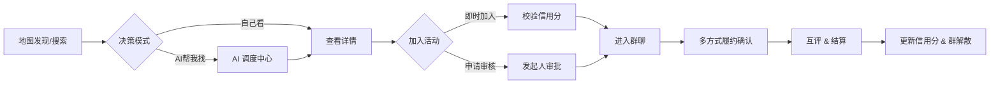

# 聚场 (Juchang) 产品需求文档 - V8.4 (MVP Ready)

## 1. 全局定义 (Global Definitions)

### 1.1 商业模式 (Business Model) - 纯合规版
*   **免费核心功能**：地图浏览、创建活动、基础AI、群聊等。
*   **按需付费服务** (微信支付)：
    *   **AI 深度服务**：智能推荐 (1元/次)、决策辅助 (2元/次)。
    *   **功能增强**：活动置顶 (5元/次)、强提醒通知 (1元/次)。
    *   **会员订阅**：月费会员 (15元/月) 享受AI服务折扣。

### 1.2 信用体系 (Trust System)
**靠谱分 (Credit Score)**：
- **初始分**：100 分
- **上限**：120 分 (需通过多次优良履约突破 100)

**信用分变动规则**：

**正向加分 (+)**：
- **完成履约**：+2 分 (通过任一履约方式)
- **获得好评**：+1 分 (每日上限 +3)
- **连续履约**：连续5次履约额外 +2 分
- **主动取消**：提前2小时以上取消 +0 分 (不扣分)

**负向扣分 (-)**：
- **违约 (无故不参加)**：-20 分 (严重惩罚)
- **临时取消**：活动开始前2小时内取消 -1 分
- **获得差评**：-2 分
- **被举报核实**：-50 分
- **恶意刷分**：-30 分

**履约认定机制**：
1. **GPS签到**：适用于固定地点活动 (吃饭、运动场所等)
2. **互相确认**：适用于移动/多地点活动 (找人、逛街、徒步等)
3. **时间确认**：适用于线上活动 (语音聊天、游戏等)

**阈值控制**：
- **< 80 分**：无法发起需审核的活动
- **< 60 分**：禁止发起活动，禁止报名
- **< 40 分**：账号冻结，需申诉恢复

### 1.3 时效性 (Ephemerality)
*   **活动生命周期**：地图默认展示所有活动，用户可通过筛选器按需过滤时间范围。
*   **群聊生命周期**：活动 `End_Time` + 24 小时后，群聊**软删除 (Soft Delete)**，前端不可见，倒逼微信沉淀。

---

## 2. 用户旅程 (User Journey)



---

## 3. 功能模块详解 (Functional Requirements)

### 3.1 Tab 1: 地图 (Map) - 发现与连接
**定位**：首页即地图，流量分发核心。

| 功能点 | 详细描述 | 优先级 |
| :--- | :--- | :--- |
| **全屏地图** | 腾讯地图 SDK，**无列表视图**。默认展示定位点 3km 内内容。 | P0 |
| **内容标记 (Pin)** | **简化颜色区分**：仅区分人（蓝色）和活动（橙色）两种类型。点击 Pin 弹出半屏卡片。 | P0 |
| **数据刷新策略** | **每次点击刷新仅更新5条数据**，避免信息过载。采用智能推荐算法优先展示相关度高的内容。 | P0 |
| **无时效过滤** | **地图不做时效性过滤**，展示所有类型的内容（包括历史活动、长期招募等），通过筛选器进行精准控制。 | P0 |
| **统一筛选器** | **右上角筛选按钮** -> 点击展开详细筛选面板，包含：<br/>• **时间筛选**：今天/明天/本周/本月/不限<br/>• **类型筛选**：吃饭/娱乐/运动/学习/其他<br/>• **人群筛选**：仅限女生/男女不限/LGBTQ友好<br/>• **信用筛选**：信用90+/80+/不限<br/>• **距离筛选**：1km/3km/5km/10km<br/>• **状态筛选**：招募中/已满员/已结束 | P0 |
| **官方运营锚点** | **[生存关键]** 后台可投放"虚拟活动/幽灵锚点"，填充冷启动期的空白区域，点击可引导发布。 | P0 |
| **极简发布** | 右下角 FAB 按钮 -> AI智能创建或传统表单。 | P0 |

**详细筛选面板设计**：
```
┌─────────────────────────────────┐
│ 🔍 筛选条件                      │
├─────────────────────────────────┤
│ ⏰ 时间范围                      │
│ ○ 今天  ○ 明天  ○ 本周  ○ 不限   │
├─────────────────────────────────┤
│ 🎯 活动类型                      │
│ ☑️ 吃饭  ☑️ 娱乐  ☑️ 运动  ☑️ 学习 │
├─────────────────────────────────┤
│ 👥 人群限制                      │
│ ○ 仅限女生  ○ 男女不限  ○ LGBTQ   │
├─────────────────────────────────┤
│ ⭐ 信用要求                      │
│ ○ 90+  ○ 80+  ○ 70+  ○ 不限     │
├─────────────────────────────────┤
│ 📍 距离范围                      │
│ ○ 1km  ○ 3km  ○ 5km  ○ 10km    │
├─────────────────────────────────┤
│ 📊 活动状态                      │
│ ☑️ 招募中  ☑️ 已满员  ☑️ 已结束   │
├─────────────────────────────────┤
│     [重置]        [应用筛选]      │
└─────────────────────────────────┘
```

**数据刷新机制**：
- **智能推荐算法**：基于用户历史偏好、地理位置、时间段等因素
- **5条数据策略**：每次刷新返回最相关的5条内容，避免信息过载
- **缓存机制**：本地缓存已加载数据，减少重复请求
- **实时更新**：新发布的活动实时推送到地图（不占用5条限制）

### 3.2 Tab 2: AI 调度中心 (Intelligence) - 增值与辅助
**定位**：智能副驾驶，核心盈利场景之一。

| 功能点 | 详细描述 | 优先级 |
| :--- | :--- | :--- |
| **CUI 对话界面** | 聊天式 UI，支持快捷指令 Chips。 | P0 |
| **RAG 检索** | "帮我找周末观音桥的局" -> 检索数据库 -> 输出**结构化活动卡片**。 | P1 |
| **AI 决策辅助** | "这几个人帮我挑一个" -> 分析申请者信用/评价/标签 -> 给出建议。 | P1 |
| **文案生成** | "帮我写个夜跑招募" -> 生成吸引人的文案。 | P1 |
| **计费逻辑** | **[盈利点]** 基础功能免费，高级决策/深度策划**直接微信支付** (1-2元/次)。 | P0 |

### 3.3 Tab 3: 消息 (Message) - 通知与沟通
**定位**：通知中心 + 临时社交。

**页面结构**：
```
┌─────────────────────────────────┐
│ 🔔 通知中心 (顶部固定区域)        │
├─────────────────────────────────┤
│ • 3个人申请加入你的火锅局         │
│ • 你的夜跑活动审核通过了          │
│ • 明天8点的聚餐别忘了哦          │
├─────────────────────────────────┤
│ 💬 消息列表 (可滚动区域)         │
├─────────────────────────────────┤
│ 🍲 周五火锅局 (4/4人)           │
│    AI助理: 还有2小时开始哦       │
├─────────────────────────────────┤
│ 🏃 夜跑小分队 (3/5人)           │
│    张三: 今天天气不错            │
└─────────────────────────────────┘
```

**交互逻辑**：
- **通知区**：点击展开详情，支持快速操作（通过/拒绝申请）
- **消息列表**：点击进入具体群聊，显示未读消息数

| 功能点 | 详细描述 | 优先级 |
| :--- | :--- | :--- |
| **通知中心** | 顶部卡片区域，展示：申请结果、审核提醒、活动开始提醒、系统消息。支持一键清除已读。 | P0 |
| **审核待办** | 发起人专属，显示待审核的申请列表，支持批量操作和AI辅助决策。 | P0 |
| **群聊列表** | 报名成功自动进群。**活动结束 24 小时后，群聊自动解散（软删除）**。按活动时间排序。 | P0 |
| **强触达通知** | **[盈利点/体验]** 重要通知必须对接**微信订阅消息**，确保用户及时收到。 | P0 |
| **私聊限制** | 仅允许活动成员间临时私聊（可选），或直接引导群内沟通。 | P1 |

### 3.4 Tab 4: 我 (Me) - 信誉与统计
**定位**：用户信任度展示，极简设计。

| 功能点 | 详细描述 | 优先级 |
| :--- | :--- | :--- |
| **靠谱分** | 0-120 分。展示在头像旁。履约(+2)/违约(-20)/好评(+1) 动态计算。支持多种履约方式。 | P0 |
| **个人统计** | 展示关键数据：组织过X场活动、履约率X%、注册X天、获得X个好评。简洁直观。 | P0 |
| **AI个人评价** | 基于用户行为数据，AI生成一句话评价："火锅局常客，大家评价守时且风趣"。 | P1 |
| **她模式开关** | **[生存关键]** 开启后，地图隐藏高风险活动，个人主页展示"她模式开启中"盾牌标识。 | P0 |

---

## 4. 核心业务流程 (Business Flows)

### 4.1 创建活动 (Creation) - AI 意图识别
**痛点**：填7个表单项太麻烦，是最大的流失点。
**AI 价值**：一句话发布 (One-Shot Creation)。

**交互流程**：
1. **AI 智能创建 (主推)**：
   - 点击 [+] → 弹出大输入框（支持语音转文字）
   - **用户输入示例**："周五晚上8点，在观音桥北城天街吃火锅，来3个能吃辣的，AA。"
   - **AI 处理**：LLM 解析意图，提取结构化信息
   - **跳转创建页**：自动跳转到创建表单页，所有字段已预填：
     ```
     标题：[AI生成] "周五北城天街火锅局，寻找3位辣椒爱好者"
     类型：[已选中] 吃
     时间：[已设置] 2024-12-13 20:00
     地点：[已定位] 北城天街 (显示地图标记)
     人数：[已填写] 4人
     费用：[已选择] AA制
     ```
   - **用户操作**：检查并微调细节 → 点击"发布活动"

2. **传统创建模式**：
   - 提供"手动填写"入口，直接进入空白表单
   - 支持AI辅助功能：标题生成、地点搜索、时间建议
   - 完整表单字段：标题、类型、时间、地点、人数、门槛设置、增值服务

**核心优势**：
- 降低创建门槛：从填7个字段 → 说1句话
- 保持控制权：AI预填 + 用户确认，而非直接发布
- 兼容性好：传统模式保底，AI模式提效

### 4.2 连接与风控 (Connection & Safety) - 守护神模式
**痛点**：我敢不敢去？这个人靠谱吗？
**AI 价值**：实时风控与决策辅助。

**报名者视角 - AI 风险提示**：
- 如果活动描述含有敏感词或暗示（如"私密"、"酒店"）
- AI 识别后在前端给用户弹红框警告："该活动被 AI 标记为高风险，请谨慎报名。"

**发起人视角 - AI 辅助审批**：
- 当有人申请时，不只显示头像
- AI 读取申请者的历史评价、履约率、注册时长，生成建议：
  - ✅ "这是一个优质用户，过去 5 场活动全勤且准时。"
  - ⚠️ "这是一个新用户，无历史数据，建议先在群里聊聊。"
  - ❌ "这是一个经常放鸽子的用户，建议拒绝。"

**流程**：
- **即时加入**：校验门槛 -> AI风险检测 -> 成功进群
- **审核加入**：申请 -> AI分析画像 -> 发起人决策 -> 通知结果

### 4.3 成局与社交 (Engagement) - AI 气氛组
**痛点**：进群后没人说话，尴尬死；到了现场找不到人。
**AI 价值**：群助理 (Agent)。

**群聊设计**：
- 活动建立，自动拉群
- 群里除了人，还有一个系统 AI

**AI 功能**：
1. **破冰 (Ice-breaking)**：
   - 进群瞬间，AI 发言："欢迎大家！我是本局助理。@发起人 既然大家都进来了，要不要先定一下具体的碰头位置？"

2. **时间提醒**：
   - 活动开始前 1 小时，AI 自动在群里 @所有人："还有一个小时哦！点击这里 [一键导航]。"

3. **隐私保护**：
   - 禁止私聊，所有沟通必须在群里
   - AI 实时监控群聊内容，检测到谩骂/色情直接撤回并禁言用户

### 4.3.1 履约确认 (Fulfillment)
**多种履约方式**：

**方式一：GPS签到** (固定地点活动)
- **适用场景**：餐厅聚餐、健身房运动、KTV等
- **流程**：
  1. 用户到达现场 → 点击"我到了"
  2. 后端校验GPS坐标 (PostGIS `ST_Distance` <= 200m)
  3. 校验通过 → 状态更新为 `Checked_In`

**方式二：互相确认** (移动/多地点活动)
- **适用场景**：找人聊天、逛街购物、徒步旅行等
- **流程**：
  1. 活动开始后，任一成员发起"确认履约"
  2. 其他成员在30分钟内确认"已参加"
  3. 超过50%成员确认 → 全员履约成功

**方式三：时间确认** (线上活动)
- **适用场景**：语音聊天、在线游戏、远程学习等
- **流程**：
  1. 活动开始时自动开启计时
  2. 持续参与超过预定时长的50% → 自动履约
  3. 中途退出可手动标记"提前结束"

### 4.3.2 履约结果与信用分变动

**履约结果**：
- **履约成功**：信用分 +2，更新个人统计数据
- **违约 (无故不参加)**：信用分 -20
- **主动取消 (提前2小时)**：信用分 +0 (不扣分)
- **临时取消 (2小时内)**：信用分 -5

**活动类型与履约方式对应**：
```
吃饭聚餐 → GPS签到 (餐厅定位)
运动健身 → GPS签到 (场馆定位)
KTV娱乐 → GPS签到 (KTV定位)
逛街购物 → 互相确认 (移动路线)
找人聊天 → 互相确认 (地点灵活)
徒步旅行 → 互相确认 (多地点)
语音聊天 → 时间确认 (线上活动)
在线游戏 → 时间确认 (线上活动)
```

### 4.4 评价与标签 (Review & Tags)
*   **触发**：仅当 `Checked_In` 状态后，弹出评价。
*   **内容**：
    *   **一段话评价**。
    *   **Vibe Tags**：选择系统预设标签（如：👍准时、👍风趣、👎鸽子）。
*   **闭环**：评价标签汇总后，生成用户显性的 **Vibe Tags** 展示在个人页，供他人参考。

---

## 5. AI 功能需求 (AI Requirements)

### 5.1 意图识别与自动填表
**功能描述**：
- 用户输入自然语言描述活动需求
- AI解析并提取结构化信息：活动类型、时间、地点、人数、费用方式
- 自动生成吸引人的活动标题和详细描述
- 调用地图API进行地址解析和定位

**输入输出**：
- **输入**："周五晚上8点，在观音桥北城天街吃火锅，来3个能吃辣的，AA"
- **输出**：预填的创建表单，包含标题、类型、时间、地点、人数等信息

### 5.2 智能风险评估
**评估维度**：
- **内容风险**：检测活动描述中的敏感词汇和暗示性语言
- **用户风险**：基于发起人的信用分数和历史违约记录
- **场景风险**：考虑活动时间（深夜）和地点偏僻程度
- **综合评分**：0-100分，超过60分触发"她模式"过滤

**应用场景**：
- 用户报名时显示风险警告
- "她模式"用户自动过滤高风险活动
- 后台运营监控异常活动

### 5.3 申请者画像分析
**分析维度**：
- **履约记录**：历史签到率、违约次数
- **用户评价**：其他用户的评价标签和评分
- **账号信息**：注册时长、实名认证状态
- **行为模式**：活动参与频率、偏好类型

**输出建议**：
- ✅ 优质用户：过去X场活动全勤且准时
- ⚠️ 新用户：无历史数据，建议先群聊了解
- ❌ 风险用户：经常放鸽子，建议拒绝

### 5.4 群聊智能助理
**核心功能**：
- **自动破冰**：新成员进群时发送欢迎消息，引导互动
- **时间提醒**：活动开始前自动提醒，提供导航链接
- **内容审核**：实时监控群聊内容，自动处理违规信息
- **氛围调节**：检测群聊冷场，主动发起话题

**触发机制**：
- 成员加入/退出群聊
- 活动开始前1小时、30分钟、10分钟
- 检测到违规内容或长时间无人发言

---

## 6. 关键支撑系统 (Support Systems)

### 6.1 运营锚点 (Ghost Anchors) - 冷启动生存关键
*   **后台功能**：管理员可在地图任意位置创建 "官方运营活动"。
*   **前端表现**：
    *   显示为带有 "官方" 标签的 Pin。
    *   点击后**不进入详情页**，而是弹出引导框："这里暂时没有活动，成为第一个发起者吧！" -> 跳转创建页。
*   **目的**：解决地图空白问题，诱导用户发布。

### 6.2 风控与安全 (Risk Control)
*   **内容风控**：所有用户发布的标题、描述、图片，**写入 DB 前必须调用腾讯云 IMS**。违规直接报错阻断。
*   **她模式逻辑**：
    *   后端计算 `RiskScore`（基于时间、地点偏僻度、发起人信用）。
    *   若用户开启"她模式"，API 仅返回 `RiskScore < 60` 的活动。

### 6.3 个人信任展示系统
**动态文本标签**：
- **统计数据**：组织过X场活动、履约率X%、注册X天
- **用户评价**：获得X个好评、最近评价标签展示
- **信用等级**：根据靠谱分显示文字等级（新手/可靠/优秀/卓越）

**AI生成评价**：
- 基于用户历史行为，AI生成个性化一句话评价
- 示例："火锅局常客，大家评价守时且风趣"
- 定期更新，保持评价的时效性和准确性

---

## 7. 运营与冷启动策略 (Operations)

1.  **幽灵锚点 (Ghost Anchors)**：
    *   在后台手动在热点区域（商圈、高校）创建官方活动。
    *   前端显示带"官方"标识，点击后引导用户"这里没人？你来发起一个"。
2.  **新用户引导**：
    *   注册完成实名认证 -> 获得初始100信用分。
    *   引导用户体验AI创建活动功能，完成首次发布。
3.  **分享裂变**：
    *   活动详情页生成分享卡片，带邀请人标识。
    *   被邀请人完成首次履约 -> 双方信用分+1。

## 8. 开发路线图 (Roadmap) - AI优先

### Phase 1: 核心基础 (Week 1-2)
1. **Week 1: 地基搭建**
   - 初始化 Monorepo (ElysiaJS API + 小程序)
   - 搭建 Postgres + PostGIS，跑通 Drizzle Schema
   - 实现 JWT 登录与 User 基础表
   - **AI服务接入**：集成LLM API (GPT-4/通义千问)

2. **Week 2: 地图与AI创建**
   - 实现地图加载、简化Pin渲染（人/活动两色）、半屏卡片
   - **5条数据刷新机制**：智能推荐算法 + 缓存策略
   - **统一筛选面板**：复杂筛选条件UI + 后端筛选逻辑
   - **AI一句话发布**：意图识别 + 自动填表
   - 实现个人统计与AI评价系统
   - 后台实现幽灵锚点投放功能

### Phase 2: AI增强体验 (Week 3-4)
3. **Week 3: 智能风控与审核**
   - 实现创建、报名、审核逻辑
   - **AI风险评估**：内容+用户+场景风险计算
   - **AI辅助审批**：申请者画像分析
   - 接入腾讯云 IMS 内容风控

4. **Week 4: AI群助理与消息**
   - 实现群聊功能与AI助理
   - **AI破冰与提醒**：自动欢迎+时间提醒
   - **实时内容审核**：违规检测+自动处理
   - 集成微信订阅消息

### Phase 3: 完善与上线 (Week 5-6)
5. **Week 5: 多方式履约与支付**
   - 实现GPS围栏签到与信用分变动
   - 实现互相确认和时间确认履约方式
   - 集成微信支付（AI服务+增值功能）
   - AI调度中心完整功能

6. **Week 6: 测试与审核**
   - 全链路测试（重点：AI功能+支付+GPS）
   - 性能优化（AI响应速度+并发处理）
   - 提交微信小程序审核

### 技术风险控制
- **AI服务降级**：LLM不可用时回退到传统表单
- **成本控制**：AI调用频次限制+缓存策略
- **合规保障**：AI生成内容二次审核机制

---

## 9. MVP 设计原则 (V8.4 Final)

### 核心理念：极简聚焦
- **信任 = 靠谱分 + AI评价**：用数字和文字展示用户可信度
- **奖励 = 组局成功的多巴胺**：真实社交带来的满足感
- **成就 = 无**：删除所有复杂的徽章系统，专注核心体验

### 开发优先级
1. **P0 功能**：地图、AI创建、信用分、群聊、履约
2. **P1 功能**：AI评价、风险评估、内容审核
3. **暂缓功能**：复杂装扮、徽章系统、积分兑换

### 成功指标
- **用户留存**：7日留存率 > 30%
- **活动成局率**：发布活动的成局率 > 60%
- **履约率**：参与活动的履约率 > 80%
- **AI使用率**：AI创建占总创建的比例 > 40%