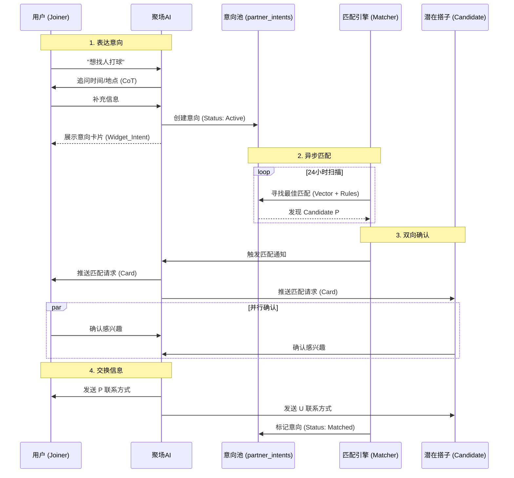
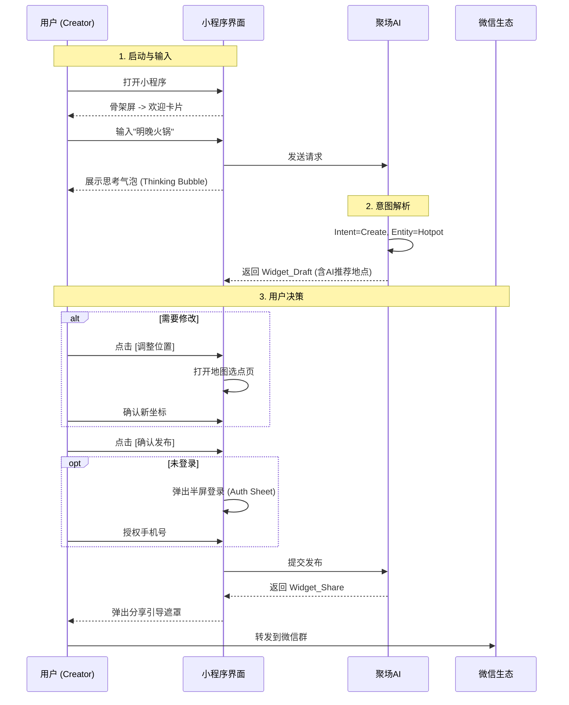
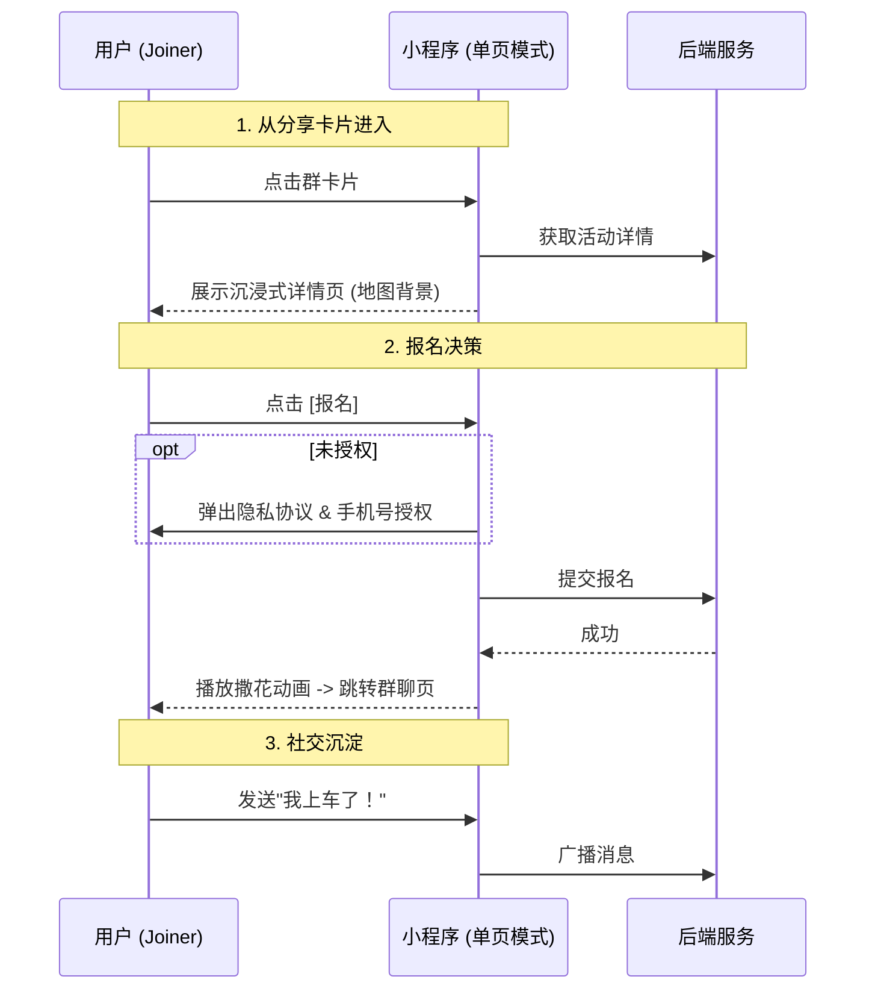

# 聚场 (JuChang) 产品需求文档

> **版本**：v4.8 (Skyline + Chat Tool Mode P0 + Digital Ascension)
> **更新日期**：2026-01-26
> **App 名称**：聚场 (JuChang)
> **产品定位**：Personal Social Agent (个人社交代理人)
> **核心 Slogan**：想怎么玩？跟小聚说说。
> **AI 角色名**：小聚 (XiaoJu)

---

## 0. 产品哲学：从工具到 Agent

### 0.0 我们不是工具，我们是 Agent

> **工具是被动的（人去操作它），Agent 是主动的（人与它协作，甚至它为人服务）。**

| 维度 | 传统工具 (SaaS) | 聚场 (Agent as a Service) |
|------|----------------|--------------------------|
| **交互模式** | 用户填表单、点按钮 | 用户说话，AI 理解并执行 |
| **界面生成** | 静态 UI，所有人看到一样的 | Generative UI，根据意图动态生成 |
| **服务对象** | 只服务"群主"（发起者） | 服务每一个人（发起者 + 参与者） |
| **用户关系** | 用完即走 | 记住你，下次更懂你 |
| **核心价值** | 效率工具 | 社交秘书 |

### 0.1 Chat-First：不是噱头，是架构

**为什么首页是对话，而不是列表/地图？**

传统 App 的首页是"货架"——你来挑。
聚场的首页是"对话"——你说，我帮你办。

这不是 UI 风格的选择，而是**产品定位的选择**：
- 货架模式 = 你是顾客，我是商城
- 对话模式 = 你是老板，我是秘书

**Chat-First 的三个核心优势**：

| 优势 | 说明 |
|------|------|
| **零门槛** | 不需要学习操作，会说话就会用 |
| **意图理解** | 用户不需要知道"该点哪个按钮"，AI 理解意图后自动执行 |
| **情绪价值** | 有人回应的感觉，比冷冰冰的界面温暖 |

### 0.2 Generative UI：界面是流动的

**传统 App**：界面是死的。无论谁来，看到的都是九宫格、列表、Banner。

**聚场**：界面是流动的。AI 根据你的意图，动态生成最合适的 Widget。

| 用户意图 | 生成的 UI |
|---------|----------|
| "明晚观音桥打麻将" | Widget_Draft（表单模式） |
| "附近有什么好玩的" | Widget_Explore（地图模式） |
| "这周五晚上不知道干嘛" | Widget_Explore + AI 推荐语 |
| "上次那个火锅局怎么样" | 文本回复 + 相关活动卡片 |

**这是聚场区别于所有竞品的杀手锏**：
- 对于发起者，它是高效的表单生成器
- 对于迷茫者，它是地图探索器
- 对于管理者，它是仪表盘

### 0.3 服务每一个人，不只是群主

**旧逻辑（工具）**：
```
用户打开 App → 看到卡片 → 报名 → 关闭
```
对于参与者来说，聚场只是一个"填坑的入口"。

**新逻辑（Agent）**：
```
用户不知道干嘛 → 问小聚 → 小聚推荐 → 报名 → 小聚提醒 → 结束后小聚询问反馈
```
小聚是每个人的社交秘书，不只是群主的工具。

**普通用户（非群主）为什么要和小聚聊天？**

| 场景 | 小聚的价值 |
|------|-----------|
| "这周五晚上不知道干嘛" | 理解情绪，推荐合适的活动 |
| "附近有什么好玩的" | 探索发现，降低决策成本 |
| "上次那个火锅局感觉怎么样" | 记住你的偏好，下次推荐更准 |
| "帮我算算人均多少钱" | 活动后的贴心服务 |

---

| 原则 | 说明 |
|------|------|
| **页面 (Page) 越少越好** | 保持沉浸，减少跳转 |
| **模态 (Modal/Sheet) 适度使用** | 解决中断，不打断主流程 |
| **流 (Stream) 是核心** | 对话不能断，状态要连贯 |

### 0.4 Digital Ascension (数字飞升)：从线下到线上的流量入口

> **v4.8 战略转向**：不再依赖传统 App 分发，而是通过**直播间 + 命令码**实现流量的"数字飞升"。

**核心理念**：用户在线下场景（直播间、活动现场、海报）看到一个**命令码**（如"仙女山"），在聚场输入后，Agent 立即返回预设的活动卡片或推荐内容。

**Digital Ascension 的三个入口**：

| 入口类型 | 场景 | 用户行为 | Agent 响应 |
|---------|------|---------|-----------|
| **直播间口播** | 主播说"想去仙女山玩的，打开聚场输入'仙女山'" | 用户打开小程序，输入"仙女山" | 返回预设的仙女山活动卡片/推荐 |
| **线下海报** | 景区/商场海报印有"聚场命令码：观音桥火锅" | 用户扫码进入，自动填充命令 | 返回观音桥火锅相关活动 |
| **社群传播** | 群友分享"今晚有个局，命令码：麻将3缺1" | 用户复制命令码，粘贴到聚场 | 返回对应的活动详情 |

**为什么这是 v4.8 的核心战略？**

传统 App 的流量获取方式（应用商店、广告投放）成本高、转化低。Digital Ascension 通过**命令码**将线下流量直接导入 Agent，实现：
- **零门槛**：不需要下载 App，微信小程序即开即用
- **精准触达**：命令码直接对应具体场景，无需用户搜索
- **病毒传播**：命令码可以口口相传、截图分享

**技术实现**：命令码本质上是**全局关键词（Global Keywords）**，在意图识别引擎中拥有最高优先级（P0），无需 NLP 处理，直接返回预设内容。

### 0.5 Dual-Mode Drive (双模驱动)：快车道与慢车道

> **v4.8 交互升级**：Agent 同时支持两种交互模式，用户可以根据场景自由切换。

**双模驱动的核心逻辑**：

| 模式 | 别名 | 适用场景 | 交互方式 | 响应速度 |
|------|------|---------|---------|---------|
| **Global Commands** | **快车道** | 明确知道要什么（如"仙女山"） | 输入关键词，直接命中 | <0.5s |
| **Natural Language** | **慢车道** | 模糊表达需求（如"周末想放松"） | 自然语言，NLP 解析 | 1-2s |

**快车道（Global Commands）**：
- **本质**：热词匹配，后端维护一个全局关键词库
- **优势**：极速响应，无需 AI 推理，适合高频场景
- **示例**：
  - 用户输入"仙女山" → 直接返回仙女山活动推荐卡片
  - 用户输入"火锅" → 返回附近火锅局列表
  - 用户输入"麻将" → 返回麻将找搭子意向卡片

**慢车道（Natural Language）**：
- **本质**：NLP 意图识别，AI 理解用户的复杂表达
- **优势**：灵活性强，能处理长尾需求
- **示例**：
  - 用户输入"这周末想找个安静的地方喝茶聊天" → AI 解析意图，推荐茶馆活动
  - 用户输入"明天下午有空，不知道干嘛" → AI 根据用户偏好推荐活动

**双模无缝切换**：
- 用户不需要知道背后有两种模式
- Agent 自动判断：先尝试快车道（关键词匹配），失败则走慢车道（NLP）
- 对用户来说，体验是统一的：**说话 → Agent 响应**

**为什么需要双模驱动？**

| 单一模式的问题 | 双模驱动的解决方案 |
|--------------|------------------|
| 只有 NLP：响应慢，成本高，不适合高频场景 | 快车道处理高频场景，降低成本 |
| 只有关键词：不够智能，无法处理复杂需求 | 慢车道兜底，保证灵活性 |

### 0.6 Context-Agnostic (上下文无关)：Agent 的统一响应原则

> **v4.8 设计哲学**：无论用户从哪里来（直播间、海报、群聊），Agent 的响应逻辑是统一的。

**Context-Agnostic 的核心原则**：

Agent 不关心用户的"来源上下文"，只关心用户的"当前输入"。无论用户是从直播间听到命令码，还是在群里看到分享，输入同一个关键词，得到的响应是一致的。

**为什么这很重要？**

| 传统 App 的问题 | Context-Agnostic 的优势 |
|---------------|----------------------|
| 不同入口有不同的落地页，用户体验割裂 | 统一的 Agent 入口，体验一致 |
| 需要为每个渠道定制页面，开发成本高 | 一套 Agent 逻辑，适配所有场景 |
| 用户需要学习不同入口的操作方式 | 用户只需要学会"跟 Agent 说话" |

**实现方式**：

无论用户从哪里进入聚场（扫码、分享卡片、直播间引导），最终都会进入**首页 Chat Stream**。Agent 通过**关键词匹配 + NLP 意图识别**统一处理所有输入。

**示例**：
- 直播间用户输入"仙女山" → Agent 返回仙女山活动卡片
- 老用户在首页输入"仙女山" → Agent 返回相同的仙女山活动卡片
- 群聊分享进入的用户输入"仙女山" → Agent 返回相同的仙女山活动卡片

**这就是 Context-Agnostic 的威力**：一套 Agent 逻辑，服务所有场景。

---

## 1. 产品定位与核心价值

### 1.1 三大核心优势

#### 🎯 响应感 —— 治愈"无人回应的焦虑"

| 旧世界（微信群） | 新世界（聚场） |
|-----------------|---------------|
| 发消息后死一般的寂静 | AI 秒回，0.5s 内开始响应 |
| 运气好有人回表情包 | 流式反馈：文字逐字显示，Widget 卡片逐步展开 |

#### 📍 秩序感 —— 把"混乱的流"变成"确定的卡片"

| 旧世界（微信群） | 新世界（聚场） |
|-----------------|---------------|
| 信息是流（Flow），瞬间被冲走 | 信息是卡片（Widget），24小时内雷打不动 |
| 想找刚才那个人？翻聊天记录 | 对话历史持久化，下次打开还在 |

#### ⚡ 零门槛 —— 不改变习惯，只提升效率

| 旧世界（填表单） | 新世界（AI 输入坞） |
|-----------------|-------------------|
| 选时间、选地点、填标题 | 在群里怎么说话，在这里就怎么说话 |
| 需要学习新操作 | 直接把群里的乱七八糟复制过来，自动变整齐 |

### 1.2 v3.4 架构：Chat-First + Generative UI + 小聚人格

| 版本 | 架构 | 问题 |
|------|------|------|
| v1.0 | 地图 + 表单 | 门槛高，用户要填表单，冷启动地图空白 |
| v2.0 | Card Feed | 信息密度低，不够直接 |
| v3.2 | Chat-First + Generative UI | 零门槛，像聊天一样组局 |
| v3.3 | + 小聚人格 + 竞品差异化 | 有灵魂，不是冷冰冰的系统 |
| **v3.4** | **+ 文案体系精修** | ✅ 统一品牌调性，强调 AI 执行力 |

**核心交互哲学**：
1. **首页即对话**：小程序打开不再是地图，而是一个无限滚动的 Chat View
2. **功能即气泡**：所有功能都封装在对话流的 Widgets 中
3. **去 Tabbar 化**：底部取消导航栏，改为悬浮的 AI Dock
4. **Generative UI**：AI 根据意图动态生成最合适的 Widget 类型

---

### 1.2 核心业务流程 (The Business Flows)

#### 1.2.1 [Flow] 找搭子 (Partner Matching) - 核心痛点攻坚

> **痛点 vs 解法**
> | 旧世界（微信群/朋友圈） | 新世界（聚场 AI Agent） | 业务价值 |
> |-------------------------|-------------------------|----------|
> | 喊话即消失：消息被淹没，有效期短 | 意向池化：需求转为 Struct 存入数据库，24h 有效 | 需求不丢失 |
> | 被动等待：能否成局看缘分，效率低 | 主动撮合：AI 24小时扫描匹配，精准推送 | 效率提升 10x |
> | 隐私顾虑：不想公开微信号给陌生人 | 虚拟中介：确认匹配意向后才交换联系方式 | 安全感提升 |

**业务剧本**：

1.  **表达 (Express)**
    - 用户："想找人周末剧本杀，不要太硬核的。"
    - AI："收到。有几个细节确认下：1. 具体是周六还是周日？2. 想要几个人？" (Slot Filling via CoT)
    - 用户："周六 afternoon，4-6人吧。"
    - AI："OK，已为你生成[剧本杀·找搭子意向卡片]。系统将在后台持续寻找匹配，有合适的我会第一时间通知你。"

2.  **存储与检索 (Store & Search)**
    - 系统将需求写入 `partner_intents` 表，状态为 `active`。
    - 启动 `PartnerMatcher` 定时任务，扫描活跃意向。
    - 发现匹配：距离 3km 内、同为"剧本杀"类别、时间重叠、Tag 相似度 > 80%。

3.  **双向确认 (Handshake)**
    - AI (对 A 仅可见)："帮你找到一个搭子！也是周六想玩本，就在你附近 2km。查看匹配详情？"
    - AI (对 B 仅可见)："有位朋友也想周六剧本杀，我看你们偏好挺像，要不要认识下？"

4.  **成局 (The Deal)**
    - A 点击 [感兴趣]，系统记录状态。
    - B 点击 [感兴趣]，匹配达成 (Matched)。
    - AI："太好了！这是对方的微信/二维码，你们聊！" (交换联系方式)
    - (Future)：AI 直接创建一个新的 Group Chat。

**流程图**：



#### 1.2.2 [Flow] 极速组局 (Activity Creation)

> **痛点 vs 解法**
> | 旧世界（APP 表单） | 新世界（AI Chat） | 业务价值 |
> |--------------------|-------------------|----------|
> | 填表单：标题、时间、地点一个个填 | 一句话生成：AI 自动从自然语言提取要素 | 降低门槛 |
> | 缺信息：不知道地点在哪 | 模糊补全：AI 根据上下文推荐合适地点 | 辅助决策 |
> | 改来改去：调整很麻烦 | 对话修改："把时间改成明天" | 自然交互 |

**业务剧本与关键交互 (Creator Journey)**：

| 步骤 | 用户行为 | 系统/界面响应 | ⚠️ 体验细节点 (Micro-Interactions) |
|------|----------|---------------|----------------------------------|
| **1. 触发** | 打开小程序 | 显示首页 Chat 流 + 欢迎卡片 | **Loading 骨架屏** (防止冷启动白屏) |
| **2. 输入** | 粘贴一段乱七八糟的群接龙 | 底部 AI Dock 弹起，输入框聚焦 | **键盘避让动画** (确保输入框不被遮挡) |
| **3. 思考** | 点击发送 | Chat 流底部出现"呼吸气泡" | **AI 思考动效** (三个跳点呼吸灯，安抚焦虑) |
| **4. 预览** | AI 返回 `Widget_Draft` | 显示地图预览 + 关键信息 | **地图选点页** (若 AI 选点不准，用户可点击纠正) |
| **5. 确认** | 点击 [确认发布] | 检查手机号绑定状态 | **半屏授权弹窗** (Auth Sheet，不生硬跳转) |
| **6. 引导** | 发布成功 | Chat 流出现 `Widget_Share` | **全屏分享引导** (箭头指向右上角，消除"然后呢") |
| **7. 闭环** | 转发到群 | 微信原生分享卡片 | **卡片文案优化** (确保标题够骚，图片不裂) |

**流程图**：



#### 1.2.3 [Flow] 参与者体验 (Participant Journey)

> **痛点 vs 解法**
> | 旧世界（群接龙） | 新世界（聚场 Widget） | 用户体验 |
> |------------------|-----------------------|----------|
> | 信息杂乱：要翻好几页聊天记录 | 结构化卡片：时间地点一目了然 | 清晰 |
> | 信任缺失：不知道谁发起的，靠谱吗 | 信任背书：精美地图、倒计时、已报名头像 | 专业 |
> | 报名繁琐：要复制粘贴+1 | 一键上车：点击按钮即完成报名 | 爽快 |

**业务剧本与关键交互 (Joiner Journey)**：

| 步骤 | 用户行为 | 系统/界面响应 | ⚠️ 体验细节点 |
|------|----------|---------------|---------------|
| **1. 触达** | 在群里点击卡片 | 单页模式启动小程序 | **全局 Loading** (数据加载时的反馈) |
| **2. 决策** | 查看活动详情 | 显示活动邀请函详情页 | **法务条款入口** (点击报名时需同意) |
| **3. 行动** | 点击 [🙋‍♂️ 报名] | 检查手机号 → 成功报名 | **报名成功反馈动画** (撒花/震动，情绪价值) |
| **4. 连接** | 报名后去哪？ | 自动跳转到活动群聊 | **群聊空状态引导** (提示"打个招呼吧") |
| **5. 留存** | 想看看别的 | 点击左上角 [返回] | **首页回流兜底** (单页模式下重定向到首页) |

**流程图**：



---

#### 1.2.4 [Flow] 智能探索 (Smart Exploration)

> **痛点 vs 解法**
> | 旧世界（APP 列表页） | 新世界（AI 意图检索） | 体验提升 |
> |----------------------|-----------------------|----------|
> | 机械筛选：自己选区域、类型、排序 | 语义理解："想轻松点的局" -> 自动映射 Tags | 懂你 |
> | 列表枯燥：一张张图看过去 | 地图沉浸：可以展开的全屏地图，拖动即搜 | 直观 |

**业务剧本与关键交互**：

| 步骤 | 用户行为 | 系统/界面响应 | ⚠️ 体验细节点 |
|------|----------|---------------|---------------|
| **1. 提问** | "附近有啥好玩的" | AI 识别意图 `intent: explore` | **Thinking Bubble** |
| **2. 预览** | 等待 1s | AI 返回 `Widget_Explore` (带静态地图预览) | **多点 Marker** (地图上显示多个活动点) |
| **3. 沉浸** | 点击卡片或 [展开] | 展开为全屏地图模式 (Bottom Sheet 交互) | **动画过渡** (从气泡平滑展开全屏) |
| **4. 交互** | 拖动地图 / 切换 Tag | 即时刷新可视区域内的活动 | **动态加载** (无需手动刷新) |
| **5. 详情** | 点击地图 Pin | 底部弹出简略信息卡片 | **轻触反馈** |
| **6. 决策** | 点击卡片 | 跳转活动详情页 | - |

**全屏地图模式结构 (Immersive Map)**：

```
┌─────────────────────────────────────────────────────────┐
│  [←]              探索附近              [筛选]          │
├─────────────────────────────────────────────────────────┤
│  [全部] [美食] [运动] [桌游] [娱乐]                     │
├─────────────────────────────────────────────────────────┤
│                                                         │
│                    Full Screen Map                      │
│         📍          📍                                  │
│                📍                                       │
├─────────────────────────────────────────────────────────┤
│  ┌─────────────────────────────────────────────────┐   │
│  │ ═══════════════════════════════════════════════ │   │
│  │ 🍲 观音桥火锅局 · 500m · 今晚 19:00         [>] │   │
│  │ 🎴 麻将局·3缺1 · 800m · 明天 14:00          [>] │   │
│  └─────────────────────────────────────────────────┘   │
└─────────────────────────────────────────────────────────┘
```

---

### 1.3 竞品分析与差异化定位

> **这不是竞争，这是错位打击。**

#### 1.3.1 市场格局：粗门 vs 聚场

粗门（CuMen）是这个赛道里的"重装坦克"，走的是典型的 **"公域流量 + 商业化俱乐部 + 强运营"** 的 B2C/B2B2C 路线。他们的界面像是一个热闹的活动电商平台（像美团/大众点评的活动版）。

**如果我们跟他们硬碰硬（去抢俱乐部、搞大活动、拼流量分发），我们必死无疑。**

但好消息是：我们的 **Chat-First + Gen UI 架构**，刚好站在了他们的反面。

#### 1.3.2 本质模型的差异：商城 vs. 秘书

| 维度 | 粗门 (The Mall) | 聚场 (The Agent) |
|------|-----------------|------------------|
| **核心定义** | 活动电商平台 (Marketplace) | AI 组局效能工具 (Utility) |
| **发起人是谁** | B端 / Big C (俱乐部主理人、商家、职业领队) | Small C (普通群主、你、你的朋友、热心群友) |
| **为了什么** | 赚钱 / 搞流量 / 卖票 | 省事 / 怕冷场 / 攒个局 |
| **流量逻辑** | 公域分发 (算法推荐热门活动，像刷抖音) | 私域流转 (在微信群里点对点传播，像发红包) |
| **操作成本** | 极高 (填表、传海报、写文案、设置票种) | 极低 (给 AI 发一句话) |

**结论**：
- **粗门是给卖铲子的人用的**
- **聚场是给想挖坑种树的普通人用的**

#### 1.3.3 用户痛点 = 我们的机会点

很多用户不喜欢粗门，痛点通常集中在以下几点：

#### 痛点 A：商业味太浓，缺乏人情味

| 粗门现状 | 聚场解法 |
|----------|----------|
| 进去全是卖票的（9.9元/99元），全是专业的宣传海报 | **Soft Tech**：界面干净、没有广告、没有推销 |
| 用户感觉自己是"韭菜"，而不是"朋友" | 用户感觉这是"我和朋友的局"，是 AA 制的、平等的 |

#### 痛点 B：圈子固化，新人门槛高

| 粗门现状 | 聚场解法 |
|----------|----------|
| 需要加入某个 Club，里面有等级、有熟人圈子 | **一次性成局**：不强制加圈子 |
| 社恐进去很尴尬 | 基于当下的活动群（Lite Chat），活动结束就解散（或归档），没有社交压力 |

#### 痛点 C：组个小局太重了

| 粗门现状 | 聚场解法 |
|----------|----------|
| 我就想约 3 个朋友吃个火锅，还要去粗门建个活动、审核、发布？疯了吗？ | **一句话成局**：这就是 Chat-First 的绝对统治区 |
| 对于"高频、低客单价、熟人/半熟人"的局，粗门是大炮打蚊子 | 聚场是精准手术刀 |

#### 1.3.4 场景的绝对隔离 (Scenario Split)

这是我们和粗门的楚河汉界：

| 场景 | 谁占优势 | 为什么？ |
|------|----------|----------|
| 商业活动 (百人徒步、飞盘局、收费教学) | 🔴 **粗门 胜** | 需要票务系统、核销、公域流量招募陌生人 |
| 兴趣社群 (每周固定的羽毛球俱乐部) | 🔴 **粗门 胜** | 需要会员管理、积分体系、排行榜 |
| 朋友聚餐 (火锅、烧烤、家宴) | 🟢 **聚场 胜** | 粗门做不了。太重了，用户不会为了吃饭去发个商业活动 |
| 临时起意 (今晚去哪喝一杯？谁有空？) | 🟢 **聚场 胜** | 唯快不破。Chat-First 3秒生成，直接甩群里摇人 |
| 半熟人拼车/拼单 (剧本杀缺1、拼车去机场) | 🟢 **聚场 胜** | 信任感。基于群聊的信任背书，加上 Widget 的清晰展示 |
| 不知道去哪 (探索周边) | 🟢 **聚场 胜** | AI 意图识别。粗门要你自己在列表里搜，聚场是直接告诉你"附近有啥" |

**差异化总结**：
- **粗门垄断了头部 20% 的"严肃/商业活动"**
- **聚场要吃掉长尾 80% 的"生活/社交活动"**

#### 1.3.5 杀手锏：Gen UI vs. Static UI

**粗门的 UI** 是典型的 Web 2.0 货架式 UI：
- 复杂的 Tabbar（首页、圈子、发布、消息、我的）
- 密密麻麻的 Banner 和瀑布流
- 如果你想发布活动，你需要适应它的表单

**聚场的 UI** 是 Web 3.0 / Agent UI：
- **Chat-First**：只有一个对话框
- **Generative**：如果你想发布活动，系统适应你的语言
- **活动邀请函**：生成的不是一个"商品详情页"，而是一张"社交邀请函"

> 这种体验上的降维打击，会让用惯了粗门的用户感到震惊：**"原来组个局可以这么简单？"**

#### 1.3.6 战略定位：不做平台，做工具

**不要试图模仿粗门去做**：
- ❌ 俱乐部入驻机制
- ❌ 主理人激励计划（那个复杂的贡献值/奖金池）
- ❌ 年度盛典/排行榜

**我们要极致地做**：
- ✅ **微信群的外挂**：我们是寄生在微信群里的 AI，而不是想把人拉到 App 里的平台
- ✅ **发起人的面子**：让那个只会说"来吃饭"的群主，变成能发出精美邀请函的"主理人"
- ✅ **AI 的智能**：粗门没有 AI，他们靠运营堆砌内容。我们靠 AI 整理内容

#### 1.3.7 一句话差异化

如果投资人或用户问你："你们和粗门有什么区别？"

你的回答：

> **"粗门是给俱乐部卖票的电商平台；聚场是你的 AI 活动助理。"**
>
> **"你想去参加百人徒步，去粗门。你想约几个朋友吃火锅、打麻将、拼个车，用聚场。"**

#### 1.3.8 名字的意义

现在回看"聚场"这个名字：

> **我们守住的是生活里最真实的那些"小聚"，而那里才是 99% 的流量所在。**

---

### 1.4 微信聊天工具模式 (WeChat Chat Tool Mode) ⭐ v4.8 P0 核心能力

> **v4.8 战略升级**：从 Phase 2 实验性功能提升为 **P0 核心能力**，基于 **Skyline 渲染引擎**实现微信群原生体验。

#### 1.4.1 为什么这是 P0 核心能力

**产品定位的必然选择**：

聚场的核心定位是"微信群的外挂"。Chat Tool Mode 让聚场真正成为微信群的一部分，而不是一个需要跳出去的独立 App。

| 维度 | 传统小程序 | Chat Tool Mode (v4.8) |
|------|-----------|---------------------|
| **入口** | 分享卡片 → 跳转小程序 | 分享卡片 → 半屏打开，不离开群聊 |
| **通知** | 订阅消息（需授权、有次数限制） | 群内系统消息（无需授权、无限次） |
| **状态同步** | 需要进小程序查看 | 卡片实时更新，群里直接看 |
| **社交裂变** | 分享后静默 | 每次报名都是一次群内曝光 |
| **用户体验** | 割裂感（跳出群聊） | 原生感（在群聊内完成） |

**核心洞察**：用户本来就在群里，所有操作就应该在群里完成，而不是跳出去。

#### 1.4.2 Skyline 渲染引擎：技术基石

**Skyline 是什么？**

Skyline 是微信小程序的新一代渲染引擎，专为高性能、复杂交互场景设计。Chat Tool Mode **必须使用 Skyline**，这不是可选项。

**Skyline 的核心优势**：

| 优势 | 说明 | 对聚场的价值 |
|------|------|------------|
| **高性能渲染** | 原生级别的渲染性能 | 半屏模式下流畅的滚动和动画 |
| **动态消息** | 支持卡片实时更新 | 报名人数实时显示在群聊卡片上 |
| **半屏交互** | 原生支持半屏模式 | 不离开群聊即可完成报名 |
| **系统消息** | 支持发送系统级通知 | "alex 已参与 cindy 发布的火锅局" |

**技术约束**：

| 约束 | 说明 |
|------|------|
| 渲染引擎 | 必须使用 Skyline（非 WebView） |
| 分包类型 | 独立分包 |
| 体积限制 | ≤ 500KB |
| 基础库 | ≥ 3.7.8 |
| 平台支持 | iOS/Android 微信 8.0.56+ |

#### 1.4.3 三大核心功能

**功能 1：动态消息 (Dynamic Messages)**

群聊中的活动卡片可以实时更新，无需用户刷新。

**示例场景**：
```
群聊中的卡片：
┌─────────────────────────────────────┐
│ 🍲 观音桥火锅局                     │
│ 今晚 19:00 · 观音桥                 │
│ 3人已参与 ← 实时更新                │
└─────────────────────────────────────┘

当第 4 个人报名时，卡片自动变为：
┌─────────────────────────────────────┐
│ 🍲 观音桥火锅局                     │
│ 今晚 19:00 · 观音桥                 │
│ 4人已参与 ← 自动更新                │
└─────────────────────────────────────┘
```

**技术实现**：
```
1. 服务端创建 activity_id（调用微信接口）
2. 前端 wx.updateShareMenu 声明动态消息
3. 用户分享卡片到群
4. 用户报名时，服务端调用 setChatToolMsg 更新状态
5. 卡片辅标题自动更新
```

**功能 2：系统通知 (System Notifications)**

用户报名后，群里自动冒泡系统消息，所有群成员都能看到。

**示例场景**：
```
群聊消息流：
─────────────────────────────────────
[系统消息] alex 已参与 cindy 发布的 观音桥火锅局
─────────────────────────────────────
```

**核心价值**：
- **免费的群内广告**：每次报名都是一次曝光
- **权威感**：系统消息比群主自己发的更有公信力
- **从众效应**：看到别人报名，激发更多人参与

**功能 3：半屏交互 (Half-Screen Interaction)**

用户点击群聊卡片后，小程序以半屏模式打开，不离开群聊。

**交互流程**：
```
群聊中点击卡片
  ↓
半屏打开活动详情（下半屏）
  ↓
用户查看详情、报名
  ↓
报名成功 → 卡片更新 + 系统消息
  ↓
用户下滑关闭半屏，回到群聊
```

**用户体验对比**：

| 传统模式 | Chat Tool Mode |
|---------|---------------|
| 点击卡片 → 全屏跳转 → 报名 → 返回群聊（4 步） | 点击卡片 → 半屏打开 → 报名 → 下滑关闭（3 步） |
| 离开群聊，割裂感强 | 始终在群聊内，原生感强 |

#### 1.4.4 通知策略重构

**旧策略（订阅消息）的致命问题**：

| 问题 | 说明 |
|------|------|
| 授权门槛 | 用户要主动点「允许」，大部分人不点 |
| 次数限制 | 一次授权只能发一条，用完就没了 |
| 模板审核 | 内容受限，不能自定义 |
| 触达率低 | 用户关掉通知就彻底失联 |

**新策略（群内系统消息）完全绕过这些限制**：

| 场景 | 旧策略（订阅消息） | 新策略（群内系统消息） |
|------|-------------------|---------------------|
| 有人报名 | 发订阅消息给群主 → 可能没看到 | 群里自动冒泡「alex 已参与」→ 所有人看到 |
| 活动快开始 | 发订阅消息提醒 → 要授权 | 卡片状态变「即将开始」→ 无需授权 |
| 催人报名 | 没有能力 | `wx.notifyGroupMembers` 系统级 @ |
| 活动状态变化 | 站内通知 → 要打开小程序 | 卡片辅标题实时更新 → 群里直接看 |

**这不是「通知」，是「社交裂变」**：
- 每次报名 = 一次免费的群内广告
- 系统消息样式 = 比群主自己发的更有权威感
- 实时更新 = 制造紧迫感和从众效应

#### 1.4.5 场景价值

| 场景 | 当前方案 | Chat Tool Mode |
|------|---------|---------------|
| 群内组局 | 复制链接 → 发群 → 手动统计 | 一键发卡片 → 自动统计 → 实时更新 |
| 报名提醒 | 群主手动 @ | 系统自动下发"alex 已参与 cindy 发布的 火锅局" |
| 参与状态 | 进小程序查看 | 卡片上直接显示"5人已参与" |
| 催人报名 | 群主手动 @ | `wx.notifyGroupMembers` 一键提醒 |
| 3缺1 场景 | 不知道还差几人 | 卡片实时显示「3/4人」→ 紧迫感拉满 |

#### 1.4.6 核心 API

| API | 用途 |
|-----|------|
| `wx.openChatTool` | 从普通模式进入聊天工具模式 |
| `wx.getChatToolInfo` | 获取绑定群聊的 opengid / group_openid |
| `wx.selectGroupMembers` | 选择群成员（返回 group_openid） |
| `wx.shareAppMessageToGroup` | 发送小程序卡片到绑定群聊 |
| `wx.notifyGroupMembers` | @ 群成员提醒参与 |
| `wx.getApiCategory` | 判断当前是否处于聊天工具模式 |

#### 1.4.7 用户流程

**发起者流程**：
```
普通模式首页 → 创建活动 → Widget_Share → [发到群聊] 
  → wx.openChatTool → 绑定群聊 → 发送动态卡片
```

**参与者流程**：
```
群聊点击卡片 → 聊天工具模式打开（半屏） → 查看详情 → 报名 
  → 卡片自动更新"X人已参与" + 系统消息通知群友
```

#### 1.4.8 与现有架构的融合

| 现有能力 | Chat Tool Mode 增强 |
|---------|-------------------|
| Widget_Share | 新增"发到群聊"按钮，触发 `wx.openChatTool` |
| 活动详情页 | 聊天工具模式下显示"提醒群友"按钮 |
| 报名成功 | 自动触发动态消息更新 |
| participants 表 | 新增 `group_openid` 字段关联群成员身份 |
| notifications 表 | 可考虑废弃或降级为备用方案 |

#### 1.4.9 实施优先级

| 阶段 | 内容 | 价值 |
|------|------|------|
| P0 | 基础分包 + 进入/退出流程 + Skyline 适配 | 跑通链路 |
| P1 | 动态消息（卡片实时更新 + 系统消息） | **核心差异化，替代订阅消息** |
| P2 | 群成员选择 + @ 提醒 | 提升转化 |
| P3 | 群成员头像昵称渲染 | 体验优化 |

#### 1.4.10 成功指标

| 指标 | 说明 | 目标 |
|------|------|------|
| 动态卡片分享率 | 使用聊天工具模式分享的比例 | ≥ 50% |
| 群内曝光→报名转化 | 看到系统消息后报名的比例 | ≥ 15% |
| 活动成局率提升 | 对比普通分享的成局率 | +20% |

#### 1.4.11 分包配置示例

```json
{
  "subPackages": [
    {
      "root": "packageChatTool",
      "name": "chatTool",
      "pages": ["pages/index/index"],
      "independent": true,
      "componentFramework": "glass-easel",
      "renderer": "skyline"
    }
  ],
  "chatTools": [{
    "root": "packageChatTool",
    "entryPagePath": "pages/index/index",
    "desc": "群内快速组局",
    "scopes": ["scope.userLocation"]
  }]
}
```

#### 1.4.12 禁用能力

聊天工具模式下以下能力不可用：
- `button open-type="share"` / 右上角分享（使用专用 API 替代）
- `navigateToMiniProgram` / `openEmbeddedMiniProgram`
- 广告组件

---

## 2. 商业模式 (MVP)

### 2.1 核心策略：全免费

**MVP 阶段目标**：验证产品价值，积累用户数据

| 功能 | 额度 | 说明 |
|------|------|------|
| AI 创建活动 | 3次/天 | 防止滥用，满足正常需求 |
| AI 探索附近 | 5次/天 | 探索场景额度 |
| 报名参与 | ✅ 无限 | 核心功能 |
| 群聊沟通 | ✅ 无限 | 核心功能 |
| 分享活动 | ✅ 无限 | 增长引擎 |

### 2.2 MVP 砍掉的功能

| 功能 | 砍掉原因 |
|------|----------|
| 付费推广 | MVP 阶段验证核心价值 |
| 会员订阅 | 用户量不足 |
| 幽灵锚点 | 运营成本高 |
| 靠谱度系统 | 复杂度高 |
| 图片上传 | 开发成本高 |
| 俱乐部入驻 | 不做平台，做工具（见 1.3.6 战略定位） |
| 主理人激励计划 | 不做平台，做工具（见 1.3.6 战略定位） |

---

## 3. 核心功能：Chat-First 首页

### 3.1 首页三层结构

```
┌─────────────────────────────────────────────────────────┐
│  [≡]              聚场              [⋮]                │  ← Custom Navbar
├─────────────────────────────────────────────────────────┤
│                                                         │
│  ┌─────────────────────────────────────────────────┐   │
│  │ 🤖 晚上好，渣渣辉                               │   │  ← Widget Dashboard
│  │                                                 │   │
│  │ 📅 今日待参加                                   │   │
│  │ ┌─────────────────────────────────────────┐    │   │
│  │ │ 🍲 观音桥火锅局 · 今晚 19:00            │    │   │
│  │ └─────────────────────────────────────────┘    │   │
│  └─────────────────────────────────────────────────┘   │
│                                                         │
│                    Chat Stream                          │  ← 对话流
│                                                         │
├─────────────────────────────────────────────────────────┤
│  ┌─────────────────────────────────────────────────┐   │
│  │ 粘贴群聊天记录，或直接告诉我怎么玩... [📋] [🎤]│   │  ← AI Dock
│  └─────────────────────────────────────────────────┘   │
└─────────────────────────────────────────────────────────┘
```

### 3.2 Custom Navbar

| 位置 | 元素 | 功能 |
|------|------|------|
| 左侧 | Menu 图标 (≡) | 跳转个人中心 |
| 中间 | 品牌词"聚场" | - |
| 右侧 | More 图标 (⋮) | 显示下拉菜单 |

**下拉菜单 (Dropmenu)**：
- [消息中心] → 跳转消息列表
- [新对话] → 清空对话历史

### 3.3 Widget 类型 (Generative UI)

| Widget | 说明 | 触发时机 |
|--------|------|----------|
| Widget_Dashboard | 进场欢迎卡片 | 首次进入/新对话 |
| Widget_Draft | 意图解析卡片 | AI 识别为"创建意图" |
| Widget_Share | 创建成功卡片 | 活动发布成功 |
| **Widget_Explore** | **探索卡片** | **AI 识别为"探索意图"** |
| Widget_Error | 错误提示卡片 | AI 解析失败 |

### 3.4 意图识别引擎：三层优先级系统 (Intent Recognition Engine)

> **v4.8 核心升级**：从单一 NLP 识别升级为**三层优先级系统**，支持 Digital Ascension 战略。

**系统架构**：

```
用户输入
  ↓
P0: 全局关键词匹配 (Global Keywords) ← 快车道
  ↓ (未命中)
P1: 意图识别 (Intent Recognition) ← 慢车道
  ↓ (未命中)
P2: 兜底引导 (Fallback Guidance)
```

#### 3.4.1 P0 层：全局关键词（热词直达）

**定义**：后端维护的热词库，用户输入后**直接返回预设卡片**，无需 NLP 处理。

**核心价值**：
- **极速响应**：<0.5s，无 AI 推理成本
- **精准触达**：直播间/海报场景的流量入口
- **动态配置**：运营可实时更新热词库

**热词匹配规则**：

| 匹配方式 | 说明 | 示例 |
|---------|------|------|
| 完全匹配 | 用户输入与热词完全一致 | "仙女山" → 仙女山活动卡片 |
| 前缀匹配 | 用户输入以热词开头 | "仙女山攻略" → 仙女山活动卡片 |
| 模糊匹配 | 用户输入包含热词（可选） | "想去仙女山玩" → 仙女山活动卡片 |

**热词示例**：

| 热词 | 返回内容 | 使用场景 |
|------|---------|---------|
| 仙女山 | 仙女山旅游活动推荐卡片 | 直播间口播、景区海报 |
| 观音桥火锅 | 观音桥火锅局列表 | 美食探店直播 |
| 麻将3缺1 | 麻将找搭子意向卡片 | 社群快速组局 |
| 周末去哪 | 周末活动推荐列表 | 通用引流关键词 |

**技术实现**：
- 热词库存储在后端数据库（可考虑 Redis 缓存）
- 每个热词关联一个 `preset_response`（预设响应）
- 支持 A/B 测试：同一热词可配置多个响应，随机返回

**运营配置界面**（Admin 后台）：
```
热词管理
├─ 添加热词
│  ├─ 关键词：仙女山
│  ├─ 匹配方式：完全匹配
│  ├─ 响应类型：Widget_Explore
│  ├─ 响应内容：{ location: "仙女山", radius: 5km }
│  └─ 有效期：2026-02-01 至 2026-02-28
├─ 热词列表
│  ├─ 仙女山 (活跃中) - 命中 1,234 次
│  ├─ 观音桥火锅 (活跃中) - 命中 567 次
│  └─ 春节活动 (已过期) - 命中 89 次
└─ 数据分析
   └─ 热词命中率、转化率统计
```

#### 3.4.2 P1 层：意图识别（NLP 解析）

**定义**：当 P0 层未命中时，使用 NLP 模型识别用户意图。

**意图分类表**：

| 用户输入 | 意图类型 | 返回 Widget | 说明 |
|---------|---------|-------------|------|
| "明晚观音桥打麻将，3缺1" | Create（创建） | Widget_Draft | 明确的组局意图 |
| "周六下午踢球，解放碑" | Create（创建） | Widget_Draft | 包含时间、地点、活动类型 |
| "想找人打球，谁组我就去" | Partner（找搭子） | Widget_AskPreference | 参与意图，非发起 |
| "观音桥附近有什么好玩的活动" | Explore（探索） | Widget_Explore | 探索附近活动 |
| "推荐一下附近的局" | Explore（探索） | Widget_Explore | 模糊探索需求 |
| "这周末想放松一下" | Explore（探索） | Widget_Explore + AI 推荐 | 情绪化表达 |
| "上次那个火锅局怎么样" | Query（查询） | 文本回复 + 活动卡片 | 查询历史活动 |
| "我的活动" | Query（查询） | 跳转活动列表页 | 查询个人活动 |

**意图识别流程**：

```
用户输入 → LLM 分析 → 提取实体（时间、地点、类型）→ 返回对应 Widget
```

**实体提取示例**：

输入："明晚观音桥打麻将，3缺1"
```json
{
  "intent": "create",
  "entities": {
    "time": "明晚",
    "location": "观音桥",
    "activity_type": "麻将",
    "participant_count": 4,
    "current_count": 1
  }
}
```

#### 3.4.3 P2 层：兜底引导（Fallback）

**定义**：当 P0、P1 层都无法识别时，引导用户使用热词或提供示例。

**兜底策略**：

| 场景 | 用户输入 | Agent 响应 |
|------|---------|-----------|
| 完全无关 | "今天天气怎么样" | "我是你的活动助理小聚，可以帮你组局、找搭子、探索附近活动。试试这样说：'明晚观音桥火锅'、'周末想玩点啥'。" |
| 意图模糊 | "想玩" | "想玩什么呢？可以告诉我具体的活动类型，比如'火锅'、'麻将'、'运动'，或者直接说'附近有什么好玩的'。" |
| 信息不足 | "组个局" | "好的！需要确认几个信息：1. 什么时候？2. 在哪里？3. 玩什么？可以一起告诉我，比如'明晚观音桥打麻将'。" |

**热词推荐**：

当用户输入无法识别时，Agent 可以推荐当前热门的全局关键词：

```
抱歉，我没理解你的意思。试试这些热门关键词：
🔥 仙女山 - 周末旅游推荐
🔥 观音桥火锅 - 附近火锅局
🔥 麻将3缺1 - 快速找搭子
```

#### 3.4.4 三层系统的优势

| 维度 | 单一 NLP 系统 | 三层优先级系统 |
|------|-------------|--------------|
| **响应速度** | 1-2s（所有请求都走 LLM） | P0: <0.5s, P1: 1-2s, P2: <0.5s |
| **成本** | 高（所有请求都消耗 Token） | 低（P0 层无 AI 成本） |
| **精准度** | 依赖 NLP 准确率 | P0 层 100% 精准 |
| **运营灵活性** | 需要重新训练模型 | P0 层可实时配置 |
| **流量承载** | 受 LLM QPS 限制 | P0 层可承载高并发 |

**实际效果预估**：

假设日活 10,000 次对话：
- P0 层命中率 30%（3,000 次）→ 节省 3,000 次 LLM 调用
- P1 层命中率 60%（6,000 次）→ 正常 LLM 处理
- P2 层兜底 10%（1,000 次）→ 模板响应，无 AI 成本

**成本节省**：30% 的请求无需 LLM，降低 30% 的 AI 成本。

### 3.5 进场欢迎卡片 (Widget_Dashboard & Entry Experience)

> **设计灵感**：参考蚂蚁阿福的 Welcome 界面，将「健康档案」概念映射为「社交档案」，让用户一进来就看到自己的社交成就，有归属感。

#### 3.5.1 Welcome 页布局

```
┌─────────────────────────────────────────────────────────┐
│  Hi～✨ [nickname]，今天想约啥？                         │  ← 动态问候语 (3.5.2)
│                                                         │
│  ┌─ 我的社交档案 ──────────────────────────────── ∨ ┐  │
│  │                                                   │  │
│  │  🎯 参与 12 场        📍 发起 3 场                │  │  ← 社交数据
│  │                                                   │  │
│  │  ✨ 完善偏好，获得更精准推荐                       │  │  ← 引导文案
│  │                                                   │  │
│  │                    [去完善 →]                      │  │
│  └───────────────────────────────────────────────────┘  │
│                                                         │
│  ┌─────────────────────────────────────────────────┐   │  ← 快捷入口
│  │  # 周末附近有什么活动？                      →  │   │
│  └─────────────────────────────────────────────────┘   │
└─────────────────────────────────────────────────────────┘
```

#### 3.5.2 动态问候语

> **原则**：根据时间动态变化，且必须包含"引导输入"的暗示，强调 AI 的执行力。

| 时间 | 问候语 |
|------|--------|
| 周末 | "周末愉快～✨ [昵称]，今天想约啥？" |
| 工作日晚 | "晚上好～✨ [昵称]，今晚有什么安排？" |
| 深夜 | "这么晚还没睡？✨ 想约宵夜还是找人聊天？" |

#### 3.5.3 Dashboard 四态设计

Widget_Dashboard 根据用户状态显示不同内容，**确保对话永远不会"死"在空白状态**：

| 状态 | 显示内容 | 用户行动 |
|------|---------|---------|
| **首次进入** | 问候语 + 社交档案卡片 + 快捷入口 | 完善偏好/点击快捷入口 |
| **有待参加活动** | 问候语 + 社交档案卡片(收起) + 活动列表（最多 3 个） | 点击查看活动详情 |
| **有未发布草稿** | 问候语 + 草稿提醒卡片 + 快捷入口 | 继续编辑草稿 |
| **空状态** | 问候语 + 引导文案 + 热门 Prompt | 点击 Prompt 直接填充输入框 |

**社交档案卡片数据来源**：

| 字段 | 来源 | 说明 |
|------|------|------|
| 参与活动数 | `users.participationCount` | 累计参与的活动数量 |
| 发起活动数 | `users.activitiesCreatedCount` | 累计发起的活动数量 |
| 偏好完善度 | `users.workingMemory` | 根据 preferences 数组长度计算 |

**偏好设置页 (PreferencePage)**：

路径：`subpackages/setting/preference/index`

```
┌─────────────────────────────────────────────────────────┐
│  [←]              我的偏好                              │
├─────────────────────────────────────────────────────────┤
│                                                         │
│  🎯 活动类型                                            │
│  ┌─────────────────────────────────────────────────┐   │
│  │ [火锅] [运动] [桌游] [KTV] [户外] [+更多]       │   │
│  └─────────────────────────────────────────────────┘   │
│                                                         │
│  ⏰ 时间偏好                                            │
│  ┌─────────────────────────────────────────────────┐   │
│  │ [工作日晚] [周末白天] [周末晚上] [随时都行]      │   │
│  └─────────────────────────────────────────────────┘   │
│                                                         │
│  📍 常去地点                                            │
│  ┌─────────────────────────────────────────────────┐   │
│  │ [观音桥] [解放碑] [南坪] [+添加]                 │   │
│  └─────────────────────────────────────────────────┘   │
│                                                         │
│  👥 社交偏好                                            │
│  ┌─────────────────────────────────────────────────┐   │
│  │ [小规模(≤4人)] [中等(5-8人)] [大型(>8人)]       │   │
│  └─────────────────────────────────────────────────┘   │
│                                                         │
│                    [保存偏好]                           │
│                                                         │
└─────────────────────────────────────────────────────────┘
```

**偏好数据存储**：保存到 `users.workingMemory` 字段，格式遵循 `EnhancedUserProfile`

**空状态设计（冷启动核心）**：
```
┌─────────────────────────────────────────────────────────┐
│  💬                                                     │
│  最近没局？有些朋友可能在等你开口。                      │
│                                                         │
│  试试这样说：                                           │
│  ┌─────────────────────────────────────────────────┐   │
│  │ "今晚观音桥打麻将，3缺1"                        │   │
│  │ "周末解放碑吃火锅"                              │   │
│  │ "明天下午踢球，差2人"                           │   │
│  │ "周六晚上 KTV，有人吗"                          │   │
│  └─────────────────────────────────────────────────┘   │
└─────────────────────────────────────────────────────────┘
```

点击任意 Prompt → 自动填充到 AI Dock 输入框 → 引导用户创建活动

> **Agent 设计原则**：永远不让对话死掉，永远引导用户下一步行动。

#### 3.5.4 输入框设计哲学 (Agent-First)

> **弱化"发布"按钮，强化"输入框"** —— 不要让用户觉得"我没有活动要发就不能用这个 App"。

| 旧设计 (工具思维) | 新设计 (Agent 思维) |
|------------------|-------------------|
| "粘贴群聊天记录..." | "想找点乐子？还是想约人？跟我说说。" |
| 暗示：你要组局 | 暗示：我是你的助理 |

**输入框占位符的心理暗示**：
- ❌ "粘贴群聊天记录，或直接告诉我怎么玩..." → 暗示用户必须有明确目的
- ✅ "想找点乐子？还是想约人？跟我说说。" → 暗示小聚是你的社交秘书

**热门 Prompt 引导**：
当用户不知道说什么时，显示可点击的快捷入口：
- "附近有什么好玩的？"
- "这周末想放松一下"
- "帮我组个火锅局"

#### 3.5.5 Hot Chips 组件 (v4.8 新增)

> **v4.8 核心交互升级**：在输入框上方显示可点击的热词胶囊，配合 Digital Ascension 战略，降低用户输入门槛。

**组件定位**：

```
┌─────────────────────────────────────────────────────────┐
│                    Chat Stream                          │
│                                                         │
├─────────────────────────────────────────────────────────┤
│  🔥 仙女山   🍲 观音桥火锅   🀄 麻将3缺1              │  ← Hot Chips
├─────────────────────────────────────────────────────────┤
│  ┌─────────────────────────────────────────────────┐   │
│  │ 想找点乐子？还是想约人？跟我说说... [📋] [🎤]  │   │  ← AI Dock
│  └─────────────────────────────────────────────────┘   │
└─────────────────────────────────────────────────────────┘
```

**核心功能**：

| 功能 | 说明 |
|------|------|
| **位置** | 固定在输入框正上方，始终可见 |
| **内容** | 显示当前热门的全局关键词（来自 P0 层热词库） |
| **交互** | 点击后自动发送该关键词到 AI |
| **样式** | 胶囊形状，带 emoji 前缀，主色调背景 |
| **数量** | 最多显示 3-5 个，横向滚动 |

**Hot Chips 示例**：

| Hot Chip | 点击后行为 | 使用场景 |
|---------|-----------|---------|
| 🔥 仙女山 | 自动发送"仙女山"，返回仙女山活动推荐 | 直播间引流 |
| 🍲 观音桥火锅 | 自动发送"观音桥火锅"，返回火锅局列表 | 美食探店 |
| 🀄 麻将3缺1 | 自动发送"麻将3缺1"，返回找搭子卡片 | 快速组局 |
| 🏀 周末运动 | 自动发送"周末运动"，返回运动活动推荐 | 通用引流 |
| 🎭 剧本杀 | 自动发送"剧本杀"，返回剧本杀活动列表 | 娱乐场景 |

**动态配置**：

Hot Chips 的内容由后端动态配置，支持以下策略：

| 配置策略 | 说明 | 示例 |
|---------|------|------|
| **热度排序** | 根据热词命中次数排序 | 最近 7 天命中最多的热词 |
| **时间相关** | 根据时间段显示不同热词 | 周末显示"周末去哪"，工作日显示"下班聚餐" |
| **地理位置** | 根据用户位置显示附近热词 | 观音桥用户显示"观音桥火锅" |
| **运营推荐** | 手动置顶特定热词 | 直播间推广"仙女山"时置顶 |
| **A/B 测试** | 不同用户看到不同热词 | 测试哪些热词转化率更高 |

**视觉设计**：

```css
.hot-chip {
  display: inline-flex;
  align-items: center;
  padding: 8rpx 16rpx;
  background: linear-gradient(135deg, #5B75FB 0%, #7B8FFF 100%);
  border-radius: 24rpx;
  color: #FFFFFF;
  font-size: 28rpx;
  margin-right: 16rpx;
  box-shadow: 0 4rpx 12rpx rgba(91, 117, 251, 0.2);
}

.hot-chip:active {
  transform: scale(0.95);
  opacity: 0.8;
}
```

**交互流程**：

```
用户进入首页
  ↓
加载 Hot Chips（从后端获取当前热词列表）
  ↓
用户点击 "🔥 仙女山"
  ↓
自动填充输入框并发送（等同于用户手动输入"仙女山"）
  ↓
触发 P0 层全局关键词匹配
  ↓
返回预设的仙女山活动卡片
```

**数据埋点**：

| 事件 | 说明 | 用途 |
|------|------|------|
| hot_chip_show | Hot Chip 曝光 | 统计曝光量 |
| hot_chip_click | 用户点击 Hot Chip | 统计点击率 |
| hot_chip_convert | 点击后完成转化（报名/发布） | 统计转化率 |

**运营价值**：

| 价值 | 说明 |
|------|------|
| **降低输入门槛** | 用户无需打字，点击即可触发 |
| **引导流量** | 直播间/海报引流后，用户看到对应 Hot Chip 立即点击 |
| **提升转化** | 热词直达预设内容，转化路径最短 |
| **数据反馈** | 通过点击率优化热词策略 |

**与 P0 层的关系**：

Hot Chips 是 P0 层全局关键词的**前端可视化**。后端配置的热词会自动同步到 Hot Chips 显示。

```
后端热词库 (P0 层)
  ↓
API: GET /api/hot-keywords
  ↓
前端 Hot Chips 组件
  ↓
用户点击 → 触发 P0 层匹配
```

**实施优先级**：

| 阶段 | 内容 | 价值 |
|------|------|------|
| P0 | 基础组件 + 静态热词 | 跑通链路 |
| P1 | 动态配置 + 热度排序 | 运营能力 |
| P2 | 地理位置 + 时间相关 | 个性化 |
| P3 | A/B 测试 + 数据分析 | 优化转化 |

---

## 8. 个人中心 (Profile Page)

### 8.1 页面风格

**Inset Grouped List**：浅灰背景 + 白色圆角卡片组

### 8.2 页面结构

```
┌─────────────────────────────────────────────────────────┐
│  [←]              个人中心                              │
├─────────────────────────────────────────────────────────┤
│                                                         │
│  ┌─────────────────────────────────────────────────┐   │
│  │  [头像]  渣渣辉                                  │   │  ← Header
│  │          一起来组局吧                            │   │
│  └─────────────────────────────────────────────────┘   │
│                                                         │
│  ┌─────────────────────────────────────────────────┐   │
│  │  [📝] 我发布的                              [>] │   │  ← Group 1
│  │  [🎯] 我参与的                              [>] │   │
│  │  [📦] 历史归档                              [>] │   │
│  └─────────────────────────────────────────────────┘   │
│                                                         │
│  ┌─────────────────────────────────────────────────┐   │
│  │  [📱] 手机绑定                        已认证    │   │  ← Group 2
│  │  [🔒] 隐私设置                              [>] │   │
│  └─────────────────────────────────────────────────┘   │
│                                                         │
│  ┌─────────────────────────────────────────────────┐   │
│  │  [ℹ️] 关于聚场                              [>] │   │  ← Group 3
│  │  [💬] 意见反馈                              [>] │   │
│  └─────────────────────────────────────────────────┘   │
│                                                         │
└─────────────────────────────────────────────────────────┘
```

---

## 9. 消息中心 (Message Center)

### 9.1 功能

- 显示所有参与的活动群聊列表
- 显示活动标题、最后一条消息、未读数量
- 点击跳转到活动群聊页面

### 9.2 群聊状态

| 状态 | 显示 |
|------|------|
| 活跃 | 正常显示 |
| 已归档 | 显示"已归档"标识 |

---

## 10. 活动群聊 (Lite Chat)

### 10.1 基本规则

- 活动创建后立即开启群聊
- 仅支持文字消息
- 活动开始后 24 小时自动归档（只读）

### 10.2 轮询机制

- 前台：每 5-10 秒轮询新消息
- 后台：停止轮询
- 回到前台：立即请求一次 + 恢复轮询

---

## 11. 延迟验证与 Guest-First 策略 (v4.8 升级)

> **v4.8 战略升级**：引入 **Guest-First** 策略，基于 OpenID 实现轻量级报名，降低参与门槛。

### 11.1 游客权限（保持不变）

| 操作 | 是否需要登录 |
|------|-------------|
| 浏览对话 | ❌ |
| 查看活动详情 | ❌ |
| 尝试 AI 解析 | ❌ |
| 探索附近活动 | ❌ |
| 发布活动 | ✅ 需绑定手机号 |
| 报名活动（普通模式） | ✅ 需绑定手机号 |

### 11.2 Guest-First 策略 (v4.8 新增)

**核心理念**：在 **Skyline 半屏模式（Chat Tool Mode）** 下，用户可以使用 **OpenID** 完成报名，无需绑定手机号。

**为什么需要 Guest-First？**

| 传统策略的问题 | Guest-First 的解决方案 |
|--------------|---------------------|
| 报名必须绑定手机号 → 流失率高 | OpenID 报名 → 降低门槛 |
| 用户担心隐私泄露 → 不愿授权 | 只在必要时才要求手机号 |
| 半屏模式下授权体验差 → 割裂感 | 半屏内完成报名 → 流畅体验 |

**Guest 用户定义**：

| 用户类型 | 标识 | 权限 |
|---------|------|------|
| **Guest** | 仅有 OpenID（微信用户标识） | 可报名活动（Skyline 半屏模式） |
| **Registered** | OpenID + 手机号 | 可发布活动、查看联系方式 |

### 11.3 权限矩阵 (v4.8 完整版)

| 操作 | Guest 用户 | Registered 用户 | 说明 |
|------|-----------|----------------|------|
| 浏览对话 | ✅ | ✅ | 无需登录 |
| 查看活动详情 | ✅ | ✅ | 无需登录 |
| 探索附近活动 | ✅ | ✅ | 无需登录 |
| **报名活动（Skyline 半屏）** | **✅ OpenID** | **✅** | **v4.8 新增** |
| 报名活动（普通模式） | ❌ 需绑定手机号 | ✅ | 保持原有逻辑 |
| 发布活动 | ❌ 需绑定手机号 | ✅ | 创建者必须实名 |
| 查看联系方式 | ❌ 需绑定手机号 | ✅ | 保护隐私 |
| 查看报名者手机号 | ❌ 需绑定手机号 | ✅ | 仅发起人可见 |

### 11.4 OpenID 报名流程

**场景**：用户在群聊中点击活动卡片，半屏打开详情页，点击报名。

```
用户点击 [🙋‍♂️ +1 报名]
  ↓
检查用户状态
  ├─ 已绑定手机号 → 直接报名成功
  └─ 未绑定手机号
      ↓
      检查当前模式
      ├─ Skyline 半屏模式 → 使用 OpenID 报名（Guest 模式）
      └─ 普通模式 → 弹出手机号授权弹窗
```

**OpenID 报名成功后**：
- 用户昵称：显示微信昵称（如果已授权）或"微信用户"
- 用户头像：显示微信头像（如果已授权）或随机头像
- 联系方式：不显示（需要绑定手机号才能查看）
- 系统消息：群里冒泡"微信用户 已参与 cindy 发布的 火锅局"

### 11.5 头像显示逻辑 (v4.8 新增)

| 用户状态 | 头像来源 | 昵称显示 |
|---------|---------|---------|
| Guest（未授权微信信息） | 随机头像（系统生成） | "微信用户" |
| Guest（已授权微信信息） | 微信头像 | 微信昵称 |
| Registered | 微信头像 或 自定义头像 | 用户设置的昵称 |

**随机头像生成规则**：
- 使用 OpenID 的哈希值生成固定的随机头像
- 确保同一用户每次看到的头像一致
- 头像样式：几何图案 或 渐变色块

### 11.6 手机号绑定触发时机

**必须绑定手机号的操作**：

| 操作 | 触发时机 | 原因 |
|------|---------|------|
| 发布活动 | 点击"确认发布"时 | 发起人需要实名，方便联系 |
| 查看联系方式 | 点击"查看联系方式"时 | 保护隐私，防止骚扰 |
| 普通模式报名 | 点击"报名"时（非 Skyline 半屏） | 保持原有逻辑 |

**手机号绑定方式**：

使用微信原生能力：
```html
<button open-type="getPhoneNumber" bindgetphonenumber="onGetPhoneNumber">
  绑定手机号
</button>
```

**半屏模式下的授权体验**：

在 Skyline 半屏模式下，如果用户触发需要手机号的操作（如发布活动），弹出半屏授权弹窗（Auth Sheet），而不是全屏跳转。

### 11.7 Guest 转 Registered 流程

**自然转化场景**：

| 场景 | 转化触发 |
|------|---------|
| Guest 用户想发布活动 | 点击"确认发布" → 弹出手机号授权 |
| Guest 用户想查看联系方式 | 点击"查看联系方式" → 弹出手机号授权 |
| Guest 用户在普通模式报名 | 点击"报名" → 弹出手机号授权 |

**转化后的变化**：
- 用户类型：Guest → Registered
- 数据库：`users.phoneNumber` 字段填充
- 权限：解锁所有功能

### 11.8 数据库设计

**users 表字段**：

| 字段 | 类型 | 说明 |
|------|------|------|
| `wxOpenId` | String | 微信 OpenID（必填） |
| `phoneNumber` | String | 手机号（可选，Guest 用户为 null） |
| `nickname` | String | 昵称（微信昵称 或 自定义） |
| `avatarUrl` | String | 头像 URL（微信头像 或 随机头像） |
| `isGuest` | Boolean | 是否为 Guest 用户（计算字段：phoneNumber === null） |

**participants 表字段**：

| 字段 | 类型 | 说明 |
|------|------|------|
| `userId` | String | 用户 ID |
| `group_openid` | String | 群成员标识（Chat Tool Mode 下使用） |
| `joinedVia` | Enum | 报名方式：'normal' / 'chat_tool_guest' / 'chat_tool_registered' |

### 11.9 成功指标

| 指标 | 说明 | 目标 |
|------|------|------|
| Guest 报名转化率 | Skyline 半屏模式下的报名率 | ≥ 30% |
| Guest → Registered 转化率 | Guest 用户最终绑定手机号的比例 | ≥ 20% |
| 手机号授权通过率 | 用户点击授权后实际授权的比例 | ≥ 60% |

---

## 12. 活动管理

### 12.1 发起人操作

| 时机 | 可用操作 |
|------|----------|
| 活动未开始 | 删除活动 |
| 活动开始后 | 确认成局 / 取消活动 |

### 12.2 状态流转

```
draft → active → completed
              → cancelled
```

---

## 13. 视觉设计：Soft Tech (柔和科技)

### 13.1 设计灵感

**蚂蚁阿福 (Ant Ah Fu)** 的疗愈科技风格：清爽、柔和、高信任感

### 13.2 配色方案

| 用途 | 浅色模式 | 深色模式 |
|------|----------|----------|
| 页面背景 | #F5F7FA | #0F172A |
| 卡片背景 | #FFFFFF | #1E293B |
| 主文字 | #1F2937 | #F1F5F9 |
| 次文字 | #6B7280 | #94A3B8 |
| 主色 (矢车菊蓝) | #5B75FB | #6380FF |
| 背景渐变顶部 | #E6EFFF | #1E1B4B |
| 辅助色 - 淡蓝 | #93C5FD | - |
| 辅助色 - 淡紫 | #C4B5FD | - |
| 辅助色 - 薄荷青 | #6EE7B7 | - |

### 13.3 卡片风格 (Soft Card)

- 纯白背景（深色模式：深板岩灰）
- 大圆角 32rpx
- 柔和阴影（深色模式：淡边框代替）

### 13.4 深色模式

- 从 Day 1 支持
- 使用语义化 CSS 变量
- 深色背景使用 Slate/Navy 色板，非纯黑

---

## 13.5 活动详情页：Skyline 双模式适配 (v4.8 新增)

> **v4.8 核心升级**：活动详情页支持**普通模式**和 **Chat Tool Mode** 两种显示模式，基于 Skyline 实现半屏交互。

### 13.5.1 双模式设计

**设计原则**：同一个页面，根据进入方式自动适配不同的布局和交互。

| 模式 | 进入方式 | 布局特点 | 核心交互 |
|------|---------|---------|---------|
| **普通模式** | 从首页/列表/探索进入 | 全屏显示 + 标准导航栏 | 标准报名流程 |
| **Chat Tool Mode** | 从群聊卡片点击进入 | 半屏显示 + 无顶部导航 | 半屏报名 + 系统消息 |

**模式判断**：

```typescript
// 通过 wx.getApiCategory 判断当前模式
const apiCategory = wx.getApiCategory();
const isChatToolMode = apiCategory === 'chat_tool';
```

### 13.5.2 普通模式布局

**全屏显示，标准导航栏**：

```
┌─────────────────────────────────────────────────────────┐
│  [←]              活动详情              [⋮]            │  ← 标准导航栏
├─────────────────────────────────────────────────────────┤
│                                                         │
│  [地图背景图]                                           │  ← 活动地图
│                                                         │
│  ┌─────────────────────────────────────────────────┐   │
│  │ 🍲 观音桥火锅局                                 │   │  ← 活动信息卡片
│  │ 今晚 19:00 · 观音桥                             │   │
│  │ 3/4人 · AA制                                    │   │
│  └─────────────────────────────────────────────────┘   │
│                                                         │
│  活动详情                                               │
│  ┌─────────────────────────────────────────────────┐   │
│  │ 想吃火锅了，观音桥老火锅走起！                   │   │
│  └─────────────────────────────────────────────────┘   │
│                                                         │
│  参与者 (3人)                                           │
│  [头像1] [头像2] [头像3]                                │
│                                                         │
├─────────────────────────────────────────────────────────┤
│  [🙋‍♂️ 我要报名]                                        │  ← 底部固定按钮
└─────────────────────────────────────────────────────────┘
```

**交互特点**：
- 顶部导航栏：显示"活动详情"标题，左侧返回按钮，右侧更多菜单
- 全屏滚动：用户可以查看完整的活动信息
- 底部固定按钮：[🙋‍♂️ 我要报名] 始终可见

### 13.5.3 Chat Tool Mode 布局

**半屏显示，无顶部导航，Skyline 渲染**：

```
┌─────────────────────────────────────────────────────────┐
│                    群聊消息流                            │  ← 上半屏：群聊
│  [消息1]                                                │
│  [消息2]                                                │
│  [活动卡片] ← 用户点击这里                              │
├═════════════════════════════════════════════════════════┤
│  ═══════════════════════════════════════════════════    │  ← 下拉手柄
│                                                         │
│  [地图背景图]                                           │  ← 下半屏：活动详情
│                                                         │
│  ┌─────────────────────────────────────────────────┐   │
│  │ 🍲 观音桥火锅局                                 │   │
│  │ 今晚 19:00 · 观音桥                             │   │
│  │ 3/4人 · AA制                                    │   │
│  └─────────────────────────────────────────────────┘   │
│                                                         │
│  活动详情                                               │
│  想吃火锅了，观音桥老火锅走起！                          │
│                                                         │
│  参与者 (3人)                                           │
│  [头像1] [头像2] [头像3]                                │
│                                                         │
├─────────────────────────────────────────────────────────┤
│  [🙋‍♂️ +1 报名]                                         │  ← 巨大的固定按钮
└─────────────────────────────────────────────────────────┘
```

**交互特点**：
- **无顶部导航栏**：节省空间，保持沉浸感
- **半屏显示**：下半屏显示活动详情，上半屏仍然是群聊
- **下拉关闭**：用户下滑可以关闭详情页，回到群聊
- **巨大的报名按钮**：[🙋‍♂️ +1 报名] 按钮更大更醒目，强调行动召唤

**Skyline 特性**：
- 高性能渲染：半屏模式下流畅的滚动和动画
- 原生手势：支持下拉关闭、上滑查看更多
- 动态更新：报名后卡片实时更新，无需刷新

### 13.5.4 辅助功能按钮

**[📋 复制文案] 按钮**：

位置：活动详情卡片右上角

功能：一键复制活动文案到剪贴板，方便用户转发到其他群

使用场景：
- 用户想在多个群分享同一个活动
- 用户想编辑文案后再分享
- 作为系统通知的补充方案

**示例文案**：
```
🍲 观音桥火锅局
⏰ 今晚 19:00
📍 观音桥
👥 3/4人 · AA制

想吃火锅了，观音桥老火锅走起！

点击查看详情：[小程序链接]
```

**[👯‍♂️ 我也组一个] 活动克隆按钮**：

位置：活动详情页底部，报名按钮旁边

功能：克隆当前活动，跳转到首页并自动填充 AI 输入框

使用场景：
- 用户看到别人的活动，想组一个类似的
- 用户想在不同时间/地点组同类型活动
- 降低创建活动的门槛

**交互流程**：
```
用户点击 [👯‍♂️ 我也组一个]
  ↓
跳转到首页（全屏模式）
  ↓
AI 输入框自动填充：
"我也想组个火锅局，明晚观音桥，4个人"
  ↓
用户可以修改后发送，或直接发送
  ↓
AI 生成 Widget_Draft
```

**克隆逻辑**：
- 保留：活动类型、地点、人数、费用方式
- 修改：时间（自动调整为"明天"或"本周末"）
- 转换：用户角色从 Joiner 变为 Creator

### 13.5.5 模式切换逻辑

**自动检测**：

```typescript
Page({
  onLoad(options) {
    const apiCategory = wx.getApiCategory();
    const isChatToolMode = apiCategory === 'chat_tool';
    
    this.setData({
      isChatToolMode,
      showNavbar: !isChatToolMode,  // Chat Tool Mode 不显示导航栏
      buttonSize: isChatToolMode ? 'large' : 'medium',  // 按钮大小
    });
  }
});
```

**布局适配**：

| 元素 | 普通模式 | Chat Tool Mode |
|------|---------|---------------|
| 顶部导航栏 | 显示 | 隐藏 |
| 页面高度 | 100vh | 50vh（半屏） |
| 报名按钮 | 中等大小 | 巨大（强调） |
| 关闭方式 | 点击返回按钮 | 下滑手势 |

### 13.5.6 技术实现要点

**Skyline 渲染引擎**：

Chat Tool Mode 必须使用 Skyline 渲染引擎，配置如下：

```json
{
  "usingComponents": {},
  "renderer": "skyline",
  "componentFramework": "glass-easel",
  "rendererOptions": {
    "skyline": {
      "defaultDisplayBlock": true
    }
  }
}
```

**半屏交互**：

```typescript
// 监听下拉手势
this.createIntersectionObserver()
  .relativeToViewport({ top: 0 })
  .observe('.detail-container', (res) => {
    if (res.intersectionRatio === 0) {
      // 用户下拉到顶部，关闭详情页
      wx.navigateBack();
    }
  });
```

**动态消息更新**：

```typescript
// 报名成功后，触发动态消息更新
wx.updateShareMenu({
  withShareTicket: true,
  success: () => {
    // 调用后端 API 更新卡片状态
    updateActivityCard(activityId, {
      subtitle: `${newCount}人已参与`,
    });
  }
});
```

### 13.5.7 成功指标

| 指标 | 说明 | 目标 |
|------|------|------|
| Chat Tool Mode 使用率 | 从群聊进入的比例 | ≥ 60% |
| 半屏报名转化率 | Chat Tool Mode 下的报名率 | ≥ 25% |
| 活动克隆使用率 | 点击"我也组一个"的比例 | ≥ 10% |
| 文案复制使用率 | 点击"复制文案"的比例 | ≥ 15% |

---

## 14. 语气规范 (Tone of Voice) 🗣️

### 14.1 核心原则

> **不要让 UI 的高级感变成"距离感"**
> 虽然我们用了精美的活动邀请函、Generative UI，但文案和交互必须接地气。

#### AI 角色设定

| 属性 | 设定 |
|------|------|
| **名字** | 小聚 (XiaoJu) |
| **定位** | 用户的 AI 活动助理，不是冷冰冰的系统 |
| **称呼用户** | 根据场景灵活使用（如"主理人"、"[昵称]"） |
| **自我介绍** | "Hi，我是小聚。想怎么玩？跟我说说，我来安排。" |
| **语气** | 温暖、接地气、像朋友一样，但强调执行力 |

> **"聚场"是空间，"小聚"是服务者** —— 这解决了"平台感太重"的问题。

### 14.2 小聚回复示例 (v3.4 优化)

| ❌ 反例（太装逼） | ✅ 正例（小聚风格） |
|------------------|------------------|
| "已为您构建全息活动契约，请确认地理围栏坐标。" | "帮你把局组好了！就在观音桥，离地铁口 200 米，把这张卡片发群里吧。" |
| "正在解析您的意图向量..." | "收到，小聚正在整理你的安排..." |
| "活动实体已成功持久化至数据库。" | "卡片做好了！看看这样安排行不行？" |
| "检测到地理位置偏移，建议重新校准。" | "这个地址好像有点远，要不要换一个？" |

### 14.3 按钮文案

| ❌ 反例 | ✅ 正例 |
|--------|--------|
| 确认提交 | 确认发布 |
| 执行分享 | 分享到群 |
| 调整地理坐标 | 调整位置 |
| 查看详细信息 | 查看详情 |
| 展开地图视图 | 展开地图 |

### 14.4 错误提示

| ❌ 反例 | ✅ 正例 |
|--------|--------|
| "解析失败，请检查输入格式。" | "抱歉，我没理解你的意思，试试换个说法？" |
| "网络请求超时，错误码 504。" | "网络有点慢，再试一次？" |
| "今日配额已耗尽。" | "今天的 AI 额度用完了，明天再来吧～" |
| "用户认证失败。" | "需要先绑定手机号才能继续哦" |

### 14.5 空状态文案 (v3.4 优化)

| 场景 | 文案 |
|------|------|
| 无待参加活动 | "最近没局？有些朋友可能在等你开口。" |
| 探索无结果 | "附近暂时没有活动，要不你来发起第一个？" |
| 消息中心为空 | "还没有群聊消息，发布活动后就有了" |
| 输入框占位符 | "粘贴群聊天记录，或直接告诉我怎么玩..." |

### 14.6 AI 思考与反馈文案 (v3.4 新增)

| 场景 | 文案 |
|------|------|
| AI 正在生成 | "收到，小聚正在整理你的安排..." |
| AI 生成完毕 | "卡片做好了！看看这样安排行不行？" |
| 发布成功 | "搞定！活动已发布，快分享给朋友吧。" |
| 额度用完 | "今天的 AI 额度用完了，明天再来吧～" |
| 网络错误 | "网络有点慢，再试一次？" |
| 解析失败 | "抱歉，我没理解你的意思，试试换个说法？" |

### 14.7 分享卡片文案 (v3.4 新增)

| 元素 | 文案 |
|------|------|
| 标题 | (AI 生成的活动标题，如：🔥 观音桥老火锅，3缺1) |
| 副标题 (App 来源) | "聚场AI - 想怎么玩？跟小聚说说" |
| 默认分享标题 | "聚场 - 你的 AI 活动助理" |

---

## 15. 页面结构

### 15.1 完整页面清单 (13 页)

| 页面 | 路径 | 类型 | 说明 |
|-----|------|------|------|
| 首页 | `pages/home/index` | 主包 | Chat-First 对话流 |
| 个人中心 | `pages/profile/index` | 主包 | Inset Grouped List |
| 消息中心 | `pages/message/index` | 主包 | 群聊列表 |
| 活动群聊 | `pages/chat/index` | 主包 | Lite Chat |
| 活动详情 | `subpackages/activity/detail/index` | 分包 | 活动邀请函详情 |
| 活动确认 | `subpackages/activity/confirm/index` | 分包 | 发布前确认 |
| 活动列表 | `subpackages/activity/list/index` | 分包 | 我发布的/我参与的/历史归档 |
| **地图选点** | `subpackages/activity/map-picker/index` | 分包 | 中心固定 Pin + 逆地址解析 |
| **沉浸式地图** | `subpackages/activity/explore/index` | 分包 | Generative UI 展开 |
| **法务页** | `subpackages/legal/index` | 分包 | 用户协议 + 隐私政策 (审核必备) |

### 15.2 中间态组件清单 (非页面)

| 组件 | 路径 | 触发场景 |
|------|------|----------|
| **auth-sheet** | `components/auth-sheet/` | 需要手机号绑定时 |
| **share-guide** | `components/share-guide/` | 活动发布成功后 |
| **activity-preview-sheet** | `components/activity-preview-sheet/` | 地图页点击 Pin |
| **thinking-bubble** | `components/thinking-bubble/` | AI 思考中 |
| **widget-skeleton** | `components/widget-skeleton/` | Widget 加载中 |

### 15.3 典型用户路径

**发起者链路 (Creator Flow)**：
```
首页(1) → [AI 思考] → Widget_Draft → [地图选点(2)] → [确认发布] → Widget_Share → [分享引导] → 转发到群 ✅
```

**参与者链路 (Joiner Flow)**：
```
点击卡片(1) → 活动详情 → [报名] → [auth-sheet] → 报名成功 → 活动群聊(2) ✅
```

**探索场景**：
```
首页(1) → Widget_Explore → 沉浸式地图(2) → [activity-preview-sheet] → 活动详情(3) = 3 层 ✅
```

**个人中心**：
```
首页(1) → 个人中心(2) → 活动列表(3) → 活动详情(4) = 4 层 ✅
```

**分享卡片进入**：
```
分享卡片进入(1) → 返回 → 首页(1) = 1 层 ✅ (首页回流兜底)
```

---

## 16. 产品逻辑闭环

```
┌─────────────────────────────────────────────────────────┐
│                                                         │
│   明确意图                        模糊探索              │
│   "明晚观音桥打麻将"              "观音桥有什么好玩的"   │
│         │                              │                │
│         ▼                              ▼                │
│   Widget_Draft                   Widget_Explore         │
│   (表单模式)                     (地图模式)             │
│         │                              │                │
│         ▼                              ▼                │
│   用户确认发布                   沉浸式地图页           │
│         │                              │                │
│         ▼                              ▼                │
│   Widget_Share                   发现感兴趣的活动       │
│   (卡片模式)                           │                │
│         │                              ▼                │
│         ▼                        活动详情页 → 报名      │
│   分享到微信群                                          │
│                                                         │
└─────────────────────────────────────────────────────────┘
```

**这就是 Generative UI 的核心价值**：根据用户意图，动态生成最合适的界面，而不是简单地返回文本或跳转页面。

---

## 17. 成功指标

> **拒绝虚荣指标**：不看"用户数"、"PV"、"分享次数"，只看能回答"担心的声音"的指标。

### 17.1 北极星指标：J2C 转化率

> **核心逻辑**：一个普通用户，最开始是 Joiner（参与者）。他点开了一张精美的邀请函，觉得"这卡片真酷"。当他下次自己想约饭时，如果能想起用聚场发一个局，他就完成了从 Joiner 到 Creator 的跃迁。**这是聚场最核心的增长引擎：体验即营销。**

```
J2C 转化率 = 先参局后组局的用户数 / 历史总参与者数
```

| J2C 转化率 | 含义 |
|-----------|------|
| < 1% | 单纯的工具，只有"群主阶级"在用，增长靠拓新 |
| 1% - 5% | **PMF 达标线**，普通群友开始尝试"篡位"当群主 |
| > 5% | 病毒式增长，产品在群裂变中自运转 |

### 17.2 核心业务指标

| 担心的声音 | 对应指标 | 达标线 | 计算方式 |
|-----------|---------|--------|---------|
| "怕没人觉得有用" | 对话→生成卡片转化率 | ≥ 5% | 发消息后生成 widget_draft 的比例 |
| "怕卡片不够吸引人" | 草稿→发布转化率 | ≥ 60% | AI 生成草稿后确认发布的比例 |
| "怕活动发了没人来" | 活动成局率 | ≥ 50% | `completed` / `active` |
| "怕只有群主用" | J2C 转化率 | ≥ 3% | 先参局后组局的用户占比 |
| "怕用完即走" | 周留存率 | ≥ 15% | 本周用过，下周又打开的用户占比 |
| "怕变成粗门" | 一次性群主占比 | ≥ 70% | 只创建过 1-3 次活动的用户占比 |

### 17.3 PMF 验证策略

> **特洛伊木马** —— 不要推销，要帮忙。
> 
> 在目标群里潜伏，看到有人喊"周末有人去玩吗？"，主动帮他生成一张邀请函：
> "@那个人 帮你做了个邀请函，发这个大家看得更清楚👇"

**观测"惊叹时刻" (Aha Moment)**：
- 有人问"这卡片怎么做的？" → 验证成功 50%
- 有人真的报名 + 群主觉得方便 → 验证成功 100%

**不看的虚荣指标**：
- ❌ 用户数 —— 100 个僵尸用户不如 10 个活跃群主
- ❌ 次日留存 —— 没人天天组局，周留存更合理
- ❌ 分享次数 —— 分享了不代表有人看/报名

### 17.4 Admin Dashboard

> **Solo Founder 版**：只看 3 个数，每周看一眼。

| 指标 | 含义 | 达标线 |
|------|------|--------|
| **本周成局数** | 真实跑通的活动数量 | ≥ 5 个/周 |
| **J2C 转化率** | 被卡片种草后自己去发卡片的人 | ≥ 3% |
| **分享→报名转化** | 分享出去后真的有人报名 | ≥ 10% |

**核心功能**：
- **数据看板**：活动统计、用户增长、AI 使用情况
- **用户管理**：用户列表、权限管理、行为分析
- **活动管理**：活动列表、审核、数据分析
- **热词管理**：P0 层全局关键词配置、响应内容编辑、统计分析
- **AI Playground**：AI 对话调试工具，支持流程图可视化执行链路（v4.6+）
  - 可视化展示从用户输入到最终输出的完整执行路径
  - 节点级调试：点击节点查看详细数据、配置项、性能指标
  - 实时更新：流式接收 trace 数据，实时显示节点状态
  - 降级路径追踪：清晰展示 P0 → P1 → P2 的降级逻辑

**J2C 转化率 SQL**：
```sql
WITH Joiners AS (
  SELECT DISTINCT user_id, MIN(created_at) as first_join_date
  FROM participants WHERE status = 'joined'
  GROUP BY user_id
),
Creators AS (
  SELECT DISTINCT creator_id, MIN(created_at) as first_create_date
  FROM activities WHERE status != 'draft'
  GROUP BY creator_id
)
SELECT 
  COUNT(*) FILTER (WHERE c.first_create_date > j.first_join_date)::float 
  / COUNT(*)::float * 100 as j2c_rate
FROM Joiners j
LEFT JOIN Creators c ON j.user_id = c.creator_id;
```

### 17.5 技术指标

| 指标 | 目标 |
|------|------|
| AI 响应时间 | < 2s |
| 页面加载时间 | < 1s |
| 小程序包体积 | < 2MB |

---

## 18. 技术约束（AI 友好型实现）

- ❌ 不使用 `backdrop-filter: blur()` —— 低端安卓机性能杀手
- ❌ 不使用跨页面 Shared Element Transition —— 小程序难以实现
- ❌ 不自动读取剪贴板 —— 微信会强制弹窗，体验差
- ❌ 不在 scroll-view 中嵌入可交互 map —— 手势冲突
- ✅ 使用高透明度白色背景 + box-shadow 模拟层级感
- ✅ 使用静态 Mesh Gradient 图片做背景（性能最优）
- ✅ 用户主动点击粘贴按钮触发剪贴板读取
- ✅ Widget_Explore 使用静态地图图片，点击后展开全屏地图

---

## 19. 找搭子能力：异步意向池模型 (Partner Matching)

> **v4.8 概念简化**：找搭子本质上是一个**异步意向池（Asynchronous Intent Pool）**，用户表达参与意愿后，系统在后台持续匹配，通过**服务通知**触达用户。

### 19.1 核心理念

**找搭子 ≠ 实时聊天室**

传统的"找搭子"产品往往设计成实时聊天室，用户需要主动刷新、查看匹配结果。这种设计的问题是：
- 用户需要频繁打开 App 查看
- 匹配成功后可能错过通知
- 用户体验割裂

**聚场的找搭子 = 异步意向池 + 服务通知**

用户表达意向后，可以关闭 App，系统在后台持续匹配。匹配成功后，通过**微信服务通知**触达用户，用户点击通知即可查看匹配结果。

### 19.2 核心场景

**用户说**："想吃火锅，谁组我就去"

**系统响应**：
1. Agent 识别到找搭子意图
2. 启动结构化追问（Widget_AskPreference）
3. 用户补充偏好信息
4. 创建意向，存入意向池
5. 用户关闭 App，系统后台持续匹配
6. 匹配成功 → 发送服务通知 → 用户点击查看

### 19.3 异步意向池模型

**意向池（Intent Pool）**：

所有用户的找搭子意向存储在 `partner_intents` 表中，状态为 `active` 的意向会被系统持续扫描匹配。

```
意向池 (partner_intents)
├─ 意向 A: 火锅 · 今晚 · 观音桥 · AA制 (active)
├─ 意向 B: 火锅 · 今晚 · 解放碑 · AA制 (active)
├─ 意向 C: 麻将 · 明天 · 南坪 · 3缺1 (active)
└─ 意向 D: 火锅 · 昨天 · 观音桥 (expired)
```

**匹配引擎（Matcher）**：

定时任务（每 5 分钟）扫描意向池，寻找匹配的意向对。

**匹配规则**：

| 规则 | 说明 |
|------|------|
| 活动类型 | 完全匹配（火锅 ↔ 火锅） |
| 位置距离 | 3km 内 |
| 时间重叠 | 时间段有交集 |
| Tag 冲突 | 无冲突（AA ↔ Treat 冲突，NoAlcohol ↔ Drinking 冲突） |
| 匹配分数 | ≥ 80% |

### 19.4 服务通知：主要触达渠道 (v4.8 强调)

**为什么强调服务通知？**

在 v4.8 中，我们引入了 Chat Tool Mode，但找搭子场景更适合使用**服务通知**而非群内系统消息，原因如下：

| 场景 | 群内系统消息 | 服务通知 |
|------|------------|---------|
| 活动报名 | ✅ 适合（群成员都能看到） | ❌ 不适合（只有报名者需要知道） |
| 找搭子匹配 | ❌ 不适合（匹配是私密的） | ✅ 适合（一对一通知） |

**服务通知流程**：

```
匹配成功
  ↓
系统调用微信服务通知 API
  ↓
用户收到微信服务通知
  ↓
用户点击通知 → 跳转到匹配详情页
  ↓
用户确认 → 交换联系方式 或 创建活动
```

**服务通知模板**：

```
【聚场】找到搭子啦！
有人也想今晚吃火锅，就在你附近 2km。
点击查看详情 →
```

### 19.5 核心流程

```
用户: "想吃火锅，谁组我就去"
  ↓
Agent 识别到找搭子意图，启动结构化追问
  ↓
用户: "1A 2A 3AD" (今晚/AA/不喝酒+没特殊要求)
  ↓
Agent 调用 createPartnerIntent
  ↓
意向存入意向池（status: active）
  ↓
用户关闭 App
  ↓
后台匹配引擎持续扫描（每 5 分钟）
  ↓
发现匹配 → 创建 Match → 发送服务通知
  ↓
用户 A 和用户 B 都收到通知
  ↓
双方确认 → Temp_Organizer 创建活动
```

### 19.6 结构化追问 (Widget_AskPreference)

```
好的，帮你找火锅搭子！🍲 请确认：

1. ⏰ 时间？ A: 今晚  B: 明天  C: 周末
2. 💰 费用？ A: AA制  B: 有人请客也行
3. 🎯 要求？ A: 不喝酒  B: 安静点  C: 女生友好  D: 没有

回复：**1A 2A 3AD**
```

### 19.7 生命周期

**Intent 状态**：
```
active → matched (匹配成功)
       → expired (24h 自动过期)
       → cancelled (用户取消)
```

**Match 状态**：
```
pending → confirmed (Temp_Organizer 确认，转为 Activity)
        → expired (6h 无响应自动过期)
        → cancelled (任一方取消)
```

### 19.8 Temp_Organizer 机制

- **定义**：匹配成功后，最早创建意向的用户成为 Temp_Organizer
- **职责**：确认匹配、补充活动细节（地点、时间）、转为正式活动
- **超时**：6h 内未确认，Match 自动过期

### 19.9 技术实现细节（保持不变）

**数据模型**：

| 表 | 说明 |
|---|------|
| `partner_intents` | 存储用户的找搭子意向 |
| `intent_matches` | 存储匹配结果 |
| `match_messages` | 存储匹配后的沟通消息 |

**匹配算法**：

使用向量相似度 + 规则过滤：
1. 将意向转换为向量（活动类型、时间、地点、Tags）
2. 计算向量相似度
3. 应用规则过滤（距离、Tag 冲突）
4. 返回匹配分数 ≥ 80% 的意向对

### 19.10 与现有功能的关系

| 意图 | 触发词 | 响应 |
|------|--------|------|
| 创建 | 想/约/组/找人 | exploreNearby → createActivityDraft |
| 探索 | 附近/推荐/有什么 | Widget_Explore |
| **找搭子** | **谁组我就去/懒得组局/想参加** | **识别意图 → 结构化追问 → createPartnerIntent** |
| 查询 | 我的活动 | getMyActivities |

---

## 20. AI 运营能力

### 20.1 用户画像 (Working Memory)

小聚记住用户偏好，下次推荐更准：

| 维度 | 示例 |
|------|------|
| 活动类型 | 喜欢火锅、不喜欢 KTV |
| 时间偏好 | 偏好周末、晚上 |
| 地点偏好 | 常去观音桥、解放碑 |
| 社交偏好 | 喜欢小规模（4人以下） |

**技术实现**：
- 存储在 `users.workingMemory` 字段（JSON 格式）
- 通过 LLM 从对话历史中提取偏好
- 注入到 System Prompt 中个性化回复

### 20.2 内容审核

AI 检测活动内容风险：

| 检测项 | 说明 |
|--------|------|
| 敏感词 | 政治、色情、暴力等 |
| 联系方式泄露 | 手机号、微信号 |
| 风险评分 | 0-100 分，>70 需人工审核 |

### 20.3 异常检测

| 异常类型 | 触发条件 |
|---------|---------|
| 批量创建 | 24h 内创建 >10 个活动 |
| 频繁取消 | 7d 内取消 >5 次 |
| 异常报名 | 短时间内报名大量活动 |

---

## 21. Future Roadmap (Phase 2)

### 21.1 AI 海报生成 API

> **Phase 2: 视觉增长引擎** - 当需要破圈传播时上线

**问题**：Native Share Card 适合群聊快速分享，但朋友圈需要更有设计感的海报。

**解决方案**：提供 `POST /share/poster` API，供小程序和 Admin 调用，生成 AI 增强的朋友圈海报。

**用户流程**：
```
用户点击"生成海报" 
  → 显示"AI 正在绘制您的专属海报..."
  → 3-5 秒后返回海报图片
  → 用户保存到相册 / 发朋友圈
```

**核心卖点**：
- **每次都不一样**：AI 根据活动内容生成独特背景图
- **设计感拉满**：精美的活动邀请函视觉风格，支持毛玻璃、渐变边框等高级效果
- **一键保存**：直接生成图片，无需截图

**策略**：
- **Phase 1 (MVP)**：Native Share Card 解决"快"和"群聊"
- **Phase 2 (Growth)**：AI 海报 API 解决"美"和"朋友圈"

---

## 21.2 微信聊天工具模式 (Chat Tool Mode)

> **⚠️ 内容已迁移**：Chat Tool Mode 已从 Phase 2 提升为 P0 核心能力，完整文档已移至 **Section 1.4 微信聊天工具模式 (WeChat Chat Tool Mode)**。
> 
> 请参阅 Section 1.4 了解：
> - Skyline 渲染引擎技术基石
> - 动态消息、系统通知、半屏交互三大核心功能
> - 通知策略重构
> - 实施优先级和成功指标

---

## 附录：术语表

| 术语 | 说明 |
|------|------|
| **Brand_Slogan** | **"想怎么玩？跟小聚说说。" - 核心品牌口号** |
| **Brand_Subtitle** | **"Personal Social Agent" - 产品定位 (v3.5)** |
| **Personal_Social_Agent** | **个人社交代理人，聚场的核心定位** |
| **Agent_vs_Tool** | **Agent 是主动的（人与它协作），Tool 是被动的（人去操作它）** |
| **Chat_First** | **首页即对话，所有功能封装在对话流中，不是 UI 风格而是产品定位** |
| **Generative_UI** | **生成式界面，AI 根据意图动态生成最合适的 Widget** |
| **Memory_Layer** | **记忆层，AI 记住用户偏好，下次推荐更准** |
| Chat_Stream | 对话流，首页核心区域 |
| AI_Dock | 超级输入坞，底部悬浮的 AI 入口 |
| **XiaoJu (小聚)** | **AI 助理人格名，每个人的社交秘书** |
| Widget_Dashboard | 进场欢迎卡片 |
| Widget_Draft | 意图解析卡片（创建场景） |
| Widget_Share | 创建成功卡片 |
| **Widget_Explore** | **探索卡片（探索场景）** |
| **Explore_Map_Page** | **沉浸式地图页，全屏可交互地图** |
| **Invitation_Card** | **活动邀请函，AI 生成的精美活动卡片，用于分享到微信群** |
| **Intent_Classification** | **意图分类，区分创建 vs 探索 vs 闲聊** |
| **Emotion_Mapping** | **情绪映射，把用户的"情绪"映射到活动的"Tag"上** |
| Custom_Navbar | 自定义导航栏 |
| Profile_Page | 个人中心页 |
| Message_Center | 消息中心 |
| Dropmenu | 下拉菜单 |
| Lite_Chat | 活动临时群聊 |
| Location_Hint | 重庆地形适配的位置备注字段 |
| Share_Card | 微信原生分享卡片 |
| Soft_Tech | 柔和科技视觉风格 |
| Soft_Card | 实心白卡样式 |
| Cornflower_Blue | 矢车菊蓝 #5B75FB，主色调 |
| **Auth_Sheet** | **半屏授权弹窗，替代原生手机号授权弹窗** |
| **Share_Guide** | **分享引导蒙层，发布成功后引导用户分享** |
| **Activity_Preview_Sheet** | **活动预览浮层，地图页点击 Pin 时显示** |
| **Thinking_Bubble** | **AI 思考气泡，三个跳动的小圆点** |
| **Widget_Skeleton** | **卡片骨架屏，Widget 加载时的占位** |
| **Map_Picker** | **地图选点页，中心固定 Pin + 逆地址解析** |
| **Creator_Flow** | **发起者链路，从输入到分享的完整流程** |
| **Joiner_Flow** | **参与者链路，从点击卡片到报名的完整流程** |
| **Scenario_Split** | **场景隔离，聚场与粗门的差异化定位边界** |
| **Small_C** | **普通用户，区别于 Big C（俱乐部主理人、商家）** |
| **Long_Tail** | **长尾场景，80% 的生活/社交活动（聚场主攻）** |
| **Cold_Start_Strategy** | **冷启动策略，没有活动时用"话痨人格"保留存** |
| **Partner_Matching** | **找搭子能力，Agent 自然识别找搭子意图并帮用户匹配 (v4.0)** |
| **Partner_Intent** | **搭子意向，用户想参加某类活动的意愿表达 (v4.0)** |
| **Temp_Organizer** | **临时召集人，匹配成功后负责确认并转为活动的用户 (v4.0)** |
| **Widget_AskPreference** | **多轮对话偏好询问卡片，找搭子的结构化追问 (v4.0)** |
| **Skyline** | **微信小程序的高性能渲染引擎，Chat Tool Mode 的技术基石 (v4.8)** |
| **Chat_Tool_Mode** | **微信聊天工具模式，小程序与群聊深度结合的核心能力 (v4.8 P0)** |
| **Dynamic_Messages** | **动态消息，群聊卡片可实时更新状态（如"3人已参与"）(v4.8)** |
| **System_Notifications** | **系统通知，用户报名后群里自动冒泡的官方消息 (v4.8)** |
| **Half_Screen_Interaction** | **半屏交互，用户在群聊内以半屏模式完成操作 (v4.8)** |
| **Global_Keywords** | **全局关键词，P0 层热词库，直接返回预设内容无需 NLP (v4.8)** |
| **Hot_Chips** | **热词胶囊，输入框上方的可点击关键词按钮 (v4.8)** |
| **Digital_Ascension** | **数字飞升，通过直播间和命令码实现流量入口的战略 (v4.8)** |
| **Dual_Mode_Drive** | **双模驱动，Global Commands（快车道）+ Natural Language（慢车道）(v4.8)** |
| **Context_Agnostic** | **上下文无关，Agent 统一响应原则，不关心用户来源 (v4.8)** |
| **Guest_Mode** | **访客模式，基于 OpenID 的轻量级报名，无需手机号 (v4.8)** |
| **OpenID** | **微信用户标识，Guest 用户的唯一身份凭证 (v4.8)** |
| **Activity_Clone** | **活动克隆，[👯‍♂️ 我也组一个] 功能，快速创建类似活动 (v4.8)** |
| **Service_Notifications** | **服务通知，微信官方通知渠道，用于找搭子匹配成功等场景 (v4.8)** |
| **Asynchronous_Intent_Pool** | **异步意向池，找搭子的核心模型，后台持续匹配 (v4.8)** |
| **Admin_Commands** | **管理员命令，前端可见的快速配置系统，用于直播间运营 (v4.8)** |

**设计原则*