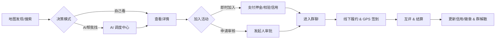

# 聚场 (Juchang) 产品需求文档 - V8.2 (Dev Ready)

## 1. 全局定义 (Global Definitions)

### 1.1 商业与货币 (Economy)
*   **货币单位**：**Pal 币** (Pal Coin)。
*   **汇率**：1 RMB = 10 Pal 币 (固定汇率)。
*   **属性**：虚拟货币，仅用于平台内消费，不可提现。
*   **获取途径**：充值 (微信支付)、系统赠送 (注册/邀请/运营补偿)。
*   **消费场景**：
    *   **皮肤/装扮**：地图 Pin 颜色、头像框 (有效期/永久)。
    *   **功能增强**：置顶卡 (Priority)、强提醒 (Notify)。
    *   **AI 服务**：深度策划、决策辅助 (按次/Token扣费)。

### 1.2 信用体系 (Trust System)
*   **靠谱分 (Credit Score)**：
    *   **初始分**：100 分。
    *   **上限**：120 分 (需通过多次优良履约突破 100)。
    *   **变动规则**：
        *   GPS 签到成功：+1 分。
        *   获得 5 星好评：+1 分 (每日上限 +3)。
        *   **未签到 (违约)**：**-20 分** (严重惩罚)。
        *   被举报核实：-50 分。
*   **阈值控制**：
    *   < 80 分：无法发起需审核的活动。
    *   < 60 分：禁止发起活动，禁止报名信用局。

### 1.3 时效性 (Ephemerality)
*   **活动生命周期**：仅展示 `Start_Time` 在 **未来 24 小时内** 的活动。
*   **群聊生命周期**：活动 `End_Time` + 24 小时后，群聊**软删除 (Soft Delete)**，前端不可见，倒逼微信沉淀。

---

## 2. 用户旅程 (User Journey)

---

## 3. 功能模块详解 (Functional Requirements)

### 3.1 Tab 1: 地图 (Map) - 发现与连接
**定位**：首页即地图，流量分发核心。

| 功能点 | 详细描述 | 优先级 |
| :--- | :--- | :--- |
| **全屏地图** | 腾讯地图 SDK，**无列表视图**。默认展示定位点 3km 内活动。 | P0 |
| **活动标记 (Pin)** | 区分颜色（吃=黄/玩=红/动=绿）。点击 Pin 弹出半屏卡片。**支持皮肤配置（如金色高亮 Pin）**。 | P0 |
| **时效过滤** | 仅展示 `Start_Time` 在 **未来 24 小时内** 的活动。过期自动从地图消失。 | P0 |
| **筛选器** | 顶部横滑 Tags：#全部 #仅限女生 #官方推荐 #信用90+。 | P0 |
| **官方运营锚点** | **[生存关键]** 后台可投放“虚拟活动/幽灵锚点”，填充冷启动期的空白区域，点击可引导发布。 | P0 |
| **极简发布** | 右下角 FAB 按钮 -> 弹窗表单。AI 辅助生成标题/文案。支持开启“审核模式”和“她模式”。 | P0 |

### 3.2 Tab 2: AI 调度中心 (Intelligence) - 增值与辅助
**定位**：智能副驾驶，核心盈利场景之一。

| 功能点 | 详细描述 | 优先级 |
| :--- | :--- | :--- |
| **CUI 对话界面** | 聊天式 UI，支持快捷指令 Chips。 | P0 |
| **RAG 检索** | “帮我找周末观音桥的局” -> 检索数据库 -> 输出**结构化活动卡片**。 | P1 |
| **AI 决策辅助** | “这几个人帮我挑一个” -> 分析申请者信用/评价/标签 -> 给出建议。 | P1 |
| **文案生成** | “帮我写个夜跑招募” -> 生成吸引人的文案。 | P1 |
| **计费逻辑** | **[盈利点]** 基础功能免费，高级决策/深度策划消耗 **Pal 币**。余额不足弹起充值窗。 | P0 |

### 3.3 Tab 3: 消息 (Message) - 轻量连接
**定位**：阅后即焚。

| 功能点 | 详细描述 | 优先级 |
| :--- | :--- | :--- |
| **临时群聊** | 报名成功自动进群。**活动结束 24 小时后，群聊自动解散（软删除）**。 | P0 |
| **强触达通知** | **[盈利点/体验]** 申请结果、审核提醒、活动开始提醒。必须对接**微信订阅消息**。 | P0 |
| **私聊限制** | 仅允许活动成员间临时私聊（可选），或直接引导群内沟通。 | P1 |

### 3.4 Tab 4: 我 (Me) - 资产与信誉
**定位**：用户数字资产沉淀。

| 功能点 | 详细描述 | 优先级 |
| :--- | :--- | :--- |
| **靠谱分** | 0-100 分。展示在头像旁。履约(+1)/违约(-20)/好评(+权重) 动态计算。 | P0 |
| **徽章墙 (Badges)** | **替代进度条**。展示“守约达人”、“活动组织者”等已解锁成就。点击查看获取条件。 | P1 |
| **钱包 (Wallet)** | **[盈利点]** 展示 Pal 币余额。充值入口（RMB -> Coin）。流水明细。 | P0 |
| **库存 (Inventory)** | **[盈利点]** 管理已购买的皮肤（Pin 颜色、头像框）、道具（置顶卡）。支持佩戴/卸下。 | P1 |
| **她模式开关** | **[生存关键]** 开启后，地图隐藏高风险活动，个人主页展示“她模式开启中”盾牌标识。 | P0 |

---

## 4. 核心业务流程 (Business Flows)

### 4.1 创建活动 (Creation)
**表单字段 (7个)**：
1.  标题 (AI 辅助生成按钮)。
2.  类型 (吃/动/玩/学/旅)。
3.  时间 (滚轮)。
4.  地点 (地图选点 + POI 名称)。
5.  人数 (2-10人)。
6.  **门槛设置** (Checkbox)：
    *   仅限女生 (需实名)。
    *   信用分 > 90。
    *   加入模式：即时 / 审核。
7.  **增值服务** (可选)：
    *   地图高亮 Pin (消耗 50 Pal 币)。
    *   活动置顶 (消耗 100 Pal 币)。

### 4.2 报名与审核 (Join & Approval)
**场景 A：即时加入**
*   用户点击 [加入] -> 校验门槛 (性别/分数) -> **成功** -> 自动进群。

**场景 B：审核加入**
*   用户点击 [申请] -> 填写理由 -> 状态 `Pending`。
*   发起人收到通知 -> 即使点击 [AI 帮我选] -> AI 分析画像 -> 发起人点击 [通过] -> 状态 `Approved` -> 触发微信订阅消息通知申请人。

### 4.3 签到与履约 (Fulfillment)
*   **校验方式**：**GPS 围栏** (PostGIS `ST_Distance` <= 200m)。
*   **流程**：
    1.  用户到达现场 -> 点击“我到了”。
    2.  后端校验坐标与时间。
    3.  校验通过 -> 状态更为 `Checked_In`。
*   **奖惩**：
    *   签到成功：信用分 +1，解冻押金（如有）。
    *   未签到（违约）：信用分 -20，扣除押金。

### 4.4 评价与标签 (Review & Tags)
*   **触发**：仅当 `Checked_In` 状态后，弹出评价。
*   **内容**：
    *   **一段话评价**。
    *   **Vibe Tags**：选择系统预设标签（如：👍准时、👍风趣、👎鸽子）。
*   **闭环**：评价标签汇总后，生成用户显性的 **Vibe Tags** 展示在个人页，供他人参考。
---

## 5. 关键支撑系统 (Support Systems)

### 5.1 运营锚点 (Ghost Anchors) - 冷启动生存关键
*   **后台功能**：管理员可在地图任意位置创建 "官方运营活动"。
*   **前端表现**：
    *   显示为带有 "官方" 标签的 Pin。
    *   点击后**不进入详情页**，而是弹出引导框："这里暂时没有活动，成为第一个发起者吧！" -> 跳转创建页。
*   **目的**：解决地图空白问题，诱导用户发布。

### 5.2 风控与安全 (Risk Control)
*   **内容风控**：所有用户发布的标题、描述、图片，**写入 DB 前必须调用腾讯云 IMS**。违规直接报错阻断。
*   **她模式逻辑**：
    *   后端计算 `RiskScore`（基于时间、地点偏僻度、发起人信用）。
    *   若用户开启“她模式”，API 仅返回 `RiskScore < 60` 的活动。

### 5.3 资产系统 (Assets) - 双账本
*   **架构**：`UserAssets` (余额表) + `AssetRecords` (流水表)。
*   **原则**：所有 Pal 币变动（充值、赠送、消费）必须有流水记录。
*   **场景**：
    *   **充值**：微信支付回调 -> 增加余额 -> 记录 `recharge` 流水。
    *   **消费**：AI 请求/购买皮肤 -> 扣除余额 -> 记录 `consume` 流水。

---

## 6. 运营与冷启动策略 (Operations)

1.  **幽灵锚点 (Ghost Anchors)**：
    *   在后台手动在热点区域（商圈、高校）创建官方活动。
    *   前端显示带“官方”标识，点击后引导用户“这里没人？你来发起一个”。
2.  **新用户赠礼**：
    *   注册完成实名认证 -> 系统自动赠送 50 Pal 币（写入流水）。
    *   引导用户去 AI Tab 体验一次付费咨询，或购买一个限时皮肤。
3.  **分享裂变**：
    *   活动详情页生成的分享卡片，必须带 `inviter_id`。
    *   被邀请人完成首次签到 -> 双方各得 50 Pal 币。

## 7. 开发路线图 (Roadmap)

1.  **Week 1: 地基搭建**
    *   初始化 Monorepo (Next.js Admin + Hono API + Weapp-Vite)。
    *   搭建 Postgres + PostGIS，跑通 Drizzle Schema。
    *   实现 JWT 登录与 User 基础表。

2.  **Week 2: 地图与资产**
    *   实现地图加载、Pin 渲染、半屏卡片。
    *   实现 **资产双账本** 与 **充值回调** (Mock)。
    *   后台实现 **幽灵锚点** 投放功能。

3.  **Week 3: 社交闭环**
    *   实现创建、报名、审核逻辑。
    *   实现 **GPS 签到** 与 **信用分** 变动。
    *   接入 **腾讯云 IMS** 风控。

4.  **Week 4: AI 与 消息**
    *   实现 AI Tab 的 CUI 界面与 SSE 接口。
    *   实现群聊列表与 **自动解散** 定时任务 (Cron Job)。
    *   集成 **微信订阅消息**。

5.  **Week 5: 验收与上线**
    *   全链路测试 (特别是支付和 GPS)。
    *   提交微信审核。
