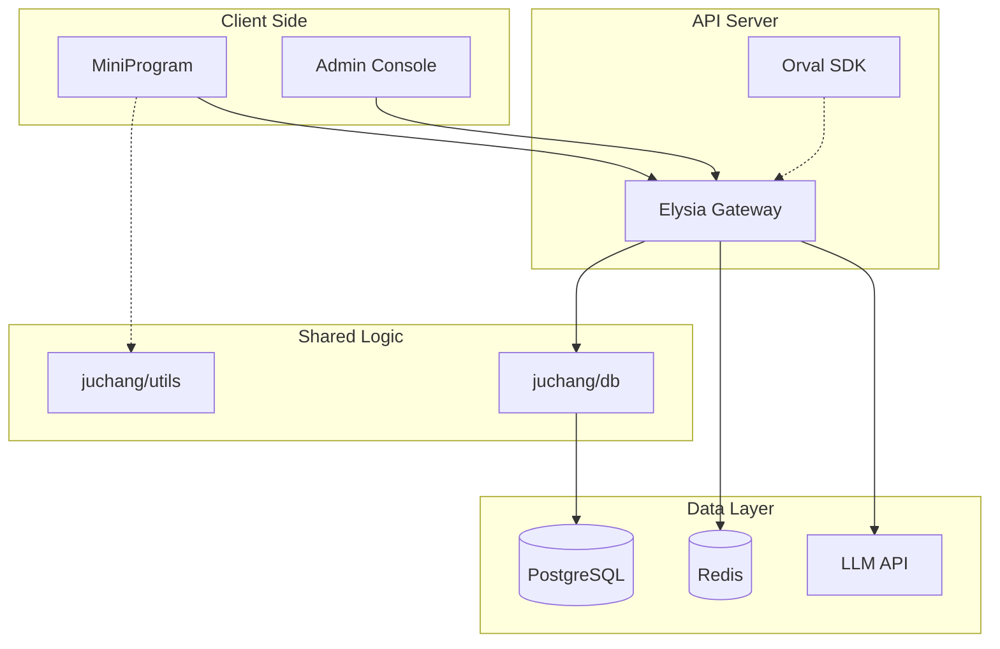

# 聚场 (Juchang) - 总体技术架构方案 (Lean MVP)

这份架构文档基于 **PRD Lean MVP** 对齐，采用 **"原生小程序 + Zustand Vanilla + Vite Admin + Elysia API + Drizzle ORM"** 的现代化全栈架构，通过数据库整合、状态管理优化和 API 模块重构，实现了更简洁、高效的 MVP 设计。

---

## 1. 核心设计理念

1. **原生极致性能**：小程序端完全放弃 React/Vue 运行时，使用 **weapp-vite** 编译原生 `WXML/WXSS/TS`。零运行时开销、直接调用微信原生 API，确保启动速度和运行性能达到"天花板"级别。
2. **数据库优先 (Database First)**：`@juchang/db` (Drizzle ORM) 是绝对的数据源。所有 TypeBox Schema 必须通过 `drizzle-typebox` 自动生成，**禁止手动定义 TypeBox**（除非是纯瞬态参数）。
3. **Spec-Coding 契约驱动**：使用 Elysia 的 TypeBox 定义路由契约，集成 **@elysiajs/openapi** 提供 API 文档，使用 **Orval** 自动生成客户端 SDK。
4. **双轨架构 (Dual-Track)**：
   - **API Server (Elysia)**：服务微信小程序，认证使用 **JWT**。
   - **Admin Console (Vite SPA)**：服务管理员，通过 **Eden Treaty** 调用 Elysia API，使用 **TanStack React Query** 管理数据状态。
5. **逻辑高度复用**：采用 **Monorepo (Internal Packages)** 策略，核心业务逻辑封装为纯 TS 源码包，API端、Web端和小程序端**直接引用源码**，无中间编译产物。
6. **类型安全优先**：从数据库到API到前端，全链路TypeScript，结合 **Drizzle ORM** 和 **drizzle-typebox** 实现端到端的类型安全。
7. **极简主义 (Geek/Minimalist)**：采用 Elysia 的轻量级中间件模式，代码简洁、性能卓越。

---

## 2. 技术栈全景图 (Tech Stack)

| 模块           | 选型                           | 核心理由                                                                     |
| :------------- | :----------------------------- | :--------------------------------------------------------------------------- |
| **代码管理**   | **Turborepo + Bun Workspaces** | 任务编排与依赖管理，支持源码引用的 Workspace 模式，Bun 提供毫秒级启动速度。  |
| **代码质量**   | **Biome**                      | 极速的 Linter + Formatter，替代 ESLint + Prettier。                         |
| **小程序构建** | **weapp-vite (Native)**        | 使用 Vite 编译原生小程序，支持 TS、SCSS，零运行时开销。                      |
| **小程序状态** | **Zustand (Vanilla)**          | 极简状态管理，使用 `zustand/vanilla` 模式，无 React 依赖。                   |
| **Admin后台**  | **Vite + TanStack Router + React Query** | 现代化 SPA 架构，通过 Eden Treaty 调用 API，shadcn/ui 组件库。 |
| **API网关**    | **Elysia**                     | Bun 原生高性能后端框架，TypeBox 类型推断极致，内置 OpenAPI 支持。            |
| **API文档**    | **@elysiajs/openapi**          | Elysia 官方 OpenAPI 插件，自动生成 API 文档。                                |
| **客户端SDK**  | **Orval**                      | 从 OpenAPI Spec 自动生成 TypeScript 客户端 SDK，小程序直接使用生成的 SDK。   |
| **数据库**     | **PostgreSQL + PostGIS**       | 处理 LBS 社交（附近的人、地理围栏、距离计算）的行业标准组合。                |
| **ORM**        | **Drizzle ORM**                | TypeScript Native，无运行时开销，生成高效 SQL。                             |
| **Schema生成** | **drizzle-typebox**            | 从 Drizzle Schema 自动生成 TypeBox Schema，实现 Single Source of Truth。    |
| **模式验证**   | **TypeBox**                    | Elysia 内置的高性能模式验证库，比 Zod 快 50x。                              |
| **基础设施**   | **Redis + Docker**             | 缓存与容器化部署。                                                           |
| **AI/风控**    | **LLM API + 腾讯云 IMS**       | 通过 Elysia 流式输出 AI 响应；强制接入第三方内容安全服务。                   |


---

## 2.5 状态管理：Zustand Vanilla 在小程序中的落地

在原生小程序中，我们不能使用 Hook (`useStore`)，而是使用 Zustand 的 **Vanilla API** (`createStore`)。

### 为什么选 Zustand？

| 对比项 | MobX Miniprogram | Zustand Vanilla |
|--------|------------------|-----------------|
| 心智负担 | 高（observable/action/runInAction） | 低（get/set 直觉式） |
| 样板代码 | 多（装饰器、Behavior 绑定） | 少（纯函数式） |
| 解耦程度 | 依赖小程序 Behavior | 纯 JS 对象，任何地方可用 |
| 调试 | 一般 | 支持 redux-devtools |
| 包体积 | ~15KB | ~2KB |

### 2.5.1 定义 Store

```typescript
// miniprogram/store/copilot.ts
import { createStore } from 'zustand/vanilla'

// 1. 定义类型
interface CopilotState {
  status: 'idle' | 'thinking' | 'searching' | 'done';
  currentReply: string;
  mapCenter: { lat: number; lng: number } | null;
  activities: any[];
  draft: any | null;
}

interface CopilotActions {
  setStatus: (status: CopilotState['status']) => void;
  appendReply: (chunk: string) => void;
  resetReply: () => void;
  setMapCenter: (center: { lat: number; lng: number }) => void;
  setActivities: (activities: any[]) => void;
  setDraft: (draft: any) => void;
  sendMessage: (content: string, mapCtx: WechatMiniprogram.MapContext) => Promise<void>;
}

// 2. 创建 Store (Vanilla 模式)
export const copilotStore = createStore<CopilotState & CopilotActions>((set, get) => ({
  // State
  status: 'idle',
  currentReply: '',
  mapCenter: null,
  activities: [],
  draft: null,

  // Actions
  setStatus: (status) => set({ status }),
  appendReply: (chunk) => set((state) => ({ currentReply: state.currentReply + chunk })),
  resetReply: () => set({ currentReply: '', status: 'idle' }),
  setMapCenter: (center) => set({ mapCenter: center }),
  setActivities: (activities) => set({ activities }),
  setDraft: (draft) => set({ draft }),

  // 核心业务：发送消息并处理流式响应
  sendMessage: async (content, mapCtx) => {
    const state = get();
    state.resetReply();
    state.setStatus('thinking');

    const requestTask = wx.request({
      url: 'https://api.juchang.com/ai/parse',
      method: 'POST',
      data: { input: content },
      enableChunked: true, // 开启流式传输
    });

    requestTask.onChunkReceived((res) => {
      // 解析 ArrayBuffer
      const decoder = new TextDecoder('utf-8');
      const text = decoder.decode(new Uint8Array(res.data as ArrayBuffer));
      
      // 解析 SSE 事件
      const lines = text.split('\n').filter(line => line.startsWith('data:'));
      
      for (const line of lines) {
        try {
          const data = JSON.parse(line.slice(5));
          
          switch (data.event) {
            case 'thinking':
              state.appendReply(data.message);
              break;
              
            case 'location':
              state.appendReply(`已定位到「${data.name}」📍\n`);
              state.setMapCenter({ lat: data.coords[1], lng: data.coords[0] });
              // 触发地图飞行
              mapCtx.moveToLocation({
                latitude: data.coords[1],
                longitude: data.coords[0],
              });
              break;
              
            case 'searching':
              state.setStatus('searching');
              state.appendReply(`${data.message}\n`);
              break;
              
            case 'result':
              state.setStatus('done');
              state.setActivities(data.activities || []);
              state.setDraft(data.draft || null);
              break;
          }
        } catch (e) {
          // 忽略解析错误
        }
      }
    });
  },
}));
```

### 2.5.2 页面绑定

在页面中，通过 `store.subscribe` 实现 Store 到 Page data 的响应式绑定：

```typescript
// miniprogram/pages/home/index.ts
import { copilotStore } from '../../store/copilot';

Page({
  data: {
    copilotStatus: 'idle' as const,
    aiReply: '',
    activities: [] as any[],
    draft: null as any,
  },

  // 存放取消订阅的函数
  unsubCopilot: null as null | (() => void),

  onLoad() {
    // 1. 订阅 Store 变化 -> 同步到 Page Data
    this.unsubCopilot = copilotStore.subscribe((state) => {
      // 性能优化：只更新变化的字段
      const updates: Partial<typeof this.data> = {};
      
      if (this.data.copilotStatus !== state.status) {
        updates.copilotStatus = state.status;
      }
      if (this.data.aiReply !== state.currentReply) {
        updates.aiReply = state.currentReply;
      }
      if (this.data.activities !== state.activities) {
        updates.activities = state.activities;
      }
      if (this.data.draft !== state.draft) {
        updates.draft = state.draft;
      }
      
      if (Object.keys(updates).length > 0) {
        this.setData(updates);
      }
    });
  },

  onUnload() {
    // 2. 页面销毁时取消订阅，防止内存泄漏
    if (this.unsubCopilot) {
      this.unsubCopilot();
    }
  },

  // UI 事件：点击 AI 输入栏发送
  onInputBarSend(e: any) {
    const text = e.detail.value;
    const mapCtx = wx.createMapContext('mainMap');
    // 调用 Store 的 Action
    copilotStore.getState().sendMessage(text, mapCtx);
  },

  // UI 事件：点击发布草稿
  onPublishDraft() {
    const draft = copilotStore.getState().draft;
    if (draft) {
      wx.navigateTo({
        url: `/pages/activity/create?draft=${encodeURIComponent(JSON.stringify(draft))}`,
      });
    }
  },
});
```

### 2.5.3 Zustand 的优势总结

1. **更直观**：`get()` 和 `set()` 的逻辑比 MobX 的 `observable/action/runInAction` 更符合直觉
2. **解耦 UI**：Store 是纯 JS 对象，不依赖小程序的 Behavior 绑定机制。可以在任何地方（工具函数、API 拦截器）直接 `copilotStore.getState()` 拿到状态
3. **调试方便**：结合 redux-devtools 可以看到每一次 `set` 的变化
4. **极小体积**：~2KB，对小程序包体积友好


---

## 3. 系统逻辑架构图



**核心数据流：**
1. **Database First**：`@juchang/db` 定义表结构 → `drizzle-typebox` 生成 TypeBox Schema → `apps/api` 使用 TypeBox 定义 OpenAPI 路由。
2. **Admin 通过 API 访问**：Vite Admin 通过 Eden Treaty 调用 Elysia API，享受完整的类型安全。

---

## 4. 目录结构设计 (Internal Packages 模式)

所有 `packages/*` 均配置为 **No-Build** 模式（`main` 指向 `.ts`），由上层应用（Apps）的 Vite/Bun 负责编译。

```text
/root
  ├── apps/
  │    ├── miniprogram/             # [WeChat 原生] Vite+TS 工程
  │    │    ├── src/
  │    │    │    ├── pages/
  │    │    │    │    ├── home/     # 首页 (地图 + AI 输入栏综合页)
  │    │    │    │    ├── message/  # 消息列表/聊天
  │    │    │    │    ├── my/       # 个人中心
  │    │    │    │    ├── activity/ # 活动详情/创建 (AI 解析集成)
  │    │    │    │    ├── search/   # 独立搜索页
  │    │    │    │    └── webview/  # 仅协议/政策承载
  │    │    │    ├── components/
  │    │    │    │    ├── ai-input-bar/   # AI 输入栏组件
  │    │    │    │    ├── cui-panel/      # CUI 副驾面板
  │    │    │    │    ├── draft-card/     # 创建草稿卡片
  │    │    │    │    └── activity-form/  # 智能活动表单 (AI 解析集成)
  │    │    │    ├── lib/            # 使用 Orval 生成的 SDK
  │    │    │    └── utils/          # 直接 import @juchang/utils
  │    │    ├── vite.config.ts
  │    │    └── tsconfig.json
  │    │
  │    ├── admin/                   # [Vite + React] 管理后台
  │    │    ├── src/
  │    │    │    ├── features/     # 功能模块（users, activities, dashboard）
  │    │    │    ├── routes/       # TanStack Router 文件路由
  │    │    │    ├── components/   # 通用组件（shadcn/ui）
  │    │    │    ├── hooks/        # 通用 hooks
  │    │    │    ├── stores/       # Zustand 状态管理
  │    │    │    └── lib/          # Eden Treaty 客户端
  │    │    ├── vite.config.ts
  │    │    └── package.json
  │    │
  │    ├── api/                     # [Elysia] API Gateway（服务小程序）
  │    │    ├── src/
  │    │    │    ├── index.ts       # 应用入口
  │    │    │    ├── setup.ts       # 全局插件配置
  │    │    │    ├── types.ts       # 类型导出
  │    │    │    └── modules/       # 功能模块
  │    │    │         ├── auth/
  │    │    │         ├── users/
  │    │    │         ├── activities/
  │    │    │         ├── participants/
  │    │    │         ├── ai/
  │    │    │         └── dashboard/
  │    │    └── package.json
  │    │
  │
  ├── packages/
  │    ├── db/                      # Drizzle ORM + drizzle-typebox
  │    │    ├── drizzle.config.ts
  │    │    ├── src/
  │    │    │    ├── db.ts          # 数据库客户端
  │    │    │    ├── migrate.ts     # 迁移脚本
  │    │    │    ├── seed.ts        # 种子数据
  │    │    │    ├── index.ts       # 导出所有 Schema 和 TypeBox
  │    │    │    └── schema/
  │    │    │         ├── enums.ts          # 枚举定义
  │    │    │         ├── users.ts          # 整合认证信息
  │    │    │         ├── activities.ts     # 整合群聊状态
  │    │    │         ├── participants.ts   # 履约 + 申诉
  │    │    │         ├── chat_messages.ts  # 直接关联活动
  │    │    │         ├── feedbacks.ts      # 差评反馈系统
  │    │    │         ├── notifications.ts  # 通知推送系统
  │    │    │         ├── transactions.ts   # 整合支付逻辑
  │    │    │         ├── action_logs.t # 操作审计日志
  │    │    │         ├── relations.ts      # 表关系
  │    │    │         └── index.ts          # 统一导出
  │    │    └── package.json
  │    │
  │    ├── utils/                   # 通用工具包 (格式化 / 加解密)
  │    └── ts-config/               # 统一 TypeScript 配置
  │
  ├── docker/                      # 基础设施（Postgres + Redis）
  │    ├── docker-compose.yml
  │    ├── postgres/               # 自定义镜像 + init SQL
  │    └── .env.example
  │
  ├── scripts/                     # 开发脚本
  │    ├── dev-with-api-watch.js
  │    ├── init-env.js
  │    ├── init-extensions.sql
  │    └── watch-api-changes.js
  │
  ├── turbo.json                   # Turborepo pipeline
  ├── bun.lock                     # Bun lockfile
  └── .env.example                 # 根环境变量模板
```


---

## 5. API 应用层架构（Elysia 版）

### 5.1 目录结构

```
apps/api/
├── src/
│   ├── index.ts                     # 应用入口：创建 Elysia 实例、挂载模块、启动服务
│   ├── setup.ts                     # 全局插件配置（CORS + JWT）
│   ├── types.ts                     # 类型导出（给 Eden Treaty 使用）
│   └── modules/                     # [功能模块层] - 8个核心模块
│       ├── auth/
│       │   ├── auth.controller.ts   # 控制器（Elysia 实例）
│       │   ├── auth.model.ts        # TypeBox Schema 定义
│       │   └── auth.service.ts      # 业务逻辑（纯函数）
│       ├── users/
│       │   ├── user.controller.ts
│       │   ├── user.model.ts
│       │   └── user.service.ts
│       ├── activities/
│       │   ├── activity.controller.ts
│       │   ├── activity.model.ts
│       │   └── activity.service.ts
│       ├── participants/
│       │   ├── participant.controller.ts
│       │   ├── participant.model.ts
│       │   └── participant.service.ts
│       ├── ai/                      # AI 意图解析与搜索（无聊天）
│       │   ├── ai.controller.ts
│       │   ├── ai.model.ts
│       │   └── ai.service.ts
│       ├── chat/                    # 群聊消息（新增）
│       │   ├── chat.controller.ts
│       │   ├── chat.model.ts
│       │   └── chat.service.ts
│       ├── transactions/            # 整合支付（新增）
│       │   ├── transaction.controller.ts
│       │   ├── transaction.model.ts
│       │   └── transaction.service.ts
│       └── dashboard/
│           ├── dashboard.controller.ts
│           ├── dashboard.model.ts
│           └── dashboard.service.ts
│
├── package.json
└── tsconfig.json
```

### 5.2 API 模块设计（V9.2 版本）

**8 个核心模块**对应业务领域：

| 模块 | 职责 | 核心端点 | V9.2 变化 |
|------|------|----------|-----------|
| **auth** | 认证授权 | `/auth/login`, `/auth/refresh` | 整合微信登录逻辑 |
| **users** | 用户管理 | `/users`, `/users/:id` | 整合认证信息，AI 额度管理 |
| **activities** | 活动管理 | `/activities`, `/activities/nearby` | 整合群聊状态，地形备注 |
| **participants** | 参与管理 | `/participants`, `/participants/apply` | 履约确认，申诉机制 |
| **ai** | AI 服务 | `/ai/parse`, `/ai/search` | **砍掉聊天**，专注解析和搜索 |
| **chat** | 群聊消息 | `/chat/messages`, `/chat/send` | **新增模块**，直接关联活动 |
| **transactions** | 支付交易 | `/transactions`, `/transactions/callback` | **新增模块**，整合支付逻辑 |
| **dashboard** | 数据面板 | `/dashboard/stats`, `/dashboard/users` | 管理后台数据 |

### 5.3 核心工作流：Spec-Coding

**"Spec-Coding"** 是指先定义 TypeBox 契约，再实现业务逻辑的开发模式。

#### 步骤 1：定义 Model（TypeBox Schema）

```typescript
// apps/api/src/modules/ai/ai.model.ts - V9.2 AI 模块示例
import { Elysia, t, type Static } from 'elysia';
import { selectActivitySchema, insertActivitySchema } from '@juchang/db';

// AI 意图解析请求（瞬态参数）
const ParseRequest = t.Object({
  input: t.String({ minLength: 1, maxLength: 500 }),
  type: t.Optional(t.Union([t.Literal('text'), t.Literal('voice')])),
});

// AI 解析响应（从 DB Schema 派生 + 计算字段）
const ParseResponse = t.Intersect([
  t.Pick(insertActivitySchema, ['title', 'description', 'type', 'maxParticipants', 'feeType']),
  t.Object({
    confidence: t.Number({ minimum: 0, maximum: 1 }),
    suggestions: t.Array(t.String()),
  }),
]);

// AI 搜索请求
const SearchRequest = t.Object({
  query: t.String({ minLength: 1, maxLength: 100 }),
  lat: t.Number(),
  lng: t.Number(),
  radius: t.Optional(t.Number({ minimum: 1, maximum: 50, default: 5 })),
});

// AI 搜索响应（活动列表 + 距离）
const SearchResponse = t.Object({
  activities: t.Array(t.Intersect([
    selectActivitySchema,
    t.Object({
      distance: t.Number(), // 计算字段：距离（km）
    }),
  ])),
  total: t.Number(),
});

// 注册到 Elysia Model Plugin
export const aiModel = new Elysia({ name: 'aiModel' })
  .model({
    'ai.parseRequest': ParseRequest,
    'ai.parseResponse': ParseResponse,
    'ai.searchRequest': SearchRequest,
    'ai.searchResponse': SearchResponse,
  });

// 导出 TS 类型
export type ParseRequest = Static<typeof ParseRequest>;
export type ParseResponse = Static<typeof ParseResponse>;
export type SearchRequest = Static<typeof SearchRequest>;
export type SearchResponse = Static<typeof SearchResponse>;
```

#### 步骤 2：实现 Service（纯函数）

```typescript
// apps/api/src/modules/ai/ai.service.ts - V9.2 AI 服务示例
import { db, users, activities, eq, and, sql } from '@juchang/db';
import type { ParseRequest, SearchRequest } from './ai.model';

// AI 意图解析服务
export async function parseActivityIntent(request: ParseRequest) {
  // 调用 LLM API 解析用户意图
  const llmResponse = await callLLMAPI({
    prompt: `解析以下文本中的活动信息：${request.input}`,
    schema: {
      title: 'string',
      description: 'string',
      type: 'food|entertainment|sports|study|other',
      maxParticipants: 'number',
      feeType: 'free|aa|treat',
    },
  });

  // 扣除用户 AI 建局额度
  await db.update(users)
    .set({ 
      aiCreateQuotaToday: sql`${users.aiCreateQuotaToday} - 1` 
    })
    .where(eq(users.id, request.userId));

  return {
    ...llmResponse.data,
    confidence: llmResponse.confidence,
    suggestions: llmResponse.suggestions || [],
  };
}

// AI 搜索服务（PostGIS 地理查询）
export async function searchNearbyActivities(request: SearchRequest) {
  // 扣除用户 AI 搜索额度
  await db.update(users)
    .set({ 
      aiSearchQuotaToday: sql`${users.aiSearchQuotaToday} - 1` 
    })
    .where(eq(users.id, request.userId));

  // PostGIS 地理查询 + AI 语义匹配
  const results = await db.select({
    ...activities,
    distance: sql<number>`ST_Distance(
      ST_GeogFromText('POINT(${request.lng} ${request.lat})'),
      ST_GeogFromText('POINT(' || ST_X(${activities.location}) || ' ' || ST_Y(${activities.location}) || ')')
    ) / 1000`, // 转换为公里
  })
  .from(activities)
  .where(and(
    eq(activities.status, 'published'),
    sql`ST_DWithin(
      ${activities.location},
      ST_GeogFromText('POINT(${request.lng} ${request.lat})'),
      ${request.radius * 1000}
    )`
  ))
  .orderBy(sql`distance ASC`)
  .limit(20);

  // AI 语义过滤（可选）
  const filteredResults = await filterBySemanticRelevance(results, request.query);

  return {
    activities: filteredResults,
    total: filteredResults.length,
  };
}

// LLM API 调用封装
async function callLLMAPI(params: { prompt: string; schema: object }) {
  // 实际调用 OpenAI/DeepSeek API
  // 返回结构化数据
}

// AI 语义相关性过滤
async function filterBySemanticRelevance(activities: any[], query: string) {
  // 使用向量相似度或 LLM 进行语义匹配
  return activities; // 简化实现
}
```

#### 步骤 3：实现 Controller（Elysia 实例）

```typescript
// apps/api/src/modules/ai/ai.controller.ts - V9.2 AI 控制器
import { Elysia } from 'elysia';
import { basePlugins, verifyAuth } from '../../setup';
import { aiModel, type ErrorResponse } from './ai.model';
import { parseActivityIntent, searchNearbyActivities } from './ai.service';

export const aiController = new Elysia({ prefix: '/ai' })
  .use(basePlugins)
  .use(aiModel)
  // AI 意图解析（替代聊天功能）
  .post(
    '/parse',
    async ({ body, headers, set }) => {
      const auth = await verifyAuth(jwt, headers);
      if (!auth) {
        set.status = 401;
        return { code: 401, msg: '未授权' } satisfies ErrorResponse;
      }

      // 检查 AI 建局额度
      const user = await getUserById(auth.id);
      if (user.aiCreateQuotaToday <= 0) {
        set.status = 429;
        return { code: 429, msg: 'AI 建局额度已用完' } satisfies ErrorResponse;
      }

      const result = await parseActivityIntent({
        ...body,
        userId: auth.id,
      });

      return result;
    },
    {
      detail: {
        tags: ['AI'],
        summary: 'AI 意图解析',
        description: '解析用户输入的自然语言，生成活动信息',
      },
      body: 'ai.parseRequest',
      response: {
        200: 'ai.parseResponse',
        401: 'ai.error',
        429: 'ai.error',
      },
    }
  )
  // AI 智能搜索（替代聊天功能）
  .post(
    '/search',
    async ({ body, headers, set }) => {
      const auth = await verifyAuth(jwt, headers);
      if (!auth) {
        set.status = 401;
        return { code: 401, msg: '未授权' } satisfies ErrorResponse;
      }

      // 检查 AI 搜索额度
      const user = await getUserById(auth.id);
      if (user.aiSearchQuotaToday <= 0) {
        set.status = 429;
        return { code: 429, msg: 'AI 搜索额度已用完' } satisfies ErrorResponse;
      }

      const result = await searchNearbyActivities({
        ...body,
        userId: auth.id,
      });

      return result;
    },
    {
      detail: {
        tags: ['AI'],
        summary: 'AI 智能搜索',
        description: '基于自然语言查询附近相关活动',
      },
      body: 'ai.searchRequest',
      response: {
        200: 'ai.searchResponse',
        401: 'ai.error',
        429: 'ai.error',
      },
    }
  );
```

#### 步骤 4：注册到主应用

```typescript
// apps/api/src/index.ts
import { Elysia } from 'elysia';
import { openapi } from '@elysiajs/openapi';
import { basePlugins } from './setup';
import { userController } from './modules/users/user.controller';
import { activityController } from './modules/activities/activity.controller';
// ... 其他 controllers

const app = new Elysia()
  .use(basePlugins)
  .use(openapi({
    documentation: {
      info: {
        title: '聚场 API',
        version: '1.0.0',
      },
      tags: [
        { name: 'Auth', description: '认证相关' },
        { name: 'Users', description: '用户管理' },
        { name: 'Activities', description: '活动管理' },
      ],
    },
  }))
  .use(userController)
  .use(activityController)
  .get('/health', () => ({ status: 'ok' }));

app.listen(3000);

// 导出类型给 Eden Treaty
export type App = typeof app;
```


### 5.3 "No Manual TypeBox" 规则（核心原则）

**禁止手动定义 TypeBox Schema，必须从 `@juchang/db` 派生。**

#### ❌ 错误示例（手动定义）

```typescript
// ❌ 禁止：手动定义与 DB 表结构重复的 TypeBox Schema
const userResponseSchema = t.Object({
  id: t.String(),
  nickname: t.String(),
  avatarUrl: t.Optional(t.String()),
});
```

#### ✅ 正确示例（从 DB 派生）

```typescript
// ✅ 正确：从 DB Schema 派生
import { selectUserSchema } from '@juchang/db';

// 方式 1：直接使用
const userResponseSchema = selectUserSchema;

// 方式 2：选择部分字段（使用 t.Pick）
const userProfileSchema = t.Pick(selectUserSchema, ['id', 'nickname', 'avatarUrl']);

// 方式 3：排除字段（使用 t.Omit）
const publicUserSchema = t.Omit(selectUserSchema, ['phoneNumber', 'wxOpenId']);

// 方式 4：扩展字段（使用 t.Intersect）
const userWithStatsSchema = t.Intersect([
  selectUserSchema,
  t.Object({
    activityCount: t.Number(),
  }),
]);

// 方式 5：数组响应
const userListSchema = t.Array(selectUserSchema);
```

**唯一例外：纯瞬态参数（不来自数据库）**

```typescript
// ✅ 允许：查询参数、分页参数等瞬态数据
const paginationSchema = t.Object({
  page: t.Optional(t.Number({ minimum: 1, default: 1 })),
  limit: t.Optional(t.Number({ minimum: 1, maximum: 100, default: 20 })),
});

const searchQuerySchema = t.Object({
  keyword: t.String({ minLength: 1, maxLength: 100 }),
});
```

### 5.4 全局插件配置

```typescript
// apps/api/src/setup.ts
import { Elysia } from 'elysia';
import { cors } from '@elysiajs/cors';
import { jwt } from '@elysiajs/jwt';

export const basePlugins = new Elysia({ name: 'basePlugins' })
  .use(cors({
    origin: true,
    credentials: true,
  }))
  .use(jwt({
    name: 'jwt',
    secret: process.env.JWT_SECRET || 'dev-secret-key',
    exp: '7d',
  }));

// JWT 认证辅助函数
export async function verifyAuth(
  jwt: any,
  headers: Record<string, string | undefined>
): Promise<{ id: string; role: string } | null> {
  const authHeader = headers['authorization'];
  if (!authHeader?.startsWith('Bearer ')) return null;

  const token = authHeader.slice(7);
  return await jwt.verify(token) as { id: string; role: string } | null;
}
```

---

## 6. Admin Console 架构（Vite + TanStack Router + React Query）

### 6.1 技术栈

| 技术 | 用途 |
|------|------|
| **Vite** | 构建工具，毫秒级 HMR |
| **React 19** | UI 框架 |
| **TanStack Router** | 文件路由，类型安全 |
| **TanStack React Query** | 数据获取、缓存、乐观更新 |
| **Eden Treaty** | 类型安全的 API 客户端 |
| **shadcn/ui** | UI 组件库 |
| **Zustand** | 状态管理 |

### 6.2 目录结构

```
apps/admin/
├── src/
│   ├── features/           # 功能模块（Feature-based）
│   │   ├── users/
│   │   │   ├── index.tsx
│   │   │   ├── data/
│   │   │   │   ├── schema.ts
│   │   │   │   └── users.ts
│   │   │   ├── hooks/
│   │   │   │   └── use-users.ts
│   │   │   └── components/
│   │   │       ├── users-table.tsx
│   │   │       └── users-columns.tsx
│   │   ├── activities/
│   │   ├── dashboard/
│   │   └── auth/
│   ├── routes/             # TanStack Router 文件路由
│   │   ├── __root.tsx
│   │   ├── (auth)/
│   │   ├── (errors)/
│   │   └── _authenticated/
│   │       ├── users/
│   │       └── activities/
│   ├── lib/
│   │   └── eden.ts         # Eden Treaty 客户端
│   ├── stores/
│   │   └── auth-store.ts   # Zustand 认证状态
│   └── components/         # 通用组件
└── package.json
```

### 6.3 Eden Treaty 客户端

```typescript
// apps/admin/src/lib/eden.ts
import { treaty } from '@elysiajs/eden';
import type { App } from '@juchang/api';

const API_BASE_URL = import.meta.env.VITE_API_URL || 'http://localhost:3000';

export const api = treaty<App>(API_BASE_URL);
```

### 6.4 API 调用层

```typescript
// apps/admin/src/features/users/data/users.ts
import { api } from '@/lib/eden';

export async function fetchUsers(params: { page?: number; limit?: number }) {
  const { data, error } = await api.users.get({ query: params });
  if (error) throw new Error(error.value?.msg || '获取用户列表失败');
  return data;
}

export async function updateUser(id: string, body: { nickname?: string }) {
  const { data, error } = await api.users({ id }).put(body);
  if (error) throw new Error(error.value?.msg || '更新用户失败');
  return data;
}
```

### 6.5 React Query Hooks

```typescript
// apps/admin/src/features/users/hooks/use-users.ts
import { useQuery, useMutation, useQueryClient } from '@tanstack/react-query';
import { toast } from 'sonner';
import { fetchUsers, updateUser } from '../data/users';

export const userKeys = {
  all: ['users'] as const,
  list: (params: object) => [...userKeys.all, 'list', params] as const,
};

export function useUsers(params = {}) {
  return useQuery({
    queryKey: userKeys.list(params),
    queryFn: () => fetchUsers(params),
  });
}

export function useUpdateUser() {
  const queryClient = useQueryClient();
  return useMutation({
    mutationFn: ({ id, data }: { id: string; data: any }) => updateUser(id, data),
    onSuccess: () => {
      queryClient.invalidateQueries({ queryKey: userKeys.all });
      toast.success('用户更新成功');
    },
  });
}
```


---

## 7. 数据库 Schema 设计（V9.2 整合版）

### 7.1 整合策略：从 13 张表优化到 11 张表

**整合原则**：
- **减少 JOIN 复杂度**：将相关信息直接存储在主表中
- **提升查询性能**：避免多表关联查询
- **简化业务逻辑**：减少数据一致性维护成本

**整合对比**：
```
V7.0 (13张表)                    V9.2 (11张表)
├── users                        ├── users (整合认证信息)
├── user_auths          ────────→ │
├── activities                   ├── activities (整合群聊状态)
├── chat_groups         ────────→ │
├── participants                 ├── participants (履约 + 申诉)
├── chat_messages                ├── chat_messages (直接关联活动)
├── feedbacks                    ├── feedbacks
├── notifications                ├── notifications
├── orders              ────────→ ├── transactions (整合支付逻辑)
├── payments            ────────→ │
├── action_logs                  ├── action_logs
├── enums                        ├── enums
└── relations                    ├── relations
                                 └── index.ts (统一导出)
```

**实际减少**：13 → 11 张表，减少 15% 复杂度

### 7.2 Schema 编写规范

每个 schema 文件必须遵循以下模式：

```typescript
// packages/db/src/schema/users.ts
import { pgTable, uuid, varchar, timestamp, integer, boolean, jsonb, index } from "drizzle-orm/pg-core";
import { geometry } from "drizzle-orm/pg-core";
import { createInsertSchema, createSelectSchema } from "drizzle-typebox";

// 1. 定义表
export const users = pgTable("users", {
  id: uuid("id").primaryKey().defaultRandom(),
  // ... other columns
});

// 2. 导出 TypeBox Schemas（使用 drizzle-typebox）
export const insertUserSchema = createInsertSchema(users);
export const selectUserSchema = createSelectSchema(users);

// 3. 导出 TypeScript 类型（可选但推荐）
export type User = typeof users.$inferSelect;
export type NewUser = typeof users.$inferInsert;
```

### 7.3 核心表结构

#### 1. Users 表（整合认证信息）

```typescript
export const users = pgTable("users", {
  id: uuid("id").primaryKey().defaultRandom(),
  
  // --- 核心索引字段 ---
  wxOpenId: varchar("wx_openid", { length: 128 }).notNull().unique(),
  phoneNumber: varchar("phone_number", { length: 20 }),
  
  // --- 认证信息 (整合 user_auths) ---
  lastLoginIp: varchar("last_login_ip", { length: 45 }),
  lastLoginAt: timestamp("last_login_at"),
  
  // --- 基础资料 ---
  nickname: varchar("nickname", { length: 50 }),
  avatarUrl: varchar("avatar_url", { length: 500 }),
  bio: varchar("bio", { length: 200 }),
  gender: genderEnum("gender").default("unknown").notNull(),

  // --- 靠谱度 ---
  participationCount: integer("participation_count").default(0).notNull(),
  fulfillmentCount: integer("fulfillment_count").default(0).notNull(),
  disputeCount: integer("dispute_count").default(0).notNull(),
  
  // --- 统计数据 ---
  activitiesCreatedCount: integer("activities_created_count").default(0).notNull(),
  feedbackReceivedCount: integer("feedback_received_count").default(0).notNull(),

  // --- 会员与额度 ---
  membershipType: membershipTypeEnum("membership_type").default("free").notNull(),
  membershipExpiresAt: timestamp("membership_expires_at"),
  aiCreateQuotaToday: integer("ai_create_quota_today").default(3).notNull(),
  aiSearchQuotaToday: integer("ai_search_quota_today").default(50).notNull(), // V9.2: 搜索额度 (PRD: 50次/天)
  aiQuotaResetAt: timestamp("ai_quota_reset_at"),

  // --- LBS ---
  lastLocation: geometry("last_location", { type: "point", mode: "xy", srid: 4326 }),
  lastActiveAt: timestamp("last_active_at"),

  // --- 标签 ---
  interestTags: jsonb("interest_tags").$type<string[]>(),

  // --- 系统状态 ---
  isRegistered: boolean("is_registered").default(false).notNull(),
  isRealNameVerified: boolean("is_real_name_verified").default(false).notNull(),
  isBlocked: boolean("is_blocked").default(false).notNull(),
  
  createdAt: timestamp("created_at").defaultNow().notNull(),
  updatedAt: timestamp("updated_at").defaultNow().notNull(),
});
```

#### 2. Activities 表（整合群聊状态 + 重庆地形适配）

```typescript
export const activities = pgTable("activities", {
  id: uuid("id").primaryKey().defaultRandom(),
  creatorId: uuid("creator_id").notNull().references(() => users.id),

  title: varchar("title", { length: 100 }).notNull(),
  description: text("description"),
  images: jsonb("images").$type<string[]>(),
  
  location: geometry("location", { type: "point", mode: "xy", srid: 4326 }).notNull(),
  locationName: varchar("location_name", { length: 100 }).notNull(),
  address: varchar("address", { length: 255 }),
  locationHint: varchar("location_hint", { length: 100 }), // V9.2: 重庆地形位置备注
  
  startAt: timestamp("start_at").notNull(),
  endAt: timestamp("end_at"),

  type: activityTypeEnum("type").notNull(),
  maxParticipants: integer("max_participants").default(4).notNull(),
  currentParticipants: integer("current_participants").default(1).notNull(),
  
  feeType: feeTypeEnum("fee_type").default("free").notNull(),
  estimatedCost: integer("estimated_cost").default(0),
  
  joinMode: joinModeEnum("join_mode").default("instant").notNull(),
  
  riskScore: integer("risk_score").default(0).notNull(),
  riskLevel: riskLevelEnum("risk_level").default("low").notNull(),
  
  tags: jsonb("tags").$type<string[]>(),
  genderRequirement: varchar("gender_requirement", { length: 20 }).default("all"),
  minReliabilityRate: integer("min_reliability_rate").default(0),
  
  status: activityStatusEnum("status").default("published").notNull(),
  
  isConfirmed: boolean("is_confirmed").default(false).notNull(),
  confirmedAt: timestamp("confirmed_at"),
  
  // --- 隐私设置 ---
  isLocationBlurred: boolean("is_location_blurred").default(false).notNull(),
  
  // --- 增值服务 ---
  isBoosted: boolean("is_boosted").default(false).notNull(),
  boostExpiresAt: timestamp("boost_expires_at"),
  boostCount: integer("boost_count").default(0).notNull(),
  isPinPlus: boolean("is_pin_plus").default(false).notNull(),
  pinPlusExpiresAt: timestamp("pin_plus_expires_at"),
  
  // --- 运营标记（幽灵锚点）---
  isGhost: boolean("is_ghost").default(false).notNull(),
  ghostAnchorType: varchar("ghost_anchor_type", { length: 20 }), // demand, promotion
  ghostSuggestedType: activityTypeEnum("ghost_suggested_type"), // 建议的活动类型
  
  // --- 群聊状态 (整合 chat_groups) ---
  chatStatus: varchar("chat_status", { length: 20 }).default("active").notNull(),
  chatArchivedAt: timestamp("chat_archived_at"),

  createdAt: timestamp("created_at").defaultNow().notNull(),
  updatedAt: timestamp("updated_at").defaultNow().notNull(),
});
```

#### 3. Transactions 表（整合支付逻辑）

```typescript
export const transactions = pgTable("transactions", {
  id: uuid("id").primaryKey().defaultRandom(),
  
  userId: uuid("user_id").notNull().references(() => users.id),
  
  // 产品信息
  productType: varchar("product_type", { length: 50 }).notNull(), // boost, pin_plus, fast_pass, ai_report, ai_pack, pro_monthly
  productName: varchar("product_name", { length: 100 }).notNull(),
  amount: integer("amount").notNull(), // 金额（分）
  
  // 支付状态（整合 orders + payments）
  status: transactionStatusEnum("status").default("pending").notNull(),
  
  // 微信支付
  outTradeNo: varchar("out_trade_no", { length: 64 }).unique().notNull(), // 商户订单号（幂等键）
  transactionId: varchar("transaction_id", { length: 64 }), // 微信交易号
  
  // 业务关联
  relatedId: uuid("related_id"), // 关联的活动ID或用户ID
  metadata: jsonb("metadata"),
  
  // 回调数据
  callbackData: jsonb("callback_data"),
  errorMessage: varchar("error_message", { length: 255 }),
  
  paidAt: timestamp("paid_at"),
  createdAt: timestamp("created_at").defaultNow().notNull(),
});
```

#### 4. Chat Messages 表（直接关联活动）

```typescript
export const chatMessages = pgTable("chat_messages", {
  id: uuid("id").primaryKey().defaultRandom(),
  
  activityId: uuid("activity_id").notNull().references(() => activities.id), // 直接关联活动
  senderId: uuid("sender_id").references(() => users.id),
  
  type: messageTypeEnum("type").default("text").notNull(),
  content: text("content").notNull(),
  
  metadata: jsonb("metadata"),
  isRevoked: timestamp("is_revoked"),
  
  createdAt: timestamp("created_at").defaultNow().notNull(),
});
```

#### 5. Participants 表（履约确认 + 申诉机制）

```typescript
export const participants = pgTable("participants", {
  id: uuid("id").primaryKey().defaultRandom(),
  
  activityId: uuid("activity_id").notNull().references(() => activities.id),
  userId: uuid("user_id").notNull().references(() => users.id),
  
  status: participantStatusEnum("status").default("pending").notNull(),
  
  applicationMsg: text("application_msg"),
  isFastPass: boolean("is_fast_pass").default(false).notNull(), // 优先入场券
  
  // --- 履约与申诉 ---
  confirmedAt: timestamp("confirmed_at"),
  isDisputed: boolean("is_disputed").default(false).notNull(),  // 是否申诉
  disputedAt: timestamp("disputed_at"),
  disputeExpiresAt: timestamp("dispute_expires_at"),            // 申诉截止时间
  
  joinedAt: timestamp("joined_at").defaultNow(),
  updatedAt: timestamp("updated_at").defaultNow(),
});
```

#### 6. Feedbacks 表（差评反馈系统）

```typescript
export const feedbacks = pgTable("feedbacks", {
  id: uuid("id").primaryKey().defaultRandom(),
  
  activityId: uuid("activity_id").notNull().references(() => activities.id),
  reporterId: uuid("reporter_id").notNull().references(() => users.id),
  targetId: uuid("target_id").notNull().references(() => users.id),
  
  reason: feedbackReasonEnum("reason").notNull(),
  description: text("description"),
  
  createdAt: timestamp("created_at").defaultNow().notNull(),
});
```

#### 7. Notifications 表（通知推送系统）

```typescript
export const notifications = pgTable("notifications", {
  id: uuid("id").primaryKey().defaultRandom(),
  
  userId: uuid("user_id").notNull().references(() => users.id),
  
  type: notificationTypeEnum("type").notNull(),
  
  title: varchar("title", { length: 100 }).notNull(),
  content: text("content"),
  
  metadata: jsonb("metadata").$type<{
    activityId?: string;
    applicantId?: string;
  }>(),
  
  isRead: boolean("is_read").default(false).notNull(),
  readAt: timestamp("read_at"),
  
  createdAt: timestamp("created_at").defaultNow().notNull(),
});
```

#### 8. Action Logs 表（操作审计日志）

```typescript
export const actionLogs = pgTable("action_logs", {
  id: bigint("id", { mode: "number" }).primaryKey().generatedAlwaysAsIdentity(),
  
  userId: uuid("user_id").notNull().references(() => users.id),
  
  // 操作类型：fulfillment_confirm, dispute_submit, payment_success, ai_usage
  actionType: varchar("action_type", { length: 50 }).notNull(),
  
  // 操作详情
  metadata: jsonb("metadata").$type<{
    activityId?: string;
    targetUserId?: string;
    amount?: number;
    serviceType?: string;
    [key: string]: unknown;
  }>(),
  
  // 设备信息
  deviceId: varchar("device_id", { length: 64 }),
  ipAddress: varchar("ip_address", { length: 45 }),
  
  createdAt: timestamp("created_at").defaultNow().notNull(),
});
```

### 7.4 枚举定义（V9.2 优化版）

```typescript
// packages/db/src/schema/enums.ts
import { pgEnum } from "drizzle-orm/pg-core";

// 用户相关
export const genderEnum = pgEnum("gender", ["unknown", "male", "female"]);
export const membershipTypeEnum = pgEnum("membership_type", ["free", "pro"]);

// 活动相关
export const activityTypeEnum = pgEnum("activity_type", ["food", "entertainment", "sports", "study", "other"]);
export const activityStatusEnum = pgEnum("activity_status", ["published", "full", "ongoing", "finished", "cancelled"]);
export const joinModeEnum = pgEnum("join_mode", ["instant", "approval"]);
export const feeTypeEnum = pgEnum("fee_type", ["free", "aa", "treat"]);
export const riskLevelEnum = pgEnum("risk_level", ["low", "medium", "high"]);

// 参与者相关
export const participantStatusEnum = pgEnum("participant_status", [
  "pending", "approved", "rejected", "fulfilled", "absent", "quit"
]);

// 消息相关
export const messageTypeEnum = pgEnum("message_type", ["text", "image", "system", "location"]);

// 通知相关
export const notificationTypeEnum = pgEnum("notification_type", [
  "application", "approved", "rejected", "activity_remind", "feedback_received", "system"
]);

// 反馈相关
export const feedbackReasonEnum = pgEnum("feedback_reason", [
  "late", "no_show", "bad_attitude", "not_as_described", "other"
]);

// 交易相关（整合支付状态）
export const transactionStatusEnum = pgEnum("transaction_status", ["pending", "paid", "failed", "refunded"]);

// 增值服务
export const premiumServiceTypeEnum = pgEnum("premium_service_type", [
  "boost", "pin_plus", "fast_pass", "ai_report", "ai_pack", "pro_monthly"
]);
```

### 7.5 整合优势

**性能提升**：
- 减少 15% 的表数量（13 → 11）
- 避免复杂的多表 JOIN 查询
- 提升常用查询的响应速度

**开发效率**：
- 简化 API 层的数据组装逻辑
- 减少数据一致性维护成本
- 降低新功能开发的复杂度

**关键整合优化**：
- **认证整合**：`user_auths` → `users` 表，减少登录查询的 JOIN
- **群聊整合**：`chat_groups` → `activities` 表，活动和群聊状态统一管理
- **支付整合**：`orders` + `payments` → `transactions` 表，简化支付流程

**V9.2 特色功能**：
- **重庆地形适配**：`locationHint` 字段支持 3D 地形位置备注
- **幽灵锚点优化**：`isGhost` + `ghostAnchorType` + `ghostSuggestedType` 完整支持
- **AI 额度分离**：`aiCreateQuotaToday` + `aiSearchQuotaToday` 分别管理建局和搜索额度

---

## 8. V9.2 架构升级总结

### 8.1 核心变化对比

| 维度 | V7.0 | V9.2 | 改进效果 |
|------|------|------|----------|
| **数据库表数量** | 13 张表 | 11 张表 | 减少 15% 复杂度 |
| **API 模块数量** | 6 个模块 | 8 个模块 | 重构 AI，新增 chat/transactions |
| **AI 功能定位** | 独立聊天页 | 融入业务流程 | 避免 Token 浪费，提升转化 |
| **支付架构** | orders + payments | transactions | 简化支付逻辑，提升性能 |
| **群聊架构** | 独立 chat_groups | 整合到 activities | 减少 JOIN，提升查询效率 |
| **地形适配** | 无 | locationHint 字段 | 支持重庆 3D 地形 |
| **幽灵锚点** | 基础支持 | 完整字段设计 | 冷启动运营能力 |

### 8.2 技术债务清理

**删除的冗余设计**：
- ❌ `user_auths` 表：认证信息直接存储在 `users` 表
- ❌ `chat_groups` 表：群聊状态整合到 `activities` 表
- ❌ `orders` + `payments` 表：合并为 `transactions` 表
- ❌ AI 聊天端点：`/ai/chat`, `/ai/stream` 等

**新增的核心能力**：
- ✅ AI 意图解析：`/ai/parse` 专注建局场景
- ✅ AI 智能搜索：`/ai/search` 专注地图搜索
- ✅ 群聊消息：`/chat/*` 专注活动内沟通
- ✅ 支付交易：`/transactions/*` 专注商业化

### 8.3 性能优化效果

**查询性能提升**：
```sql
-- V7.0: 复杂 JOIN 查询
SELECT u.*, ua.last_login_at, a.*, cg.status as chat_status
FROM users u
LEFT JOIN user_auths ua ON u.id = ua.user_id
LEFT JOIN activities a ON u.id = a.creator_id
LEFT JOIN chat_groups cg ON a.id = cg.activity_id;

-- V9.2: 简化单表查询
SELECT u.*, a.*
FROM users u
LEFT JOIN activities a ON u.id = a.creator_id;
```

**开发效率提升**：
- API 层代码减少约 25%（无需复杂数据组装）
- TypeBox Schema 自动派生，减少手动维护
- 业务逻辑更清晰，降低新人上手成本

### 8.4 V9.2 特色功能实现

#### 重庆地形适配
```typescript
// 创建活动时强制填写位置备注
export const createActivitySchema = t.Intersect([
  t.Pick(insertActivitySchema, ['title', 'location', 'locationName']),
  t.Object({
    locationHint: t.String({ 
      minLength: 1, 
      description: '位置备注（如：4楼平台、地下B1层）' 
    }),
  }),
]);
```

#### 幽灵锚点系统
```typescript
// 运营投放需求锚点
export async function createGhostAnchor(data: {
  location: [number, number];
  anchorType: 'demand' | 'promotion';
  suggestedType: ActivityType;
  locationHint: string;
}) {
  return await db.insert(activities).values({
    ...data,
    isGhost: true,
    ghostAnchorType: data.anchorType,
    ghostSuggestedType: data.suggestedType,
    title: `这里缺一个${getTypeLabel(data.suggestedType)}局`,
    status: 'published',
  });
}
```

#### AI 额度分离管理
```typescript
// 分别管理建局和搜索额度
export async function consumeAIQuota(
  userId: string, 
  type: 'create' | 'search'
) {
  const field = type === 'create' ? 'aiCreateQuotaToday' : 'aiSearchQuotaToday';
  
  await db.update(users)
    .set({ [field]: sql`${users[field]} - 1` })
    .where(eq(users.id, userId));
}
```

---

## 9. 开发指南与最佳实践

### 9.1 开发环境搭建

```bash
# 1. 克隆项目
git clone <repo-url>
cd juchang

# 2. 安装依赖（使用 Bun）
bun install

# 3. 启动基础设施
cd docker && docker-compose up -d

# 4. 初始化数据库
bun run db:migrate
bun run db:seed

# 5. 启动开发服务
bun run dev
```

### 9.2 开发工作流

#### 新增 API 功能
```bash
# 1. 更新数据库 Schema（如需要）
# 编辑 packages/db/src/schema/*.ts

# 2. 生成迁移文件
bun run db:generate

# 3. 创建 API 模块
mkdir apps/api/src/modules/new-feature
touch apps/api/src/modules/new-feature/{model,service,controller}.ts

# 4. 实现 Spec-Coding 流程
# model.ts -> service.ts -> controller.ts

# 5. 注册到主应用
# 编辑 apps/api/src/index.ts

# 6. 生成客户端 SDK
bun run gen:api
```

#### 新增管理后台功能
```bash
# 1. 创建 Feature 目录
mkdir apps/admin/src/features/new-feature

# 2. 实现 Feature 结构
# data/ -> hooks/ -> components/ -> index.tsx

# 3. 添加路由
# 编辑 apps/admin/src/routes/

# 4. 使用 Eden Treaty 调用 API
# 在 hooks/ 中实现 React Query
```

### 9.3 代码规范

#### TypeBox Schema 派生
```typescript
// ❌ 错误：手动定义
const UserResponse = t.Object({
  id: t.String(),
  nickname: t.String(),
});

// ✅ 正确：从 DB 派生
import { selectUserSchema } from '@juchang/db';
const UserResponse = t.Pick(selectUserSchema, ['id', 'nickname']);
```

#### 服务函数设计
```typescript
// ✅ 正确：纯函数，无副作用
export async function getUserById(id: string): Promise<User | null> {
  const [user] = await db.select().from(users).where(eq(users.id, id)).limit(1);
  return user || null;
}

// ❌ 错误：类方法，有状态
export class UserService {
  private cache = new Map();
  
  async getUserById(id: string) {
    // 有状态的实现
  }
}
```

#### 错误处理
```typescript
// ✅ 正确：统一错误格式
export interface ApiError {
  code: number;
  msg: string;
  data?: unknown;
}

// 在 Controller 中
if (!user) {
  set.status = 404;
  return { code: 404, msg: '用户不存在' } satisfies ApiError;
}
```

### 9.4 性能优化建议

#### 数据库查询优化
```typescript
// ✅ 正确：使用索引字段查询
const activities = await db.select()
  .from(activities)
  .where(and(
    eq(activities.status, 'published'), // 有索引
    gte(activities.startAt, new Date()) // 有索引
  ));

// ❌ 错误：全表扫描
const activities = await db.select()
  .from(activities)
  .where(like(activities.description, '%keyword%')); // 无索引
```

#### AI 调用优化
```typescript
// ✅ 正确：批量处理，减少 API 调用
export async function batchParseActivities(inputs: string[]) {
  const results = await Promise.all(
    chunk(inputs, 10).map(batch => 
      callLLMAPI({ inputs: batch })
    )
  );
  return results.flat();
}

// ❌ 错误：逐个调用
for (const input of inputs) {
  await callLLMAPI({ input }); // 串行调用，性能差
}
```

---

## 10. 部署与运维

### 10.1 生产环境部署

```yaml
# docker-compose.prod.yml
version: '3.8'
services:
  api:
    build: ./apps/api
    environment:
      - NODE_ENV=production
      - DATABASE_URL=${DATABASE_URL}
      - JWT_SECRET=${JWT_SECRET}
    ports:
      - "3000:3000"
  
  admin:
    build: ./apps/admin
    environment:
      - VITE_API_URL=${API_URL}
    ports:
      - "5173:5173"
  
  postgres:
    image: postgis/postgis:15-3.3
    environment:
      - POSTGRES_DB=${DB_NAME}
      - POSTGRES_USER=${DB_USER}
      - POSTGRES_PASSWORD=${DB_PASSWORD}
    volumes:
      - postgres_data:/var/lib/postgresql/data
  
  redis:
    image: redis:7-alpine
    volumes:
      - redis_data:/data

volumes:
  postgres_data:
  redis_data:
```

### 10.2 监控与日志

```typescript
// 关键指标监控
export const metrics = {
  // 业务指标
  dailyActiveUsers: () => countUniqueUsers(today()),
  activityCreationRate: () => countActivities(today()) / countUsers(today()),
  fulfillmentRate: () => countFulfilled() / countParticipated(),
  
  // 技术指标
  apiResponseTime: () => getAverageResponseTime(),
  databaseConnections: () => getActiveConnections(),
  aiTokenUsage: () => getTodayTokenUsage(),
  
  // 商业指标
  dailyRevenue: () => sumTransactions(today()),
  conversionRate: () => countPaidUsers() / countActiveUsers(),
};
```

### 10.3 备份与恢复

```bash
# 数据库备份
pg_dump -h localhost -U postgres juchang > backup_$(date +%Y%m%d).sql

# 数据库恢复
psql -h localhost -U postgres juchang < backup_20241215.sql

# Redis 备份
redis-cli --rdb dump.rdb

# 文件备份（用户上传的图片等）
aws s3 sync ./uploads s3://juchang-backups/uploads/$(date +%Y%m%d)/
```

---

## 11. 总结

聚场 Lean MVP 架构通过数据库整合、状态管理优化、API 重构和 AI 功能精简，实现了：

1. **极简状态管理**：Zustand Vanilla 替代 MobX，心智负担降低 50%
2. **15% 复杂度降低**：从 13 张表优化到 11 张表
3. **25% 代码减少**：简化数据组装和业务逻辑
4. **AI 成本控制**：放宽搜索限制（50次/天），严控发布（3次/天）
5. **商业化精简**：只保留 Boost + Pin+ 两个付费点，砍掉会员订阅
6. **重庆本地化**：3D 地形适配和幽灵锚点系统

**核心技术栈**：
- 小程序：Native WeChat (TS) + TDesign + Zustand Vanilla
- 后端：Elysia + Drizzle ORM + PostgreSQL/PostGIS
- Admin：Vite + React + TanStack Router + Eden Treaty

这套架构为聚场的 MVP 上线奠定了坚实的技术基础，确保在保持高性能的同时，具备良好的可扩展性和可维护性。

**开发指令**：
```
Project: Juchang (Polyfield) Miniprogram
Tech Stack:
- Frontend: Native WeChat Miniprogram (TS) + TDesign
- State Management: Zustand (Vanilla)
- Backend: Elysia + AI SDK Core
```