# 聚场 (JuChang) 技术架构文档

> **版本**：v4.6 (Admin Cockpit Redesign + Agent-First + Generative UI + Partner Matching + AI Ops Persistence + RAG Semantic Search)
> **更新日期**：2026-01-21
> **架构**：原生小程序 + Zustand Vanilla + Elysia API + Drizzle ORM

---

## 1. 核心设计理念

### 1.1 产品架构哲学

| 原则 | 说明 |
|------|------|
| **Agent-First** | 聚场是 Personal Social Agent，不是工具。AI 主动服务用户，而非被动等待操作 |
| **Chat-First** | 首页即对话，所有功能封装在 Widget 气泡中。这不是 UI 风格，是产品定位 |
| **Generative UI** | AI 根据意图动态生成最合适的 Widget 类型（创建 vs 探索 vs 闲聊） |
| **Memory Layer** | AI 记住用户偏好，下次推荐更准。对话历史持久化到 conversations 表 |

### 1.2 技术架构原则

1. **Database First**：`@juchang/db` (Drizzle ORM) 是绝对数据源，TypeBox Schema 从 Drizzle 自动派生
2. **原生极致性能**：小程序端使用微信开发者工具直接构建原生 WXML/LESS/TS，零运行时开销
3. **Spec-Coding 契约驱动**：Elysia TypeBox 定义路由契约，Orval 自动生成客户端 SDK
4. **服务每个人**：不只服务群主（Creator），也服务参与者（Joiner）
5. **Flow-Driven**：每一行代码都服务于 [PRD: 核心业务流程] 的痛点消除 (详见 6.13)

---

## 2. 技术栈

| 模块 | 选型 | 说明 |
|------|------|------|
| **代码管理** | Turborepo + Bun | 任务编排与依赖管理 |
| **小程序** | 微信开发者工具 (Native) | TS + LESS，零运行时 |
| **小程序状态** | Zustand (Vanilla) | 极简状态管理，~2KB |
| **Admin 后台** | Vite + React + TanStack | Eden Treaty 调用 API |
| **API 网关** | Elysia | Bun 原生高性能框架 |
| **数据库** | PostgreSQL + PostGIS | LBS 地理查询 |
| **ORM** | Drizzle ORM | TypeScript Native |
| **Schema 生成** | drizzle-typebox | 自动生成 TypeBox |

---

## 3. 目录结构

```
/root
├── apps/
│   ├── miniprogram/          # 微信原生小程序
│   │   ├── pages/            # 主包页面 (去 Tabbar 化)
│   │   │   ├── home/         # 首页 (Chat-First)
│   │   │   ├── profile/      # 个人中心
│   │   │   └── message/      # 消息中心
│   │   ├── subpackages/      # 分包
│   │   │   ├── activity/     # 活动相关
│   │   │   │   ├── detail/   # 活动详情
│   │   │   │   ├── create/   # 活动创建
│   │   │   │   ├── confirm/  # 活动确认页
│   │   │   │   ├── draft-edit/ # 草稿编辑页
│   │   │   │   ├── list/     # 活动列表页
│   │   │   │   ├── map-picker/  # 地图选点页
│   │   │   │   └── explore/  # 沉浸式地图页 (Generative UI)
│   │   │   ├── legal/        # 法律文档
│   │   │   │   ├── index     # 用户协议
│   │   │   │   └── about/    # 关于聚场
│   │   │   ├── safety/       # 安全中心
│   │   │   ├── search/       # 活动搜索
│   │   │   ├── chat/         # 活动群聊 (Lite_Chat)
│   │   │   ├── login/        # 登录页
│   │   │   └── setting/      # 设置页
│   │   │       └── preference/ # 偏好设置页 (v4.4 新增)
│   │   ├── components/       # 公共组件 (36 个)
│   │   │   ├── custom-navbar/    # 自定义导航栏
│   │   │   ├── ai-dock/          # 超级输入坞
│   │   │   ├── chat-stream/      # 对话流容器
│   │   │   ├── widget-dashboard/ # 进场欢迎卡片 (v4.4 含社交档案)
│   │   │   ├── social-profile-card/ # 社交档案卡片 (v4.4 新增)
│   │   │   ├── quick-prompts/    # 快捷入口组件 (v4.4 新增)
│   │   │   ├── widget-draft/     # 意图解析卡片
│   │   │   ├── widget-share/     # 创建成功卡片
│   │   │   ├── widget-explore/   # 探索卡片 (Generative UI)
│   │   │   ├── widget-launcher/  # 组局发射台
│   │   │   ├── widget-action/    # 快捷操作按钮
│   │   │   ├── widget-ask-preference/ # 多轮对话偏好询问
│   │   │   ├── widget-error/     # 错误提示卡片
│   │   │   ├── widget-skeleton/  # 卡片骨架屏
│   │   │   ├── thinking-bubble/  # AI 思考气泡
│   │   │   ├── auth-sheet/       # 半屏授权弹窗
│   │   │   ├── share-guide/      # 分享引导蒙层
│   │   │   ├── activity-preview-sheet/ # 活动预览浮层
│   │   │   └── ...               # 其他组件
│   │   ├── src/
│   │   │   ├── stores/       # Zustand Vanilla
│   │   │   ├── api/          # Orval 生成的 SDK
│   │   │   └── utils/        # 工具函数
│   │   └── app.json
│   │
│   ├── admin/                # Vite + React 管理后台
│   │   └── src/
│   │       ├── features/     # 功能模块
│   │       │   ├── dashboard/      # 指挥舱 God View
│   │       │   ├── ai-ops/         # AI Ops (Playground/对话审计/用量统计)
│   │       │   ├── activities/     # 安全中心 - 活动管理
│   │       │   ├── users/          # 用户管理
│   │       │   └── settings/       # 系统设置
│   │       ├── routes/       # TanStack Router
│   │       │   ├── _authenticated/
│   │       │   │   ├── index.tsx           # 指挥舱 God View
│   │       │   │   ├── ai-ops/
│   │       │   │   │   ├── playground.tsx  # AI 调试场
│   │       │   │   │   ├── conversations.tsx # 对话审计
│   │       │   │   │   └── usage.tsx       # 用量统计（合并 Token + 额度）
│   │       │   │   ├── safety/
│   │       │   │   │   ├── moderation.tsx  # 风险审核
│   │       │   │   │   └── activities.tsx  # 活动管理
│   │       │   │   ├── growth/
│   │       │   │   │   ├── poster.tsx      # 海报工厂
│   │       │   │   │   └── trends.tsx      # 热门洞察
│   │       │   │   ├── users/
│   │       │   │   │   └── index.tsx       # 用户列表
│   │       │   │   └── settings/
│   │       │   │       └── index.tsx       # 系统设置
│   │       │   └── login.tsx
│   │       └── lib/          # Eden Treaty
│   │
│   └── api/                  # Elysia API
│       └── src/
│           ├── index.ts      # 应用入口
│           ├── setup.ts      # 全局插件
│           └── modules/      # 功能模块 (15 个)
│               ├── auth/         # 微信登录、手机号绑定
│               ├── users/        # 用户 CRUD、额度
│               ├── activities/   # 活动 CRUD、报名、附近搜索
│               ├── participants/ # 参与者管理
│               ├── chat/         # 活动群聊消息
│               ├── ai/           # AI 解析、对话历史
│               ├── dashboard/    # 首页数据聚合、God View
│               ├── growth/       # 增长工具（海报工厂、热门洞察）
│               ├── notifications/ # 通知管理
│               ├── reports/      # 举报管理
│               ├── content-security/ # 内容安全检测 (v4.6)
│               ├── feedbacks/    # 用户反馈 (v4.6)
│               ├── transactions/ # 交易记录 (v4.6)
│               ├── upload/       # 文件上传 (v4.6)
│               └── wechat/       # 微信能力封装 (v4.6)
│
├── packages/
│   ├── db/                   # Drizzle ORM
│   │   └── src/schema/       # 13 张核心表 (含 AI Ops)
│   ├── utils/                # 通用工具
│   └── ts-config/            # TypeScript 配置
│
└── docker/                   # 基础设施
```

---

## 4. 数据库 Schema (v4.6 - 13 表)

### 4.1 表结构概览

| 表 | 说明 | 核心字段 |
|---|------|---------|
| `users` | 用户表 | wxOpenId, phoneNumber, nickname, avatarUrl, aiCreateQuotaToday, workingMemory |
| `activities` | 活动表 | title, location, locationHint, startAt, type, status, embedding (v4.5) |
| `participants` | 参与者表 | activityId, userId, status (joined/quit) |
| `conversations` | **AI 会话表** | userId, title, messageCount, lastMessageAt |
| `conversation_messages` | **AI 对话消息表** | conversationId, userId, role, messageType, content, activityId |
| `activity_messages` | **活动群聊消息表** | activityId, senderId, messageType, content |
| `notifications` | 通知表 | userId, type, title, isRead, activityId |
| `partner_intents` | **搭子意向表 (v4.0)** | userId, type, tags, location, expiresAt, status |
| `intent_matches` | **意向匹配表 (v4.0)** | intentAId, intentBId, tempOrganizerId, outcome |
| `match_messages` | **匹配消息表 (v4.0)** | matchId, senderId, content |
| `ai_conversation_metrics` | **AI 对话质量指标 (v4.6)** | conversationId, intentAccuracy, toolCallSuccess, latency |
| `ai_sensitive_words` | **AI 敏感词表 (v4.6)** | word, level, category, isActive |
| `ai_security_events` | **AI 安全事件表 (v4.6)** | userId, eventType, content, severity |

### 4.2 conversations 表 (两层会话结构)

```typescript
// packages/db/src/schema/conversations.ts

// ==========================================
// conversations 表（会话）
// ==========================================
export const conversations = pgTable("conversations", {
  id: uuid("id").primaryKey().defaultRandom(),
  userId: uuid("user_id").notNull().references(() => users.id),
  title: text("title"),  // 会话标题（从第一条用户消息自动提取）
  messageCount: integer("message_count").default(0).notNull(),
  createdAt: timestamp("created_at").defaultNow().notNull(),
  lastMessageAt: timestamp("last_message_at").defaultNow().notNull(),
});

// ==========================================
// conversation_messages 表（消息）
// ==========================================
export const conversationMessages = pgTable("conversation_messages", {
  id: uuid("id").primaryKey().defaultRandom(),
  conversationId: uuid("conversation_id").notNull().references(() => conversations.id, { onDelete: 'cascade' }),
  userId: uuid("user_id").notNull().references(() => users.id),
  role: conversationRoleEnum("role").notNull(),  // user | assistant
  messageType: conversationMessageTypeEnum("message_type").notNull(),
  content: jsonb("content").notNull(),
  activityId: uuid("activity_id").references(() => activities.id),  // Tool 返回的活动关联
  createdAt: timestamp("created_at").defaultNow().notNull(),
});

// 对话角色枚举 (使用 assistant 符合 OpenAI 标准)
export const conversationRoleEnum = pgEnum('conversation_role', ['user', 'assistant']);

// 对话消息类型枚举 (v3.9 含 widget_ask_preference)
export const conversationMessageTypeEnum = pgEnum('conversation_message_type', [
  'text',              // 普通文本
  'widget_dashboard',  // 进场欢迎卡片
  'widget_launcher',   // 组局发射台 (复合型卡片)
  'widget_action',     // 快捷操作按钮 (简单跳转)
  'widget_draft',      // 意图解析卡片
  'widget_share',      // 创建成功卡片
  'widget_explore',    // 探索卡片 (Generative UI)
  'widget_error',      // 错误提示卡片
  'widget_ask_preference'  // 多轮对话偏好询问卡片
]);
```

**v3.9 AI 对话持久化**：
- `streamChat` 的 `onFinish` 回调自动保存对话到 `conversation_messages`
- 有 `userId` 时保存，无 `userId`（未登录）时不保存
- Tool 返回的 `activityId` 自动关联到 AI 响应消息
- 支持按 `activityId` 查询关联的对话历史（Admin 活动管理用）

### 4.3 activity_messages 表 (v3.3 语义化命名)

```typescript
// packages/db/src/schema/activity_messages.ts
// 活动消息类型枚举 (本地定义，语义化命名)
export const activityMessageTypeEnum = pgEnum('activity_message_type', [
  'text',    // 文本消息
  'system'   // 系统消息
]);

export const activityMessages = pgTable('activity_messages', {
  id: uuid('id').primaryKey().defaultRandom(),
  activityId: uuid('activity_id').notNull().references(() => activities.id),
  senderId: uuid('sender_id').references(() => users.id),
  messageType: activityMessageTypeEnum('message_type').default('text').notNull(),
  content: text('content').notNull(),
  createdAt: timestamp('created_at').defaultNow().notNull()
});
```

### 4.4 活动状态枚举 (v3.3 默认 draft)

```typescript
export const activityStatusEnum = pgEnum('activity_status', [
  'draft',      // AI 生成了，用户还没点确认 (默认值)
  'active',     // 用户确认了，正式发布
  'completed',  // 成局
  'cancelled'   // 取消
]);
```

### 4.5 其他表结构

```typescript
// users 表
export const users = pgTable("users", {
  id: uuid("id").primaryKey().defaultRandom(),
  wxOpenId: varchar("wx_openid", { length: 128 }).notNull().unique(),
  phoneNumber: varchar("phone_number", { length: 20 }),
  nickname: varchar("nickname", { length: 50 }),
  avatarUrl: varchar("avatar_url", { length: 500 }),
  aiCreateQuotaToday: integer("ai_create_quota_today").default(3).notNull(),
  aiQuotaResetAt: timestamp("ai_quota_reset_at"),
  activitiesCreatedCount: integer("activities_created_count").default(0).notNull(),
  participationCount: integer("participation_count").default(0).notNull(),
  createdAt: timestamp("created_at").defaultNow().notNull(),
  updatedAt: timestamp("updated_at").defaultNow().notNull(),
});

// activities 表 (v4.5 新增 embedding 列)
export const activities = pgTable("activities", {
  id: uuid("id").primaryKey().defaultRandom(),
  creatorId: uuid("creator_id").notNull().references(() => users.id),
  title: varchar("title", { length: 100 }).notNull(),
  description: text("description"),
  location: geometry("location", { type: "point", mode: "xy", srid: 4326 }).notNull(),
  locationName: varchar("location_name", { length: 100 }).notNull(),
  address: varchar("address", { length: 255 }),
  locationHint: varchar("location_hint", { length: 100 }).notNull(),
  startAt: timestamp("start_at").notNull(),
  type: activityTypeEnum("type").notNull(),
  maxParticipants: integer("max_participants").default(4).notNull(),
  currentParticipants: integer("current_participants").default(1).notNull(),
  status: activityStatusEnum("status").default("draft").notNull(),
  embedding: vector("embedding", { dimensions: 1536 }),  // v4.5: Qwen text-embedding-v4 向量
  createdAt: timestamp("created_at").defaultNow().notNull(),
  updatedAt: timestamp("updated_at").defaultNow().notNull(),
});

// v4.5: HNSW 索引用于向量相似度搜索
// CREATE INDEX activities_embedding_idx ON activities USING hnsw (embedding vector_cosine_ops);
```

### 4.6 找搭子相关表 (v4.0 新增)

```typescript
// 搭子意向状态枚举
export const partnerIntentStatusEnum = pgEnum('partner_intent_status', [
  'active',     // 活跃，等待匹配
  'matched',    // 已匹配
  'expired',    // 24h 自动过期
  'cancelled'   // 用户取消
]);

// 意向匹配结果枚举
export const intentMatchOutcomeEnum = pgEnum('intent_match_outcome', [
  'pending',    // 等待 Temp_Organizer 确认
  'confirmed',  // 已确认，转为 Activity
  'expired',    // 6h 无响应自动过期
  'cancelled'   // 任一方取消
]);

// partner_intents 表 - 搭子意向
export const partnerIntents = pgTable('partner_intents', {
  id: uuid('id').primaryKey().defaultRandom(),
  userId: uuid('user_id').notNull().references(() => users.id),
  type: activityTypeEnum('type').notNull(),  // 活动类型
  tags: jsonb('tags').$type<string[]>().default([]),  // 偏好标签 ['AA', 'NoAlcohol']
  location: geometry('location', { type: 'point', mode: 'xy', srid: 4326 }),
  locationName: varchar('location_name', { length: 100 }),
  timeRange: varchar('time_range', { length: 50 }),  // 'tonight' | 'tomorrow' | 'weekend'
  expiresAt: timestamp('expires_at').notNull(),  // 24h 后过期
  status: partnerIntentStatusEnum('status').default('active').notNull(),
  createdAt: timestamp('created_at').defaultNow().notNull(),
});

// intent_matches 表 - 意向匹配
export const intentMatches = pgTable('intent_matches', {
  id: uuid('id').primaryKey().defaultRandom(),
  intentAId: uuid('intent_a_id').notNull().references(() => partnerIntents.id),
  intentBId: uuid('intent_b_id').notNull().references(() => partnerIntents.id),
  tempOrganizerId: uuid('temp_organizer_id').notNull().references(() => users.id),
  matchScore: integer('match_score').notNull(),  // 0-100
  outcome: intentMatchOutcomeEnum('outcome').default('pending').notNull(),
  activityId: uuid('activity_id').references(() => activities.id),  // 确认后关联的活动
  expiresAt: timestamp('expires_at').notNull(),  // 6h 后过期
  createdAt: timestamp('created_at').defaultNow().notNull(),
});

// match_messages 表 - 匹配消息
export const matchMessages = pgTable('match_messages', {
  id: uuid('id').primaryKey().defaultRandom(),
  matchId: uuid('match_id').notNull().references(() => intentMatches.id, { onDelete: 'cascade' }),
  senderId: uuid('sender_id').notNull().references(() => users.id),
  content: text('content').notNull(),
  createdAt: timestamp('created_at').defaultNow().notNull(),
});
```

**找搭子业务规则**：
- **CP-23**: 同一用户同一类型只能有一个 active 意向
- **CP-24**: 意向 24h 自动过期
- **CP-25**: 匹配只在无 tag 冲突、同类型、3km 内、score ≥ 80% 时创建
- **CP-26**: Temp_Organizer 是最早创建意向的用户

---

## 5. API 模块设计

### 5.1 模块划分

| 模块 | 路径前缀 | 职责 |
|------|---------|------|
| `auth` | `/auth` | 微信登录、手机号绑定 |
| `users` | `/users` | 用户资料管理 |
| `activities` | `/activities` | 活动 CRUD、报名退出、**附近搜索** |
| `participants` | `/participants` | 参与者管理 |
| `chat` | `/chat` | 活动群聊消息 (activity_messages 表) |
| `ai` | `/ai` | AI 解析 (SSE)，**意图分类**，**对话历史管理** (conversations 表) |
| `dashboard` | `/dashboard` | 首页数据聚合、God View 实时概览 |
| `growth` | `/growth` | 增长工具：海报工厂、热门洞察 |
| `notifications` | `/notifications` | 通知管理 |
| `reports` | `/reports` | 举报管理 |
| `content-security` | `/content-security` | 内容安全检测 (v4.6) |
| `feedbacks` | `/feedbacks` | 用户反馈 (v4.6) |
| `transactions` | `/transactions` | 交易记录 (v4.6) |
| `upload` | `/upload` | 文件上传 (v4.6) |
| `wechat` | `/wechat` | 微信能力封装 (v4.6) |

**设计原则**：API 模块按功能领域划分，而非按页面划分。对话历史 (conversations) 属于 AI 功能领域，归入 `ai` 模块。

### 5.2 API 接口

```typescript
// Auth
POST /auth/login          // 微信静默登录
POST /auth/bindPhone      // 绑定手机号

// Users
GET  /users               // 获取用户列表 (分页、搜索)
GET  /users/:id           // 获取用户详情
PUT  /users/:id           // 更新用户信息
GET  /users/:id/quota     // 获取用户额度

// Activities
POST /activities          // 创建活动 (从 draft 变 active)
GET  /activities/:id      // 获取活动详情
GET  /activities/mine     // 获取我相关的活动
GET  /activities/nearby   // 获取附近活动 (Generative UI)
PATCH /activities/:id/status  // 更新活动状态
DELETE /activities/:id    // 删除活动
POST /activities/:id/join // 报名活动
POST /activities/:id/quit // 退出活动

// Chat (活动群聊)
GET  /chat/:activityId/messages  // 获取消息列表
POST /chat/:activityId/messages  // 发送消息

// AI (v3.9 扩展：AI 解析 + 对话历史 + 会话管理)
POST /ai/chat             // AI 对话 (Data Stream，自动保存对话历史)
GET  /ai/conversations    // 获取 AI 对话历史 (支持 activityId 查询)
POST /ai/conversations    // 添加用户消息到对话
DELETE /ai/conversations  // 清空对话历史 (新对话)
GET  /ai/sessions         // 获取会话列表 (Admin 对话审计)
GET  /ai/sessions/:id     // 获取会话详情
DELETE /ai/sessions/:id   // 删除会话

// Dashboard (v4.5 新增：God View 实时概览)
GET  /dashboard/god-view  // 获取 God View 数据（实时概览/AI健康度/异常警报）

// Growth (v4.5 新增：增长工具)
POST /growth/poster/generate  // 生成海报文案（小红书风格）
GET  /growth/trends           // 获取热门洞察（高频词/意图分布）
```

### 5.3 AI 解析 - 意图分类 (v3.2)

```typescript
// POST /ai/parse 的响应类型
type AIParseResponse = 
  | { intent: 'create'; widget: 'widget_draft'; data: ActivityDraft & { activityId: string } }
  | { intent: 'explore'; widget: 'widget_explore'; data: ExploreResponse }
  | { intent: 'unknown'; widget: 'text'; data: { message: string } };

interface ExploreResponse {
  center: { lat: number; lng: number; name: string };
  results: ExploreResult[];
  title: string;
}

interface ExploreResult {
  id: string;
  title: string;
  type: ActivityType;
  lat: number;
  lng: number;
  locationName: string;
  distance: number;
  startAt: string;
  currentParticipants: number;
  maxParticipants: number;
}
```

### 5.4 Growth 模块 - 增长工具 (v4.5 新增)

**海报工厂 (Poster Factory)**：

```typescript
// POST /growth/poster/generate
interface GeneratePosterRequest {
  text: string;           // 活动描述或自定义文案
  style: 'xiaohongshu' | 'casual' | 'professional';  // 文案风格
}

interface PosterResult {
  title: string;          // 标题
  content: string;        // 正文
  tags: string[];         // 话题标签
  emoji: string;          // 推荐 Emoji
}
```

**实现原理**：
- 使用 DeepSeek 生成小红书风格文案
- 支持从活动描述提取关键信息
- 自动生成话题标签和 Emoji
- Admin 后台可复制文案，手动截图发布

**热门洞察 (Trend Insights)**：

```typescript
// GET /growth/trends?period=7d
interface TrendInsight {
  period: '7d' | '30d';
  keywords: Array<{
    word: string;
    count: number;
    trend: 'up' | 'down' | 'stable';  // 相比上期趋势
  }>;
  intents: Array<{
    type: 'create' | 'explore' | 'partner' | 'manage' | 'chitchat';
    count: number;
    percentage: number;
  }>;
  topActivities: Array<{
    type: ActivityType;
    count: number;
  }>;
}
```

**实现原理**：
- 分析 `conversation_messages` 表中用户消息
- 提取高频关键词 Top 20（中文分词）
- 统计意图分类分布
- 统计活动类型偏好
- 支持 7 天/30 天时间范围

**使用场景**：
- Solo Founder 了解用户需求趋势
- 发现新的活动类型机会
- 优化 AI 提示词和工具选择

### 5.5 SSE 事件 (v3.2)

```typescript
type SSEEvent = 
  // 通用
  | { type: 'thinking'; data: { message: string } }
  
  // 创建场景
  | { type: 'location'; data: { name: string; lat: number; lng: number } }
  | { type: 'draft'; data: ActivityDraft & { activityId: string } }
  
  // 探索场景 (v3.2 新增)
  | { type: 'searching'; data: { message: string; center: { lat: number; lng: number; name: string } } }
  | { type: 'explore'; data: ExploreResponse }
  
  // 通用
  | { type: 'error'; data: { message: string } }
  | { type: 'done' };
```

---

## 6. AI 架构 (v4.3)

聚场的 AI 系统采用模块化架构，基于 Vercel AI SDK 构建，支持意图识别、工具调用、记忆系统、安全护栏等完整能力。

### 6.1 架构概览

```
┌─────────────────────────────────────────────────────────────────┐
│                     AI Module (AI 模块)                          │
├─────────────────────────────────────────────────────────────────┤
│  ┌─────────────┐  ┌─────────────┐  ┌─────────────┐              │
│  │   Intent    │  │   Memory    │  │   Tools     │              │
│  │  Classifier │  │   System    │  │  Registry   │              │
│  │  (意图分类)  │  │  (记忆上下文) │  │ (工具注册)    │              │
│  └──────┬──────┘  └──────┬──────┘  └──────┬──────┘              │
│         │                │                │                      │
│  ┌──────▼────────────────▼────────────────▼──────┐              │
│  │         AI Pipeline (AI 处理管道)              │              │
│  │    (上下文组装、用户画像注入、历史召回)             │              │
│  └──────────────────────┬────────────────────────┘              │
│                         │                                        │
│  ┌──────────────────────▼────────────────────────┐              │
│  │           Model Router (模型路由)              │              │
│  │      (Qwen3 主力 + DeepSeek Fallback 备选)       │              │
│  └──────────────────────┬────────────────────────┘              │
│                         │                                        │
│  ┌─────────────┐  ┌─────▼─────┐  ┌─────────────┐              │
│  │ Guardrails  │  │  Prompts  │  │Observability│              │
│  │  (安全护栏)  │   │ (提示词工程)  │  (可观测性)   │              │
│  │ 输入/输出检测 │  │ agent人设  │  │追踪/日志/指标 │              │
│  └─────────────┘  └───────────┘  └─────────────┘              │
│                                                                  │
│  ┌─────────────┐  ┌─────────────┐  ┌─────────────┐              │
│  │  Workflow   │  │    Evals    │  │  Moderation │              │
│  │ (HITL 流程) │   │  (评估系统)  │  │  (内容审核)  │              │
│  │草稿/匹配/追问 │  │意图/语气/相关 │  │ 敏感词/违规   │              │
│  └─────────────┘  └─────────────┘  └─────────────┘              │
└─────────────────────────────────────────────────────────────────┘
```

### 6.2 模块目录结构

```
apps/api/src/modules/ai/
├── index.ts              # 模块入口，统一导出
├── ai.controller.ts      # HTTP 路由控制器
├── ai.model.ts           # TypeBox Schema 定义
├── ai.service.ts         # 核心服务（streamChat, 会话管理）
│
├── processors/           # v4.6 Processor 纯函数 (新增)
│   ├── index.ts          # 统一导出
│   ├── input-guard.ts    # 输入安全检查
│   ├── user-profile.ts   # 用户画像注入
│   ├── semantic-recall.ts # 语义召回历史
│   ├── token-limit.ts    # Token 限制
│   ├── save-history.ts   # 保存对话历史
│   └── extract-preferences.ts # 偏好提取
│
├── agent/                # @deprecated v4.5 Agent 封装（已废弃，保留备份）
│   ├── ...
│
├── rag/                  # v4.5 RAG 语义检索模块
│   ├── index.ts          # 模块导出
│   ├── types.ts          # HybridSearchParams, ScoredActivity
│   ├── search.ts         # search(), indexActivity(), deleteIndex()
│   └── utils.ts          # enrichActivityText(), generateEmbedding()
│
├── intent/               # 意图识别模块
│   ├── index.ts          # 模块导出
│   ├── types.ts          # IntentType, ClassifyResult
│   ├── definitions.ts    # 意图模式定义
│   ├── classifier.ts     # 分类器（Regex + LLM）
│   └── router.ts         # 意图路由（Tool 选择）
│
├── memory/               # 记忆系统模块
│   ├── index.ts          # 模块导出
│   ├── types.ts          # Thread, Message, UserProfile
│   ├── store.ts          # 会话存储（conversations 表）
│   ├── working.ts        # 工作记忆（用户画像）
│   └── extractor.ts      # LLM 偏好提取
│
├── tools/                # 工具系统模块 (整合式架构)
│   ├── index.ts          # 统一导出所有 Tools
│   ├── types.ts          # ToolContext, ToolResult
│   ├── widgets.ts        # Widget 构建器
│   ├── registry.ts       # 工具注册表
│   ├── executor.ts       # Tool 执行器
│   ├── create-tool.ts    # v4.5 Tool 工厂函数 (Mastra 风格)
│   ├── activity-tools.ts # 活动相关 Tools (createDraft, refineDraft, publishActivity, joinActivity, getMyActivities)
│   ├── query-tools.ts    # 查询相关 Tools (getActivityDetail, askPreference)
│   ├── partner-tools.ts  # 找搭子 Tools (createPartnerIntent, getMyIntents, confirmMatch)
│   ├── explore-nearby.ts # 探索附近 (v4.5 升级为 RAG 语义搜索)
│   └── helpers/          # 工具辅助函数
│       └── match.ts      # 匹配算法辅助
│
├── models/               # 模型路由模块 (v4.6 升级)
│   ├── index.ts          # 模块导出
│   ├── types.ts          # ModelConfig, ChatParams
│   ├── router.ts         # 模型选择、降级、重试、意图路由
│   └── adapters/         # 提供商适配器
│       ├── qwen.ts       # Qwen3 适配 (v4.6 主力: flash/plus/max/rerank)
│       └── deepseek.ts   # DeepSeek 适配 (备选)
│
├── prompts/              # 提示词模块
│   ├── index.ts          # 模块导出
│   ├── types.ts          # PromptContext, PromptTemplate
│   ├── builder.ts        # Prompt 构建工具
│   ├── xiaoju-v38.ts     # 小橘人设 Prompt (v3.8)
│   └── xiaoju-v39.ts     # 小橘人设 Prompt (v3.9)
│
├── workflow/             # HITL 工作流模块
│   ├── index.ts          # 模块导出
│   ├── types.ts          # WorkflowState, WorkflowStep
│   ├── workflow.ts       # 工作流引擎
│   ├── draft-flow.ts     # 草稿确认流程
│   ├── match-flow.ts     # 匹配确认流程
│   └── partner-matching.ts # 找搭子追问流程
│
├── guardrails/           # 安全护栏模块
│   ├── index.ts          # 模块导出
│   ├── types.ts          # GuardResult, RateLimitConfig
│   ├── input-guard.ts    # 输入检测
│   ├── output-guard.ts   # 输出检测
│   └── rate-limiter.ts   # 频率限制
│
├── observability/        # 可观测性模块
│   ├── index.ts          # 模块导出
│   ├── types.ts          # Span, LogEntry, MetricPoint
│   ├── tracer.ts         # 追踪器
│   ├── logger.ts         # 日志器
│   └── metrics.ts        # 指标收集
│
├── evals/                # 评估系统模块
│   ├── index.ts          # 模块导出
│   ├── types.ts          # EvalSample, Scorer
│   ├── scorers.ts        # 评分器（意图、语气、相关性）
│   └── runner.ts         # 评估运行器
│
├── moderation/           # 内容审核模块
│   ├── moderation.controller.ts
│   └── moderation.service.ts
│
└── anomaly/              # 异常检测模块
    ├── anomaly.controller.ts
    └── detector.ts
```

### 6.3 意图识别 (Intent Classification)

**意图类型**：

| 意图 | 说明 | 触发词示例 |
|------|------|-----------|
| `create` | 创建活动 | "帮我组"、"我想组"、"创建一个" |
| `explore` | 探索附近 | "附近有什么"、"推荐"、"想找人" |
| `manage` | 管理活动 | "我的活动"、"取消活动" |
| `partner` | 找搭子 | "找搭子"、"谁组我就去" |
| `chitchat` | 闲聊 | 无明确意图的对话 |
| `idle` | 空闲 | 暂停、等待 |

**分类策略**：

```typescript
// 1. 优先使用 Regex 快速分类（零延迟）
const regexResult = classifyByRegex(message);
if (regexResult.confidence > 0.8) return regexResult;

// 2. 复杂场景使用 LLM 分类
const llmResult = await classifyWithLLM(message, context);
return llmResult;
```

**意图路由**：根据意图动态加载 Tools，减少 Token 消耗

```typescript
// 不同意图加载不同 Tools
switch (intent) {
  case 'create':
    return { createActivityDraft, refineDraft, publishActivity };
  case 'explore':
    return { exploreNearby, getActivityDetail, joinActivity };
  case 'partner':
    return { createPartnerIntent, getMyIntents, confirmMatch };
}
```

### 6.4 记忆系统 (Memory System)

聚场的记忆系统参考 Mastra 架构，支持三种类型的记忆：

| 记忆类型 | 说明 | 存储位置 | 状态 |
|---------|------|---------|------|
| **工作记忆** (Working Memory) | 用户画像、偏好、禁忌 | `users.workingMemory` | ✅ 已实现 |
| **对话历史** (Conversation History) | 会话消息记录 | `conversations` + `conversation_messages` | ✅ 已实现 |
| **语义回忆** (Semantic Recall) | 向量检索相关活动 | `activities.embedding` | ✅ v4.5 已实现 |

**两层会话结构**：

```
conversations (会话)
    └── conversation_messages (消息)
```

**工作记忆 (Working Memory)**：

存储在 `users.workingMemory` 字段，JSON 格式的用户画像：

```typescript
interface EnhancedUserProfile {
  version: 2;
  preferences: EnhancedPreference[];  // 偏好列表
  frequentLocations: string[];        // 常去地点
  lastUpdated: Date;                  // 最后更新时间
}

interface EnhancedPreference {
  category: 'activity_type' | 'time' | 'location' | 'social' | 'food';
  sentiment: 'like' | 'dislike' | 'neutral';
  value: string;           // "火锅"、"周末"
  confidence: number;      // 0-1 置信度
  updatedAt: Date;         // 更新时间（用于时效性判断）
}
```

**偏好提取与更新**：

```typescript
// 异步使用 LLM 从对话中提取偏好
const extraction = await extractPreferences(conversationHistory, { useLLM: true });
if (extraction.preferences.length > 0) {
  // 合并新偏好，新偏好覆盖旧偏好（置信度更高或旧偏好超过 7 天）
  await updateEnhancedUserProfile(userId, extraction);
}
```

**对话历史 (Conversation History)**：

- 24 小时会话窗口：同一用户 24h 内的消息归入同一会话
- 自动保存：`streamChat` 的 `onFinish` 回调自动保存对话
- 活动关联：Tool 返回的 `activityId` 自动关联到消息

**语义回忆 (Semantic Recall)** - v4.5 已实现：

基于 pgvector 的活动语义搜索，支持自然语言查询匹配活动：

```typescript
// RAG 混合检索：Hard Filter (SQL) + Soft Rank (Vector)
const results = await search({
  semanticQuery: '想找人一起打羽毛球',
  filters: {
    location: { lat: 29.56, lng: 106.55, radiusInKm: 5 },
    type: 'sports',
  },
  userId: 'xxx', // 用于 MaxSim 个性化
});
```

**用户兴趣向量 (MaxSim 策略)**：

存储在 `users.workingMemory` 中，最多 3 个最近满意活动的向量：

```typescript
interface InterestVector {
  activityId: string;
  embedding: number[];  // 1536 维 (Qwen text-embedding-v4)
  participatedAt: Date;
  feedback?: 'positive' | 'neutral' | 'negative';
}

// MaxSim：取用户所有兴趣向量与查询向量的最大相似度
// 相似度 > 0.5 时，排名提升 20%
const maxSim = calculateMaxSim(queryVector, interestVectors);
if (maxSim > 0.5) {
  finalScore = similarity * (1 + 0.2 * maxSim);
}
```

### 6.5 工具系统 (Tool System)

**工具类型**：

| 工具 | 说明 | 返回 Widget |
|------|------|------------|
| `createActivityDraft` | 创建活动草稿 | `widget_draft` |
| `refineDraft` | 修改草稿 | `widget_draft` |
| `publishActivity` | 发布活动 | `widget_share` |
| `exploreNearby` | 探索附近活动 | `widget_explore` |
| `joinActivity` | 报名活动 | `widget_share` |
| `askPreference` | 追问偏好 | `widget_ask_preference` |
| `createPartnerIntent` | 创建搭子意向 | `widget_ask_preference` |
| `getMyActivities` | 获取我的活动 | `widget_launcher` |

**工具上下文**：

```typescript
interface ToolContext {
  userId: string | null;
  userLocation?: { lat: number; lng: number };
  draftContext?: { activityId: string; currentDraft: ActivityDraft };
}
```

**Tool 工厂函数 (v4.5)**：

```typescript
// Mastra 风格的 Tool 工厂
import { createToolFactory } from './tools/create-tool';

export const exploreNearbyTool = createToolFactory<ExploreNearbyParams, ExploreData>({
  name: 'exploreNearby',
  description: '探索附近活动。支持语义搜索。',
  parameters: exploreNearbySchema,
  execute: async (params, context) => {
    // context 自动注入 userId, location
    const results = await search({
      semanticQuery: params.semanticQuery,
      filters: { location: params.center },
      userId: context.userId,
    });
    return { success: true, explore: results };
  },
});
```

### 6.6 RAG 语义检索系统 (v4.5)

基于 pgvector 的活动语义搜索，支持自然语言查询匹配活动。

**架构概览**：

```
用户查询 "想找人一起打羽毛球"
    │
    ▼
┌─────────────────┐
│ 1. 生成查询向量 │ ← Qwen text-embedding-v4 (1536 维)
└────────┬────────┘
         │
         ▼
┌─────────────────┐
│ 2. Hard Filter  │ ← SQL 过滤 (位置、类型、时间、状态)
│   (SQL 层)      │
└────────┬────────┘
         │
         ▼
┌─────────────────┐
│ 3. Soft Rank    │ ← pgvector 余弦相似度排序
│   (向量层)      │
└────────┬────────┘
         │
         ▼
┌─────────────────┐
│ 4. MaxSim Boost │ ← 用户兴趣向量个性化提升 (20%)
│   (个性化层)    │
└────────┬────────┘
         │
         ▼
    返回 ScoredActivity[]
```

**核心函数**：

| 函数 | 说明 |
|------|------|
| `indexActivity(activity)` | 索引单个活动（创建/更新时调用） |
| `indexActivities(list)` | 批量索引（数据回填用） |
| `deleteIndex(activityId)` | 删除索引（活动删除时调用） |
| `search(params)` | 混合检索（Hard Filter + Soft Rank + MaxSim） |
| `generateMatchReason(query, activity, score)` | 生成推荐理由 |

**文本富集化**：

活动在索引前会进行文本富集化，增强语义理解：

```typescript
// 原始: { title: "🏸 羽毛球", type: "sports", startAt: "2026-01-15T19:00:00" }
// 富集后: "🏸 羽毛球 运动 周三 晚上 活力"

function enrichActivityText(activity: Activity): string {
  const parts = [
    activity.title,
    getTypeLabel(activity.type),      // sports → 运动
    getDayOfWeek(activity.startAt),   // → 周三
    getTimeOfDay(activity.startAt),   // → 晚上
    inferVibe(activity),              // → 活力
    activity.locationName,
  ];
  return parts.filter(Boolean).join(' ');
}
```

**MaxSim 个性化策略**：

```typescript
// 用户参与活动后，保存活动向量到 interestVectors
await addInterestVector(userId, {
  activityId: activity.id,
  embedding: activity.embedding,
  participatedAt: new Date(),
  feedback: 'positive',
});

// 搜索时，计算 MaxSim 提升
const maxSim = calculateMaxSim(queryVector, interestVectors);
if (maxSim > 0.5) {
  finalScore = similarity * (1 + 0.2 * maxSim);  // 提升 20%
}
```

### 6.7 模型路由 (Model Router) - v4.6 升级

**支持的模型 (v4.6 Qwen3 全家桶)**：

| 提供商 | 模型 | 用途 |
|--------|------|------|
| **Qwen** | `qwen-flash` | **主力 Chat** (极速闲聊) |
| **Qwen** | `qwen-plus` | **深度思考** (找搭子/复杂匹配) |
| **Qwen** | `qwen-max` | **Agent** (Tool Calling/Generative UI) |
| **Qwen** | `qwen-vl-max` | 视觉理解 |
| **Qwen** | `text-embedding-v4` | 文本向量化 (1536 维) |
| **Qwen** | `qwen3-rerank` | 检索重排序 |
| DeepSeek | `deepseek-chat` | 备选 Chat |

**意图路由 (v4.6 新增)**：

```typescript
// 根据业务意图选择最合适的模型
export function getModelByIntent(intent: 'chat' | 'reasoning' | 'agent' | 'vision'): LanguageModel {
  switch (intent) {
    case 'chat':      return qwen('qwen-flash');     // 极速闲聊
    case 'reasoning': return qwen('qwen-plus');      // 深度思考
    case 'agent':     return qwen('qwen-max');       // Tool Calling
    case 'vision':    return qwen('qwen-vl-max');    // 视觉理解
  }
}
```

**降级策略**：

```typescript
const DEFAULT_FALLBACK_CONFIG = {
  primary: 'qwen',      // v4.6: 主力切换为 Qwen
  fallback: 'zhipu',
  maxRetries: 2,
  retryDelay: 1000,
  enableFallback: true,
};
```

**重试机制**：

```typescript
// 带重试的模型调用
const result = await withRetry(
  () => generateText({ model, prompt }),
  { maxRetries: 2, retryDelay: 1000 }
);
```

### 6.7 安全护栏 (Guardrails)

**输入检测**：

```typescript
const guardResult = checkInput(userMessage);
if (guardResult.blocked) {
  return guardResult.suggestedResponse;
}
```

检测规则：
- 敏感词过滤
- 注入攻击检测
- 长度限制

**输出检测**：

```typescript
const outputResult = checkOutput(aiResponse);
const safeResponse = outputResult.blocked 
  ? outputResult.suggestedResponse 
  : sanitizeOutput(aiResponse);
```

**频率限制**：

```typescript
const rateLimitResult = checkRateLimit(userId, {
  maxRequests: 30,
  windowSeconds: 60,
});
if (!rateLimitResult.allowed) {
  return `请求太频繁，${rateLimitResult.retryAfter}秒后再试`;
}
```

### 6.8 HITL 工作流 (Human-in-the-Loop)

**工作流类型**：

| 类型 | 说明 | 步骤 |
|------|------|------|
| `draft` | 草稿确认流程 | 创建 → 修改 → 确认发布 |
| `match` | 匹配确认流程 | 匹配 → 确认 → 创建活动 |
| `preference` | 追问流程 | 追问 → 收集 → 完成 |

**找搭子追问流程 (Partner Matching)**：

```typescript
// 状态机
interface PartnerMatchingState {
  workflowId: string;
  status: 'collecting' | 'paused' | 'completed';
  round: number;
  collectedPreferences: {
    activityType?: string;
    timeRange?: string;
    location?: string;
    tags?: string[];
  };
}

// 追问问题
const questions = [
  { field: 'activityType', question: '想玩点什么？', options: ['吃饭', '运动', '游戏'] },
  { field: 'timeRange', question: '什么时候有空？', options: ['今晚', '明天', '周末'] },
  { field: 'location', question: '在哪附近？', options: ['观音桥', '解放碑', '南坪'] },
];
```

### 6.9 可观测性 (Observability)

**追踪 (Tracing)**：

```typescript
const result = await withSpan('processMessage', async (span) => {
  span.setAttribute('userId', userId);
  span.setAttribute('intent', intent);
  // 业务逻辑...
  return result;
});
```

**日志 (Logging)**：

```typescript
const logger = createLogger('ai.service');
logger.info('AI request completed', { 
  userId, tokens: totalUsage.totalTokens, duration 
});
```

**指标 (Metrics)**：

```typescript
// 请求计数
countAIRequest('deepseek-chat', 'success');

// 延迟记录
recordAILatency('deepseek-chat', duration);

// Token 用量
recordTokenUsage('deepseek-chat', promptTokens, completionTokens);
```

### 6.10 评估系统 (Evals)

**评分器**：

| 评分器 | 说明 | 权重 |
|--------|------|------|
| `intentScorer` | 意图识别准确率 | 0.3 |
| `toolCallScorer` | Tool 调用正确性 | 0.2 |
| `relevanceScorer` | 回复相关性 | 0.2 |
| `toneScorer` | 语气一致性 | 0.15 |
| `contextScorer` | 上下文理解 | 0.15 |

**评估运行**：

```typescript
const result = await runEval({
  dataset: xiaojuEvalDataset,
  scorers: defaultScorers,
}, async (input) => {
  const response = await streamChat({ messages: [{ role: 'user', content: input }] });
  return { output: response.text, intent: response.intent };
});

printEvalReport(result);
```

### 6.11 AI 对话流程图

```mermaid
flowchart TD
    subgraph Input["输入层"]
        A[用户消息] --> B[提取消息内容]
        B --> C{频率限制检查}
        C -->|超限| C1[返回限流响应]
        C -->|通过| D[输入护栏检查]
        D -->|拦截| D1[返回安全提示]
        D -->|通过| E[构建上下文]
    end

    subgraph Context["上下文层"]
        E --> F[获取工作记忆/用户画像]
        F --> G[意图分类]
    end

    subgraph Intent["意图路由层"]
        G -->|create| H1[创建 Tools]
        G -->|explore| H2[探索 Tools]
        G -->|partner| H3[找搭子 Tools]
        G -->|manage| H4[管理 Tools]
        G -->|chitchat| H5[闲聊快速响应]
    end

    subgraph Agent["Agent 执行层"]
        H1 & H2 & H3 & H4 --> I[构建 Prompt + Pipeline]
        I --> J[LLM 推理 - 流式输出]
        J -->|onStepFinish| K[Tool 执行]
        K -->|循环| J
        J -->|onFinish| L[响应后处理]
    end

    subgraph Output["输出层"]
        L --> M1[保存对话历史]
        L --> M2[LLM 提取偏好]
        L --> M3[质量评估]
        L --> M4[记录指标]
        M1 & M2 & M3 & M4 --> N[流式响应 SSE]
    end

    H5 --> N
    C1 --> END[结束]
    D1 --> END
    N --> END
```



### 6.12 AI 请求流程 (v4.6 Processor 架构)

```
用户消息
    │
    ▼
┌─────────────────┐
│ 0. 提取消息内容 │ ← 从 UIMessage 提取文本
└────────┬────────┘
         │
         ▼
┌─────────────────┐
│ 1. 频率限制检查 │ ← checkRateLimit(30次/分钟)
└────────┬────────┘
         │ (超限返回快速响应)
         ▼
┌─────────────────┐
│ 2. 输入护栏     │ ← [Processor] sanitizeAndGuard()
└────────┬────────┘
         │ (敏感词/注入攻击拦截)
         ▼
┌─────────────────┐
│ 3. 构建上下文   │ ← 位置逆地理编码、用户昵称
└────────┬────────┘
         │
         ▼
┌─────────────────┐
│ 4. 意图分类     │ ← classifyIntent(Regex优先/LLM兜底)
└────────┬────────┘
         │
         ├──────────────────┐
         │ (partner 意图)   │
         ▼                  ▼
┌─────────────────┐  ┌─────────────────┐
│ 4.5 找搭子追问  │  │ 5. 闲聊快速响应 │
│ (Partner Flow)  │  │ (chitchat)      │
└────────┬────────┘  └─────────────────┘
         │
         ▼
┌─────────────────┐
│ 6. 工具选择     │ ← getToolsByIntent(按意图加载)
└────────┬────────┘
         │
         ▼
┌─────────────────────────────────────┐
│ 7. Prompt + Processors (v4.6)      │
│   [1] injectUserProfile()          │ ← 注入用户画像
│   [2] injectSemanticRecall()       │ ← 语义召回历史
│   [3] truncateByTokenLimit()       │ ← Token 限制
└────────┬────────────────────────────┘
         │
         ▼
┌─────────────────┐
│ 8. LLM 推理     │ ← streamText(Qwen: flash/plus/max)
│   (流式输出)    │   tools 直接传入，无抽象层
└────────┬────────┘
         │
         ├─── onStepFinish ───┐
         │                    ▼
         │            ┌─────────────────┐
         │            │ Tool 执行       │
         │            │ (最多 5 步)     │
         │            └─────────────────┘
         │
         ├─── onFinish (Output Processors) ───┐
         │                                    ▼
         │            ┌─────────────────────────────────┐
         │            │ 9. 响应后处理 (v4.6 Processors) │
         │            │ [4] saveConversationHistory()   │
         │            │ [5] extractAndUpdatePreferences()│
         │            │ [6] evaluateResponseQuality()   │
         │            │ [7] recordConversationMetrics() │
         │            └─────────────────────────────────┘
         │
         ▼
    流式响应 (SSE)
```

### 6.12 Prompt 工程

**小橘人设 (v3.9)**：

```xml
<role>
你是「小橘」，聚场的 AI 组局助手。
性格：热情、接地气、重庆味儿
语气：像朋友聊天，不要太正式
</role>

<context>
当前时间：{currentTime}
用户位置：{userLocation}
用户昵称：{userNickname}
用户画像：{workingMemory}
</context>

<rules>
1. 创建活动时必须调用 createActivityDraft
2. 探索附近时必须调用 exploreNearby
3. 不确定时使用 askPreference 追问
4. 语气要接地气，不要太装
</rules>
```

**Prompt 技术**：
- XML 结构化（清晰的角色/上下文/规则分离）
- Few-shot 示例（典型对话样例）
- Chain-of-Thought（复杂场景引导推理）

---

### 6.13 技术支撑业务：找搭子匹配 (Mapping Flow 1.2.1)

为了实现 PRD 1.2.1 中"异步匹配"与"双向确认"的业务需求，技术实现必须解决以下难点：
1. **意向结构化**：如何把 "周末剧本杀" 变成可计算的数据？
2. **实时/定时匹配**：如何高效扫描数据库？
3. **隐私安全**：如何在双方确认前保护联系方式？

#### 6.13.1 数据流转设计

```mermaid
sequenceDiagram
    participant LLM as Qwen-Max
    participant API as PartnerIntentService
    participant DB as PGVector (partner_intents)
    participant Cron as Matcher Job
    participant Match as intent_matches 表

    Note over LLM, API: Phase 1: 结构化存储
    LLM->>API: 提取意向 JSON (Type, Time, Tags)
    API->>API: 计算 Embedding (v4.5)
    API->>DB: INSERT into partner_intents (Status=Active)
    
    Note over Cron, DB: Phase 2: 匹配计算
    loop 每 5 分钟
        Cron->>DB: 扫描 Active Intents
        Cron->>DB: 向量相似度搜索 (HNSW Index)
        Cron->>Cron: 业务规则过滤 (Geo < 3km, Time Overlap)
        Cron->>Match: 创建 Pending Match (Status=Pending)
    end
    
    Note over Match, API: Phase 3: 状态流转
    Match->>API: 触发 Notification
    API-->>UserA: 推送匹配卡片
    API-->>UserB: 推送匹配卡片
```



#### 6.13.2 匹配算法核心逻辑

位置：`apps/api/src/modules/workflow/partner-matching.ts`

1.  **粗筛 (Recall)**：
    - `type` 必须相同
    - `location` 距离 < 5km (PostGIS `ST_DWithin`)
    - `status` 必须为 `active`

2.  **精排 (Rank)**：
    - **时间重叠度**：计算两个意向的时间窗口交集
    - **Tag 相似度**：使用 Embedding Cosine Similarity
    - **信用分过滤**：排除信用分过低的用户

3.  **握手协议 (Handshake Protocol)**：
    - 状态机：`Pending` -> `Confirmed_A` -> `Matched` (双方都确认)
    - 隐私保护：在 `Matched` 状态之前，API **绝对不返回** 对方的 `phoneNumber` 或 `wxId`。

#### 6.13.3 对应 CP (Correctness Properties)
- **CP-23 (One Active Intent)**: 这里的逻辑保证同一用户同一类型下只能有一个 Active 意向，防止恶意刷屏。
- **CP-24 (24h Expiry)**: 定时任务自动将超过 24h 的 Intent 标记为 `expired`，保证匹配的时效性。

---

### 6.14 技术支撑业务：极速组局 (Mapping Flow 1.2.2)

这是 PRD 1.2.2 "一句话生成" 背后的技术链路，核心在于将自然语言无损转化为结构化活动数据。

#### 6.14.1 数据流转设计

```mermaid
sequenceDiagram
    participant User as 用户
    participant LLM as Intent Processor
    participant Tool as ActivityTool
    participant DB as PostGIS (activities)
    participant Bus as EventBus

    User->>LLM: 输入 "明晚观音桥火锅"
    LLM->>LLM: 意图分类 (Intent: create)
    LLM->>LLM: 实体提取 (Time: 2026-0X-XX 19:00, Loc: 观音桥, Type: Hotpot)
    LLM->>Tool: 调用 createActivityDraft(title, time, location)
    Tool->>DB: INSERT into activities (Status: draft)
    DB-->>Tool: 返回 activity_id
    Tool-->>User: 返回 Widget_Draft (含预览图)

    User->>User: 点击 [确认发布]
    User->>DB: UPDATE activities SET status = 'active'
    DB->>Bus: 触发 'activity.created' 事件
    Bus->>User: 异步生成分享卡片 (Widget_Share)
```



#### 6.14.2 核心逻辑实现

位置：`apps/api/src/modules/ai/tools/activity.ts`

1.  **意图解析 (Intent Parsing)**：
    - 优先使用正则 `/(约|组|我想去).+/` 快速命中
    - 兜底使用 Qwen-Max 进行语义理解
    - **时间归一化**：将 "明晚" 解析为具体 ISO 时间戳

2.  **草稿机制 (Draft Mechanism)**：
    - `draft` 状态的活动仅对自己可见，不进入广场/推荐流
    - 允许 `null` 字段（如尚未确定的地点），但在转并在 `active` 前必须校验完整性

3.  **状态机 (Lifecycle FSM)**：
    - `draft` → `active`: 用户确认发布，触发各种通知
    - `active` → `completed`: 时间结束或发起人手动结束
    - `active` → `cancelled`: 发起人取消

#### 6.14.3 对应 CP (Correctness Properties)
- **CP-12 (Valid Geolocation)**: 活动必须包含有效的 PostGIS `POINT(lon, lat)`，否则无法进行基于距离的推荐。
- **CP-15 (Author Modification)**: 只有 `creator_id` 匹配的用户才有权修改或发布该活动草稿。

---

## 7. 小程序架构

### 7.1 Zustand Vanilla Store

```typescript
// stores/home.ts - 首页对话状态
import { create } from 'zustand'
import { immer } from 'zustand/middleware/immer'
import { persist, createJSONStorage } from 'zustand/middleware'

interface HomeMessage {
  id: string;
  role: 'user' | 'assistant';
  type: 'text' | 'widget_dashboard' | 'widget_launcher' | 'widget_action' | 'widget_draft' | 'widget_share' | 'widget_explore' | 'widget_error';
  content: any;
  activityId?: string;
  createdAt: string;
}

interface HomeState {
  messages: HomeMessage[];
  isLoading: boolean;
  hasMore: boolean;
  cursor: string | null;
}

// 微信小程序存储适配器
const wechatStorage = {
  getItem: (name: string) => wx.getStorageSync(name) || null,
  setItem: (name: string, value: string) => wx.setStorageSync(name, value),
  removeItem: (name: string) => wx.removeStorageSync(name),
}

export const useHomeStore = create<HomeState & HomeActions>()(
  persist(
    immer((set, get) => ({
      messages: [],
      isLoading: false,
      hasMore: true,
      cursor: null,
      // ... actions
    })),
    {
      name: 'home-store',
      storage: createJSONStorage(() => wechatStorage),
      partialize: (state) => ({
        messages: state.messages.slice(-50),
      }),
    }
  )
)
```

### 6.2 页面绑定模式

```typescript
// pages/home/index.ts
import { useHomeStore } from '../../stores/home'

Page({
  data: {
    messages: [] as any[],
    isLoading: false,
  },
  
  unsub: null as null | (() => void),
  
  onLoad() {
    const store = useHomeStore
    
    // 1. 初始化数据
    const state = store.getState()
    this.setData({
      messages: state.messages,
      isLoading: state.isLoading,
    })
    
    // 2. 订阅 Store 变化
    this.unsub = store.subscribe((state) => {
      this.setData({
        messages: state.messages,
        isLoading: state.isLoading,
      })
    })
    
    // 3. 加载消息
    store.getState().loadMessages()
  },
  
  onUnload() {
    if (this.unsub) {
      this.unsub()
    }
  },
})
```

### 6.3 群聊轮询策略

```typescript
// pages/chat/index.ts
Page({
  timer: null as number | null,

  onShow() {
    this.fetchMessages();
    this.timer = setInterval(() => this.fetchMessages(), 5000);
  },

  onHide() {
    if (this.timer) {
      clearInterval(this.timer);
      this.timer = null;
    }
  },

  onUnload() {
    if (this.timer) {
      clearInterval(this.timer);
    }
  },
});
```

### 6.4 自定义导航栏

```typescript
// components/custom-navbar/index.ts
Component({
  properties: {
    title: { type: String, value: '' },
    showBack: { type: Boolean, value: true },
    showMenu: { type: Boolean, value: false },
    showMore: { type: Boolean, value: false }
  },
  data: {
    statusBarHeight: 0,
    navBarHeight: 0,
  },
  lifetimes: {
    attached() {
      const { statusBarHeight } = wx.getSystemInfoSync();
      const menuButton = wx.getMenuButtonBoundingClientRect();
      const navBarHeight = (menuButton.top - statusBarHeight) * 2 + menuButton.height;
      this.setData({ statusBarHeight, navBarHeight });
    }
  },
  methods: {
    onBack() {
      const pages = getCurrentPages();
      if (pages.length > 1) {
        wx.navigateBack();
      } else {
        wx.reLaunch({ url: '/pages/home/index' });
      }
    }
  }
});
```

---

## 8. Generative UI 实现要点

### 8.1 Static Preview + Immersive Expansion

**问题**：`<map>` 是原生组件，层级最高，与 `<scroll-view>` 存在手势冲突

**解决方案**：
- Widget_Explore 在 Chat_Stream 中使用静态地图图片
- 点击后展开为全屏可交互地图
- 使用 `page-container` 或自定义动画实现"卡片放大"效果

### 8.2 意图分类的 Prompt Engineering

```
明确创建意图：包含时间 + 地点 + 活动类型
  → 返回 Widget_Draft

模糊探索意图：包含"附近"、"推荐"、"有什么好玩的"
  → 返回 Widget_Explore

无法识别：
  → 返回文本消息引导
```

### 8.3 流式渲染的分阶段策略

**探索场景渲染顺序**：
1. `thinking` → 显示 "正在理解你的需求..."
2. `searching` → 显示 "正在搜索观音桥附近的活动..."
3. `explore` → 逐步渲染 Widget_Explore：
   - 先显示 Header
   - 再显示静态地图预览
   - 最后显示活动列表
4. `done` → 显示 Action 按钮

### 8.4 地图 Markers 性能优化

- 限制同时显示的 Markers 数量（≤ 20 个）
- 使用聚合算法合并密集的 Markers
- 地图拖拽时使用防抖加载新数据

### 8.5 分享卡片落地页逻辑

**场景**：用户从分享卡片进入活动详情页，没有对话历史。

**实现要点**：
- 分享卡片进入时，页面栈长度为 1
- 点击返回时，调用 `wx.reLaunch('/pages/home/index')` 跳转首页
- 首页 Chat_Stream 为空，显示 Widget_Dashboard
- **MVP**：使用默认问候语即可
- **优化（可选）**：通过 URL 参数 `?from=share&activityId=xxx` 识别来源，显示定制问候语："看完活动了？要不你也来组一个？"

### 8.6 草稿过期处理

**场景**：用户翻到上周生成的 Widget_Draft，点击"确认发布"。

**后端校验**：
```typescript
// POST /activities 发布活动时
if (activity.status === 'draft' && activity.startAt < new Date()) {
  throw new Error('活动时间已过期，请重新创建');
}
```

**前端渲染**：
- Widget_Draft 根据 `startAt` 动态计算是否过期
- 过期状态：灰色卡片 + 禁用按钮 + 显示"已过期"标签
- 过期的 Widget_Draft 不可点击"确认发布"

**状态判断逻辑**：
```typescript
// 前端判断草稿是否过期
const isExpired = (draft: ActivityDraft) => {
  return new Date(draft.startAt) < new Date();
};
```

---

## 9. Admin 后台架构

### 9.1 Admin Cockpit Redesign (v4.5.1)

**设计理念**：从传统 CRUD 管理系统转型为 Solo Founder 的 AI Cockpit + Growth Arsenal

**核心变化**：

| 维度 | 旧设计 | 新设计 (v4.5.1) |
|------|--------|----------------|
| **定位** | 全能管理后台 | AI Cockpit + Growth Arsenal |
| **用户** | 运营团队 | Solo Founder |
| **首页** | 数据大屏 | God View 实时概览 |
| **导航** | 功能平铺 | 分层聚焦（指挥舱/AI Ops/安全/增长） |
| **AI 调试** | 分散的配置页 | 统一 Playground |
| **增长工具** | 无 | 海报工厂 + 热门洞察 |

**导航结构**：

```
指挥舱 (Dashboard)
  └── God View - 实时概览（活跃用户/成局数/Token消耗/AI健康度/异常警报）

AI Ops
  ├── Playground - AI 调试场（模拟身份/思维链/Tool 追踪）
  ├── 对话审计 - 会话列表（质量评估/用户反馈）
  └── 用量统计 - Token 消耗 + 用户额度管理

安全 (Safety)
  ├── 风险审核 - 违规内容队列（通过/删除/封号）
  └── 活动管理 - 活动列表（状态管理/删除）

增长 (Growth)
  ├── 海报工厂 - 生成小红书文案（活动描述 → 文案 + 标签）
  └── 热门洞察 - 用户需求趋势（高频词/意图分布）

用户 (Users)
  └── 用户列表 - 用户管理（额度赠送/Working Memory 查看）

设置 (Settings)
  └── 系统设置 - 全局配置
```

**删除的低频入口**：
- ❌ RAG 管理（开发者工具，不需要 UI）
- ❌ Memory 管理（自动化，不需要手动干预）
- ❌ 异常检测（合并到 God View 警报）
- ❌ 通知管理（低频操作）
- ❌ AI 配置页（合并到 Playground）
- ❌ 额度管理页（合并到用量统计）

**新增功能**：
- ✅ God View 实时概览（生死攸关的数据）
- ✅ Playground 统一调试（模拟身份/思维链/Tool 追踪）
- ✅ 海报工厂（小红书文案生成）
- ✅ 热门洞察（用户需求趋势分析）
- ✅ 风险审核（一键处理违规内容）

### 9.2 Eden Treaty 客户端

```typescript
// lib/eden.ts
import { treaty } from '@elysiajs/eden';
import type { App } from '@juchang/api';

export const api = treaty<App>(import.meta.env.VITE_API_URL);
```

### 9.2 Eden Treaty 客户端

```typescript
// lib/eden.ts
import { treaty } from '@elysiajs/eden';
import type { App } from '@juchang/api';

export const api = treaty<App>(import.meta.env.VITE_API_URL);
```

### 9.3 React Query Hooks

```typescript
// features/users/hooks/use-users.ts
import { useQuery, useMutation, useQueryClient } from '@tanstack/react-query';
import { api } from '@/lib/eden';

export function useUsers(params = {}) {
  return useQuery({
    queryKey: ['users', params],
    queryFn: async () => {
      const { data, error } = await api.users.get({ query: params });
      if (error) throw error;
      return data;
    },
  });
}
```

### 9.4 God View Dashboard (v4.5.1)

**实时概览卡片**：

```typescript
interface GodViewData {
  overview: {
    activeUsers: number;        // 今日活跃用户
    completedActivities: number; // 今日成局数
    tokenUsage: number;         // 今日 Token 消耗
    j2cRate: number;            // Join-to-Complete 转化率
  };
  aiHealth: {
    badCaseCount: number;       // Bad Case 数量
    toolErrorRate: number;      // Tool 错误率
    avgResponseTime: number;    // 平均响应时长
  };
  alerts: {
    errorCount: number;         // 报错数量
    sensitiveCount: number;     // 敏感词触发数
    pendingReview: number;      // 待审核内容数
  };
}
```

**设计原则**：
- 只显示生死攸关的数据（用户活跃/成局/AI 健康）
- 异常警报一目了然（红色高亮）
- 点击卡片跳转详情页

### 9.5 AI Playground 执行追踪

Admin 后台的 AI Playground 支持两种模式：

| 模式 | API 参数 | 用途 |
|------|---------|------|
| **Trace 模式** | `trace: true` | 调试用，返回完整执行追踪数据 |
| **生产模式** | `trace: false` | 模拟小程序真实调用，验证最终返回值 |

**Trace 模式显示内容**：
- LLM 推理信息（模型、tokens、耗时）
- 意图分类（explore/create/manage/idle）
- Tool 调用详情（input 参数 + output 返回值）
- 质量评估结果（语气、相关性、上下文评分）
- System Prompt 查看
- AI 输出完整 JSON

**生产模式隐藏内容**：
- ❌ 意图分类
- ❌ Tool input（参数）
- ❌ 评估结果
- ❌ System Prompt 按钮

**生产模式保留内容**：
- ✅ LLM 推理信息
- ✅ Tool output（返回值）
- ✅ AI 输出完整 JSON（原样展示，用于排查问题）

---

## 10. TypeBox Schema 派生规则

### 10.1 核心原则

**禁止手动定义 TypeBox Schema，必须从 `@juchang/db` 派生**

```typescript
// ❌ 错误：手动定义
const userResponseSchema = t.Object({
  id: t.String(),
  nickname: t.String(),
});

// ✅ 正确：从 DB 派生
import { selectUserSchema } from '@juchang/db';
const userResponseSchema = t.Pick(selectUserSchema, ['id', 'nickname']);
```

### 10.2 派生方式

```typescript
// 直接使用
const userSchema = selectUserSchema;

// 选择字段
const userProfileSchema = t.Pick(selectUserSchema, ['id', 'nickname', 'avatarUrl']);

// 排除字段
const publicUserSchema = t.Omit(selectUserSchema, ['phoneNumber', 'wxOpenId']);

// 扩展字段
const userWithStatsSchema = t.Intersect([
  selectUserSchema,
  t.Object({ activityCount: t.Number() }),
]);

// 数组
const userListSchema = t.Array(selectUserSchema);
```

---

## 11. 开发命令

```bash
# 安装依赖
bun install

# 启动基础设施
cd docker && docker-compose up -d

# 数据库操作
bun run db:migrate      # 执行迁移
bun run db:generate     # 生成迁移文件
bun run db:seed         # 填充种子数据

# 开发服务
bun run dev             # 启动所有服务
bun run dev:api         # 仅启动 API
bun run dev:admin       # 仅启动 Admin

# 代码生成
bun run gen:api         # 生成 Orval SDK
```

---

## 12. 正确性属性 (Correctness Properties)

### 12.1 数据一致性

- **CP-1**: `currentParticipants` = `participants` 表中 `status='joined'` 的记录数
- **CP-2**: `activitiesCreatedCount` = `activities` 表中该用户创建的记录数
- **CP-3**: `cancelled/completed` 状态的活动不允许新增参与者

### 12.2 业务规则

- **CP-4**: 每日创建活动次数 ≤ `aiCreateQuotaToday` (默认 3)
- **CP-5**: 只有活动创建者可以更新状态
- **CP-6**: 只有 `active` 且未开始的活动可以删除
- **CP-7**: `isArchived` = `now > startAt + 24h` (动态计算)
- **CP-8**: `locationHint` 不能为空
- **CP-19**: `draft` 状态的活动，`startAt` 已过期时不允许发布 (返回 400 错误)

### 12.3 认证规则

- **CP-9**: 未绑定手机号的用户不能发布/报名活动
- **CP-10**: 用户不能报名自己创建的活动
- **CP-11**: 未登录用户可以浏览对话、查看详情、探索附近

### 12.4 前端状态

- **CP-12**: 页面栈长度为 1 时，返回按钮跳转首页
- **CP-13**: 群聊页面 onHide 停止轮询，onShow 恢复轮询
- **CP-14**: 未读消息 > 0 时，消息中心显示角标

### 12.5 Generative UI (v3.2 新增)

- **CP-15**: AI 意图分类一致性 - 明确创建信息返回 Widget_Draft，探索性问题返回 Widget_Explore
- **CP-16**: Widget_Explore 在 Chat_Stream 中必须使用静态地图图片
- **CP-17**: 沉浸式地图页拖拽后必须自动加载新区域活动
- **CP-18**: 沉浸式地图页关闭时使用收缩动画

### 12.6 AI 对话持久化 (v3.9 新增)

- **CP-20**: AI 对话自动持久化 - 有 userId 时保存到 conversation_messages
- **CP-21**: Tool 返回的 activityId 自动关联到 AI 响应消息
- **CP-22**: 按 activityId 查询时返回完整会话上下文（不只是关联消息）

---

## 13. 视觉设计系统：Soft Tech

### 13.1 CSS Variables

```less
/* app.less - 语义化变量，自动适配深色模式 */
page {
  /* 主色 (Brand) - 矢车菊蓝 */
  --color-primary: #5B75FB;
  --color-primary-light: #708DFD;
  
  /* 辅助色 (同色系淡色) */
  --color-blue-light: #93C5FD;
  --color-purple-light: #C4B5FD;
  --color-mint-light: #6EE7B7;
  
  /* 语义化背景色 */
  --bg-page: #F5F7FA;
  --bg-card: #FFFFFF;
  --bg-gradient-top: #E6EFFF;
  
  /* 语义化文字色 */
  --text-main: #1F2937;
  --text-sub: #6B7280;
  
  /* 卡片样式 */
  --shadow-card: 0 8rpx 24rpx rgba(91, 117, 251, 0.06);
  --radius-lg: 32rpx;
}

/* 深色模式 */
@media (prefers-color-scheme: dark) {
  page {
    --color-primary: #6380FF;
    --bg-page: #0F172A;
    --bg-card: #1E293B;
    --bg-gradient-top: #1E1B4B;
    --text-main: #F1F5F9;
    --text-sub: #94A3B8;
    --border-card: 1px solid rgba(255, 255, 255, 0.1);
    --shadow-card: none;
  }
}
```

### 13.2 卡片样式

```less
.soft-card {
  background: var(--bg-card);
  color: var(--text-main);
  border: var(--border-card);
  box-shadow: var(--shadow-card);
  border-radius: var(--radius-lg);
}
```

---

---

## 14. Future Roadmap (Phase 2)

### 14.1 AI 海报生成 API

> **Phase 2: 视觉增长引擎** - 当需要破圈传播时上线

**API 端点**：`POST /share/poster`

**调用方**：小程序、Admin 后台

**架构设计**：
```
客户端点击"生成海报" 
  → POST /share/poster { activityId }
  → Elysia API 组装数据 
  → (可选) AI 生成背景图 (Flux/SDXL)
  → Puppeteer 渲染 HTML 模板 
  → 截图上传 CDN 
  → 返回 { posterUrl }
```

**技术栈**：
| 层级 | 技术 | 说明 |
|------|------|------|
| API 层 | Elysia `/share/poster` | 统一入口，供小程序和 Admin 调用 |
| 渲染层 | Puppeteer + HTML | CSS 就是画笔，Halo Card 样式 100% 复用 |
| 内容层 | Flux/SDXL API | AI 生成独一无二的活动背景图 |
| 组装层 | Puppeteer Composition | 二维码 + AI 图 + 文字信息拼接 |
| 存储层 | CDN (OSS/S3) | 海报图片持久化存储 |

**API 设计**：
```typescript
// POST /share/poster
// Request
{ activityId: string; style?: 'default' | 'cyberpunk' | 'minimal' }

// Response
{ 
  posterUrl: string;      // CDN 链接
  cached: boolean;        // 是否命中缓存
  generatedAt: string;    // 生成时间
}
```

**核心优势**：
- **CSS 复用**：Halo Card 样式代码 100% 复用，无需重写 Canvas 绘图逻辑
- **高级效果**：支持 `backdrop-filter`、`mask-image` 等小程序 Canvas 无法实现的效果
- **AI 增强**：每次生成独特背景图，刺激用户反复创建活动

**缓存策略**：
- 同一活动只生成一次，后续直接返回 CDN 链接
- 活动信息更新后自动失效缓存

---

## 附录：v3.9 vs v3.3 对比

| 维度 | v3.3 | v3.9 |
|------|------|------|
| 会话结构 | 单表 conversations | 两层结构 conversations + conversation_messages |
| 对话持久化 | 无自动保存 | streamChat onFinish 自动保存 |
| activityId 关联 | 手动关联 | Tool 返回时自动关联 |
| Widget 类型 | 8 种 | 9 种 (+widget_ask_preference) |
| 会话管理 API | 无 | /ai/sessions (Admin 对话审计) |
